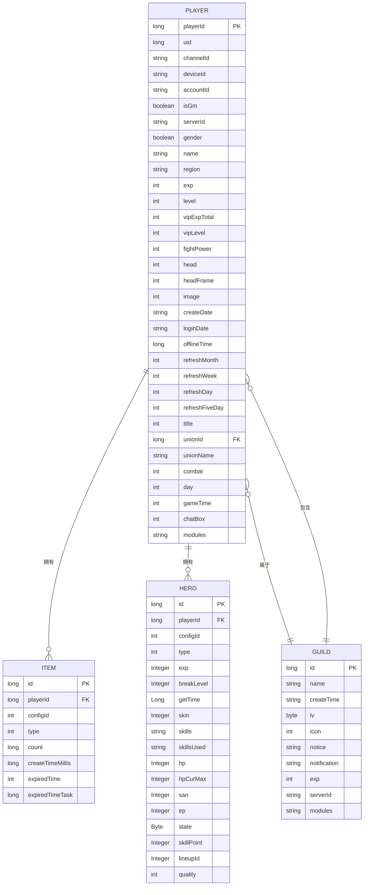
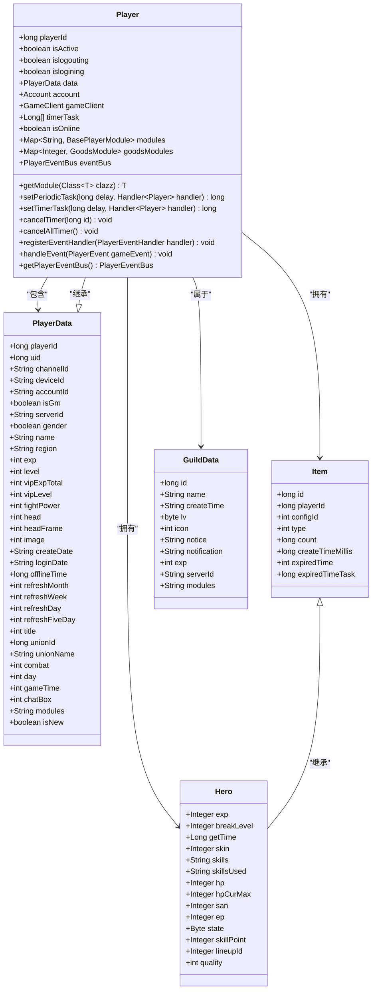

# 数据模型

<cite>
**本文档引用的文件**   
- [Player.java](file://game/src/main/java/cn/game/games/cache/entity/Player.java)
- [PlayerData.java](file://game/src/main/java/cn/game/games/cache/entity/PlayerData.java)
- [PlayerDataMapper.xml](file://game/src/main/resources/mapping/PlayerDataMapper.xml)
- [PlayerDataMapper.java](file://game/src/main/java/cn/game/games/net/data/mapper/PlayerDataMapper.java)
- [Item.java](file://game/src/main/java/cn/game/games/cache/entity/Item.java)
- [Hero.java](file://game/src/main/java/cn/game/games/cache/entity/Hero.java)
- [GuildData.java](file://game/src/main/java/cn/game/games/cache/entity/GuildData.java)
- [SegmentIdService.java](file://core/src/main/java/cn/game/core/id/SegmentIdService.java)
- [IdUtil.java](file://core/src/main/java/cn/game/core/id/IdUtil.java)
- [SnowflakeService.java](file://core/src/main/java/cn/game/core/id/SnowflakeService.java)
</cite>

## 目录
1. [玩家实体模型](#玩家实体模型)
2. [关联实体关系模型](#关联实体关系模型)
3. [MyBatis映射机制](#mybatis映射机制)
4. [分布式ID生成机制](#分布式id生成机制)
5. [数据生命周期管理](#数据生命周期管理)
6. [实体关系图](#实体关系图)

## 玩家实体模型

`Player`实体是游戏服务器的核心数据结构，采用内存与持久化分离的设计模式。该实体分为两个主要部分：`Player`类和`PlayerData`类。

`Player`类代表玩家在内存中的运行时状态，包含以下关键字段：
- `playerId`: 玩家唯一标识符，长整型
- `isActive`: 布尔值，表示玩家是否处于活跃状态
- `islogouting`: 布尔值，表示玩家是否正在退出
- `islogining`: 布尔值，表示玩家是否正在登录
- `data`: 指向`PlayerData`对象的引用，包含持久化数据
- `account`: 账号信息对象
- `gameClient`: 网络连接客户端
- `modules`: 存储各种功能模块的映射表

`PlayerData`类代表玩家的持久化数据，实现了`Serializable`接口和`DbEntity`接口，包含以下主要字段：
- `playerId`: 玩家ID，主键
- `uid`: 用户ID，与服务器ID组成唯一键
- `channelId`: 渠道ID
- `deviceId`: 设备唯一标识
- `accountId`: 登录账号ID
- `isGm`: 是否为GM账号
- `serverId`: 玩家所在服务器ID
- `gender`: 性别（1男2女）
- `name`: 玩家名称
- `region`: 注册地区
- `exp`: 经验值
- `level`: 等级
- `vipExpTotal`: 累积VIP经验
- `vipLevel`: VIP等级
- `fightPower`: 战力
- `head`: 头像ID
- `headFrame`: 头像框ID
- `image`: 形象ID
- `createDate`: 创建日期
- `loginDate`: 最后登录日期
- `offlineTime`: 离线时间戳
- `refreshMonth`: 跨月数据刷新日期
- `refreshWeek`: 跨周数据刷新日期
- `refreshDay`: 跨天数据刷新日期
- `refreshFiveDay`: 每日5点刷新日期
- `title`: 称号
- `unionId`: 所在工会ID
- `unionName`: 所在工会名称
- `combat`: 战斗力
- `day`: 游戏天数
- `gameTime`: 累计游戏时长（秒）
- `chatBox`: 聊天框ID
- `modules`: 所有模块的数据，存储为JSON字符串

`Player`类通过`initPlayerModule()`方法初始化其模块系统，从`PlayerData`的`modules`字段反序列化模块数据，并为每个模块创建实例。这种设计实现了数据的灵活扩展，允许通过添加新模块来扩展玩家功能而无需修改核心类。

**Section sources**
- [Player.java](file://game/src/main/java/cn/game/games/cache/entity/Player.java#L1-L800)
- [PlayerData.java](file://game/src/main/java/cn/game/games/cache/entity/PlayerData.java#L1-L658)

## 关联实体关系模型

### 物品实体（Item）
`Item`实体代表玩家拥有的物品，包含以下字段：
- `id`: 物品唯一ID
- `playerId`: 所属玩家ID
- `configId`: 配置表ID
- `type`: 物品类型
- `count`: 数量
- `createTimeMillis`: 创建时间（毫秒时间戳）
- `expiredTime`: 过期时间（秒时间戳）
- `expiredTimeTask`: 过期时间对应的删除任务ID

物品系统通过`ItemModule`进行管理，支持堆叠和非堆叠物品。物品的过期机制通过定时任务实现，当物品过期时自动从玩家背包中移除。

### 英雄实体（Hero）
`Hero`实体继承自`ItemNoStack`，代表玩家拥有的英雄角色，包含以下特有字段：
- `exp`: 等级经验
- `breakLevel`: 突破等级
- `getTime`: 获取时间
- `skin`: 当前使用的皮肤ID
- `skills`: 技能信息
- `skillsUsed`: 已使用的技能
- `hp`: 血量
- `hpCurMax`: 当前最大血量
- `san`: SAN值
- `ep`: EP值
- `state`: 状态（0正常 1重伤 2死亡）
- `skillPoint`: 技能点
- `lineupId`: 队列ID
- `quality`: 品质

英雄系统通过`HeroModule`进行管理，支持英雄的升级、突破、技能学习等功能。

### 公会实体（Guild）
`GuildData`实体代表游戏中的公会，包含以下字段：
- `id`: 公会ID
- `name`: 公会名称
- `createTime`: 创建时间
- `lv`: 等级
- `icon`: 公会图标
- `notice`: 公告
- `notification`: 通知（仅成员可见）
- `exp`: 当前经验
- `serverId`: 所属逻辑服务器ID
- `modules`: 所有模块数据

公会系统通过`GuildModule`进行管理，支持公会的创建、升级、成员管理等功能。

玩家与这些实体的关系如下：
- 一个玩家可以拥有多个物品
- 一个玩家可以拥有多个英雄
- 一个玩家只能属于一个公会
- 一个公会可以包含多个玩家

**Section sources**
- [Item.java](file://game/src/main/java/cn/game/games/cache/entity/Item.java#L1-L116)
- [Hero.java](file://game/src/main/java/cn/game/games/cache/entity/Hero.java#L1-L321)
- [GuildData.java](file://game/src/main/java/cn/game/games/cache/entity/GuildData.java#L1-L220)

## MyBatis映射机制

MyBatis映射文件`PlayerDataMapper.xml`定义了`PlayerData`实体与数据库表`t_player_data`之间的映射关系。

### 结果映射
映射文件定义了两个结果映射：
- `BaseResultMap`: 映射基本字段
- `ResultMapWithBLOBs`: 继承`BaseResultMap`并添加`modules`字段的映射

```xml
<resultMap id="BaseResultMap" type="cn.game.games.cache.entity.PlayerData">
    <id column="player_id" jdbcType="BIGINT" property="playerId" />
    <result column="uid" jdbcType="BIGINT" property="uid" />
    <result column="channel_id" jdbcType="VARCHAR" property="channelId" />
    <!-- 其他字段映射 -->
</resultMap>
```

### SQL语句
映射文件提供了多种SQL操作：

#### 基本CRUD操作
- `selectByPrimaryKey`: 根据玩家ID查询
- `deleteByPrimaryKey`: 根据玩家ID删除
- `insert`: 插入新记录
- `updateByPrimaryKey`: 根据主键更新

#### 批量操作
- `insertBatch`: 批量插入
- `deleteBatch`: 批量删除
- `updateBatch`: 批量更新，使用CASE语句实现

#### 查询操作
- `selectByUkUidServerid`: 根据UID和服务器ID查询
- `selectAll`: 查询所有记录
- `getBatchOffset`: 分页查询，使用OFFSET
- `getBatchCursor`: 游标查询，使用WHERE条件

#### 特殊操作
- `insertOrUpdate`: 插入或更新，使用ON DUPLICATE KEY UPDATE
- `updateColumnsByPrimaryKey`: 动态更新指定字段，使用`<if>`标签实现条件更新
- `executeSql`: 执行动态SQL语句

### 复杂查询设计
`updateBatch`方法使用了复杂的SQL设计，通过多个`<trim>`和`<foreach>`标签生成批量更新语句：

```xml
<update id="updateBatch" parameterType="java.util.List">
    update t_player_data 
    <trim prefix="set" suffixOverrides=",">
        <trim prefix="uid =case " suffix="end,">
            <foreach collection="recordList" index="index" item="item">
                when player_id = #{item.playerId,jdbcType=BIGINT} then #{item.uid,jdbcType=BIGINT}
            </foreach>
        </trim>
        <!-- 其他字段的CASE语句 -->
    </trim>
    where player_id in(
    <foreach collection="recordList" index="index" item="item" separator=",">
        #{item.playerId,jdbcType=BIGINT}
    </foreach>
    )
</update>
```

这种设计避免了多次数据库交互，提高了批量更新的性能。

**Section sources**
- [PlayerDataMapper.xml](file://game/src/main/resources/mapping/PlayerDataMapper.xml#L1-L623)
- [PlayerDataMapper.java](file://game/src/main/java/cn/game/games/net/data/mapper/PlayerDataMapper.java#L1-L134)

## 分布式ID生成机制

系统实现了两种分布式ID生成机制：Snowflake算法和号段模式（Segment）。

### Snowflake算法
`SnowflakeService`类实现了Snowflake算法，生成64位的唯一ID。ID的结构如下：
- 1位：符号位，始终为0
- 41位：时间戳（毫秒）
- 10位：机器ID（Worker ID）
- 12位：序列号

`SnowflakeService`通过ZooKeeper分配唯一的Worker ID，确保在分布式环境下的ID唯一性。服务启动时，会检查ZooKeeper中的`/server/distributed-id`路径，并为当前服务器分配一个唯一的Worker ID。

```java
public class SnowflakeService {
    private static final String ZK_WORKER_ID_PATH = "/server/distributed-id";
    
    public void init() throws Exception {
        // 确保父路径存在
        if (ZkHelper.curator.checkExists().forPath(ZK_WORKER_ID_PATH) == null) {
            ZkHelper.curator.create().creatingParentsIfNeeded()
                .withMode(CreateMode.PERSISTENT).forPath(ZK_WORKER_ID_PATH);
        }
        
        // 分配Worker ID
        this.workerId = allocateWorkerId();
        
        // 实例化算法
        this.idWorker = new IdWorker(workerId, DATACENTER_ID);
        
        // 启动心跳
        startHeartbeat();
    }
}
```

### 号段模式（Segment）
`SegmentIdService`类实现了号段模式的ID生成机制。该机制通过ZooKeeper协调，为每个ID类型分配连续的号段。

`SegmentGenerator`内部类管理单个ID类型的号段生成：
- `ID_COUNT_PER_SEGMENT`: 每个号段包含的ID数量，默认为10000
- `CORDON_RATE`: 警戒线比率，默认为0.5
- `curIdSegment`: 当前号段
- `nextIdSegment`: 下一个号段
- `minId`: 当前号段的最小ID
- `maxId`: 当前号段的最大ID
- `cordon`: 警戒线ID

当ID生成接近警戒线时，系统会异步预加载下一个号段，确保ID生成的连续性和高性能。

```java
private class SegmentGenerator {
    private static final int ID_COUNT_PER_SEGMENT = 10000;
    private static final float CORDON_RATE = 0.5f;
    
    public synchronized long nextId() {
        long ret = currentId++;
        
        if (ret == cordon) {
            // 预加载下一个号段
            CompletableFuture.supplyAsync(() -> allocateIdSegmentNode(idType))
                .whenCompleteAsync((segment, ex) -> {
                    if (ex != null) {
                        log.error("预加载号段失败: " + idType, ex);
                    } else {
                        this.nextIdSegment = segment;
                    }
                });
        } else if (ret == maxId) {
            // 切换到下一个号段
            changeSegment();
        }
        return ret;
    }
}
```

### ID生成工具
`IdUtil`类提供了统一的ID生成接口，封装了两种ID生成机制：

```java
public class IdUtil {
    public static long getIdBySnowflake(IdType idType) {
        checkInit();
        return snowflakeService.nextId(idType);
    }
    
    public static long getIdBySegment(IdType idType) {
        checkInit();
        return segmentService.nextId(idType);
    }
    
    public static long genOrderId(long playerId) {
        // 示例：高位是玩家ID，低位是全局自增序列
        return playerId << 33 | getIdBySegment(IdType.ORDER);
    }
}
```

系统根据不同的业务场景选择合适的ID生成机制：
- Snowflake算法适用于需要时间有序的场景
- 号段模式适用于高性能、高并发的场景
- 混合模式适用于需要业务逻辑关联的场景

**Section sources**
- [SegmentIdService.java](file://core/src/main/java/cn/game/core/id/SegmentIdService.java#L1-L107)
- [IdUtil.java](file://core/src/main/java/cn/game/core/id/IdUtil.java#L114-L144)
- [SnowflakeService.java](file://core/src/main/java/cn/game/core/id/SnowflakeService.java#L40-L80)

## 数据生命周期管理

### 缓存失效策略
系统采用多级缓存策略管理玩家数据：
- 内存缓存：`Player`对象存储在内存中，提供最快的访问速度
- Redis缓存：热点数据存储在Redis中，支持分布式部署
- 数据库持久化：所有数据最终持久化到MySQL数据库

缓存失效策略如下：
- 玩家登录时，从数据库加载数据到内存
- 玩家在线时，数据保持在内存中
- 玩家离线后，数据在内存中保留一段时间（由`isActive`标志控制）
- 长时间不活跃的玩家数据会被清理，但保留数据库记录

### 冷热数据分离
系统通过以下方式实现冷热数据分离：
- 热数据：活跃玩家的数据存储在内存和Redis中
- 温数据：近期离线玩家的数据存储在Redis中
- 冷数据：长期离线玩家的数据仅存储在数据库中

数据迁移策略：
- 活跃玩家：内存 → Redis → 数据库
- 离线玩家：Redis → 数据库
- 长期离线玩家：仅数据库

### 归档机制
系统实现了数据归档机制，定期将历史数据迁移到归档表或归档数据库：
- 日志数据：定期归档到历史表
- 过期物品：自动清理
- 删除玩家：数据标记为删除，定期清理

归档策略：
- 时间维度：按天、周、月归档
- 空间维度：按数据大小归档
- 业务维度：按玩家活跃度归档

数据归档通过后台任务定期执行，不影响主线程性能。

**Section sources**
- [Player.java](file://game/src/main/java/cn/game/games/cache/entity/Player.java#L140-L143)
- [PlayerData.java](file://game/src/main/java/cn/game/games/cache/entity/PlayerData.java#L640-L649)

## 实体关系图



**Diagram sources**
- [PlayerData.java](file://game/src/main/java/cn/game/games/cache/entity/PlayerData.java#L14-L171)
- [Item.java](file://game/src/main/java/cn/game/games/cache/entity/Item.java#L10-L27)
- [Hero.java](file://game/src/main/java/cn/game/games/cache/entity/Hero.java#L15-L30)
- [GuildData.java](file://game/src/main/java/cn/game/games/cache/entity/GuildData.java#L12-L57)



**Diagram sources**
- [Player.java](file://game/src/main/java/cn/game/games/cache/entity/Player.java#L112-L798)
- [PlayerData.java](file://game/src/main/java/cn/game/games/cache/entity/PlayerData.java#L14-L658)
- [Item.java](file://game/src/main/java/cn/game/games/cache/entity/Item.java#L10-L27)
- [Hero.java](file://game/src/main/java/cn/game/games/cache/entity/Hero.java#L9-L321)
- [GuildData.java](file://game/src/main/java/cn/game/games/cache/entity/GuildData.java#L12-L220)