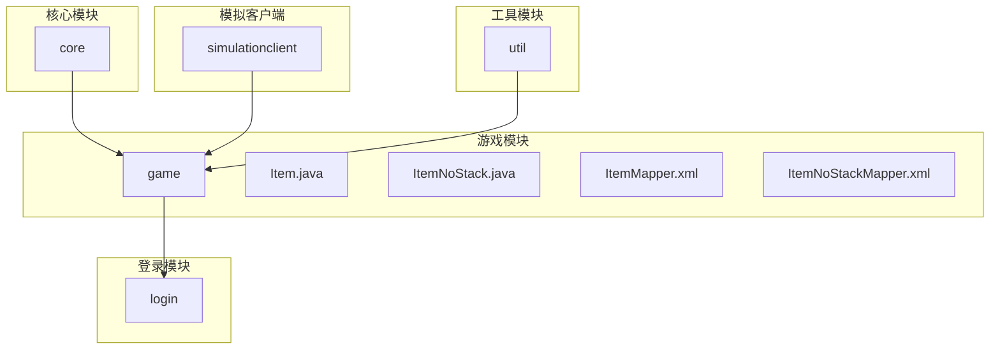
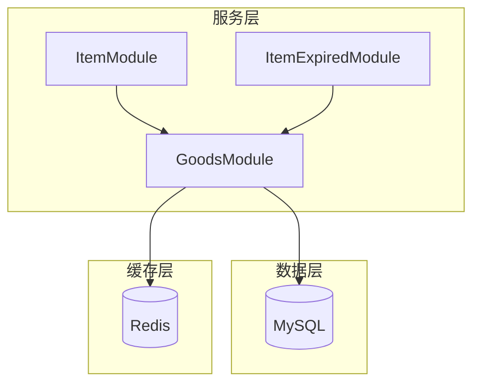
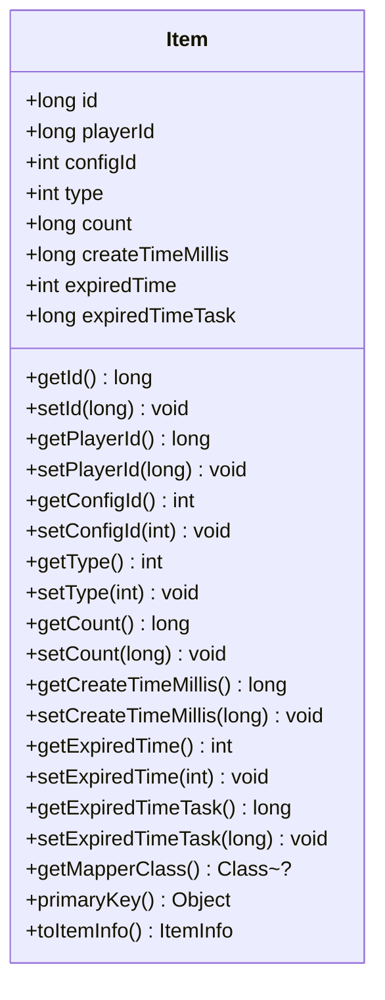
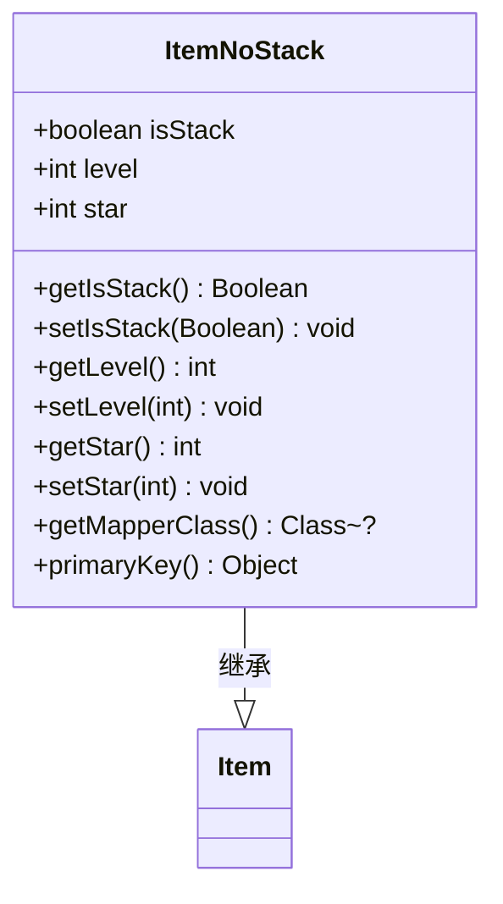
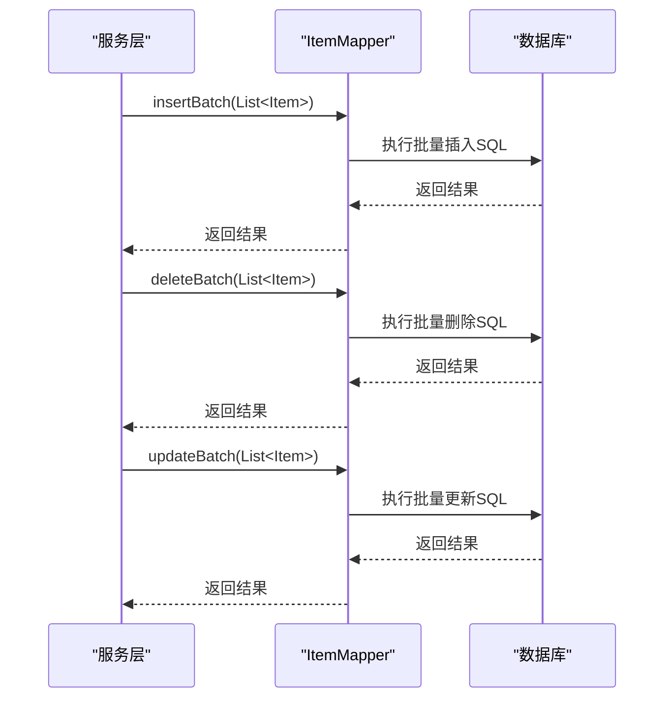
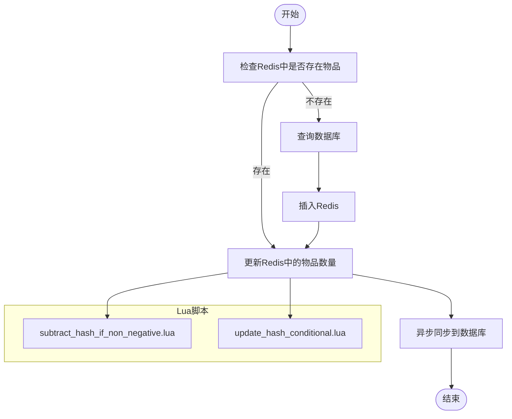
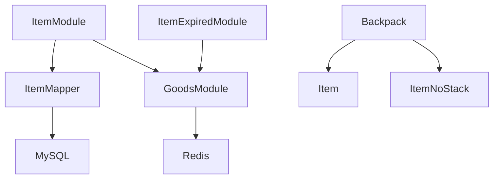

# 基础物品模型

<cite>
**本文档引用文件**  
- [Item.java](file://game/src/main/java/cn/game/games/cache/entity/Item.java)
- [ItemNoStack.java](file://game/src/main/java/cn/game/games/cache/entity/ItemNoStack.java)
- [ItemMapper.xml](file://game/src/main/resources/mapping/ItemMapper.xml)
- [ItemNoStackMapper.xml](file://game/src/main/resources/mapping/ItemNoStackMapper.xml)
- [ItemModule.java](file://game/src/main/java/cn/game/games/net/game/module/item/ItemModule.java)
- [AbstractItemModule.java](file://game/src/main/java/cn/game/games/net/game/module/item/AbstractItemModule.java)
- [GoodsModule.java](file://game/src/main/java/cn/game/games/core/GoodsModule.java)
- [ItemExpiredModule.java](file://game/src/main/java/cn/game/games/core/ItemExpiredModule.java)
- [Backpack.java](file://game/src/main/java/cn/game/games/net/game/module/backpack/Backpack.java)
- [subtract_hash_if_non_negative.lua](file://game/src/main/resources/lua/subtract_hash_if_non_negative.lua)
- [update_hash_conditional.lua](file://game/src/main/resources/lua/update_hash_conditional.lua)
</cite>

## 目录
1. [简介](#简介)
2. [项目结构](#项目结构)
3. [核心组件](#核心组件)
4. [架构概述](#架构概述)
5. [详细组件分析](#详细组件分析)
6. [依赖分析](#依赖分析)
7. [性能考虑](#性能考虑)
8. [故障排除指南](#故障排除指南)
9. [结论](#结论)

## 简介
本文档详细阐述了游戏服务器中基础物品模型的设计与实现。重点分析了`Item`类作为所有物品基类的核心字段定义与作用，包括物品ID、数量、过期时间戳和创建时间等。文档还深入探讨了`ItemNoStack`类对不可堆叠物品的特殊处理机制，包括唯一实例标识和持久化策略。此外，文档解析了MyBatis映射文件中基础物品的CRUD操作SQL语句，特别是批量查询和过期清理的优化设计。同时，阐述了基础物品在Redis中的存储结构（如使用Hash存储物品属性）以及与数据库的同步机制。最后，提供了物品创建、使用、销毁的代码示例，并说明了异常处理和数据一致性保障措施。

## 项目结构
该项目采用模块化设计，主要分为core、game、login、simulationclient和util等模块。其中，基础物品模型相关代码主要位于game模块的`cn.game.games.cache.entity`包中，MyBatis映射文件位于`resources/mapping`目录下，而物品相关的业务逻辑则分布在`net.game.module.item`等包中。

**图示来源**  
- [Item.java](file://game/src/main/java/cn/game/games/cache/entity/Item.java)
- [ItemNoStack.java](file://game/src/main/java/cn/game/games/cache/entity/ItemNoStack.java)
- [ItemMapper.xml](file://game/src/main/resources/mapping/ItemMapper.xml)
- [ItemNoStackMapper.xml](file://game/src/main/resources/mapping/ItemNoStackMapper.xml)

**本节来源**  
- [Item.java](file://game/src/main/java/cn/game/games/cache/entity/Item.java)
- [ItemNoStack.java](file://game/src/main/java/cn/game/games/cache/entity/ItemNoStack.java)
- [ItemMapper.xml](file://game/src/main/resources/mapping/ItemMapper.xml)
- [ItemNoStackMapper.xml](file://game/src/main/resources/mapping/ItemNoStackMapper.xml)

## 核心组件
基础物品模型的核心组件包括`Item`类、`ItemNoStack`类、`ItemMapper`接口及其对应的XML映射文件。`Item`类作为所有物品的基类，定义了物品的基本属性和行为。`ItemNoStack`类继承自`Item`类，用于表示不可堆叠的物品。`ItemMapper`接口和XML文件定义了与数据库交互的CRUD操作。

**本节来源**  
- [Item.java](file://game/src/main/java/cn/game/games/cache/entity/Item.java)
- [ItemNoStack.java](file://game/src/main/java/cn/game/games/cache/entity/ItemNoStack.java)
- [ItemMapper.xml](file://game/src/main/resources/mapping/ItemMapper.xml)
- [ItemNoStackMapper.xml](file://game/src/main/resources/mapping/ItemNoStackMapper.xml)

## 架构概述
基础物品模型的架构主要包括数据层、服务层和缓存层。数据层通过MyBatis实现与MySQL数据库的交互；服务层由`GoodsModule`及其子类构成，负责处理物品的业务逻辑；缓存层利用Redis存储物品属性，提高访问效率。

**图示来源**  
- [Item.java](file://game/src/main/java/cn/game/games/cache/entity/Item.java)
- [ItemNoStack.java](file://game/src/main/java/cn/game/games/cache/entity/ItemNoStack.java)
- [GoodsModule.java](file://game/src/main/java/cn/game/games/core/GoodsModule.java)
- [ItemModule.java](file://game/src/main/java/cn/game/games/net/game/module/item/ItemModule.java)
- [ItemExpiredModule.java](file://game/src/main/java/cn/game/games/core/ItemExpiredModule.java)

## 详细组件分析

### Item类分析
`Item`类是所有物品的基类，定义了物品的核心字段，包括`id`（唯一标识）、`playerId`（所属玩家ID）、`configId`（配置ID）、`type`（类型）、`count`（数量）、`createTimeMillis`（创建时间毫秒）、`expiredTime`（过期时间戳）和`expiredTimeTask`（过期任务ID）。这些字段共同描述了一个物品的基本信息和生命周期。

**图示来源**  
- [Item.java](file://game/src/main/java/cn/game/games/cache/entity/Item.java)

**本节来源**  
- [Item.java](file://game/src/main/java/cn/game/games/cache/entity/Item.java)

### ItemNoStack类分析
`ItemNoStack`类继承自`Item`类，用于表示不可堆叠的物品。它添加了`isStack`（是否可堆叠）、`level`（等级）和`star`（星级）等字段。`isStack`字段始终为`false`，用于标识该物品不可堆叠。此类通过重写`primaryKey()`方法，使用`isStack`作为主键，确保了不可堆叠物品的唯一性。

**图示来源**  
- [ItemNoStack.java](file://game/src/main/java/cn/game/games/cache/entity/ItemNoStack.java)

**本节来源**  
- [ItemNoStack.java](file://game/src/main/java/cn/game/games/cache/entity/ItemNoStack.java)

### MyBatis映射分析
MyBatis映射文件定义了基础物品的CRUD操作。`ItemMapper.xml`文件中的SQL语句实现了对`t_item`表的增删改查操作，包括批量插入、批量删除和批量更新。批量操作通过`<foreach>`标签实现，提高了数据库操作的效率。过期清理操作通过`selectByPlayerId`查询玩家的所有物品，然后在服务层进行过期判断和删除。

**图示来源**  
- [ItemMapper.xml](file://game/src/main/resources/mapping/ItemMapper.xml)

**本节来源**  
- [ItemMapper.xml](file://game/src/main/resources/mapping/ItemMapper.xml)

### Redis存储分析
基础物品在Redis中的存储结构采用了Hash类型，以玩家ID为key，物品ID为field，物品属性为value。这种结构便于快速查询和更新单个物品的属性。Lua脚本`subtract_hash_if_non_negative.lua`和`update_hash_conditional.lua`用于保证在并发环境下对物品数量的原子性操作，防止出现负数或数据不一致的情况。

**图示来源**  
- [subtract_hash_if_non_negative.lua](file://game/src/main/resources/lua/subtract_hash_if_non_negative.lua)
- [update_hash_conditional.lua](file://game/src/main/resources/lua/update_hash_conditional.lua)

**本节来源**  
- [subtract_hash_if_non_negative.lua](file://game/src/main/resources/lua/subtract_hash_if_non_negative.lua)
- [update_hash_conditional.lua](file://game/src/main/resources/lua/update_hash_conditional.lua)

## 依赖分析
基础物品模型依赖于MyBatis框架进行数据库操作，依赖于Redis进行缓存管理，依赖于`GoodsModule`类提供基础的物品管理功能。`ItemModule`类依赖于`ItemMapper`接口进行数据持久化，`ItemExpiredModule`类依赖于`GoodsModule`类进行过期物品的清理。

**图示来源**  
- [ItemModule.java](file://game/src/main/java/cn/game/games/net/game/module/item/ItemModule.java)
- [ItemMapper.xml](file://game/src/main/resources/mapping/ItemMapper.xml)
- [GoodsModule.java](file://game/src/main/java/cn/game/games/core/GoodsModule.java)
- [ItemExpiredModule.java](file://game/src/main/java/cn/game/games/core/ItemExpiredModule.java)
- [Backpack.java](file://game/src/main/java/cn/game/games/net/game/module/backpack/Backpack.java)

**本节来源**  
- [ItemModule.java](file://game/src/main/java/cn/game/games/net/game/module/item/ItemModule.java)
- [ItemMapper.xml](file://game/src/main/resources/mapping/ItemMapper.xml)
- [GoodsModule.java](file://game/src/main/java/cn/game/games/core/GoodsModule.java)
- [ItemExpiredModule.java](file://game/src/main/java/cn/game/games/core/ItemExpiredModule.java)
- [Backpack.java](file://game/src/main/java/cn/game/games/net/game/module/backpack/Backpack.java)

## 性能考虑
为了提高性能，系统采用了批量操作和缓存机制。批量插入、删除和更新操作减少了数据库的I/O次数，提高了处理效率。Redis缓存避免了频繁的数据库查询，显著提升了读取性能。Lua脚本保证了在高并发场景下的数据一致性，避免了竞态条件。

## 故障排除指南
在使用基础物品模型时，可能会遇到数据不一致、过期物品未及时清理等问题。建议检查`ItemExpiredModule`的定时任务是否正常运行，确认Redis与数据库的同步机制是否正确实现。对于并发操作导致的问题，应确保使用Lua脚本进行原子性操作。

**本节来源**  
- [ItemExpiredModule.java](file://game/src/main/java/cn/game/games/core/ItemExpiredModule.java)
- [subtract_hash_if_non_negative.lua](file://game/src/main/resources/lua/subtract_hash_if_non_negative.lua)
- [update_hash_conditional.lua](file://game/src/main/resources/lua/update_hash_conditional.lua)

## 结论
基础物品模型通过合理的类设计、高效的数据库操作和可靠的缓存机制，实现了对游戏物品的有效管理。`Item`类和`ItemNoStack`类的继承关系清晰地表达了可堆叠与不可堆叠物品的区别，MyBatis的批量操作和Redis的原子性脚本保证了系统的高性能和数据一致性。未来可以进一步优化过期清理策略，减少对数据库的频繁访问。