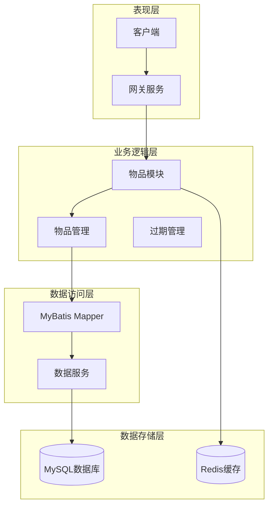
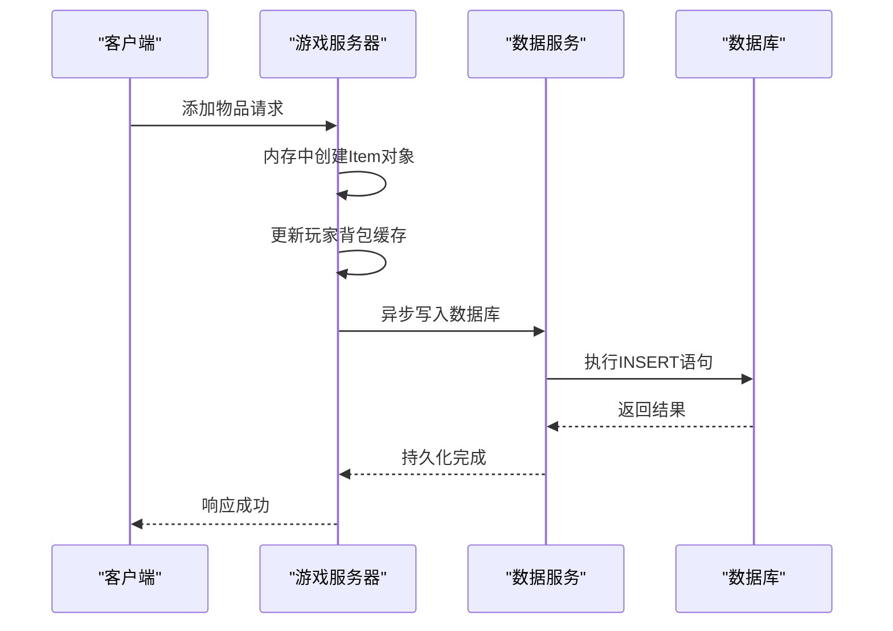
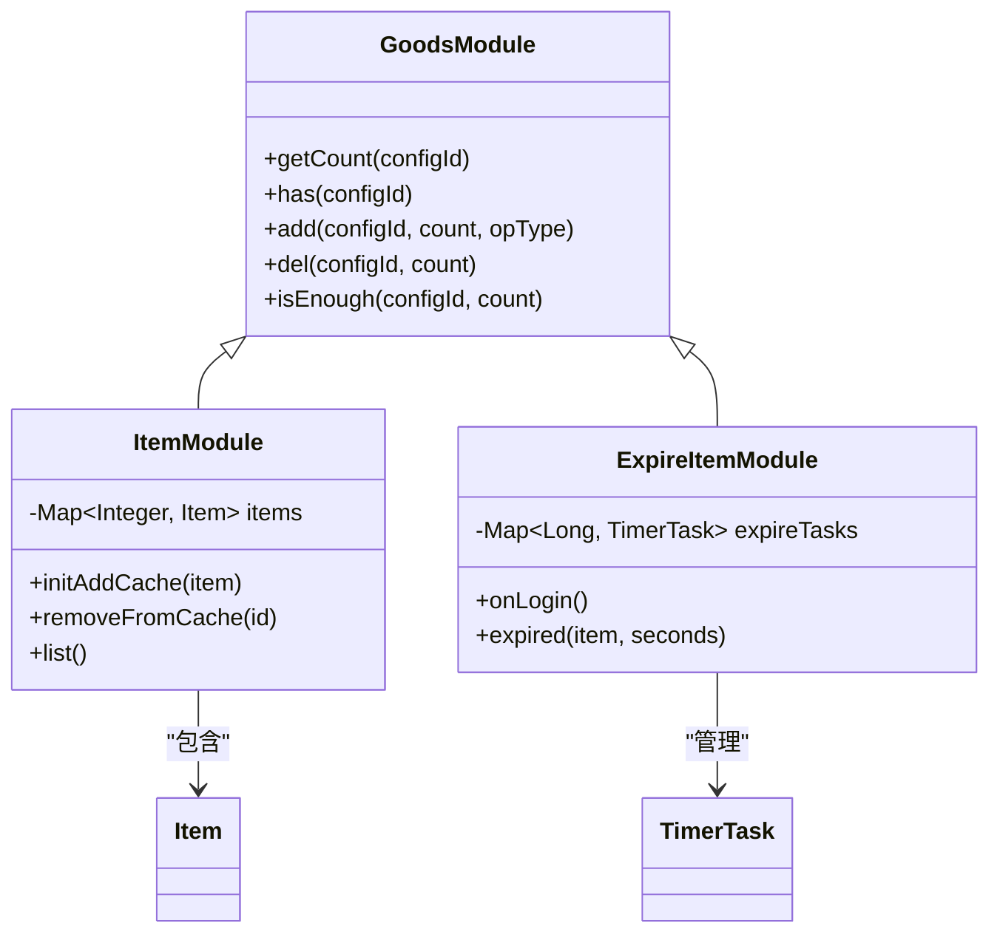
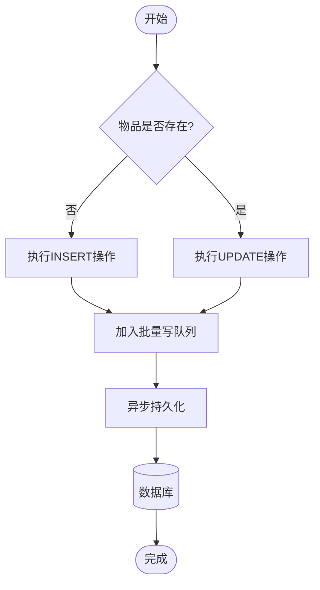
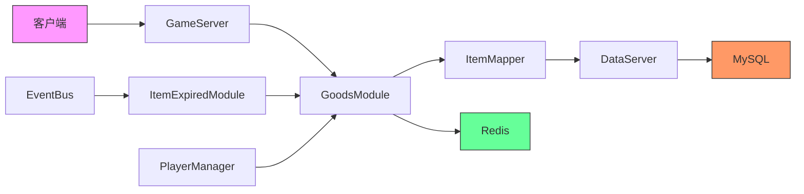

# 物品持久化

<cite>
**本文档引用的文件**  
- [ItemMapper.xml](file://game/src/main/resources/mapping/ItemMapper.xml)
- [GoodsModule.java](file://game/src/main/java/cn/game/games/core/GoodsModule.java)
- [ItemExpiredModule.java](file://game/src/main/java/cn/game/games/core/ItemExpiredModule.java)
- [DataServer.java](file://game/src/main/java/cn/game/games/net/data/DataServer.java)
- [Item.java](file://game/src/main/java/cn/game/games/cache/entity/Item.java)
- [BasePlayer.java](file://game/src/main/java/cn/game/games/core/BasePlayer.java)
- [BasePlayerModule.java](file://game/src/main/java/cn/game/games/core/BasePlayerModule.java)
- [PlayerDataMapper.java](file://game/src/main/java/cn/game/games/net/data/mapper/PlayerDataMapper.java)
- [ItemMapper.java](file://game/src/main/java/cn/game/games/net/data/mapper/ItemMapper.java)
- [ItemHelper.java](file://game/src/main/java/cn/game/games/net/game/helper/ItemHelper.java)
- [AbstractItemModule.java](file://game/src/main/java/cn/game/games/net/game/module/item/AbstractItemModule.java)
- [ItemModule.java](file://game/src/main/java/cn/game/games/net/game/module/item/ItemModule.java)
- [ExpireItemModule.java](file://game/src/main/java/cn/game/games/net/game/module/item/ExpireItemModule.java)
- [dataServer-mybatorConfig.xml](file://game/dataServer-mybatorConfig.xml)
</cite>

## 目录
1. [简介](#简介)
2. [项目结构](#项目结构)
3. [核心组件](#核心组件)
4. [架构概述](#架构概述)
5. [详细组件分析](#详细组件分析)
6. [依赖分析](#依赖分析)
7. [性能考量](#性能考量)
8. [故障排查指南](#故障排查指南)
9. [结论](#结论)

## 简介
本文档深入解析游戏服务器中物品数据的持久化机制，涵盖从内存到数据库的完整流程。重点分析MyBatis映射文件的设计原则、DataServer与数据库的交互方式、批量写入与异步处理策略、缓存预热机制、事务管理以及数据一致性保障。同时提供数据库表结构设计、索引策略和数据备份恢复方案。

## 项目结构
游戏服务端采用模块化分层架构，核心持久化逻辑位于`game`模块中，通过MyBatis实现ORM映射。数据访问层与业务逻辑层分离，确保高内聚低耦合。

**图示来源**  
- [GoodsModule.java](file://game/src/main/java/cn/game/games/core/GoodsModule.java)
- [ItemModule.java](file://game/src/main/java/cn/game/games/net/game/module/item/ItemModule.java)
- [DataServer.java](file://game/src/main/java/cn/game/games/net/data/DataServer.java)
- [ItemMapper.xml](file://game/src/main/resources/mapping/ItemMapper.xml)

**本节来源**  
- [项目结构信息](file://project_structure)

## 核心组件
系统通过`GoodsModule`抽象类定义物品管理的核心接口，所有具体物品类型继承该基类。`ItemMapper`负责数据库CRUD操作，`DataServer`作为数据访问入口统一调度。

**本节来源**  
- [GoodsModule.java](file://game/src/main/java/cn/game/games/core/GoodsModule.java)
- [ItemMapper.xml](file://game/src/main/resources/mapping/ItemMapper.xml)
- [DataServer.java](file://game/src/main/java/cn/game/games/net/data/DataServer.java)

## 架构概述
系统采用内存+数据库双写策略，物品数据首先在内存中操作，通过事务保证一致性后异步持久化到MySQL。Redis用于热点数据缓存和分布式锁控制。

**图示来源**  
- [GoodsModule.java](file://game/src/main/java/cn/game/games/core/GoodsModule.java#L60-L68)
- [ItemMapper.xml](file://game/src/main/resources/mapping/ItemMapper.xml#L41-L52)
- [DataServer.java](file://game/src/main/java/cn/game/games/net/data/DataServer.java#L102)

## 详细组件分析

### 物品模块分析
`GoodsModule`是所有物品管理模块的基类，提供统一的增删改查接口。子类需实现具体的数据结构和缓存策略。

**图示来源**  
- [GoodsModule.java](file://game/src/main/java/cn/game/games/core/GoodsModule.java)
- [ItemModule.java](file://game/src/main/java/cn/game/games/net/game/module/item/ItemModule.java)
- [ExpireItemModule.java](file://game/src/main/java/cn/game/games/net/game/module/item/ExpireItemModule.java)

**本节来源**  
- [GoodsModule.java](file://game/src/main/java/cn/game/games/core/GoodsModule.java)
- [ItemModule.java](file://game/src/main/java/cn/game/games/net/game/module/item/ItemModule.java)

### MyBatis映射文件设计
`ItemMapper.xml`定义了物品表的完整CRUD操作，采用MyBatis Generator自动生成基础语句，并支持批量操作优化性能。

#### INSERT语句设计
- `insert`: 标准插入，所有字段必填
- `insertSelective`: 选择性插入，仅插入非空字段
- `insertBatch`: 批量插入，使用VALUES语法一次性写入多条记录

#### UPDATE语句设计
- `updateByPrimaryKey`: 全字段更新
- `updateByPrimaryKeySelective`: 选择性更新
- `updateBatch`: 批量更新，采用CASE WHEN语法减少数据库交互次数

#### DELETE语句设计
- `deleteByPrimaryKey`: 单条删除
- `deleteBatch`: 批量删除，配合IN子句和foreach实现

**图示来源**  
- [ItemMapper.xml](file://game/src/main/resources/mapping/ItemMapper.xml)
- [GoodsModule.java](file://game/src/main/java/cn/game/games/core/GoodsModule.java#L67)

**本节来源**  
- [ItemMapper.xml](file://game/src/main/resources/mapping/ItemMapper.xml)
- [dataServer-mybatorConfig.xml](file://game/dataServer-mybatorConfig.xml)

## 依赖分析
系统各组件间存在明确的依赖关系，确保职责分离和可维护性。

**图示来源**  
- [ItemExpiredModule.java](file://game/src/main/java/cn/game/games/core/ItemExpiredModule.java#L23)
- [GoodsModule.java](file://game/src/main/java/cn/game/games/core/GoodsModule.java)
- [DataServer.java](file://game/src/main/java/cn/game/games/net/data/DataServer.java)

**本节来源**  
- [ItemExpiredModule.java](file://game/src/main/java/cn/game/games/core/ItemExpiredModule.java)
- [PlayerDataMapper.java](file://game/src/main/java/cn/game/games/net/data/mapper/PlayerDataMapper.java)
- [BasePlayerModule.java](file://game/src/main/java/cn/game/games/core/BasePlayerModule.java)

## 性能考量
系统通过多种机制优化持久化性能：

1. **批量写入**：合并多个数据库操作，减少网络往返
2. **异步处理**：非关键操作异步执行，提升响应速度
3. **连接池优化**：合理配置数据库连接池大小（maxPoolSize=50）
4. **索引策略**：在player_id、config_id等常用查询字段建立B+树索引
5. **分库分表**：根据玩家ID进行水平分片，缓解单表压力

**本节来源**  
- [DataServer.java](file://game/src/main/java/cn/game/games/net/data/DataServer.java#L57-L65)
- [ItemMapper.xml](file://game/src/main/resources/mapping/ItemMapper.xml#L157)
- [dataServer-mybatorConfig.xml](file://game/dataServer-mybatorConfig.xml)

## 故障排查指南
常见问题及解决方案：

1. **数据库连接超时**：检查连接池配置，适当增加maxPoolSize
2. **批量插入失败**：验证SQL语句长度限制，分批处理大数据量
3. **数据不一致**：检查事务边界，确保关键操作在同一个事务中
4. **内存泄漏**：监控TimerTask对象释放，避免过期任务堆积
5. **缓存穿透**：为热点数据设置空值缓存，防止频繁查询数据库

**本节来源**  
- [DataServer.java](file://game/src/main/java/cn/game/games/net/data/DataServer.java#L40-L44)
- [ItemExpiredModule.java](file://game/src/main/java/cn/game/games/core/ItemExpiredModule.java#L115-L122)
- [GoodsModule.java](file://game/src/main/java/cn/game/games/core/GoodsModule.java#L145-L146)

## 结论
本系统通过精心设计的分层架构和优化策略，实现了高效可靠的物品持久化机制。MyBatis映射文件的批量操作支持显著提升了数据库性能，异步写入模式保证了游戏服务器的高响应性。未来可进一步引入消息队列解耦数据写入，增强系统的可扩展性和容错能力。