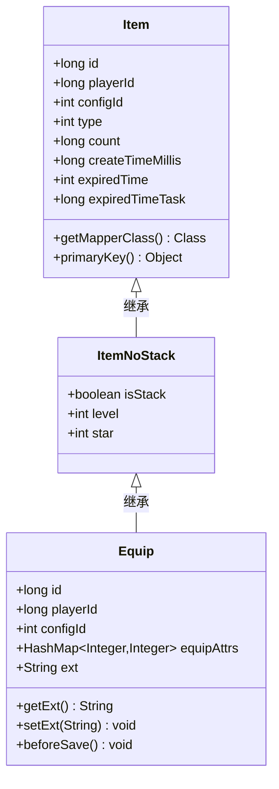
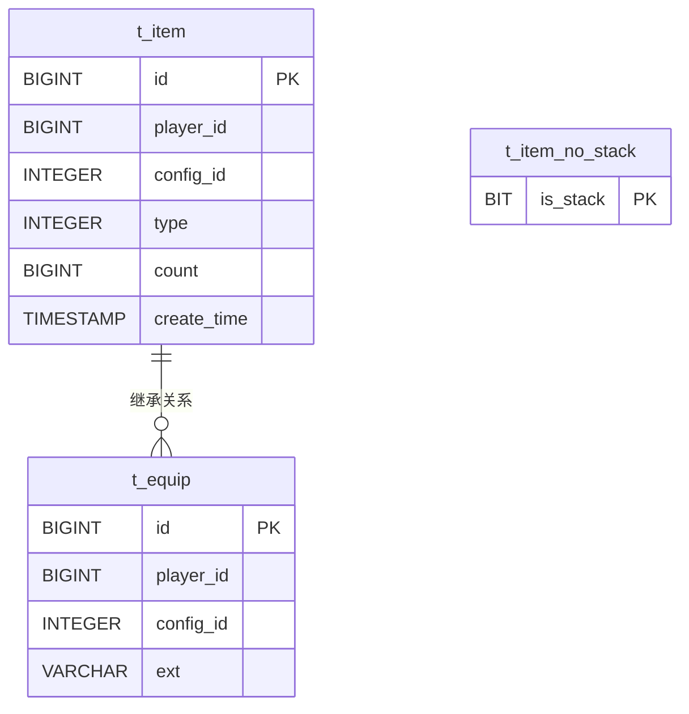
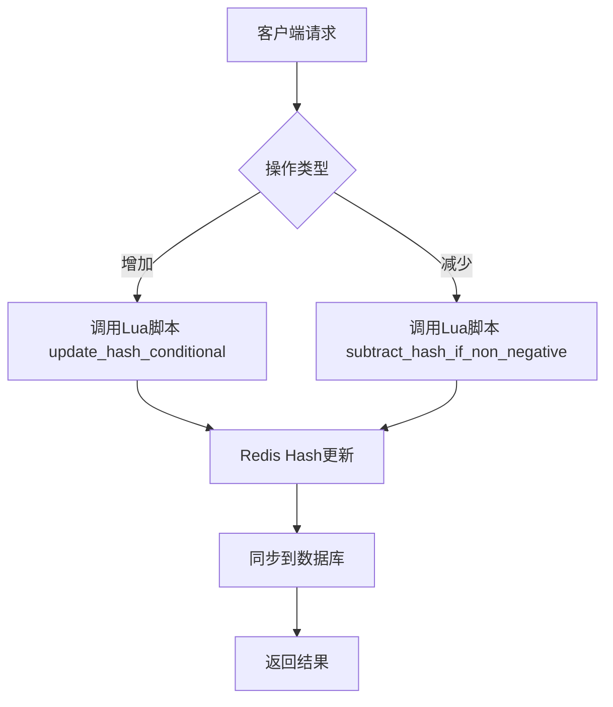
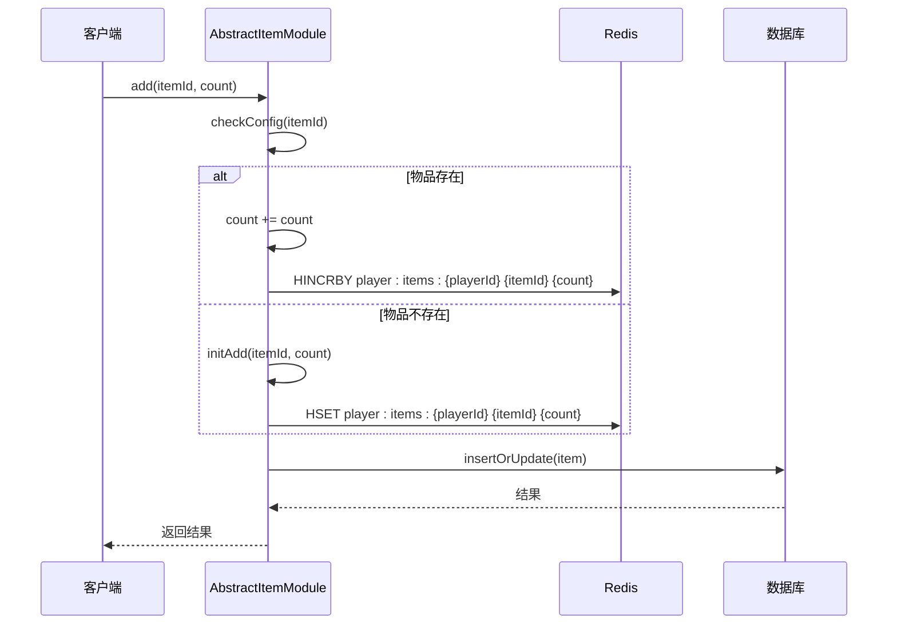

# 物品系统数据模型

<cite>
**本文档引用文件**  
- [Item.java](file://game\src\main\java\cn\game\games\cache\entity\Item.java)
- [ItemNoStack.java](file://game\src\main\java\cn\game\games\cache\entity\ItemNoStack.java)
- [Equip.java](file://game\src\main\java\cn\game\games\cache\entity\Equip.java)
- [ItemMapper.xml](file://game\src\main\resources\mapping\ItemMapper.xml)
- [ItemNoStackMapper.xml](file://game\src\main\resources\mapping\ItemNoStackMapper.xml)
- [EquipMapper.xml](file://game\src\main\resources\mapping\EquipMapper.xml)
- [AbstractItemModule.java](file://game\src\main\java\cn\game\games\net\game\module\item\AbstractItemModule.java)
- [ItemExpiredModule.java](file://game\src\main\java\cn\game\games\core\ItemExpiredModule.java)
- [RedisShardedSet.java](file://core\src\main\java\cn\game\core\redis\RedisShardedSet.java)
- [subtract_hash_if_non_negative.lua](file://game\src\main\resources\lua\subtract_hash_if_non_negative.lua)
- [update_hash_conditional.lua](file://game\src\main\resources\lua\update_hash_conditional.lua)
</cite>

## 目录
1. [引言](#引言)
2. [核心数据模型设计](#核心数据模型设计)
3. [继承关系与字段定义](#继承关系与字段定义)
4. [MyBatis映射与SQL查询设计](#mybatis映射与sql查询设计)
5. [内存与数据库存储结构](#内存与数据库存储结构)
6. [数据一致性保障机制](#数据一致性保障机制)
7. [结论](#结论)

## 引言
本文档深入解析游戏物品系统的数据模型设计，涵盖普通物品、可堆叠物品和装备的继承结构、字段定义、数据库映射、内存存储及数据一致性机制。通过分析Java实体类、MyBatis映射文件、Redis存储策略和Lua脚本，全面揭示物品系统的技术实现。

## 核心数据模型设计

游戏物品系统采用面向对象的继承结构，以`Item`类为基类，派生出`ItemNoStack`和`Equip`等具体类型，实现通用属性与扩展属性的分层管理。该设计支持灵活的物品分类与功能扩展。

### 通用属性设计
所有物品共享以下核心字段：
- **id**：唯一标识符，用于数据库主键和Redis存储
- **playerId**：所属玩家ID，建立物品与玩家的归属关系
- **configId**：配置表ID，关联物品类型和属性模板
- **type**：物品类型，用于分类和逻辑判断
- **count**：数量，适用于可堆叠物品
- **createTimeMillis**：创建时间戳，用于时效性计算
- **expiredTime**：过期时间（秒级时间戳），支持限时物品功能
- **expiredTimeTask**：过期任务ID，用于异步清理

**Section sources**
- [Item.java](file://game\src\main\java\cn\game\games\cache\entity\Item.java#L10-L95)

## 继承关系与字段定义

### 类继承结构

**Diagram sources**
- [Item.java](file://game\src\main\java\cn\game\games\cache\entity\Item.java#L8-L116)
- [ItemNoStack.java](file://game\src\main\java\cn\game\games\cache\entity\ItemNoStack.java#L3-L63)
- [Equip.java](file://game\src\main\java\cn\game\games\cache\entity\Equip.java#L12-L147)

### 物品类型详解

#### 普通物品（Item）
作为所有物品的基类，`Item`类定义了最基本的属性和行为，适用于可堆叠的消耗品、货币等。其`count`字段支持数量管理，`expiredTime`支持时效控制。

#### 可堆叠物品（ItemNoStack）
继承自`Item`，`ItemNoStack`类通过`isStack`字段标识堆叠状态，并扩展了`level`（等级）和`star`（星级）属性，适用于需要等级成长的非堆叠物品。

**Section sources**
- [ItemNoStack.java](file://game\src\main\java\cn\game\games\cache\entity\ItemNoStack.java#L3-L63)

#### 装备（Equip）
`Equip`类继承自`ItemNoStack`，是物品系统的最复杂类型，专为装备设计。其核心扩展属性包括：
- **equipAttrs**：`HashMap<Integer, Integer>`类型，存储装备属性（如强化等级、镶嵌宝石ID等）
- **ext**：JSON序列化字符串，用于持久化`equipAttrs`，实现灵活的属性扩展

`Equip`类重写了`getExt()`和`setExt()`方法，在读取时自动反序列化JSON，在写入时调用`beforeSave()`方法将`equipAttrs`序列化为JSON字符串，确保数据一致性。

**Section sources**
- [Equip.java](file://game\src\main\java\cn\game\games\cache\entity\Equip.java#L12-L147)

## MyBatis映射与SQL查询设计

### 映射文件结构
MyBatis映射文件定义了Java对象与数据库表的映射关系，每个物品类型对应独立的Mapper文件，确保数据访问的模块化。

**Diagram sources**
- [ItemMapper.xml](file://game\src\main\resources\mapping\ItemMapper.xml#L1-L220)
- [ItemNoStackMapper.xml](file://game\src\main\resources\mapping\ItemNoStackMapper.xml#L1-L92)
- [EquipMapper.xml](file://game\src\main\resources\mapping\EquipMapper.xml#L1-L208)

### 装备属性复杂查询设计
`EquipMapper.xml`中的SQL查询设计充分考虑了性能和功能需求：
- **批量操作**：`insertBatch`、`updateBatch`、`deleteBatch`支持批量处理，提升数据库操作效率
- **分页查询**：`getBatchOffset`和`getBatchCursor`提供两种分页策略，支持大数据量的分批加载
- **条件更新**：`updateColumnsByPrimaryKey`支持动态字段更新，避免全字段更新的性能开销
- **UPSERT操作**：`insertOrUpdate`使用`ON DUPLICATE KEY UPDATE`语法，实现插入或更新的原子操作

**Section sources**
- [EquipMapper.xml](file://game\src\main\resources\mapping\EquipMapper.xml#L1-L208)

## 内存与数据库存储结构

### 数据库存储规范
- **表命名**：采用`t_`前缀，如`t_item`、`t_equip`
- **主键设计**：`Item`和`Equip`使用`BIGINT`类型的`id`作为主键，`ItemNoStack`使用`is_stack`作为主键
- **字段类型**：`ext`字段使用`VARCHAR`存储JSON字符串，平衡灵活性与存储效率
- **索引策略**：`player_id`字段建立索引，支持按玩家ID快速查询

### 内存存储结构
物品数据在内存中通过Redis进行缓存，主要采用以下结构：
- **Hash结构**：用于存储单个物品的属性，如`HSET player:items:{playerId} {itemId} {count}`
- **Set结构**：`RedisShardedSet`实现分片Set，用于管理玩家物品集合，提高并发性能
- **Lua脚本**：使用`subtract_hash_if_non_negative.lua`和`update_hash_conditional.lua`等脚本，确保原子性操作

**Diagram sources**
- [RedisShardedSet.java](file://core\src\main\java\cn\game\core\redis\RedisShardedSet.java#L1-L641)
- [subtract_hash_if_non_negative.lua](file://game\src\main\resources\lua\subtract_hash_if_non_negative.lua#L1-L39)
- [update_hash_conditional.lua](file://game\src\main\resources\lua\update_hash_conditional.lua#L1-L27)

**Section sources**
- [RedisShardedSet.java](file://core\src\main\java\cn\game\core\redis\RedisShardedSet.java#L1-L641)
- [LuaScriptUtil.java](file://util\src\main\java\cn\game\util\LuaScriptUtil.java#L1-L36)

## 数据一致性保障机制

### 创建过程
1. 生成全局唯一ID（`genUid`）
2. 初始化物品属性（`initAdd`）
3. 写入Redis缓存
4. 异步持久化到数据库（`insert`或`insertOrUpdate`）

### 使用过程
- **数量变更**：通过`add`和`del`方法修改`count`，自动触发`update`操作
- **属性变更**：修改`equipAttrs`后，`beforeSave`自动序列化到`ext`字段
- **原子操作**：关键操作使用Redis Lua脚本保证原子性

### 销毁过程
1. 从内存缓存中移除（`removeFromCache`）
2. 从Redis中删除
3. 从数据库中删除（`delete`或`deleteByPrimaryKey`）
4. 过期物品由`ItemExpiredModule`在登录时统一清理

**Diagram sources**
- [AbstractItemModule.java](file://game\src\main\java\cn\game\games\net\game\module\item\AbstractItemModule.java#L1-L150)
- [ItemExpiredModule.java](file://game\src\main\java\cn\game\games\core\ItemExpiredModule.java#L1-L66)

**Section sources**
- [AbstractItemModule.java](file://game\src\main\java\cn\game\games\net\game\module\item\AbstractItemModule.java#L1-L150)
- [ItemExpiredModule.java](file://game\src\main\java\cn\game\games\core\ItemExpiredModule.java#L1-L66)

## 结论
游戏物品系统通过清晰的继承结构、灵活的属性设计、高效的数据库映射和可靠的存储策略，实现了对多种物品类型的统一管理。`Item`-`ItemNoStack`-`Equip`的三层继承模型既保证了代码复用，又支持功能扩展。MyBatis的批量操作和Redis的分片Set、Lua脚本共同保障了系统的高性能和数据一致性。该设计为游戏的物品管理提供了坚实的基础。