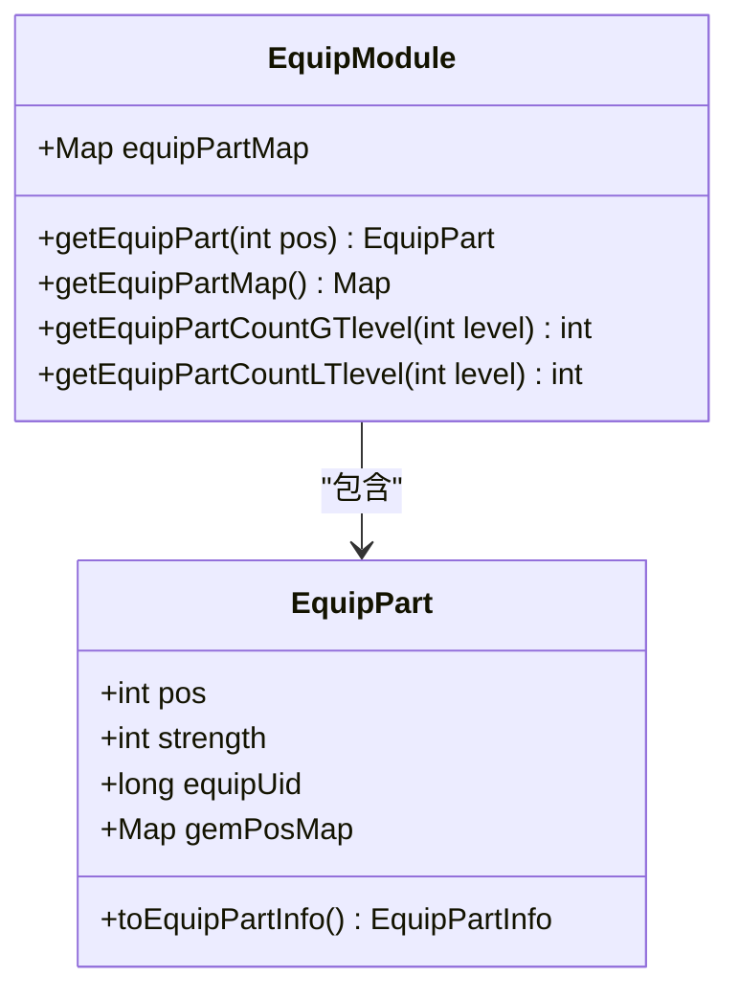
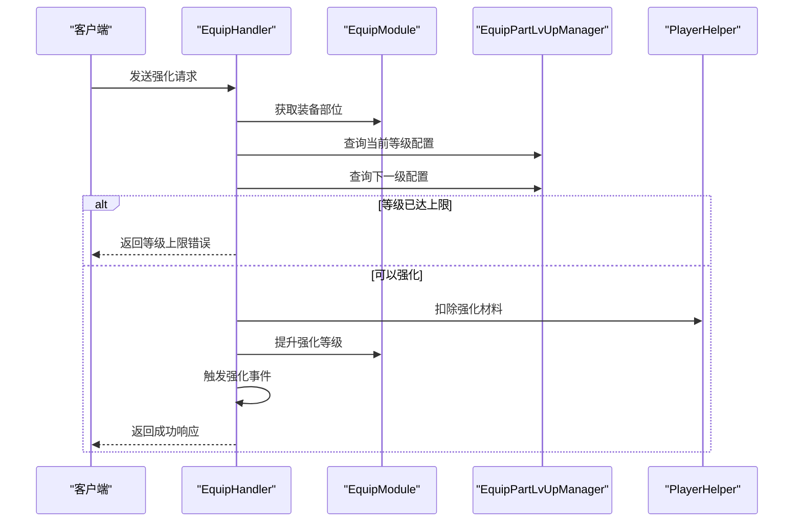
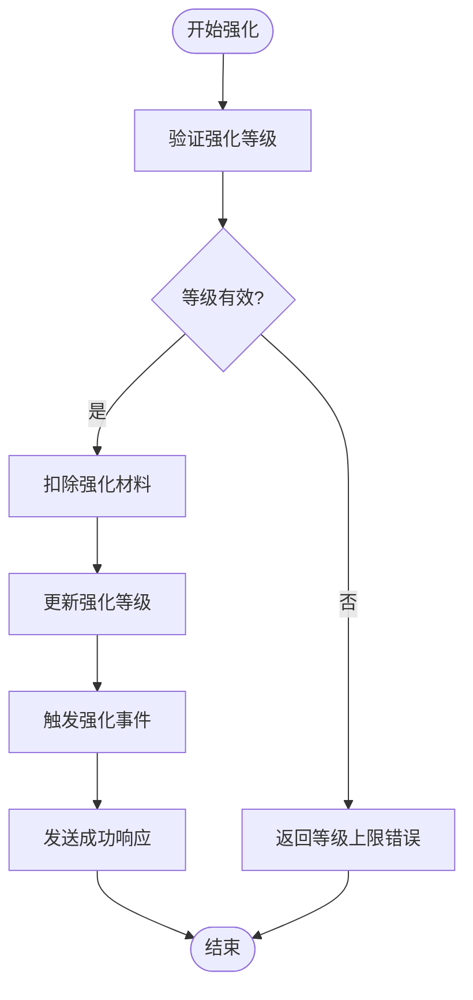
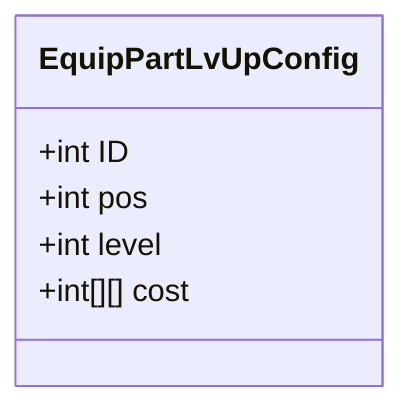
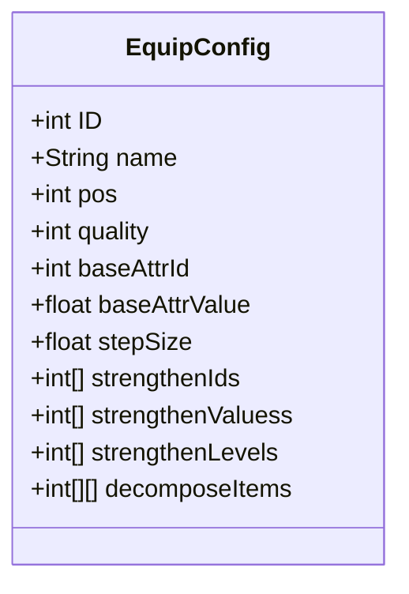
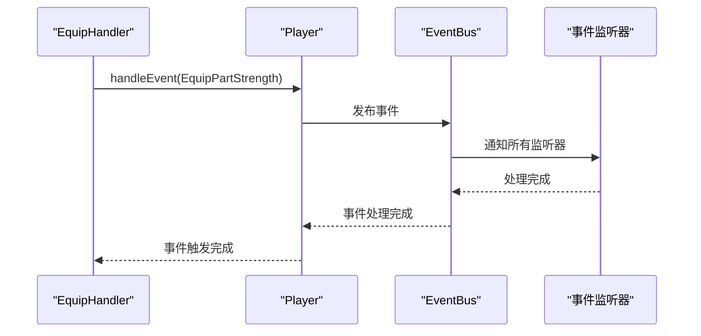
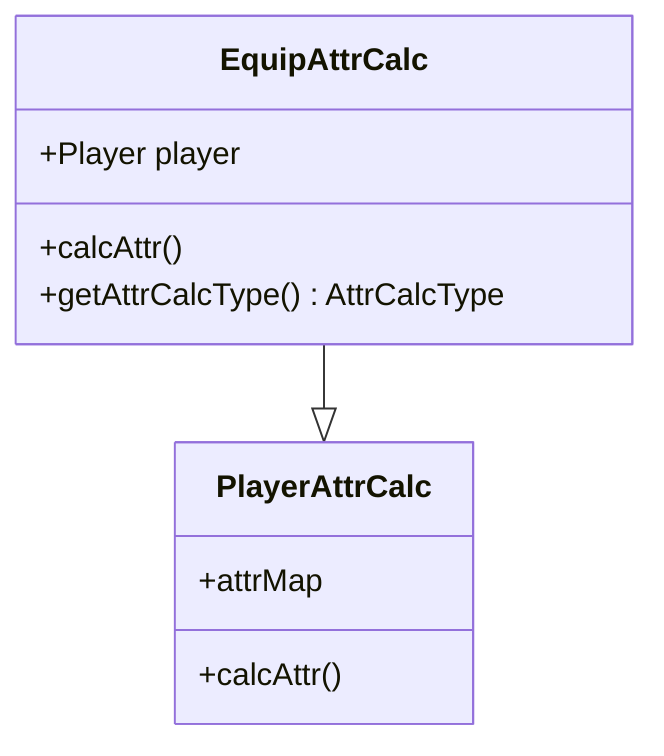

# 装备强化系统

<cite>
**本文档引用文件**  
- [EquipHandler.java](file://game\src\main\java\cn\game\games\net\game\module\develop\equip\EquipHandler.java)
- [EquipModule.java](file://game\src\main\java\cn\game\games\net\game\module\develop\equip\EquipModule.java)
- [EquipPart.java](file://game\src\main\java\cn\game\games\net\game\module\develop\equip\EquipPart.java)
- [EquipAttrCalc.java](file://game\src\main\java\cn\game\games\net\game\module\develop\attr\EquipAttrCalc.java)
- [EquipPartLvUpConfig.java](file://protocol\src\main\java\cn\game\protocol\generated\config\EquipPartLvUpConfig.java)
- [EquipConfig.java](file://protocol\src\main\java\cn\game\protocol\generated\config\EquipConfig.java)
- [PlayerHelper.java](file://game\src\main\java\cn\game\games\net\game\helper\PlayerHelper.java)
- [EventTypeEnum.java](file://game\src\main\java\cn\game\games\core\event\EventTypeEnum.java)
</cite>

## 目录
1. [系统概述](#系统概述)
2. [核心组件分析](#核心组件分析)
3. [强化业务流程](#强化业务流程)
4. [数据变更与事务管理](#数据变更与事务管理)
5. [接口调用示例](#接口调用示例)
6. [配置数据管理](#配置数据管理)
7. [事件触发机制](#事件触发机制)
8. [属性计算逻辑](#属性计算逻辑)

## 系统概述
装备强化系统是游戏核心养成系统的重要组成部分，负责管理玩家装备的强化、穿戴、分解等操作。系统通过模块化设计，将装备数据与行为逻辑分离，确保数据一致性与业务逻辑的可维护性。本系统支持装备部位强化、材料消耗、失败处理等完整强化流程，并通过事件机制实现系统间的松耦合通信。

## 核心组件分析

### 装备处理组件 (EquipHandler)
该组件作为网络请求的入口，负责接收和处理来自客户端的装备相关操作请求，包括装备穿戴、卸下、强化和分解等。通过协议分发机制，将不同类型的请求路由到对应的处理方法。

**组件来源**  
- [EquipHandler.java](file://game\src\main\java\cn\game\games\net\game\module\develop\equip\EquipHandler.java#L35-L49)

### 装备模块组件 (EquipModule)
作为装备系统的业务逻辑核心，该模块管理玩家所有装备数据，包括装备实体和装备部位状态。它维护了一个从部位类型到装备部位对象的映射关系，用于跟踪每个部位的强化等级和装备状态。

**图示来源**  
- [EquipModule.java](file://game\src\main\java\cn\game\games\net\game\module\develop\equip\EquipModule.java#L26-L150)
- [EquipPart.java](file://game\src\main\java\cn\game\games\net\game\module\develop\equip\EquipPart.java#L8-L56)

**组件来源**  
- [EquipModule.java](file://game\src\main\java\cn\game\games\net\game\module\develop\equip\EquipModule.java#L26-L150)

## 强化业务流程

### 强化流程执行步骤
装备强化流程遵循严格的顺序执行逻辑，确保每一步操作都经过验证和处理：

1. **请求验证**：接收客户端强化请求，验证请求参数合法性
2. **等级检查**：查询当前强化等级对应的配置，检查是否达到等级上限
3. **资源扣除**：根据配置扣除相应的强化材料
4. **等级提升**：更新装备部位的强化等级
5. **事件触发**：发布强化成功事件，通知相关系统
6. **响应返回**：向客户端返回操作结果

**图示来源**  
- [EquipHandler.java](file://game\src\main\java\cn\game\games\net\game\module\develop\equip\EquipHandler.java#L91-L112)

**组件来源**  
- [EquipHandler.java](file://game\src\main\java\cn\game\games\net\game\module\develop\equip\EquipHandler.java#L91-L112)

## 数据变更与事务管理

### 数据变更操作
在强化过程中，系统会进行多项数据变更操作，包括：

- **强化等级更新**：`EquipPart` 对象的 `strength` 字段递增
- **资源扣除**：通过 `PlayerHelper.delResources` 方法扣除指定材料
- **状态同步**：更新后的装备状态通过协议推送给客户端

系统通过原子性操作确保数据一致性，所有变更操作要么全部成功，要么全部回滚。

### 事务管理策略
系统采用基于方法级别的事务管理策略，确保每个业务操作的原子性。通过 `PlayerHelper` 工具类提供的资源操作方法，系统能够自动处理资源扣除的事务性，包括：

- 资源充足性检查
- 资源扣除操作
- 客户端通知推送
- 日志记录与统计

**图示来源**  
- [PlayerHelper.java](file://game\src\main\java\cn\game\games\net\game\helper\PlayerHelper.java#L538-L566)
- [EquipHandler.java](file://game\src\main\java\cn\game\games\net\game\module\develop\equip\EquipHandler.java#L106-L108)

**组件来源**  
- [PlayerHelper.java](file://game\src\main\java\cn\game\games\net\game\helper\PlayerHelper.java#L538-L566)

## 接口调用示例

### 请求参数结构
强化请求包含以下必要参数：

- `type`：装备部位类型（1-6）
- 协议标识：`EquipPartStrengthRequest_09000007`

### 响应数据格式
成功响应包含：

- 空响应体（使用默认实例）
- 错误码（如等级上限）

### 错误码处理
系统定义了标准化的错误处理机制：

- `ErrorMsgEnum.level_limit.ID`：强化等级已达上限
- `ErrorMsgEnum.player_data_not_found.ID`：玩家数据未找到
- 资源不足时自动抛出异常

**组件来源**  
- [EquipHandler.java](file://game\src\main\java\cn\game\games\net\game\module\develop\equip\EquipHandler.java#L102-L104)
- [AI.md](file://AI.md#L65-L68)

## 配置数据管理

### 强化配置结构
系统通过配置文件管理强化相关数据，主要配置类包括：

#### 装备部位升级配置 (EquipPartLvUpConfig)

**图示来源**  
- [EquipPartLvUpConfig.java](file://protocol\src\main\java\cn\game\protocol\generated\config\EquipPartLvUpConfig.java#L11-L50)

#### 装备基础配置 (EquipConfig)

**图示来源**  
- [EquipConfig.java](file://protocol\src\main\java\cn\game\protocol\generated\config\EquipConfig.java#L11-L122)

### 配置加载与平衡调整
配置数据由管理器类（Manager）统一加载和管理：

- `EquipPartLvUpManager`：负责加载和查询装备部位升级配置
- `EquipManager`：负责加载和查询装备基础配置
- 配置通过XML文件定义，支持热更新和版本管理

通过调整配置文件中的 `cost`（消耗）、`strengthenLevels`（强化等级要求）等字段，可以灵活调整游戏平衡性。

**组件来源**  
- [EquipPartLvUpConfig.java](file://protocol\src\main\java\cn\game\protocol\generated\config\EquipPartLvUpConfig.java#L11-L50)
- [EquipConfig.java](file://protocol\src\main\java\cn\game\protocol\generated\config\EquipConfig.java#L11-L122)

## 事件触发机制

### 事件传播路径
当装备强化成功后，系统会触发相应的事件，通知其他系统进行处理：

**图示来源**  
- [EquipHandler.java](file://game\src\main\java\cn\game\games\net\game\module\develop\equip\EquipHandler.java#L109)
- [PlayerEvent.java](file://game\src\main\java\cn\game\games\core\event\PlayerEvent.java)
- [EventTypeEnum.java](file://game\src\main\java\cn\game\games\core\event\EventTypeEnum.java)

### 事件类型与监听
系统定义了多种装备相关事件类型：

- `EventTypeEnum.EquipPartStrength`：装备部位强化事件
- `EventTypeEnum.EquipWear`：装备穿戴事件
- `EventTypeEnum.CostItem`：物品消耗事件

其他系统可以通过注册事件监听器来响应这些事件，实现功能扩展和数据统计。

**组件来源**  
- [EquipHandler.java](file://game\src\main\java\cn\game\games\net\game\module\develop\equip\EquipHandler.java#L109)
- [EventTypeEnum.java](file://game\src\main\java\cn\game\games\core\event\EventTypeEnum.java)

## 属性计算逻辑

### 装备属性计算
系统通过 `EquipAttrCalc` 类负责计算装备带来的属性加成：

**图示来源**  
- [EquipAttrCalc.java](file://game\src\main\java\cn\game\games\net\game\module\develop\attr\EquipAttrCalc.java#L13-L53)

### 属性计算规则
属性计算遵循以下规则：

1. **基础属性**：`baseAttrValue + (strength - 1) * stepSize`
2. **随机词条**：装备生成时随机赋予的属性
3. **强化词条**：达到指定强化等级后激活的额外属性

当装备强化等级提升时，系统会重新计算所有装备属性，并更新玩家的最终属性值。

**组件来源**  
- [EquipAttrCalc.java](file://game\src\main\java\cn\game\games\net\game\module\develop\attr\EquipAttrCalc.java#L32-L40)
- [EquipConfig.java](file://protocol\src\main\java\cn\game\protocol\generated\config\EquipConfig.java#L25-L36)