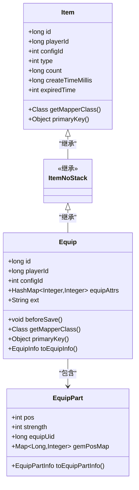
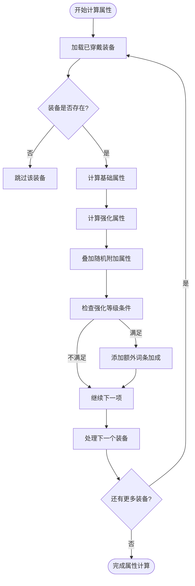
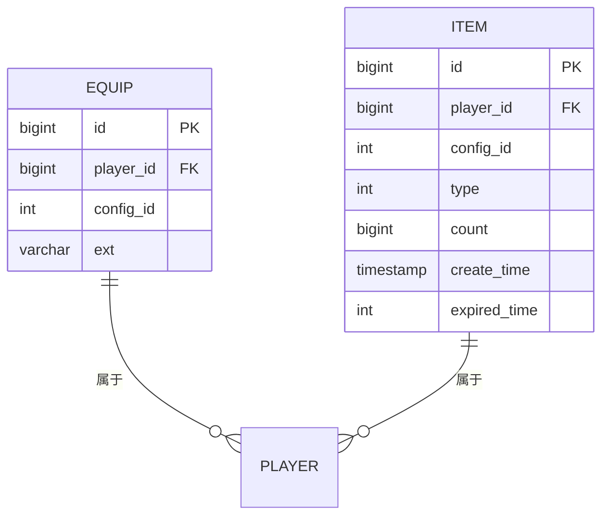
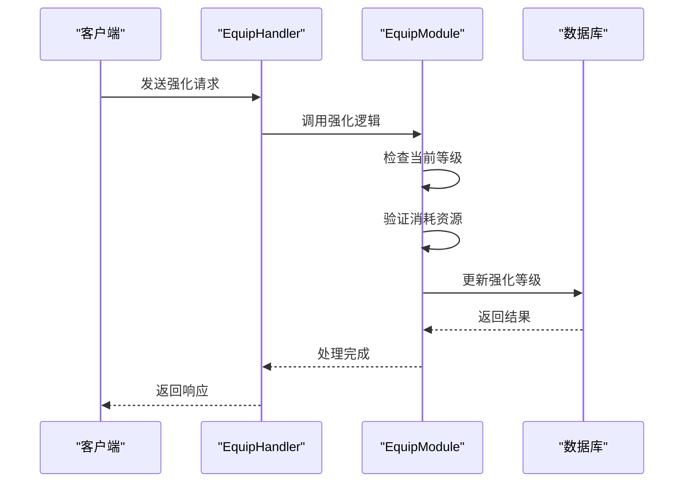

# 装备模型

<cite>
**本文档引用文件**  
- [Equip.java](file://game\src\main\java\cn\game\games\cache\entity\Equip.java)
- [Item.java](file://game\src\main\java\cn\game\games\cache\entity\Item.java)
- [EquipMapper.xml](file://game\src\main\resources\mapping\EquipMapper.xml)
- [ItemMapper.xml](file://game\src\main\resources\mapping\ItemMapper.xml)
- [EquipModule.java](file://game\src\main\java\cn\game\games\net\game\module\develop\equip\EquipModule.java)
- [EquipAttrCalc.java](file://game\src\main\java\cn\game\games\net\game\module\develop\attr\EquipAttrCalc.java)
- [EquipHandler.java](file://game\src\main\java\cn\game\games\net\game\module\develop\equip\EquipHandler.java)
- [EquipConfig.java](file://protocol\src\main\java\cn\game\protocol\generated\config\EquipConfig.java)
- [EquipPart.java](file://game\src\main\java\cn\game\games\net\game\module\develop\equip\EquipPart.java)
- [EquipPartLvUpConfig.java](file://protocol\src\main\java\cn\game\protocol\generated\config\EquipPartLvUpConfig.java)
</cite>

## 目录
1. [简介](#简介)
2. [核心类结构分析](#核心类结构分析)
3. [装备属性计算逻辑](#装备属性计算逻辑)
4. [MyBatis映射与数据库设计](#mybatis映射与数据库设计)
5. [内存存储结构](#内存存储结构)
6. [核心功能实现](#核心功能实现)
7. [事务与数据一致性](#事务与数据一致性)

## 简介
本系统中的装备模型基于继承机制构建，`Equip`类继承自基础道具类`Item`，扩展了强化等级、耐久度、宝石槽位和附加属性等特性。装备系统通过模块化设计实现了穿戴、强化、分解等功能，并结合MyBatis进行持久化操作，利用Redis缓存提升性能。

## 核心类结构分析

**图示来源**  
- [Equip.java](file://game\src\main\java\cn\game\games\cache\entity\Equip.java#L12)
- [Item.java](file://game\src\main\java\cn\game\games\cache\entity\Item.java#L8)
- [EquipPart.java](file://game\src\main\java\cn\game\games\net\game\module\develop\equip\EquipPart.java#L8)

**本节来源**  
- [Equip.java](file://game\src\main\java\cn\game\games\cache\entity\Equip.java#L12)
- [Item.java](file://game\src\main\java\cn\game\games\cache\entity\Item.java#L8)

## 装备属性计算逻辑

**图示来源**  
- [EquipAttrCalc.java](file://game\src\main\java\cn\game\games\net\game\module\develop\attr\EquipAttrCalc.java#L19)

**本节来源**  
- [EquipAttrCalc.java](file://game\src\main\java\cn\game\games\net\game\module\develop\attr\EquipAttrCalc.java#L19)

## MyBatis映射与数据库设计

**图示来源**  
- [EquipMapper.xml](file://game\src\main\resources\mapping\EquipMapper.xml#L4)
- [ItemMapper.xml](file://game\src\main\resources\mapping\ItemMapper.xml#L4)

**本节来源**  
- [EquipMapper.xml](file://game\src\main\resources\mapping\EquipMapper.xml#L4)
- [ItemMapper.xml](file://game\src\main\resources\mapping\ItemMapper.xml#L4)

## 内存存储结构
装备在内存中采用分层存储策略。基础属性通过Redis的Hash结构存储，强化记录使用Sorted Set维护。每个玩家的装备数据以`equip:{playerId}`为键存储在Hash中，而强化历史则以`strengthen_log:{playerId}`为键存储在Sorted Set中，便于按时间排序查询。

**本节来源**  
- [Equip.java](file://game\src\main\java\cn\game\games\cache\entity\Equip.java#L29)
- [EquipPart.java](file://game\src\main\java\cn\game\games\net\game\module\develop\equip\EquipPart.java#L15)

## 核心功能实现

**图示来源**  
- [EquipHandler.java](file://game\src\main\java\cn\game\games\net\game\module\develop\equip\EquipHandler.java#L91)
- [EquipModule.java](file://game\src\main\java\cn\game\games\net\game\module\develop\equip\EquipModule.java#L106)

**本节来源**  
- [EquipHandler.java](file://game\src\main\java\cn\game\games\net\game\module\develop\equip\EquipHandler.java#L91)
- [EquipModule.java](file://game\src\main\java\cn\game\games\net\game\module\develop\equip\EquipModule.java#L106)

## 事务与数据一致性
装备系统的数据一致性通过业务层事务控制保障。在执行装备强化、分解等操作时，先检查资源是否充足，然后在内存中更新状态，最后同步到数据库。所有写操作均通过MyBatis的批量更新接口完成，确保原子性。异常情况下通过事件回滚机制恢复状态。

**本节来源**  
- [EquipHandler.java](file://game\src\main\java\cn\game\games\net\game\module\develop\equip\EquipHandler.java#L106)
- [EquipModule.java](file://game\src\main\java\cn\game\games\net\game\module\develop\equip\EquipModule.java#L80)