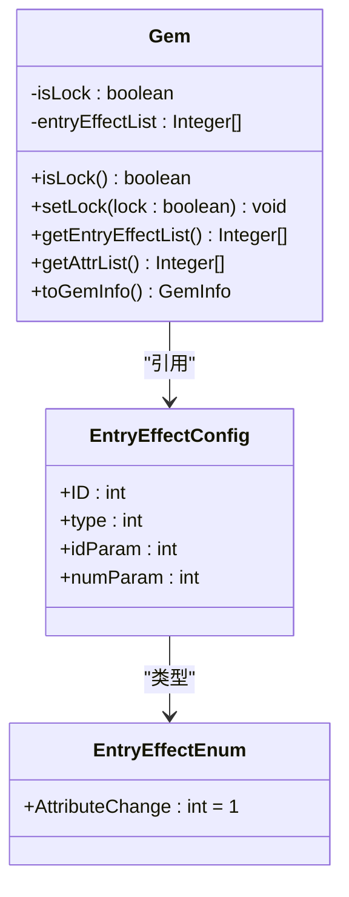
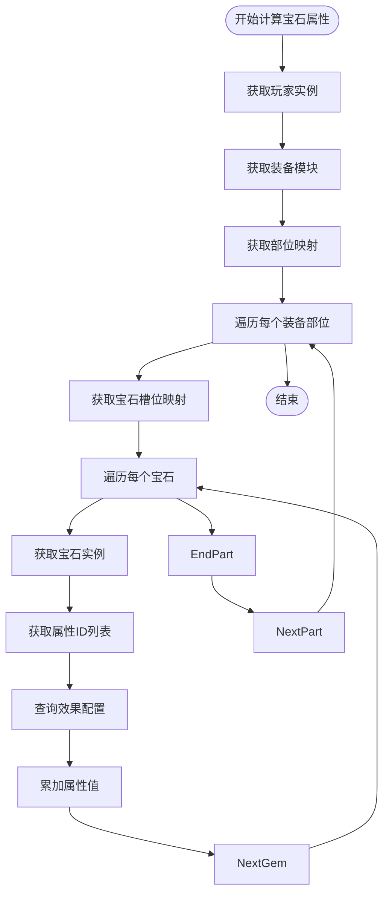
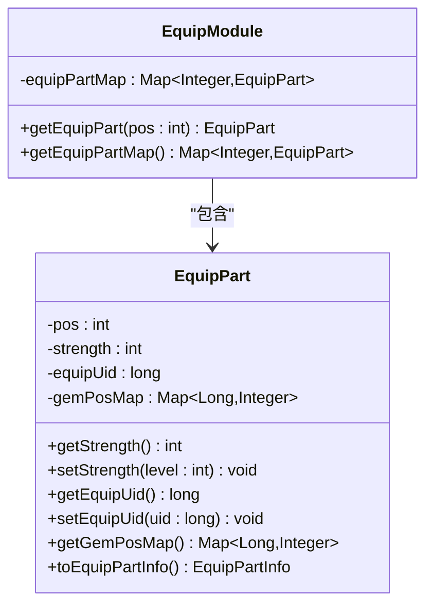
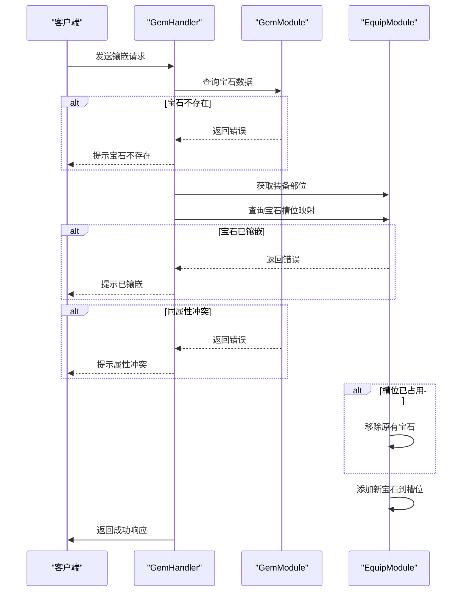
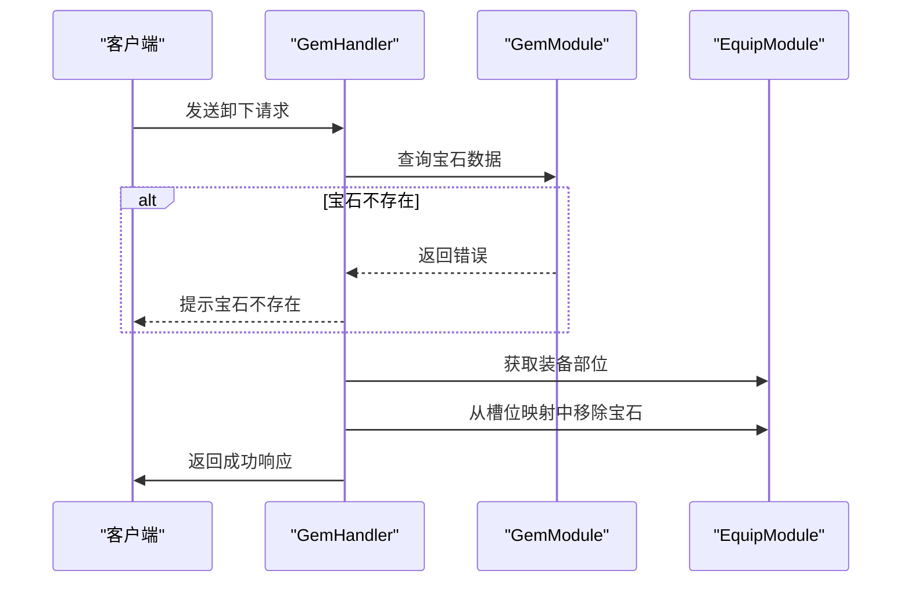
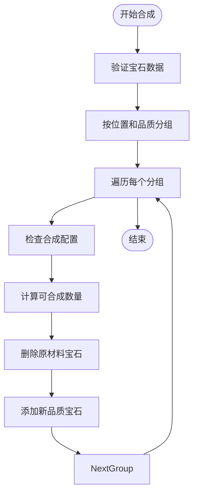
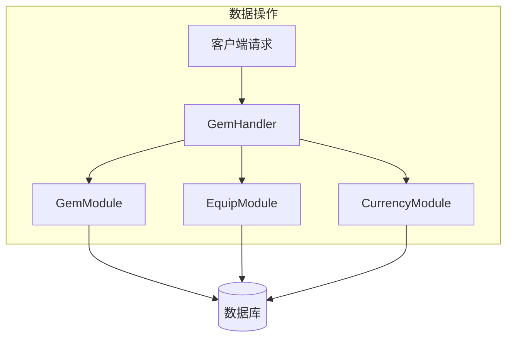
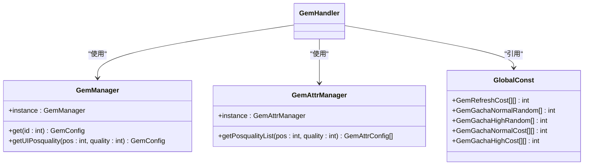
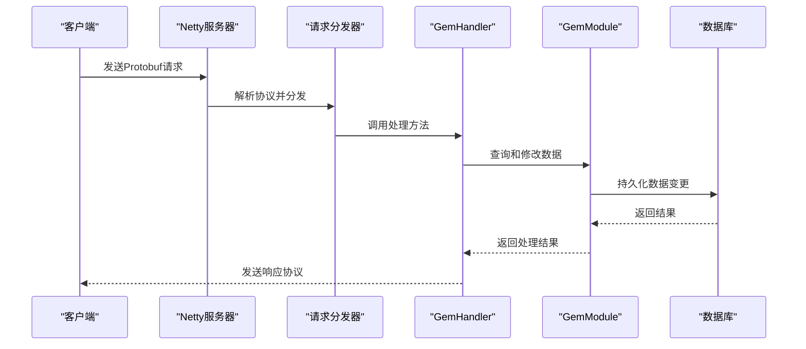

# 装备镶嵌系统

<cite>
**本文档引用文件**  
- [GemModule.java](file://game\src\main\java\cn\game\games\net\game\module\develop\gem\GemModule.java)
- [GemHandler.java](file://game\src\main\java\cn\game\games\net\game\module\develop\gem\GemHandler.java)
- [Gem.java](file://game\src\main\java\cn\game\games\net\game\module\develop\gem\Gem.java)
- [EquipModule.java](file://game\src\main\java\cn\game\games\net\game\module\develop\equip\EquipModule.java)
- [EquipPart.java](file://game\src\main\java\cn\game\games\net\game\module\develop\equip\EquipPart.java)
- [EquipPartShow.java](file://game\src\main\java\cn\game\games\net\game\module\develop\equip\EquipPartShow.java)
- [GemAttrCalc.java](file://game\src\main\java\cn\game\games\net\game\module\develop\attr\GemAttrCalc.java)
- [GlobalConst.java](file://protocol\src\main\java\cn\game\protocol\generated\config\GlobalConst.java)
- [EntryEffectEnum.xml](file://game\src\main\resources\xml\EntryEffectEnum.xml)
- [EntryEffect.xml](file://game\src\main\resources\xml\EntryEffect.xml)
</cite>

## 目录
1. [系统概述](#系统概述)
2. [宝石类型与属性体系](#宝石类型与属性体系)
3. [装备槽位管理](#装备槽位管理)
4. [核心操作流程](#核心操作流程)
5. [多实体数据操作与事务控制](#多实体数据操作与事务控制)
6. [API接口说明](#api接口说明)
7. [配置数据组织与运行时加载](#配置数据组织与运行时加载)
8. [完整处理链路](#完整处理链路)

## 系统概述

装备镶嵌系统是游戏内提升角色属性的重要养成系统，通过将宝石镶嵌到装备的特定槽位来获得属性加成。系统支持宝石的镶嵌、卸下、锁定、合成、洗练和抽取等核心功能。宝石与装备之间存在位置匹配关系，每个装备部位对应特定类型的宝石槽位。

**本节来源**  
- [GemModule.java](file://game\src\main\java\cn\game\games\net\game\module\develop\gem\GemModule.java#L1-L271)
- [EquipModule.java](file://game\src\main\java\cn\game\games\net\game\module\develop\equip\EquipModule.java#L1-L151)

## 宝石类型与属性体系

### 宝石类型体系
宝石系统基于配置驱动，每种宝石由配置ID唯一标识，包含品质（quality）、位置（pos）等属性。宝石品质决定了其属性强度和合成上限。宝石位置决定了其可镶嵌的装备部位。

### 属性加成规则
宝石的属性加成通过`EntryEffect`系统实现。每个宝石包含一个`entryEffectList`，存储其生效的效果ID。系统通过`EntryEffectManager`查询效果配置，获取具体的属性类型和数值。

**图示来源**  
- [Gem.java](file://game\src\main\java\cn\game\games\net\game\module\develop\gem\Gem.java#L1-L80)
- [EntryEffectEnum.xml](file://game\src\main\resources\xml\EntryEffectEnum.xml#L1-L23)
- [EntryEffect.xml](file://game\src\main\resources\xml\EntryEffect.xml#L135-L148)

### 属性计算逻辑
宝石属性在运行时由`GemAttrCalc`类统一计算。该类遍历玩家所有装备的宝石槽位，收集所有激活的宝石属性，并累加到角色属性中。

**图示来源**  
- [GemAttrCalc.java](file://game\src\main\java\cn\game\games\net\game\module\develop\attr\GemAttrCalc.java#L1-L49)
- [GemModule.java](file://game\src\main\java\cn\game\games\net\game\module\develop\gem\GemModule.java#L111-L126)

**本节来源**  
- [Gem.java](file://game\src\main\java\cn\game\games\net\game\module\develop\gem\Gem.java#L50-L80)
- [GemAttrCalc.java](file://game\src\main\java\cn\game\games\net\game\module\develop\attr\GemAttrCalc.java#L1-L49)

## 装备槽位管理

### 槽位数据结构
装备槽位由`EquipPart`类表示，每个装备部位（1-6）对应一个`EquipPart`实例。`EquipPart`维护了当前装备的UID和宝石槽位映射。

**图示来源**  
- [EquipPart.java](file://game\src\main\java\cn\game\games\net\game\module\develop\equip\EquipPart.java#L1-L57)
- [EquipModule.java](file://game\src\main\java\cn\game\games\net\game\module\develop\equip\EquipModule.java#L1-L151)

### 槽位状态管理
`EquipPart`中的`gemPosMap`是核心数据结构，键为宝石UID，值为槽位位置（0-5）。该映射确保了：
1. 同一宝石不能重复镶嵌
2. 同一槽位只能镶嵌一颗宝石
3. 同属性词条的宝石不能同时存在

**本节来源**  
- [EquipPart.java](file://game\src\main\java\cn\game\games\net\game\module\develop\equip\EquipPart.java#L1-L57)
- [GemHandler.java](file://game\src\main\java\cn\game\games\net\game\module\develop\gem\GemHandler.java#L62-L107)

## 核心操作流程

### 镶嵌操作
镶嵌操作由`GemHandler.wear()`方法处理，流程如下：

**图示来源**  
- [GemHandler.java](file://game\src\main\java\cn\game\games\net\game\module\develop\gem\GemHandler.java#L62-L107)

### 卸下操作
卸下操作由`GemHandler.teardown()`方法处理，流程如下：

**图示来源**  
- [GemHandler.java](file://game\src\main\java\cn\game\games\net\game\module\develop\gem\GemHandler.java#L110-L127)

### 合成操作
合成操作由`GemHandler.compose()`方法处理，流程如下：

**图示来源**  
- [GemHandler.java](file://game\src\main\java\cn\game\games\net\game\module\develop\gem\GemHandler.java#L146-L191)
- [GemModule.java](file://game\src\main\java\cn\game\games\net\game\module\develop\gem\GemModule.java#L179-L182)

**本节来源**  
- [GemHandler.java](file://game\src\main\java\cn\game\games\net\game\module\develop\gem\GemHandler.java#L62-L234)
- [GemModule.java](file://game\src\main\java\cn\game\games\net\game\module\develop\gem\GemModule.java#L133-L178)

## 多实体数据操作与事务控制

镶嵌系统涉及多个实体的数据操作，包括：
- **装备实体**：通过`EquipModule`管理
- **宝石实体**：通过`GemModule`管理
- **背包实体**：通过`BackpackSystem`管理

系统采用以下策略确保数据一致性：
1. 所有操作在单个请求处理线程中完成
2. 使用模块化设计，各模块负责自身数据的CRUD
3. 通过`PlayerHelper`工具类统一处理资源增减
4. 关键操作（如合成）在删除原材料后才添加新物品

**图示来源**  
- [GemHandler.java](file://game\src\main\java\cn\game\games\net\game\module\develop\gem\GemHandler.java#L147-L187)
- [PlayerHelper.java](file://game\src\main\java\cn\game\games\net\game\helper\PlayerHelper.java)

**本节来源**  
- [GemHandler.java](file://game\src\main\java\cn\game\games\net\game\module\develop\gem\GemHandler.java#L146-L191)
- [PlayerHelper.java](file://game\src\main\java\cn\game\games\net\game\helper\PlayerHelper.java)

## API接口说明

### 请求/响应数据结构
系统提供以下核心API接口：

| 接口名称 | 请求协议 | 响应协议 | 功能描述 |
|--------|--------|--------|--------|
| 镶嵌宝石 | GemWearRequest_10000001 | GemWearResponse_10000002 | 将宝石镶嵌到装备槽位 |
| 卸下宝石 | GemTeardownRequest_10000003 | GemTeardownResponse_10000004 | 从装备槽位卸下宝石 |
| 锁定宝石 | GemLockRequest_10000005 | GemLockResponse_10000006 | 锁定/解锁宝石防止误操作 |
| 合成宝石 | GemComposeRequest_10000007 | GemComposeResponse_10000008 | 合成更高品质的宝石 |
| 洗练宝石 | GemXiLianRequest_10000010 | GemXiLianResponse_10000011 | 重随机宝石属性 |
| 宝石抽取 | GemGacheRequest_10000012 | GemGacheResponse_10000013 | 抽取新的宝石 |

### 状态码定义
| 状态码 | 错误枚举 | 描述 |
|-------|--------|------|
| 10001 | player_data_not_found | 玩家数据未找到 |
| 10002 | repeat_request | 重复请求 |
| 10003 | request_parameter_error | 请求参数错误 |
| 10004 | condition_check_error | 条件检查失败 |
| 10005 | currency_not_enough | 货币不足 |

### 异常处理机制
系统采用统一的异常处理机制：
1. 所有操作在方法开始时进行参数验证
2. 验证失败立即返回对应错误码
3. 关键操作使用事务性操作确保数据一致性
4. 日志记录关键操作的执行情况

**本节来源**  
- [GemHandler.java](file://game\src\main\java\cn\game\games\net\game\module\develop\gem\GemHandler.java#L47-L60)
- [ErrorMsgEnum.java](file://game\src\main\java\cn\game\protocol\manual\ErrorMsgEnum.java)

## 配置数据组织与运行时加载

### 配置数据组织
宝石系统配置数据主要包含：
- `GlobalConst.java`：全局常量，包含合成消耗、抽取概率等
- `EntryEffect.xml`：效果配置，定义属性类型和数值
- `EntryEffectEnum.xml`：效果类型枚举

### 运行时加载机制
系统在启动时通过`GemManager`和`GemAttrManager`加载配置数据到内存中，提供高效的查询服务。

**图示来源**  
- [GlobalConst.java](file://protocol\src\main\java\cn\game\protocol\generated\config\GlobalConst.java)
- [GemModule.java](file://game\src\main\java\cn\game\games\net\game\module\develop\gem\GemModule.java#L56-L57)

### 动态平衡调整
通过修改`GlobalConst`中的常量值，可以动态调整系统平衡：
- `GemRefreshCost`：洗练消耗
- `GemGachaNormal/HighRandom`：抽取概率
- `GemGachaNormal/HighCost`：抽取消耗

**本节来源**  
- [GlobalConst.java](file://protocol\src\main\java\cn\game\protocol\generated\config\GlobalConst.java)
- [GemModule.java](file://game\src\main\java\cn\game\games\net\game\module\develop\gem\GemModule.java#L161-L162)

## 完整处理链路

从网络请求到数据持久化的完整处理链路如下：

该链路确保了：
1. 请求的高效分发
2. 业务逻辑的清晰分离
3. 数据的一致性保证
4. 响应的及时返回

**图示来源**  
- [GemHandler.java](file://game\src\main\java\cn\game\games\net\game\module\develop\gem\GemHandler.java#L47-L60)
- [GemModule.java](file://game\src\main\java\cn\game\games\net\game\module\develop\gem\GemModule.java)

**本节来源**  
- [GemHandler.java](file://game\src\main\java\cn\game\games\net\game\module\develop\gem\GemHandler.java)
- [GemModule.java](file://game\src\main\java\cn\game\games\net\game\module\develop\gem\GemModule.java)