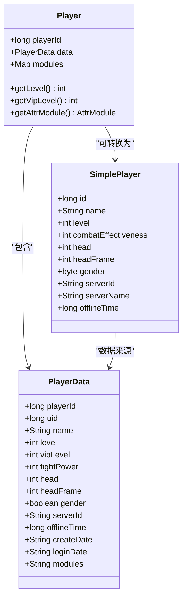
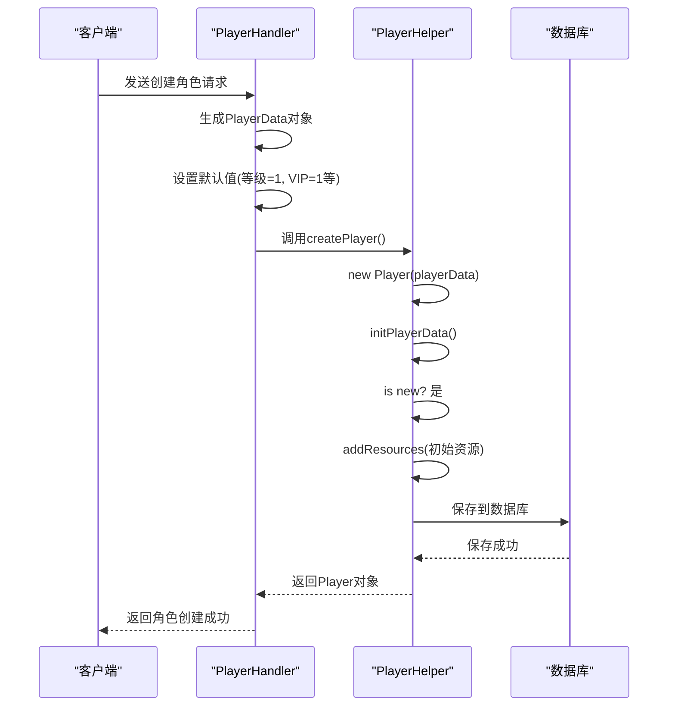
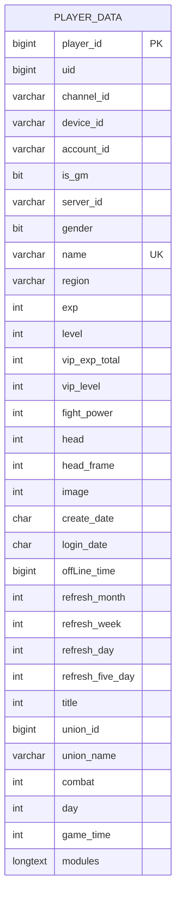
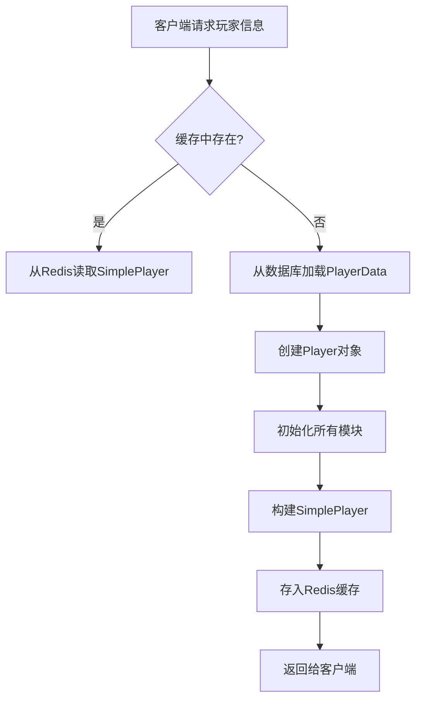

# 玩家基础属性

<cite>
**本文档引用的文件**   
- [Player.java](file://game/src/main/java/cn/game/games/cache/entity/Player.java)
- [PlayerData.java](file://game/src/main/java/cn/game/games/cache/entity/PlayerData.java)
- [SimplePlayer.java](file://game/src/main/java/cn/game/games/core/SimplePlayer.java)
- [BasePlayer.java](file://game/src/main/java/cn/game/games/core/BasePlayer.java)
- [PlayerDataMapper.xml](file://game/src/main/resources/mapping/PlayerDataMapper.xml)
- [PlayerHandler.java](file://game/src/main/java/cn/game/games/net/game/handler/PlayerHandler.java)
- [PlayerHelper.java](file://game/src/main/java/cn/game/games/net/game/helper/PlayerHelper.java)
- [PlayerManager.java](file://game/src/main/java/cn/game/games/net/game/manager/PlayerManager.java)
- [CacheType.java](file://core/src/main/java/cn/game/core/cache/CacheType.java)
- [SimpleCacheManager.java](file://core/src/main/java/cn/game/core/cache/SimpleCacheManager.java)
</cite>

## 目录
1. [引言](#引言)
2. [核心实体类与属性定义](#核心实体类与属性定义)
3. [属性初始化逻辑](#属性初始化逻辑)
4. [数据库映射与存储结构](#数据库映射与存储结构)
5. [Redis缓存设计](#redis缓存设计)
6. [字段约束与业务规则](#字段约束与业务规则)
7. [属性读取与更新操作](#属性读取与更新操作)
8. [总结](#总结)

## 引言
本文档详细阐述了游戏服务器项目中玩家基础属性的设计与实现。核心围绕`Player`实体类，解析其关键字段如玩家ID（uid）、昵称（name）、等级（level）、职业（profession）、战力（power）等。文档将深入分析这些属性的初始化逻辑、在Redis缓存中的存储结构、通过MyBatis的resultMap到数据库字段的映射关系，并提供字段类型、约束条件和业务规则的详细说明。

## 核心实体类与属性定义
玩家基础属性的核心由`Player`、`PlayerData`和`SimplePlayer`三个类共同构成。`Player`类是玩家在内存中的完整运行时对象，它聚合了`PlayerData`作为其持久化数据，并通过各种模块（Module）来管理复杂的业务逻辑。

`PlayerData`类是直接与数据库表`t_player_data`进行映射的实体，它定义了所有需要持久化存储的基础属性字段。

**Diagram sources**
- [Player.java](file://game/src/main/java/cn/game/games/cache/entity/Player.java)
- [PlayerData.java](file://game/src/main/java/cn/game/games/cache/entity/PlayerData.java)
- [SimplePlayer.java](file://game/src/main/java/cn/game/games/core/SimplePlayer.java)

**Section sources**
- [Player.java](file://game/src/main/java/cn/game/games/cache/entity/Player.java#L112-L153)
- [PlayerData.java](file://game/src/main/java/cn/game/games/cache/entity/PlayerData.java#L14-L175)

## 属性初始化逻辑
新玩家的创建和初始化是一个多步骤的过程，涉及默认值的设置和初始资源的发放。

当玩家首次注册时，系统会创建一个`PlayerData`对象，并为其设置一系列默认值。例如，玩家等级（level）和VIP等级（vipLevel）的初始值均为1。玩家的创建日期（createDate）和最后一次登录日期（loginDate）会被设置为当前时间。同时，系统会为玩家分配一个服务器ID（serverId），该ID用于标识玩家所在的逻辑服务器。

**Diagram sources**
- [PlayerHandler.java](file://game/src/main/java/cn/game/games/net/game/handler/PlayerHandler.java#L1181-L1214)
- [PlayerHelper.java](file://game/src/main/java/cn/game/games/net/game/helper/PlayerHelper.java#L1440-L1447)

**Section sources**
- [PlayerHandler.java](file://game/src/main/java/cn/game/games/net/game/handler/PlayerHandler.java#L1181-L1214)
- [PlayerHelper.java](file://game/src/main/java/cn/game/games/net/game/helper/PlayerHelper.java#L1440-L1447)

## 数据库映射与存储结构
玩家基础属性通过MyBatis框架持久化到MySQL数据库中。`PlayerDataMapper.xml`文件定义了`PlayerData`实体与`t_player_data`表之间的映射关系。

`resultMap`配置将Java字段与数据库列进行精确映射。例如，Java中的`level`字段映射到数据库的`level`列，`fightPower`字段映射到`fight_power`列。这种映射确保了对象与关系数据之间的无缝转换。

**Diagram sources**
- [PlayerDataMapper.xml](file://game/src/main/resources/mapping/PlayerDataMapper.xml)

**Section sources**
- [PlayerDataMapper.xml](file://game/src/main/resources/mapping/PlayerDataMapper.xml#L4-L47)

## Redis缓存设计
为了提高性能，玩家的部分基础属性被缓存在Redis中。系统使用`SimplePlayer`对象来存储那些需要频繁访问但不常修改的玩家信息，如昵称、等级、头像等。

缓存的键（key）遵循`PLAYER_SIMPLE:{playerId}`的命名规范，其中`PLAYER_SIMPLE`是`CacheType`枚举中定义的前缀。这种设计使得缓存的管理和失效变得非常高效。

**Diagram sources**
- [PlayerManager.java](file://game/src/main/java/cn/game/games/net/game/manager/PlayerManager.java#L129-L131)
- [CacheType.java](file://core/src/main/java/cn/game/core/cache/CacheType.java)
- [SimpleCacheManager.java](file://core/src/main/java/cn/game/core/cache/SimpleCacheManager.java)

**Section sources**
- [PlayerManager.java](file://game/src/main/java/cn/game/games/net/game/manager/PlayerManager.java#L129-L131)

## 字段约束与业务规则
玩家基础属性受到严格的业务规则和数据约束的保护。

*   **唯一性约束**: 玩家的昵称（name）在全服范围内必须是唯一的。系统通过`PlayerNameManager`类，利用Redis的Set数据结构来实现分布式环境下的昵称唯一性校验。
*   **长度限制**: 昵称的长度有明确的限制，通常在2到12个字符之间，具体规则由`GlobalConst`常量类定义。
*   **内容过滤**: 玩家的昵称、公会宣言等文本内容会经过敏感词过滤，确保内容的合规性。这通过`PlayerHelper.checkContextData()`方法实现。
*   **数据类型**: 关键数值如等级、战力、ID等均使用`int`或`long`类型，确保了数值的精确性和范围。

**Section sources**
- [PlayerNameManager.java](file://game/src/main/java/cn/game/games/net/game/manager/PlayerNameManager.java)
- [GuildHandler.java](file://game/src/main/java/cn/game/games/net/game/module/guild/GuildHandler.java#L489-L492)
- [PlayerHelper.java](file://game/src/main/java/cn/game/games/net/game/helper/PlayerHelper.java)

## 属性读取与更新操作
对玩家属性的读取和更新操作是游戏运行的核心。

*   **读取操作**: 通常通过`PlayerManager`获取`Player`对象，然后调用其getter方法。对于只读信息，优先从Redis缓存中获取`SimplePlayer`以减少数据库压力。
*   **更新操作**: 更新属性时，首先修改内存中的`Player`对象，然后在适当的时机（如玩家下线或定时任务）将变更持久化到数据库。更新操作通常会触发缓存的失效，以保证数据一致性。

**Section sources**
- [Player.java](file://game/src/main/java/cn/game/games/cache/entity/Player.java#L774-L793)
- [PlayerData.java](file://game/src/main/java/cn/game/games/cache/entity/PlayerData.java#L179-L342)
- [PlayerManager.java](file://game/src/main/java/cn/game/games/net/game/manager/PlayerManager.java#L176-L178)

## 总结
玩家基础属性的设计体现了分层、缓存和数据一致性的最佳实践。通过`PlayerData`与数据库的映射实现持久化，通过`SimplePlayer`和Redis实现高性能读取，通过`Player`对象封装复杂的业务逻辑。整个系统通过严谨的初始化流程、业务规则校验和缓存管理，确保了玩家数据的准确、高效和安全。