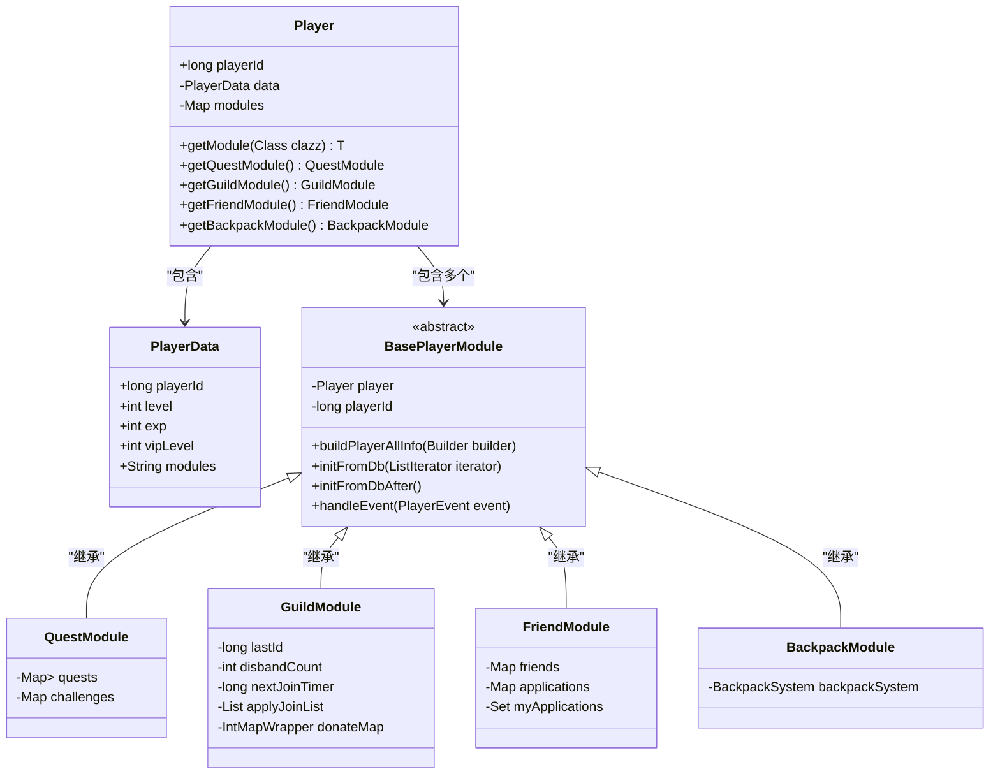
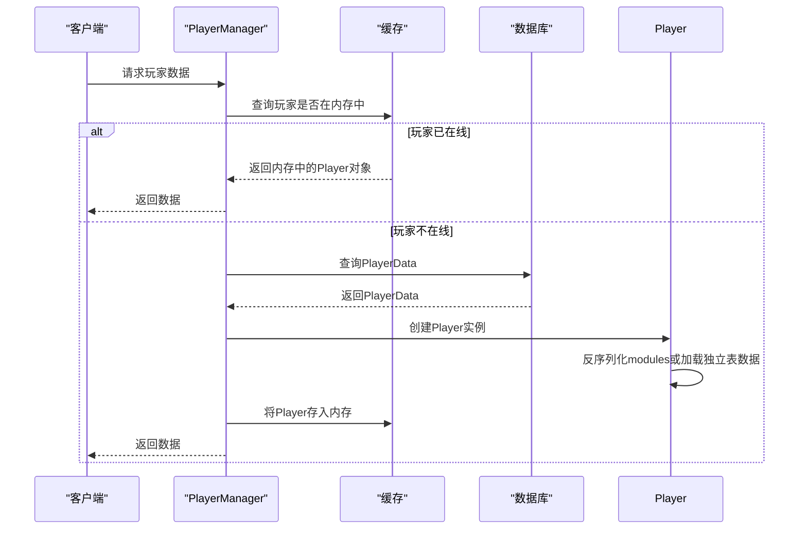

# 玩家扩展属性

<cite>
**本文档引用文件**   
- [PlayerData.java](file://game/src/main/java/cn/game/games/cache/entity/PlayerData.java)
- [Player.java](file://game/src/main/java/cn/game/games/cache/entity/Player.java)
- [BasePlayerModule.java](file://game/src/main/java/cn/game/games/core/BasePlayerModule.java)
- [PlayerDataMapper.java](file://game/src/main/java/cn/game/games/net/data/mapper/PlayerDataMapper.java)
- [QuestModule.java](file://game/src/main/java/cn/game/games/net/game/module/quest/QuestModule.java)
- [GuildModule.java](file://game/src/main/java/cn/game/games/net/game/module/guild/GuildModule.java)
- [FriendModule.java](file://game/src/main/java/cn/game/games/net/game/module/friend/FriendModule.java)
- [BackpackModule.java](file://game/src/main/java/cn/game/games/net/game/module/backpack/BackpackModule.java)
</cite>

## 目录
1. [引言](#引言)
2. [核心数据结构](#核心数据结构)
3. [扩展属性的模块化设计](#扩展属性的模块化设计)
4. [数据持久化与序列化](#数据持久化与序列化)
5. [懒加载与缓存策略](#懒加载与缓存策略)
6. [扩展属性的关联关系与内存组织](#扩展属性的关联关系与内存组织)
7. [结论](#结论)

## 引言
本文档旨在深入解析游戏服务器中玩家扩展属性的设计与实现。玩家的核心数据不仅包含基础信息（如ID、等级、经验），更包含大量复杂的扩展属性，如背包物品、任务进度、成就状态和社交关系（好友、公会）。这些属性在功能上高度独立，数据量大且结构复杂，因此需要一套高效、可扩展的系统来管理。本文将详细阐述`PlayerData`实体类的设计、扩展属性的模块化组织、持久化策略以及性能优化方案。

## 核心数据结构
玩家的核心数据由`PlayerData`类表示，该类实现了`Serializable`接口，是与数据库直接映射的持久化实体。

`PlayerData`类主要包含两类数据：
1.  **基础属性**：这些是玩家最核心、访问最频繁的字段，直接以数据库列的形式存储。例如`playerId`（玩家ID）、`level`（等级）、`exp`（经验）、`vipLevel`（VIP等级）、`head`（头像ID）等。
2.  **扩展属性**：所有复杂的、非基础的模块化数据，被统一序列化为一个JSON字符串，存储在名为`modules`的单一字段中。

这种设计将频繁读写的热点数据（基础属性）与复杂但访问频率相对较低的扩展数据分离，优化了数据库的I/O性能。

**Section sources**
- [PlayerData.java](file://game/src/main/java/cn/game/games/cache/entity/PlayerData.java#L1-L658)

## 扩展属性的模块化设计
系统采用模块化（Module）设计来管理玩家的扩展属性。每个功能模块（如任务、公会、好友、背包）都由一个独立的`BasePlayerModule`的子类实现。

### 模块化架构
`Player`类是玩家在内存中的完整表示，它持有一个`PlayerData`对象和一个`Map<String, BasePlayerModule>`，用于存储所有已加载的模块实例。



**Diagram sources **
- [Player.java](file://game/src/main/java/cn/game/games/cache/entity/Player.java#L108-L800)
- [PlayerData.java](file://game/src/main/java/cn/game/games/cache/entity/PlayerData.java#L1-L658)
- [BasePlayerModule.java](file://game/src/main/java/cn/game/games/core/BasePlayerModule.java#L1-L217)
- [QuestModule.java](file://game/src/main/java/cn/game/games/net/game/module/quest/QuestModule.java#L1-L800)
- [GuildModule.java](file://game/src/main/java/cn/game/games/net/game/module/guild/GuildModule.java#L1-L358)
- [FriendModule.java](file://game/src/main/java/cn/game/games/net/game/module/friend/FriendModule.java#L1-L395)
- [BackpackModule.java](file://game/src/main/java/cn/game/games/net/game/module/backpack/BackpackModule.java#L58-L173)

**Section sources**
- [Player.java](file://game/src/main/java/cn/game/games/cache/entity/Player.java#L108-L800)
- [BasePlayerModule.java](file://game/src/main/java/cn/game/games/core/BasePlayerModule.java#L1-L217)

### 模块功能说明
*   **QuestModule (任务模块)**：管理玩家的日常、周常、成就等任务。它使用嵌套的`Map`结构来存储不同任务类型（`QuestTypeEnum`）下的具体任务（`Quest`），并跟踪任务的完成状态和进度。
*   **GuildModule (公会模块)**：处理玩家与公会相关的所有数据，包括当前公会ID、加入时间、捐献记录、申请列表以及跨天刷新的CD时间。
*   **FriendModule (好友模块)**：维护玩家的好友列表、黑名单、收到的好友申请以及每日互动次数（如送礼次数）。
*   **BackpackModule (背包模块)**：负责管理玩家的背包系统，包括物品的增删、移动、整理等操作。它通过`BackpackSystem`来管理不同类型的背包（如装备背包、材料背包）。

## 数据持久化与序列化
系统采用混合持久化策略，根据数据特性和访问模式选择最合适的存储方式。

### 统一序列化存储
对于`PlayerData`中的`modules`字段，系统将`Player`对象中所有`BasePlayerModule`的实例通过`JsonUtil.toJsonString()`方法序列化为一个JSON字符串，并存入数据库。在加载时，通过`JsonUtil.parseObjectWithType()`方法反序列化回内存对象。

```java
// Player.java 中的 initPlayerModule 方法
public void initPlayerModule() {
    HashMap<String, BasePlayerModule> modules = null;
    String modules2 = getData().getModules();
    if (!StringUtils.isEmpty(modules2) && !"[]".equals(modules2)) {
        modules = JsonUtil.parseObjectWithType(modules2); // 反序列化
    }
    initModule(modules);
}
```

### 独立表存储
对于数据量巨大或需要复杂查询的模块，系统允许其使用独立的数据库表进行存储。这通过在模块中复写`defaultDbMapperClass()`方法来实现。例如，`FriendModule`就使用了独立的`friend`和`friend_application`表。

```java
// FriendModule.java
@Override
public Class<?>[] defaultDbMapperClass() {
    return new Class[] { FriendMapper.class, FriendApplicationMapper.class };
}
```

`BasePlayerModule`的`alwaysStoreDataInStandaloneTable()`方法会根据`defaultDbMapperClass()`的返回值自动判断是否使用独立表。如果使用独立表，则该模块的数据不会被序列化到`PlayerData.modules`字段中，从而避免了大JSON的性能问题。

**Section sources**
- [Player.java](file://game/src/main/java/cn/game/games/cache/entity/Player.java#L351-L358)
- [BasePlayerModule.java](file://game/src/main/java/cn/game/games/core/BasePlayerModule.java#L116-L118)
- [FriendModule.java](file://game/src/main/java/cn/game/games/net/game/module/friend/FriendModule.java#L306-L308)

## 懒加载与缓存策略
为了平衡性能和内存占用，系统采用了懒加载和缓存机制。

### 内存缓存
当玩家登录时，其`PlayerData`会被加载到内存中，并由`PlayerManager`进行管理。此时，`Player`对象被创建，其基础属性来自`PlayerData`，而扩展模块则根据`modules`字段被反序列化或从独立表中加载。

### 懒加载的应用
虽然核心的`Player`对象在登录时被加载，但系统通过`PlayerManager`和`GameCacheService`等组件，对一些非核心或跨玩家的数据实现了懒加载。例如，查询其他玩家的公会等级时，会先尝试从缓存中获取，若不存在则从数据库加载，避免了在初始化主玩家时加载所有关联玩家的全部数据。



**Diagram sources **
- [Player.java](file://game/src/main/java/cn/game/games/cache/entity/Player.java#L345-L349)
- [PlayerHelper.java](file://game/src/main/java/cn/game/games/net/game/helper/PlayerHelper.java#L1380-L1382)
- [GuildModule.java](file://game/src/main/java/cn/game/games/net/game/module/guild/GuildModule.java#L346-L347)

## 扩展属性的关联关系与内存组织
各扩展属性模块在内存中通过`Player`对象紧密关联，形成了一个完整的玩家数据视图。

### 关联关系
*   **数据关联**：模块之间通过`Player`对象进行通信。例如，当玩家完成一个任务（`QuestModule`）时，会触发事件，`CurrencyModule`可能会根据任务奖励增加玩家的货币。
*   **状态关联**：某些模块的状态会影响其他模块。例如，`GuildModule`会在`NewDay`事件中刷新公会任务，这需要调用`QuestModule`的相关方法。

### 内存组织
在内存中，`Player`对象是所有数据的中心枢纽。它通过`getModule()`方法提供对所有扩展模块的访问，使得业务逻辑可以方便地查询和修改任意属性。这种组织方式保证了数据的一致性和操作的原子性（在单个玩家线程内）。

## 结论
本系统通过`PlayerData`实体类与`BasePlayerModule`模块化设计的结合，成功实现了对复杂玩家扩展属性的高效管理。通过将基础属性与扩展属性分离存储、采用JSON序列化与独立表存储相结合的持久化策略，以及利用内存缓存和懒加载机制，系统在保证数据完整性的同时，优化了性能和可扩展性。这种设计模式为处理复杂的玩家数据提供了一个清晰、灵活且高性能的解决方案。