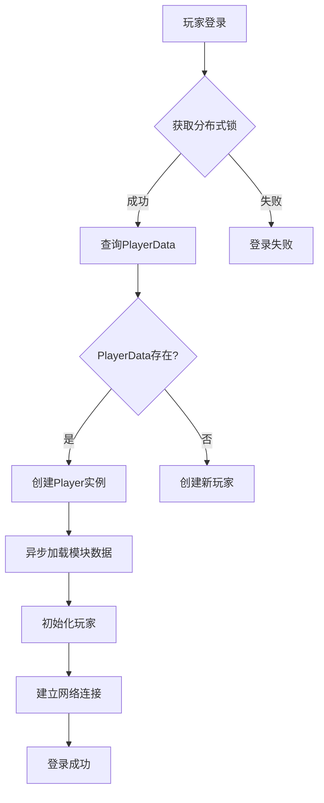
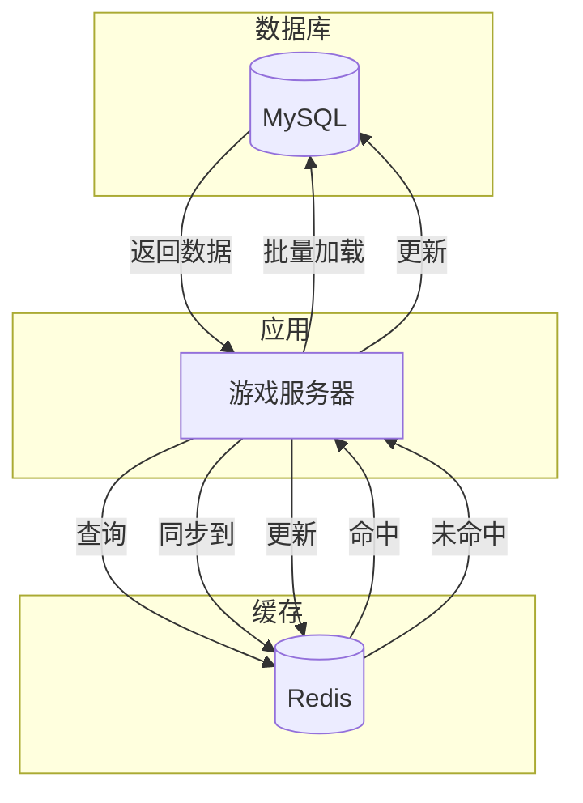
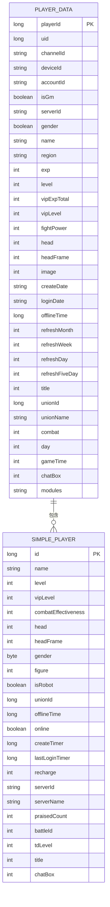

# 玩家数据模型

<cite>
**本文档引用文件**   
- [Player.java](file://game/src/main/java/cn/game/games/cache/entity/Player.java)
- [PlayerData.java](file://game/src/main/java/cn/game/games/cache/entity/PlayerData.java)
- [PlayerDataMapper.xml](file://game/src/main/resources/mapping/PlayerDataMapper.xml)
- [PlayerDataMapper.java](file://game/src/main/java/cn/game/games/net/data/mapper/PlayerDataMapper.java)
- [IdUtil.java](file://core/src/main/java/cn/game/core/id/IdUtil.java)
- [SnowflakeService.java](file://core/src/main/java/cn/game/core/id/SnowflakeService.java)
- [PlayerHelper.java](file://game/src/main/java/cn/game/games/net/game/helper/PlayerHelper.java)
- [GameServer.java](file://game/src/main/java/cn/game/games/net/game/GameServer.java)
- [PlayerManager.java](file://game/src/main/java/cn/game/games/net/game/manager/PlayerManager.java)
- [RedisLocalCache.java](file://core/src/main/java/cn/game/core/cache/RedisLocalCache.java)
</cite>

## 目录
1. [引言](#引言)
2. [核心数据实体设计](#核心数据实体设计)
3. [分布式ID生成机制](#分布式id生成机制)
4. [数据持久化与MyBatis映射](#数据持久化与mybatis映射)
5. [玩家数据加载流程](#玩家数据加载流程)
6. [缓存同步机制](#缓存同步机制)
7. [序列化与反序列化](#序列化与反序列化)
8. [实体关系图](#实体关系图)

## 引言
本文档详细阐述游戏服务器中玩家核心数据模型的设计与实现。该模型是整个游戏系统的基础，承载着玩家的身份、属性、资源和状态等关键信息。系统采用分层架构，将玩家数据在内存、Redis缓存和MySQL数据库之间进行高效同步，确保数据的一致性、可用性和高性能访问。本设计以`Player`和`PlayerData`两个核心实体为基础，通过分布式ID生成器保证玩家ID的全局唯一性，并利用MyBatis框架实现与数据库的映射操作。

## 核心数据实体设计
玩家核心数据模型主要由`Player`和`PlayerData`两个实体类构成，它们共同协作，实现了数据与行为的分离。

`PlayerData`类是玩家数据的持久化载体，实现了`Serializable`接口，确保其可以被序列化。它包含了玩家的所有核心属性，这些属性可以分为以下几类：

- **基础属性**：`playerId`（玩家ID）、`name`（昵称）、`level`（等级）、`exp`（经验）、`gender`（性别）等。
- **资源属性**：`vipExpTotal`（累积VIP经验）、`vipLevel`（VIP等级）、`fightPower`（战力）等。
- **状态属性**：`createDate`（创建日期）、`loginDate`（最后登录日期）、`offlineTime`（离线时间戳）、`refreshDay`（每日刷新时间）等。
- **扩展属性**：`modules`（所有模块的数据，以JSON字符串形式存储）、`serverId`（玩家所在服务器ID）等。

`Player`类是玩家在内存中的运行时实例，它封装了`PlayerData`对象，并提供了丰富的业务逻辑方法。`Player`类通过`modules`字段管理着各种功能模块（如`HeroModule`、`CurrencyModule`等），并通过事件总线`eventBus`处理玩家相关的事件。这种设计使得`Player`类可以专注于业务逻辑的处理，而`PlayerData`类则专注于数据的存储。

**Section sources**
- [Player.java](file://game/src/main/java/cn/game/games/cache/entity/Player.java#L1-L800)
- [PlayerData.java](file://game/src/main/java/cn/game/games/cache/entity/PlayerData.java#L1-L658)

## 分布式ID生成机制
系统采用`IdUtil`作为分布式ID生成器的外观类，整合了多种ID生成策略，为新玩家创建唯一标识。其核心实现基于`SnowflakeService`（雪花算法）。

`SnowflakeService`通过ZooKeeper协调，为每个服务器实例分配唯一的`workerId`，从而保证生成的ID在分布式环境下的全局唯一性。ID由时间戳、`workerId`和序列号组成，具有趋势递增的特性。当服务器启动时，`SnowflakeService`会初始化并获取其`workerId`，之后通过`nextId()`方法生成64位长整型的唯一ID。`IdUtil`类提供了`getId()`静态方法作为统一的入口，简化了ID的获取过程。

```mermaid
sequenceDiagram
participant Server as "游戏服务器"
participant Snowflake as "SnowflakeService"
participant ZooKeeper as "ZooKeeper"
Server->>Snowflake : init(serverId)
Snowflake->>ZooKeeper : 检查/创建 /server/distributed-id-workers 节点
Snowflake->>ZooKeeper : 获取子节点列表
alt 复用已有workerId
ZooKeeper-->>Snowflake : 返回workerId列表
loop 遍历每个workerId
Snowflake->>ZooKeeper : 读取节点数据
alt serverId匹配
ZooKeeper-->>Snowflake : WorkerNodeInfo
Snowflake->>Snowflake : 使用该workerId
break
end
end
else 创建新workerId
Snowflake->>ZooKeeper : 创建临时节点 /server/distributed-id-workers/[id]
ZooKeeper-->>Snowflake : 成功
end
Snowflake->>Snowflake : 初始化IdWorker(workerId, datacenterId)
Snowflake->>Snowflake : 启动心跳线程
loop 客户端请求ID
Server->>Snowflake : nextId()
Snowflake->>Snowflake : 根据时间戳、workerId、序列号生成ID
Snowflake-->>Server : 返回唯一ID
end
```

**Diagram sources **
- [IdUtil.java](file://core/src/main/java/cn/game/core/id/IdUtil.java#L1-L117)
- [SnowflakeService.java](file://core/src/main/java/cn/game/core/id/SnowflakeService.java#L1-L80)

## 数据持久化与MyBatis映射
玩家数据通过MyBatis框架持久化到MySQL数据库中。`PlayerDataMapper.xml`是核心的映射文件，定义了`PlayerData`实体与`t_player_data`数据库表之间的映射关系。

映射文件中定义了`BaseResultMap`和`ResultMapWithBLOBs`两个`resultMap`。`BaseResultMap`映射了除`modules`字段外的所有基本列，而`ResultMapWithBLOBs`继承了`BaseResultMap`并额外映射了`modules`字段，该字段在数据库中类型为`LONGVARCHAR`，用于存储JSON格式的模块数据。

关键的SQL语句包括：
- `selectByPrimaryKey`: 根据`player_id`主键查询玩家数据。
- `insert`: 插入新的玩家数据记录。
- `updateByPrimaryKey`: 更新玩家数据。
- `selectByUkUidServerid`: 根据`uid`和`server_id`的联合唯一键查询玩家，这是登录流程中的关键查询。

`PlayerDataMapper`接口定义了与XML映射文件相对应的方法，如`selectByPrimaryKey(long playerId)`和`insert(PlayerData row)`。此外，还定义了`updateColumnsByPrimaryKey`方法，支持根据主键动态更新指定的字段，提高了数据更新的灵活性。

**Section sources**
- [PlayerDataMapper.xml](file://game/src/main/resources/mapping/PlayerDataMapper.xml#L1-L623)
- [PlayerDataMapper.java](file://game/src/main/java/cn/game/games/net/data/mapper/PlayerDataMapper.java#L1-L134)

## 玩家数据加载流程
玩家数据的加载是一个从数据库查询到内存构建的完整过程，主要在玩家登录时触发。

1.  **获取分布式锁**：首先，系统通过`getPlayerDistributedLock(playerId)`获取该玩家的分布式锁，防止并发登录导致的数据不一致。
2.  **查询数据库**：调用`PlayerDataMapper.selectByUkUidServerid(uid, serverId)`，根据用户的`uid`和`serverId`从数据库中查询`PlayerData`对象。
3.  **创建Player实例**：如果查询到数据，则使用`PlayerData`对象构造`Player`实例。如果未查询到，则创建新玩家。
4.  **加载模块数据**：对于已存在的玩家，系统会执行`selectPlayerModuleData(player)`，这是一个异步操作，会查询所有独立存储的玩家模块数据（如好友、邮件等）。
5.  **初始化玩家**：调用`initPlayerData(player)`方法，完成玩家的初始化工作，包括设置默认值、触发登录事件等。
6.  **建立连接**：将`Player`实例与`GameClient`网络连接关联起来。



**Section sources**
- [PlayerHelper.java](file://game/src/main/java/cn/game/games/net/game/helper/PlayerHelper.java#L1380-L1404)
- [PlayerHelper.java](file://game/src/main/java/cn/game/games/net/game/helper/PlayerHelper.java#L1441-L1453)

## 缓存同步机制
为了提升性能，系统采用了Redis作为缓存层，实现了玩家数据在Redis缓存与MySQL数据库之间的同步。

- **SimplePlayer缓存**：系统将玩家的部分核心信息（如ID、等级、昵称、战力等）封装成`SimplePlayer`对象，并缓存到Redis中。这主要用于排行榜、好友列表等需要快速获取大量玩家简要信息的场景。
- **缓存加载**：当服务器启动或Redis数据丢失时，`GameServer.initSimplePlayers()`方法会从数据库批量加载所有玩家数据，并将对应的`SimplePlayer`对象同步到Redis缓存中。
- **缓存更新**：当玩家数据发生变化时，系统会调用`saveSimplePlayerToRedis(player)`方法，异步地将更新后的`SimplePlayer`对象写入Redis，确保缓存与数据库的一致性。
- **缓存访问**：`PlayerManager`提供了`getSimplePlayerFromRedisAsync(long playerId)`等方法，用于从Redis中异步获取`SimplePlayer`对象。



**Diagram sources **
- [GameServer.java](file://game/src/main/java/cn/game/games/net/game/GameServer.java#L232-L270)
- [PlayerManager.java](file://game/src/main/java/cn/game/games/net/game/manager/PlayerManager.java#L122-L158)
- [RedisLocalCache.java](file://core/src/main/java/cn/game/core/cache/RedisLocalCache.java#L155-L177)

## 序列化与反序列化
玩家数据的序列化与反序列化是数据在内存、缓存和数据库之间流转的关键环节。

- **内存到数据库**：当玩家数据需要持久化时，`Player`对象中的`modules`字段（一个`HashMap<String, BasePlayerModule>`）会被`JsonUtil.toJsonStringWithType()`方法序列化为JSON字符串，然后存储到`PlayerData`的`modules`字段中。`PlayerData`对象本身通过MyBatis的`insert`或`update`操作被持久化到数据库。
- **数据库到内存**：当从数据库加载`PlayerData`时，`modules`字段的JSON字符串会被`JsonUtil.parseObjectWithType()`方法反序列化回`HashMap<String, BasePlayerModule>`，并重新注入到`Player`对象的`modules`中，从而恢复玩家的所有模块状态。
- **内存到缓存**：`Player`对象被转换为`SimplePlayer`对象，然后由Redis客户端（如Redisson）自动进行序列化后存储到Redis中。读取时，Redis客户端会自动将其反序列化。

**Section sources**
- [PlayerHelper.java](file://game/src/main/java/cn/game/games/net/game/helper/PlayerHelper.java#L1506-L1508)
- [Player.java](file://game/src/main/java/cn/game/games/cache/entity/Player.java#L351-L358)

## 实体关系图


**Diagram sources **
- [PlayerData.java](file://game/src/main/java/cn/game/games/cache/entity/PlayerData.java#L14-L165)
- [SimplePlayer.java](file://game/src/main/java/cn/game/games/core/SimplePlayer.java#L39-L79)