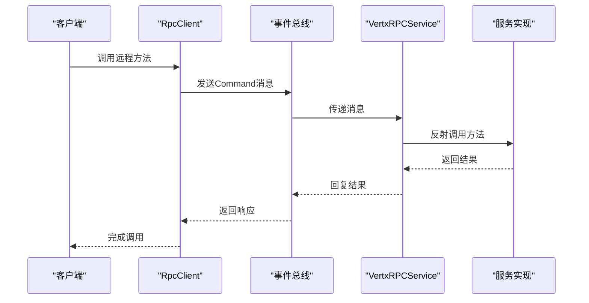
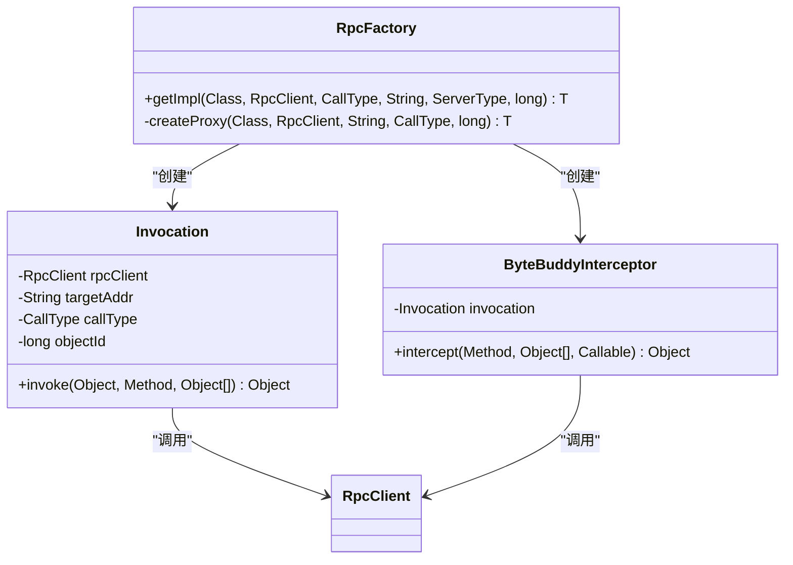
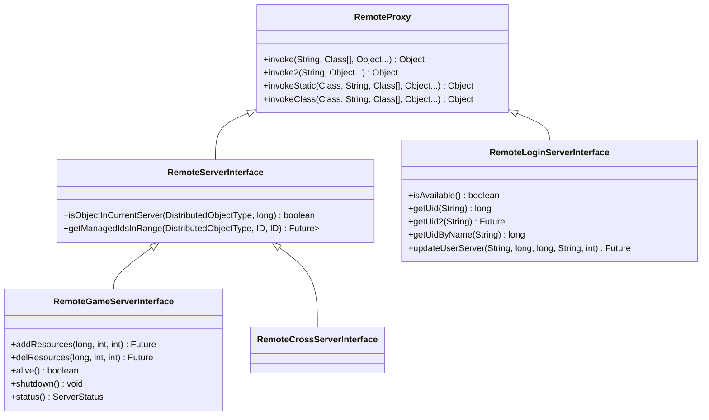
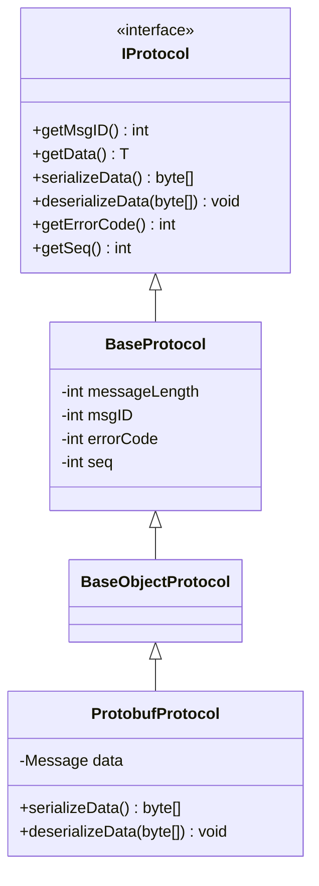
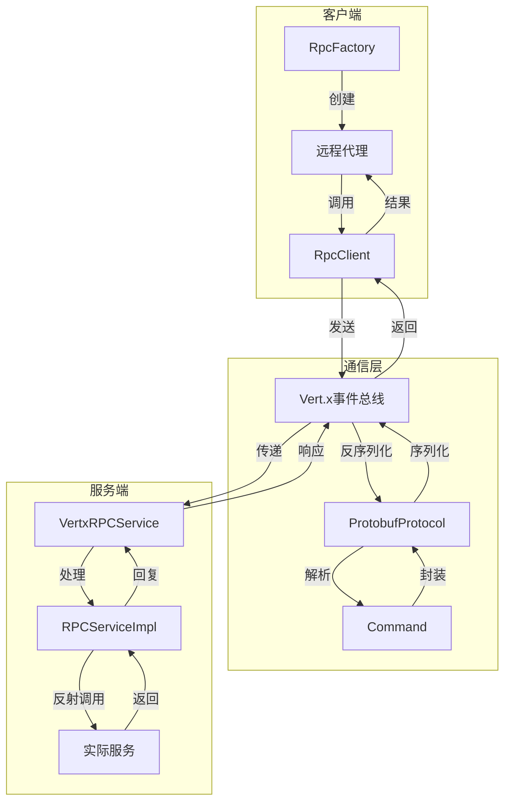

# RPC通信

<cite>
**本文档引用文件**   
- [VertxRpcClient.java](file://core\src\main\java\cn\game\core\net\rpc\vertx\VertxRpcClient.java)
- [VertxRPCService.java](file://core\src\main\java\cn\game\core\net\rpc\vertx\VertxRPCService.java)
- [RPCServiceImpl.java](file://core\src\main\java\cn\game\core\net\rpc\RPCServiceImpl.java)
- [CallType.java](file://core\src\main\java\cn\game\core\net\rpc\CallType.java)
- [RpcFactory.java](file://core\src\main\java\cn\game\core\net\rpc\RpcFactory.java)
- [RemoteServerInterface.java](file://core\src\main\java\cn\game\core\net\remote\RemoteServerInterface.java)
- [RemoteProxy.java](file://core\src\main\java\cn\game\core\net\remote\RemoteProxy.java)
- [ProtobufProtocol.java](file://core\src\main\java\cn\game\core\net\protocol\object\ProtobufProtocol.java)
- [RpcClient.java](file://core\src\main\java\cn\game\core\net\rpc\RpcClient.java)
- [RPCService.java](file://core\src\main\java\cn\game\core\net\rpc\RPCService.java)
- [Command.java](file://core\src\main\java\cn\game\core\net\transport\Command.java)
- [BaseProtocol.java](file://core\src\main\java\cn\game\core\net\protocol\BaseProtocol.java)
- [IProtocol.java](file://core\src\main\java\cn\game\core\net\protocol\IProtocol.java)
- [RemoteGameServerInterface.java](file://core\src\main\java\cn\game\core\net\remote\RemoteGameServerInterface.java)
- [RemoteLoginServerInterface.java](file://core\src\main\java\cn\game\core\net\remote\RemoteLoginServerInterface.java)
- [RemoteCrossServerInterface.java](file://core\src\main\java\cn\game\core\net\remote\RemoteCrossServerInterface.java)
</cite>

## 目录
1. [简介](#简介)
2. [RPC调用模式](#rpc调用模式)
3. [VertxRPCService实现机制](#vertxrpcservice实现机制)
4. [RpcFactory与代理创建](#rpcfactory与代理创建)
5. [远程服务契约](#远程服务契约)
6. [序列化协议](#序列化协议)
7. [错误处理与重试策略](#错误处理与重试策略)
8. [性能优化建议](#性能优化建议)
9. [架构图示](#架构图示)

## 简介
本系统基于Vert.x事件总线实现RPC通信机制，支持跨服务器节点的方法调用。通过`VertxRPCService`封装事件总线通信，结合`RpcFactory`动态代理技术，实现透明的远程方法调用。系统定义了`RemoteServerInterface`作为远程服务契约，并通过`ProtobufProtocol`进行高效序列化。

## RPC调用模式
系统定义了三种RPC调用模式，通过`CallType`枚举实现：

- **点对点（PointToPoint）**：直接向指定服务器ID发送请求
- **负载均衡（LoadBalancer）**：向指定类型的服务实例发送请求，由事件总线自动选择
- **广播（Broadcast）**：向所有匹配类型的服务实例发送消息

这些调用模式通过`RpcFactory`在创建代理时指定，决定了消息的路由方式和目标地址生成策略。

**节来源**
- [CallType.java](file://core\src\main\java\cn\game\core\net\rpc\CallType.java#L3-L5)

## VertxRPCService实现机制
`VertxRPCService`基于Vert.x事件总线实现RPC服务端功能，继承自`AbstractMessageHandlerService`并实现`RPCService`接口。其核心机制如下：

1. 通过`handleMessage`方法监听事件总线上的RPC请求
2. 接收到`Command`对象后，提取方法名、参数类型和参数值
3. 使用`RPCServiceImpl.invokeWithCache`反射调用本地服务方法
4. 通过Promise机制异步处理结果并回复调用方
5. 支持分布式追踪（trace-id）传递

服务初始化时通过`initConsumer`注册事件总线消费者，监听特定地址的消息。

**图来源**
- [VertxRPCService.java](file://core\src\main\java\cn\game\core\net\rpc\vertx\VertxRPCService.java#L29-L101)
- [RPCServiceImpl.java](file://core\src\main\java\cn\game\core\net\rpc\RPCServiceImpl.java#L18-L31)

**节来源**
- [VertxRPCService.java](file://core\src\main\java\cn\game\core\net\rpc\vertx\VertxRPCService.java#L29-L101)

## RpcFactory与代理创建
`RpcFactory`负责创建远程服务的动态代理实例，支持接口和类的代理：

1. **接口代理**：使用JDK Proxy实现
2. **类代理**：使用Byte Buddy库实现

代理创建过程根据`CallType`、`serverId`或`serverType`生成目标地址，并缓存无`objectId`的代理实例以提高性能。`Invocation`处理器拦截方法调用，将其转换为RPC请求。

**图来源**
- [RpcFactory.java](file://core\src\main\java\cn\game\core\net\rpc\RpcFactory.java#L26-L218)

**节来源**
- [RpcFactory.java](file://core\src\main\java\cn\game\core\net\rpc\RpcFactory.java#L26-L218)

## 远程服务契约
系统通过接口定义远程服务契约，主要包含：

- **RemoteServerInterface**：基础远程服务接口，继承自`RemoteProxy`
- **RemoteGameServerInterface**：游戏服务器提供的远程接口
- **RemoteLoginServerInterface**：登录服务器提供的远程接口
- **RemoteCrossServerInterface**：跨服服务器提供的远程接口

远程方法默认采用异步调用，返回类型为`Future`、`CompletionStage`或JDK `Future`的方法被视为异步调用，其他情况为同步调用。

**图来源**
- [RemoteServerInterface.java](file://core\src\main\java\cn\game\core\net\remote\RemoteServerInterface.java#L12-L43)
- [RemoteGameServerInterface.java](file://core\src\main\java\cn\game\core\net\remote\RemoteGameServerInterface.java#L12-L24)
- [RemoteLoginServerInterface.java](file://core\src\main\java\cn\game\core\net\remote\RemoteLoginServerInterface.java#L12-L34)

**节来源**
- [RemoteServerInterface.java](file://core\src\main\java\cn\game\core\net\remote\RemoteServerInterface.java#L12-L43)
- [RemoteProxy.java](file://core\src\main\java\cn\game\core\net\remote\RemoteProxy.java#L19-L94)

## 序列化协议
系统采用Protobuf作为主要序列化协议，通过`ProtobufProtocol`实现：

1. 继承自`BaseObjectProtocol<Message>`
2. 使用`PbProtocol.getInstance().parseFrom`进行反序列化
3. 通过`data.toByteArray()`进行序列化

协议设计遵循`IProtocol`接口规范，包含消息ID、序列号、错误码等元数据。

**图来源**
- [ProtobufProtocol.java](file://core\src\main\java\cn\game\core\net\protocol\object\ProtobufProtocol.java#L7-L30)
- [BaseProtocol.java](file://core\src\main\java\cn\game\core\net\protocol\BaseProtocol.java#L3-L73)
- [IProtocol.java](file://core\src\main\java\cn\game\core\net\protocol\IProtocol.java#L3-L36)

**节来源**
- [ProtobufProtocol.java](file://core\src\main\java\cn\game\core\net\protocol\object\ProtobufProtocol.java#L7-L30)

## 错误处理与重试策略
RPC系统实现了完善的错误处理机制：

1. **异常包装**：远程异常被包装为`RPCException`传输
2. **调用方处理**：根据返回类型自动处理异常
3. **超时控制**：通过`Config.remoteCallTimeOut`配置超时时间
4. **日志记录**：详细记录调用失败信息

同步调用在worker线程中执行，通过`checkAllowSync`验证执行环境。异步调用使用Future链式处理，避免阻塞事件循环。

**节来源**
- [RpcClient.java](file://core\src\main\java\cn\game\core\net\rpc\RpcClient.java#L26-L215)
- [VertxRPCService.java](file://core\src\main\java\cn\game\core\net\rpc\vertx\VertxRPCService.java#L38-L101)

## 性能优化建议
为提升RPC系统性能，建议采取以下措施：

1. **连接池管理**：复用事件总线连接，减少连接创建开销
2. **负载均衡**：合理使用`LoadBalancer`模式分散请求压力
3. **异步调用**：优先使用`Future`返回类型的方法，避免阻塞
4. **代理缓存**：对于无`objectId`的代理实例，利用`RpcFactory`的缓存机制
5. **批量操作**：合并多个小请求为批量操作，减少网络往返

**节来源**
- [RpcFactory.java](file://core\src\main\java\cn\game\core\net\rpc\RpcFactory.java#L29-L59)
- [VertxRpcClient.java](file://core\src\main\java\cn\game\core\net\rpc\vertx\VertxRpcClient.java#L10-L55)

## 架构图示

**图来源**
- [RpcFactory.java](file://core\src\main\java\cn\game\core\net\rpc\RpcFactory.java#L26-L218)
- [RpcClient.java](file://core\src\main\java\cn\game\core\net\rpc\RpcClient.java#L26-L215)
- [Command.java](file://core\src\main\java\cn\game\core\net\transport\Command.java#L13-L93)
- [ProtobufProtocol.java](file://core\src\main\java\cn\game\core\net\protocol\object\ProtobufProtocol.java#L7-L30)
- [VertxRPCService.java](file://core\src\main\java\cn\game\core\net\rpc\vertx\VertxRPCService.java#L29-L101)