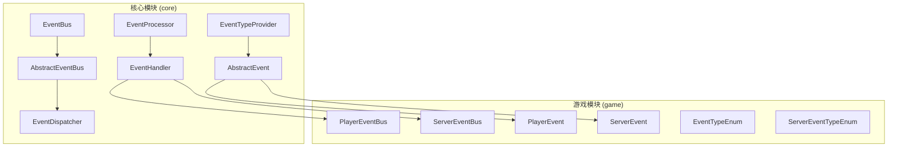
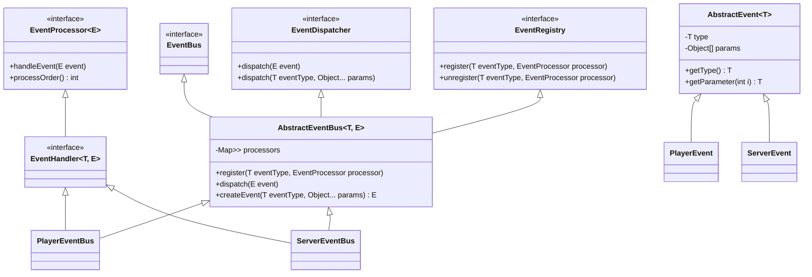
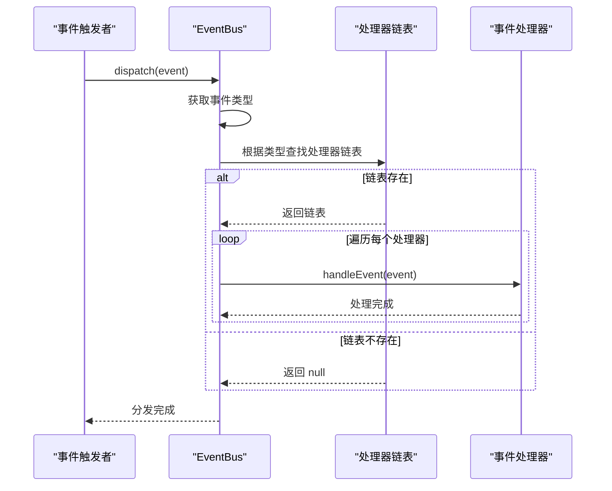
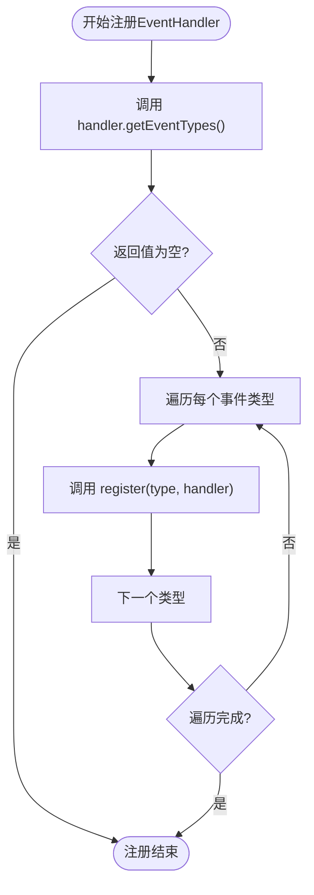
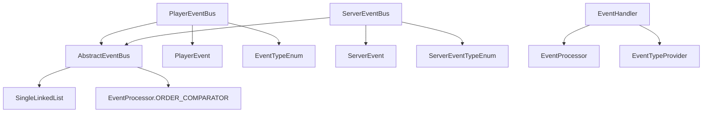

# 事件系统

<cite>
**本文档引用的文件**
- [EventBus.java](file://core/src/main/java/cn/game/core/event/EventBus.java)
- [AbstractEventBus.java](file://core/src/main/java/cn/game/core/event/AbstractEventBus.java)
- [EventDispatcher.java](file://core/src/main/java/cn/game/core/event/EventDispatcher.java)
- [EventProcessor.java](file://core/src/main/java/cn/game/core/event/EventProcessor.java)
- [EventHandler.java](file://core/src/main/java/cn/game/core/event/EventHandler.java)
- [EventTypeProvider.java](file://core/src/main/java/cn/game/core/event/EventTypeProvider.java)
- [EventRegistry.java](file://core/src/main/java/cn/game/core/event/EventRegistry.java)
- [AbstractEvent.java](file://core/src/main/java/cn/game/core/event/AbstractEvent.java)
- [ServerEventTypeEnum.java](file://core/src/main/java/cn/game/core/event/ServerEventTypeEnum.java)
- [PlayerEvent.java](file://game/src/main/java/cn/game/games/core/event/PlayerEvent.java)
- [PlayerEventBus.java](file://game/src/main/java/cn/game/games/core/event/PlayerEventBus.java)
- [ServerEventBus.java](file://game/src/main/java/cn/game/games/core/event/server/ServerEventBus.java)
- [SingleLinkedList.java](file://util/src/main/java/cn/game/util/SingleLinkedList.java)
</cite>

## 目录
1. [简介](#简介)
2. [项目结构](#项目结构)
3. [核心组件](#核心组件)
4. [架构概述](#架构概述)
5. [详细组件分析](#详细组件分析)
6. [依赖分析](#依赖分析)
7. [性能考虑](#性能考虑)
8. [故障排除指南](#故障排除指南)
9. [结论](#结论)

## 简介
本文档深入解析游戏服务器中的事件系统，重点阐述事件总线（EventBus）作为核心通信枢纽的设计与实现。该系统支持同步和异步事件分发，通过精巧的路由机制和优先级处理逻辑，实现了游戏模块间的高效解耦。文档将详细说明事件处理器的注册规范、事件队列的处理流程，以及该系统在玩家管理、战斗系统等核心模块中的实际应用，并提供最佳实践和性能优化建议。

## 项目结构
事件系统主要分布在`core`和`game`两个模块中。`core`模块提供了事件系统的基础抽象和通用实现，而`game`模块则基于这些基础构建了具体的游戏事件类型和总线实例。

**图示来源**
- [EventBus.java](file://core/src/main/java/cn/game/core/event/EventBus.java)
- [AbstractEventBus.java](file://core/src/main/java/cn/game/core/event/AbstractEventBus.java)
- [PlayerEventBus.java](file://game/src/main/java/cn/game/games/core/event/PlayerEventBus.java)
- [ServerEventBus.java](file://game/src/main/java/cn/game/games/core/event/server/ServerEventBus.java)

**本节来源**
- [core/src/main/java/cn/game/core/event](file://core/src/main/java/cn/game/core/event)
- [game/src/main/java/cn/game/games/core/event](file://game/src/main/java/cn/game/games/core/event)

## 核心组件
事件系统的核心由`EventBus`、`EventProcessor`、`EventHandler`和`EventDispatcher`等接口和抽象类构成。`AbstractEventBus`作为具体实现的基类，提供了事件注册、注销和分发的基础功能。`PlayerEventBus`和`ServerEventBus`是针对不同作用域（玩家级、服务器级）的具体总线实现。

**本节来源**
- [EventBus.java](file://core/src/main/java/cn/game/core/event/EventBus.java)
- [AbstractEventBus.java](file://core/src/main/java/cn/game/core/event/AbstractEventBus.java)
- [PlayerEventBus.java](file://game/src/main/java/cn/game/games/core/event/PlayerEventBus.java)
- [ServerEventBus.java](file://game/src/main/java/cn/game/games/core/event/server/ServerEventBus.java)

## 架构概述
事件系统采用发布-订阅模式，`EventBus`作为中心枢纽，管理着事件类型与处理器之间的映射关系。当事件被触发时，`EventDispatcher`负责将事件分发到所有注册了该事件类型的`EventProcessor`。处理器通过`EventHandler`接口实现，同时具备提供事件类型和处理事件的双重职责。

**图示来源**
- [EventBus.java](file://core/src/main/java/cn/game/core/event/EventBus.java)
- [AbstractEventBus.java](file://core/src/main/java/cn/game/core/event/AbstractEventBus.java)
- [EventDispatcher.java](file://core/src/main/java/cn/game/core/event/EventDispatcher.java)
- [EventProcessor.java](file://core/src/main/java/cn/game/core/event/EventProcessor.java)
- [EventHandler.java](file://core/src/main/java/cn/game/core/event/EventHandler.java)
- [AbstractEvent.java](file://core/src/main/java/cn/game/core/event/AbstractEvent.java)

## 详细组件分析

### EventBus 与事件分发机制
`EventBus`是事件系统的核心接口，它继承自`EventDispatcher`和`EventRegistry`，统一了事件的分发与注册功能。`AbstractEventBus`作为其抽象实现，使用`HashMap`将事件类型映射到一个有序的`SingleLinkedList`上，链表中的每个节点都是一个`EventProcessor`。这种设计支持了高效的事件路由和处理器的优先级排序。

当调用`dispatch`方法时，系统会根据事件的类型从`processors`映射中找到对应的处理器链表，并按顺序执行每个处理器的`handleEvent`方法。这实现了同步的事件分发。异步分发则可以通过在`EventProcessor`内部使用异步任务执行器来实现。

**图示来源**
- [AbstractEventBus.java](file://core/src/main/java/cn/game/core/event/AbstractEventBus.java#L88-L99)
- [EventDispatcher.java](file://core/src/main/java/cn/game/core/event/EventDispatcher.java#L5-L7)

**本节来源**
- [EventBus.java](file://core/src/main/java/cn/game/core/event/EventBus.java)
- [AbstractEventBus.java](file://core/src/main/java/cn/game/core/event/AbstractEventBus.java)

### EventProcessor 与优先级处理
`EventProcessor`接口定义了事件处理的核心方法`handleEvent`。其关键特性是`processOrder`方法，该方法返回一个整数值，用于确定同一事件类型下多个处理器的执行顺序。数值越小，优先级越高，越先执行。

在`AbstractEventBus`中，`SingleLinkedList`使用`EventProcessor.ORDER_COMPARATOR`作为比较器，确保新注册的处理器能根据其`processOrder`值被插入到链表的正确位置。系统预定义了`EVENT_PROCESS_ORDER_HIGH`、`EVENT_PROCESS_ORDER_MEDIUM`和`EVENT_PROCESS_ORDER_LOW`三个常量，方便开发者快速指定高、中、低三种优先级。

**本节来源**
- [EventProcessor.java](file://core/src/main/java/cn/game/core/event/EventProcessor.java)
- [AbstractEventBus.java](file://core/src/main/java/cn/game/core/event/AbstractEventBus.java#L16-L20)

### EventHandler 与事件类型注册
`EventHandler`接口继承自`EventTypeProvider`和`EventProcessor`，它将事件处理逻辑和事件类型声明合二为一。实现`EventHandler`的类需要实现`getEventTypes`方法，返回一个包含其监听的所有事件类型的数组。

`EventBus`提供了`register(EventHandler<T, E> handler)`方法，该方法会自动调用处理器的`getEventTypes`方法，并将处理器注册到所有声明的事件类型上。这种设计简化了注册流程，避免了为每个事件类型单独调用注册方法的繁琐操作。

**图示来源**
- [EventHandler.java](file://core/src/main/java/cn/game/core/event/EventHandler.java)
- [EventTypeProvider.java](file://core/src/main/java/cn/game/core/event/EventTypeProvider.java)
- [AbstractEventBus.java](file://core/src/main/java/cn/game/core/event/AbstractEventBus.java#L43-L48)

**本节来源**
- [EventHandler.java](file://core/src/main/java/cn/game/core/event/EventHandler.java)
- [EventTypeProvider.java](file://core/src/main/java/cn/game/core/event/EventTypeProvider.java)
- [AbstractEventBus.java](file://core/src/main/java/cn/game/core/event/AbstractEventBus.java)

### EventProcessor 与事件队列处理
`EventProcessor`本身并不直接处理队列，而是由`EventBus`的使用者来决定。`AbstractEventBus`的`dispatch`方法是同步的，它会立即执行所有处理器。要实现异步和队列化处理，通常的做法是创建一个专门的`EventProcessor`，其`handleEvent`方法不直接处理业务逻辑，而是将事件对象放入一个由`TaskExecutorService`管理的任务队列中。

例如，可以创建一个`AsyncEventProcessor`，它监听所有事件，然后将事件包装成一个`Callable`任务提交给异步执行器。这样，事件的分发是同步的（保证了事件顺序），而实际的业务处理是异步的，避免了阻塞主线程。

**本节来源**
- [EventProcessor.java](file://core/src/main/java/cn/game/core/event/EventProcessor.java)
- [TaskExecutorService.java](file://core/src/main/java/cn/game/core/execute/TaskExecutorService.java)

### AbstractEventBus 基础功能
`AbstractEventBus`提供了事件系统的基础骨架，其主要功能包括：
1.  **注册与注销**：提供多种`register`和`unregister`方法，支持单个事件类型、事件类型数组、`EventTypeProvider`以及`EventHandler`的注册与注销。
2.  **事件分发**：`dispatch`方法根据事件类型查找处理器链表并执行。
3.  **事件创建**：`dispatch(T eventType, Object... params)`方法会调用抽象的`createEvent`方法来创建具体的事件对象，这要求子类必须实现此方法。
4.  **优先级支持**：利用`SingleLinkedList`和`Comparator`确保处理器按`processOrder`排序执行。

**本节来源**
- [AbstractEventBus.java](file://core/src/main/java/cn/game/core/event/AbstractEventBus.java)

## 依赖分析
事件系统内部组件之间存在清晰的依赖关系。`AbstractEventBus`依赖于`SingleLinkedList`来维护有序的处理器列表，依赖于`EventProcessor`的`ORDER_COMPARATOR`进行排序。`PlayerEventBus`和`ServerEventBus`作为`AbstractEventBus`的子类，依赖于具体的事件类型枚举（`EventTypeEnum`和`ServerEventTypeEnum`）和事件类（`PlayerEvent`和`ServerEvent`）。

**图示来源**
- [AbstractEventBus.java](file://core/src/main/java/cn/game/core/event/AbstractEventBus.java)
- [SingleLinkedList.java](file://util/src/main/java/cn/game/util/SingleLinkedList.java)
- [PlayerEventBus.java](file://game/src/main/java/cn/game/games/core/event/PlayerEventBus.java)
- [ServerEventBus.java](file://game/src/main/java/cn/game/games/core/event/server/ServerEventBus.java)

**本节来源**
- [AbstractEventBus.java](file://core/src/main/java/cn/game/core/event/AbstractEventBus.java)
- [SingleLinkedList.java](file://util/src/main/java/cn/game/util/SingleLinkedList.java)

## 性能考虑
1.  **同步分发**：`dispatch`方法是同步的，如果某个`EventProcessor`执行时间过长，会阻塞后续处理器。对于耗时操作，应将其放入异步队列。
2.  **链表性能**：`SingleLinkedList`的`addSorted`操作在最坏情况下是O(n)，但由于事件处理器数量通常不会太多，且注册操作远少于分发操作，因此可以接受。
3.  **内存管理**：务必在适当时机调用`unregister`方法注销事件处理器，尤其是在玩家登出或模块销毁时，以避免内存泄漏。
4.  **事件对象**：避免在事件对象中存储大量数据或持有长生命周期对象的引用。

## 故障排除指南
1.  **事件未被处理**：检查处理器是否已正确注册，确认事件类型是否匹配，检查`getEventTypes`方法的返回值。
2.  **处理器执行顺序错误**：确认`processOrder`方法的返回值是否正确，高优先级的处理器应返回较小的数值。
3.  **内存泄漏**：检查是否有未注销的`EventHandler`，特别是那些与特定玩家或临时对象绑定的处理器。
4.  **性能瓶颈**：使用性能分析工具检查`dispatch`方法的执行时间，定位耗时的`EventProcessor`。

**本节来源**
- [EventProcessor.java](file://core/src/main/java/cn/game/core/event/EventProcessor.java)
- [AbstractEventBus.java](file://core/src/main/java/cn/game/core/event/AbstractEventBus.java)

## 结论
本文档详细阐述了游戏服务器事件系统的设计与实现。该系统以`EventBus`为核心，通过`EventProcessor`的优先级机制和`EventHandler`的便捷注册方式，构建了一个灵活、高效且易于扩展的通信框架。它成功地将玩家管理、战斗系统等核心模块解耦，使得各模块可以独立开发和维护。遵循本文档的最佳实践，可以有效利用该系统提升代码质量和系统性能。