# 健康监控

<cite>
**本文档引用的文件**   
- [SelfDestructGuard.java](file://core\src\main\java\cn\game\core\health\SelfDestructGuard.java)
- [HealthGuard.java](file://core\src\main\java\cn\game\core\health\HealthGuard.java)
- [RedisHealth.java](file://core\src\main\java\cn\game\core\health\RedisHealth.java)
- [ZkHealth.java](file://core\src\main\java\cn\game\core\health\ZkHealth.java)
- [SelfDestructGuardConfig.java](file://core\src\main\java\cn\game\core\health\SelfDestructGuardConfig.java)
- [RedisProbeMode.java](file://core\src\main\java\cn\game\core\health\RedisProbeMode.java)
- [ZkHelper.java](file://util\src\main\java\cn\game\util\ZkHelper.java)
- [OperationalGate.java](file://core\src\main\java\cn\game\core\ops\OperationalGate.java)
- [GameServer.java](file://game\src\main\java\cn\game\games\net\game\GameServer.java)
- [LoadManager.java](file://core\src\main\java\cn\game\core\performance\LoadManager.java)
</cite>

## 目录
1. [引言](#引言)
2. [核心健康监控组件](#核心健康监控组件)
3. [健康检查集成与探针模式](#健康检查集成与探针模式)
4. [自毁保护机制](#自毁保护机制)
5. [健康状态对服务器的影响](#健康状态对服务器的影响)
6. [健康检查端点与监控集成](#健康检查端点与监控集成)
7. [自定义健康检查逻辑](#自定义健康检查逻辑)
8. [结论](#结论)

## 引言

健康监控系统是确保服务器稳定运行的关键组件。本系统通过集成Redis和ZooKeeper的健康检查，实现对核心依赖的实时监控。当检测到严重故障时，系统能够通过自毁保护机制进行自我保护，防止故障扩散。同时，健康检查结果会直接影响服务器的运行状态和外部可见性，确保服务的高可用性。本文档将深入解析HealthGuard如何集成RedisHealth和ZkHealth来评估系统健康状态，详细说明SelfDestructGuard的自毁保护机制及其配置参数，并提供健康检查端点的暴露方式和监控集成方案。

**本节不分析具体源文件，因此不提供来源**

## 核心健康监控组件

健康监控系统由多个核心组件构成，包括HealthGuard、RedisHealth、ZkHealth、SelfDestructGuard和SelfDestructGuardConfig。这些组件协同工作，共同实现对服务器健康状态的全面监控。

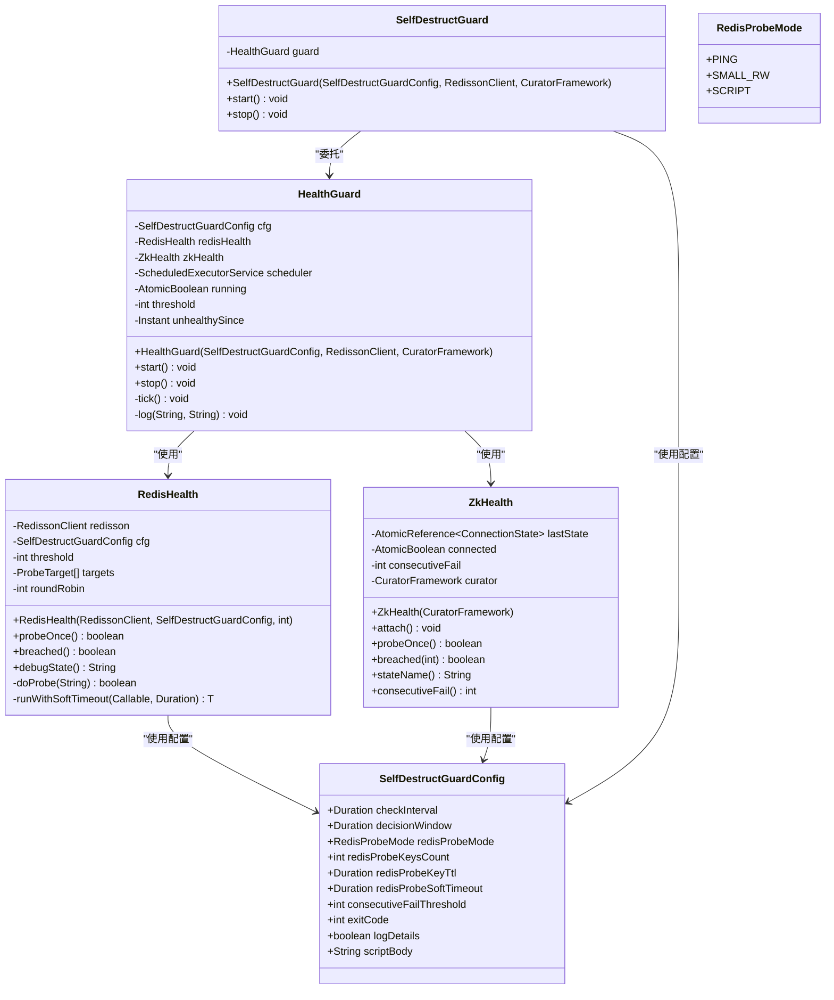

**图源**
- [HealthGuard.java](file://core\src\main\java\cn\game\core\health\HealthGuard.java)
- [RedisHealth.java](file://core\src\main\java\cn\game\core\health\RedisHealth.java)
- [ZkHealth.java](file://core\src\main\java\cn\game\core\health\ZkHealth.java)
- [SelfDestructGuard.java](file://core\src\main\java\cn\game\core\health\SelfDestructGuard.java)
- [SelfDestructGuardConfig.java](file://core\src\main\java\cn\game\core\health\SelfDestructGuardConfig.java)
- [RedisProbeMode.java](file://core\src\main\java\cn\game\core\health\RedisProbeMode.java)

## 健康检查集成与探针模式

健康监控系统通过HealthGuard组件集成Redis和ZooKeeper的健康检查。HealthGuard定期执行健康检查，评估Redis和ZooKeeper的健康状态。对于Redis的健康检查，系统提供了多种探针模式，以适应不同的监控需求。

### Redis探针模式

Redis探针模式定义了如何探测Redis的健康状态，共有三种模式：PING、SMALL_RW和SCRIPT。

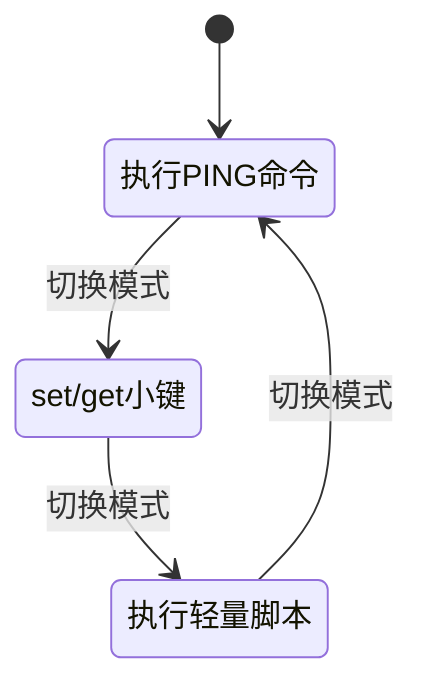

**图源**
- [RedisProbeMode.java](file://core\src\main\java\cn\game\core\health\RedisProbeMode.java)
- [RedisHealth.java](file://core\src\main\java\cn\game\core\health\RedisHealth.java)

#### PING模式

PING模式是最简单的探针模式，通过执行PING命令来检查Redis的连通性。如果PING命令失败，则会使用exists命令作为兜底方案。

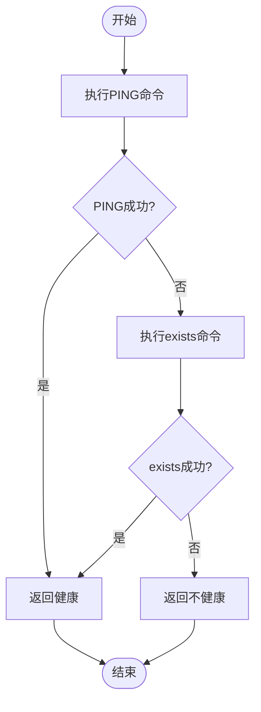

**图源**
- [RedisHealth.java](file://core\src\main\java\cn\game\core\health\RedisHealth.java#L101-L115)

#### SMALL_RW模式

SMALL_RW模式通过执行set/get操作来检查Redis的读写能力。该模式会创建一个临时键，设置值后立即读取，验证读写一致性。

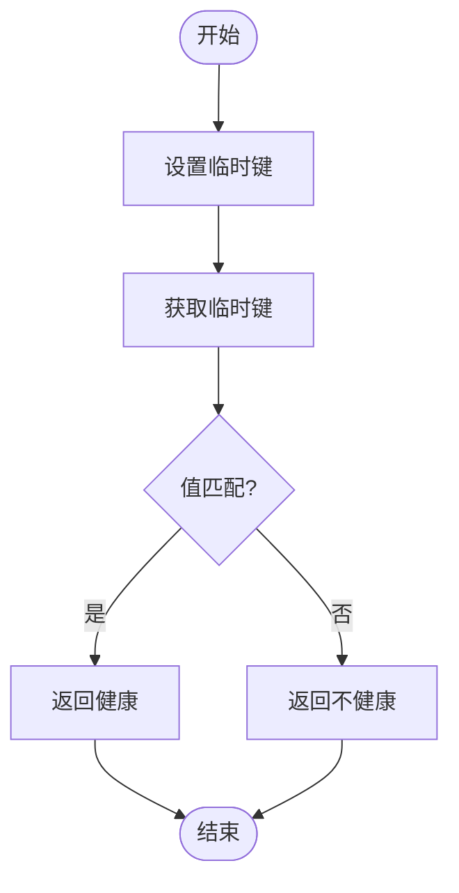

**图源**
- [RedisHealth.java](file://core\src\main\java\cn\game\core\health\RedisHealth.java#L117-L122)

#### SCRIPT模式

SCRIPT模式通过执行轻量级Lua脚本来检查Redis的脚本执行能力。该模式允许用户自定义脚本，以满足特定的监控需求。

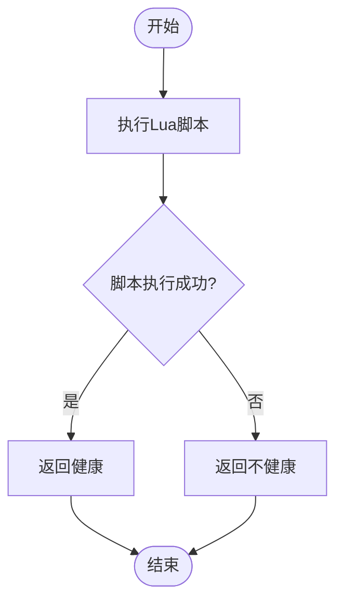

**图源**
- [RedisHealth.java](file://core\src\main\java\cn\game\core\health\RedisHealth.java#L123-L129)
- [SelfDestructGuardConfig.java](file://core\src\main\java\cn\game\core\health\SelfDestructGuardConfig.java#L34-L36)

## 自毁保护机制

自毁保护机制是健康监控系统的核心安全特性，当检测到严重故障时，系统会自动触发自毁操作，防止故障扩散。该机制由SelfDestructGuard组件实现，通过HealthGuard定期检查系统健康状态。

### 自毁保护流程

自毁保护机制的流程如下：HealthGuard定期执行健康检查，如果发现Redis或ZooKeeper连续失败达到阈值，则触发自毁操作。

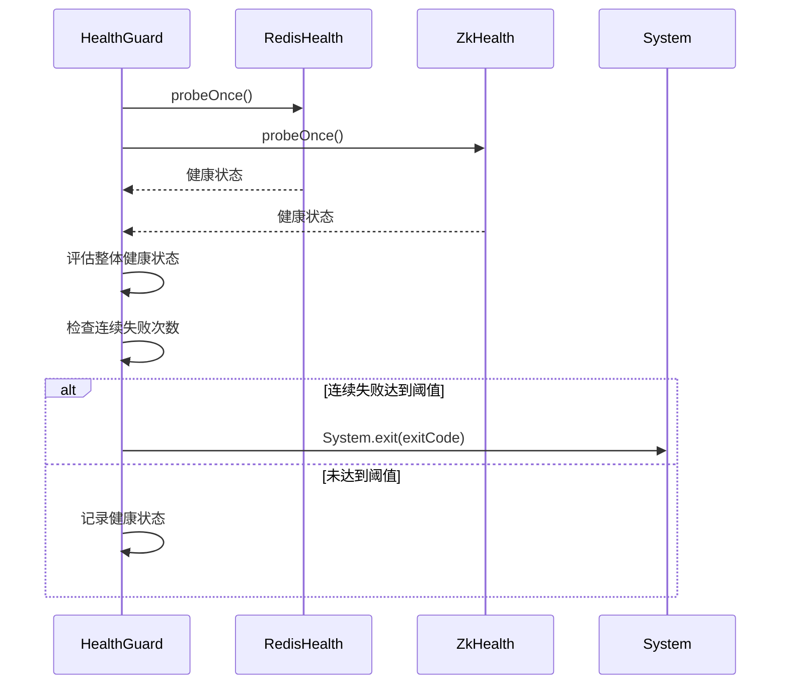

**图源**
- [HealthGuard.java](file://core\src\main\java\cn\game\core\health\HealthGuard.java#L61-L84)
- [SelfDestructGuard.java](file://core\src\main\java\cn\game\core\health\SelfDestructGuard.java#L27-L33)

### SelfDestructGuardConfig配置参数

SelfDestructGuardConfig类定义了自毁保护机制的配置参数，包括健康检查频率、故障判定窗口、Redis探针模式等。

| 配置参数 | 类型 | 默认值 | 描述 |
|--------|-----|-------|------|
| checkInterval | Duration | 10秒 | 健康检查频率 |
| decisionWindow | Duration | 5分钟 | 故障判定窗口 |
| redisProbeMode | RedisProbeMode | SMALL_RW | Redis探针模式 |
| redisProbeKeysCount | int | 9 | 探测目标键的数量 |
| redisProbeKeyTtl | Duration | 30秒 | Redis读写键的过期时间 |
| redisProbeSoftTimeout | Duration | 500毫秒 | 软超时 |
| consecutiveFailThreshold | int | 0 | 连续失败阈值 |
| exitCode | int | 42 | 退出码 |
| logDetails | boolean | true | 是否记录详细日志 |
| scriptBody | String | "return redis.call('setex', KEYS[1], ARGV[1], ARGV[2])" | 轻量脚本体 |

**表源**
- [SelfDestructGuardConfig.java](file://core\src\main\java\cn\game\core\health\SelfDestructGuardConfig.java)

## 健康状态对服务器的影响

健康检查结果不仅影响自毁保护机制，还会影响服务器的运行状态和外部可见性。通过OperationalGate组件，系统可以根据健康状态调整业务逻辑的执行策略。

### 运行状态转换

服务器的运行状态根据健康检查结果进行转换，包括NORMAL（正常）、PROTECT（保护）和SEVERE（严重）三种状态。

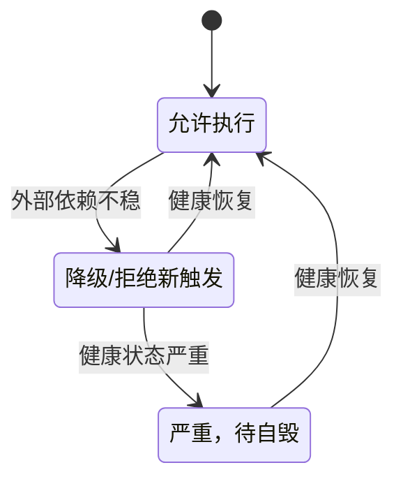

**图源**
- [OperationalGate.java](file://core\src\main\java\cn\game\core\ops\OperationalGate.java#L22-L26)

### 外部可见性控制

当服务器进入PROTECT或SEVERE状态时，系统会通过ZooKeeper更新服务器状态，通知外部系统当前服务器的健康状况。

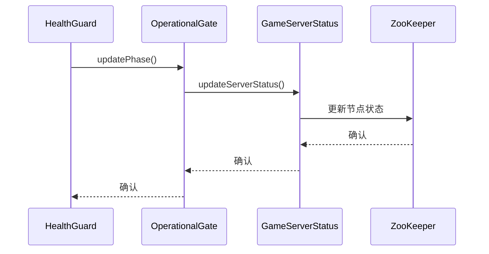

**图源**
- [OperationalGate.java](file://core\src\main\java\cn\game\core\ops\OperationalGate.java)
- [GameServer.java](file://game\src\main\java\cn\game\games\net\game\GameServer.java#L609-L625)

## 健康检查端点与监控集成

健康检查系统与Prometheus等监控系统集成，提供详细的运行时指标，便于运维人员监控服务器状态。

### Prometheus监控集成

系统通过MeterRegistry与Prometheus集成，暴露HTTP服务器请求等关键指标。

```mermaid
flowchart TD
subgraph "监控系统"
Prometheus[Prometheus Server]
end
subgraph "应用服务器"
MeterRegistry[MeterRegistry]
GameServer[GameServer]
BackendRegistries[BackendRegistries]
end
GameServer --> BackendRegistries: 获取默认注册表
BackendRegistries --> MeterRegistry: 返回注册表实例
MeterRegistry --> Prometheus: 暴露指标
Prometheus --> MeterRegistry: 抓取指标
```

**图源**
- [GameServer.java](file://game\src\main\java\cn\game\games\net\game\GameServer.java#L642-L685)

### 系统负载监控

系统通过LoadManager组件监控CPU、内存、磁盘等系统资源的使用情况，并根据预设阈值评估系统负载状态。

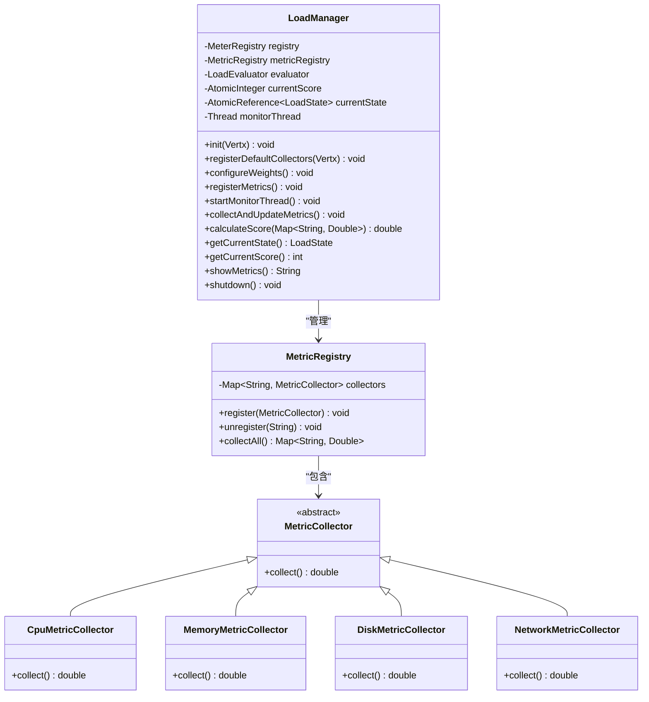

**图源**
- [LoadManager.java](file://core\src\main\java\cn\game\core\performance\LoadManager.java)
- [MemoryMetricCollector.java](file://core\src\main\java\cn\game\core\performance\metric\system\MemoryMetricCollector.java)

## 自定义健康检查逻辑

系统提供了灵活的扩展机制，允许开发者自定义健康检查逻辑。通过实现MetricCollector接口，可以添加新的指标收集器。

### 自定义指标收集器

开发者可以通过继承AbstractMetricCollector类来创建自定义的指标收集器。

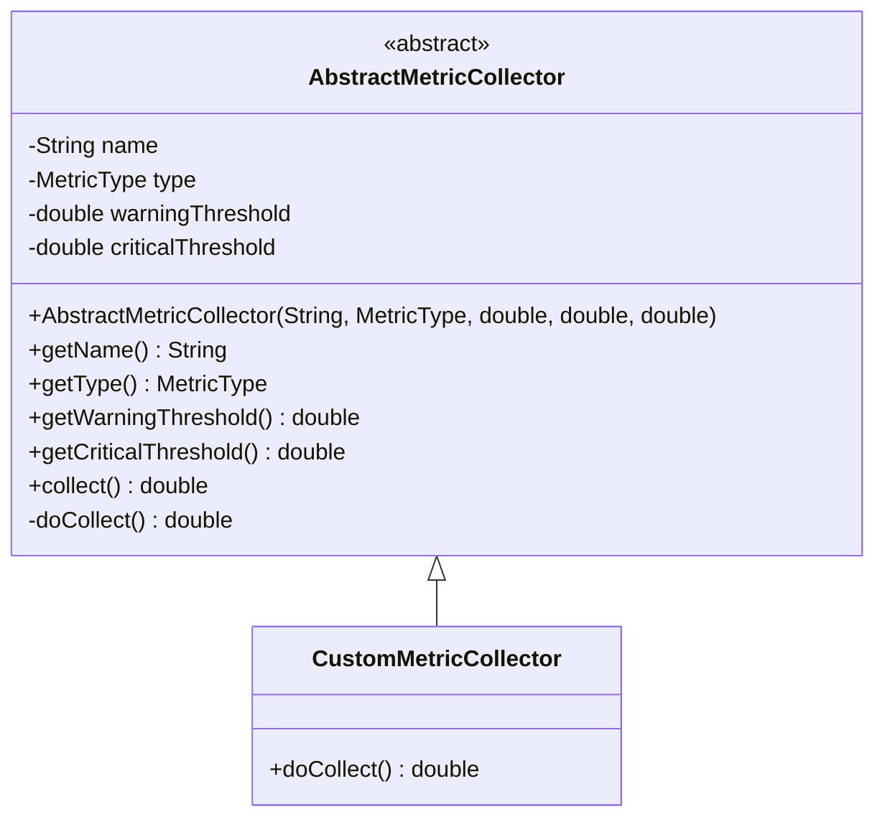

**图源**
- [AbstractMetricCollector.java](file://core\src\main\java\cn\game\core\performance\metric\AbstractMetricCollector.java)

### 扩展健康检查

通过LoadManager的register方法，可以将自定义的指标收集器注册到系统中。

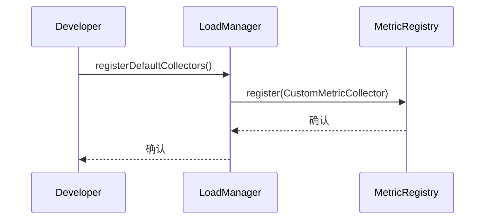

**图源**
- [LoadManager.java](file://core\src\main\java\cn\game\core\performance\LoadManager.java#L101-L113)

## 结论

健康监控系统通过集成Redis和ZooKeeper的健康检查，实现了对核心依赖的全面监控。系统提供了多种Redis探针模式，包括PING、SMALL_RW和SCRIPT，以适应不同的监控需求。自毁保护机制在检测到严重故障时能够自动触发自毁操作，防止故障扩散。健康检查结果通过OperationalGate组件影响服务器的运行状态和外部可见性，确保服务的高可用性。系统与Prometheus等监控系统集成，提供详细的运行时指标，便于运维人员监控服务器状态。通过灵活的扩展机制，开发者可以自定义健康检查逻辑，满足特定的监控需求。

**本节不分析具体源文件，因此不提供来源**