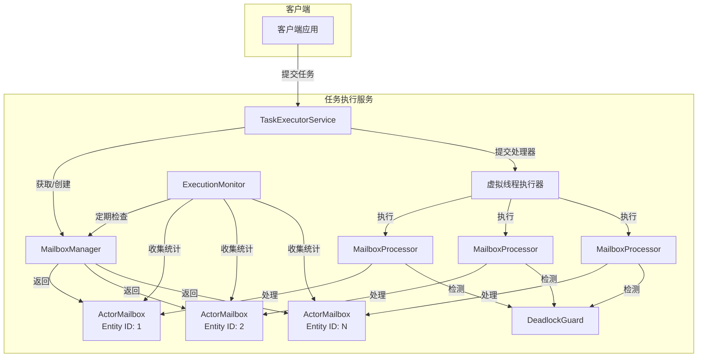
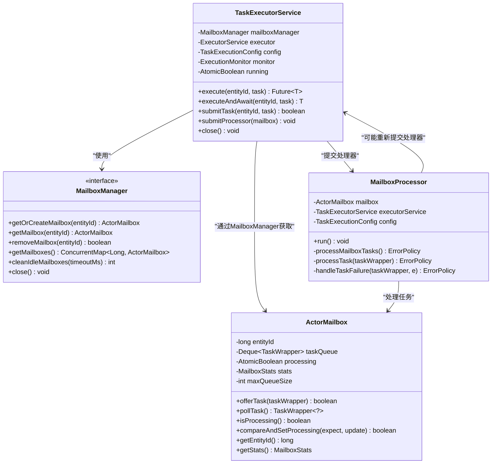
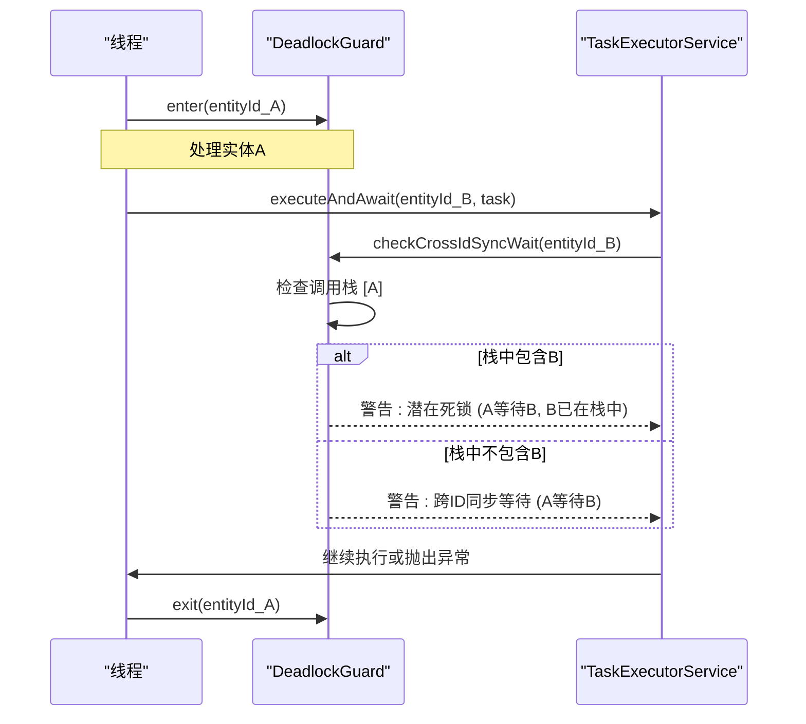
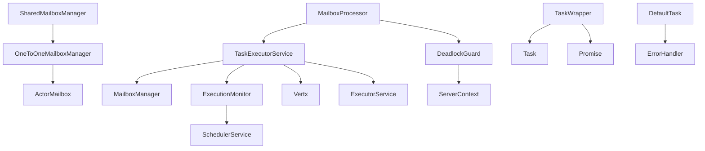

# 异步处理

<cite>
**本文档引用的文件**   
- [TaskExecutorService.java](file://core\src\main\java\cn\game\core\execute\TaskExecutorService.java)
- [DeadlockGuard.java](file://core\src\main\java\cn\game\core\execute\DeadlockGuard.java)
- [ExecutionMonitor.java](file://core\src\main\java\cn\game\core\execute\ExecutionMonitor.java)
- [TaskWrapper.java](file://core\src\main\java\cn\game\core\execute\TaskWrapper.java)
- [TaskExecutionConfig.java](file://core\src\main\java\cn\game\core\execute\TaskExecutionConfig.java)
- [ActorMailbox.java](file://core\src\main\java\cn\game\core\execute\ActorMailbox.java)
- [MailboxProcessor.java](file://core\src\main\java\cn\game\core\execute\MailboxProcessor.java)
- [TaskTimeoutException.java](file://core\src\main\java\cn\game\core\execute\TaskTimeoutException.java)
- [OneToOneMailboxManager.java](file://core\src\main\java\cn\game\core\execute\OneToOneMailboxManager.java)
- [SharedMailboxManager.java](file://core\src\main\java\cn\game\core\execute\SharedMailboxManager.java)
</cite>

## 目录
1. [简介](#简介)
2. [核心组件](#核心组件)
3. [架构概述](#架构概述)
4. [详细组件分析](#详细组件分析)
5. [依赖分析](#依赖分析)
6. [性能考量](#性能考量)
7. [故障排除指南](#故障排除指南)
8. [结论](#结论)

## 简介
本文档深入解析了基于Mailbox模式的异步处理子系统，重点阐述了`TaskExecutorService`如何实现高效的任务调度与执行。文档详细说明了不同处理器类型（如`SingleThreadProcessor`、`MultiThreadProcessor`等）的适用场景与性能特征，以及`DeadlockGuard`如何检测和预防死锁。同时，文档还解释了`TaskWrapper`对任务执行上下文的封装机制，`TaskTimeoutException`的超时控制策略，以及`ExecutionMonitor`提供的执行监控能力。此外，文档提供了配置`TaskExecutionConfig`的最佳实践，包括线程池大小、队列容量和拒绝策略的调优建议，并结合代码示例展示如何定义和提交自定义任务。

## 核心组件
本系统的核心组件包括`TaskExecutorService`、`MailboxManager`、`ActorMailbox`、`MailboxProcessor`、`DeadlockGuard`、`ExecutionMonitor`和`TaskWrapper`。这些组件共同协作，实现了基于Mailbox模式的异步任务处理机制。`TaskExecutorService`作为任务执行服务的入口，负责管理所有邮箱并协调任务执行。`MailboxManager`负责创建和管理邮箱，支持一对一和共享两种模式。`ActorMailbox`作为每个实体ID的任务队列，确保了任务的串行化执行。`MailboxProcessor`负责从邮箱中取出任务并执行。`DeadlockGuard`用于检测和预防跨ID同步等待导致的死锁。`ExecutionMonitor`提供执行监控能力，收集和报告执行统计信息。`TaskWrapper`封装了任务和结果Promise，便于任务执行和结果回调。

**本节来源**
- [TaskExecutorService.java](file://core\src\main\java\cn\game\core\execute\TaskExecutorService.java)
- [DeadlockGuard.java](file://core\src\main\java\cn\game\core\execute\DeadlockGuard.java)
- [ExecutionMonitor.java](file://core\src\main\java\cn\game\core\execute\ExecutionMonitor.java)
- [TaskWrapper.java](file://core\src\main\java\cn\game\core\execute\TaskWrapper.java)

## 架构概述
异步处理子系统采用基于Mailbox模式的Actor模型，通过`TaskExecutorService`统一管理任务的提交、调度和执行。系统的核心是邮箱（`ActorMailbox`）机制，每个实体ID对应一个独立的邮箱，确保了该实体ID上所有任务的串行化执行，避免了并发访问带来的数据竞争问题。任务提交后被封装在`TaskWrapper`中并放入对应实体ID的邮箱队列。当邮箱处于非处理状态时，`TaskExecutorService`会提交一个`MailboxProcessor`到虚拟线程执行器中，由该处理器负责从邮箱中取出任务并执行。执行过程中，`DeadlockGuard`会检测潜在的死锁风险，`ExecutionMonitor`会定期收集和报告执行统计信息。

**图示来源**
- [TaskExecutorService.java](file://core\src\main\java\cn\game\core\execute\TaskExecutorService.java)
- [ActorMailbox.java](file://core\src\main\java\cn\game\core\execute\ActorMailbox.java)
- [MailboxProcessor.java](file://core\src\main\java\cn\game\core\execute\MailboxProcessor.java)
- [DeadlockGuard.java](file://core\src\main\java\cn\game\core\execute\DeadlockGuard.java)
- [ExecutionMonitor.java](file://core\src\main\java\cn\game\core\execute\ExecutionMonitor.java)

## 详细组件分析

### TaskExecutorService 分析
`TaskExecutorService`是异步处理子系统的核心服务类，负责管理所有邮箱并协调任务的执行。它使用虚拟线程（Virtual Thread）作为底层执行器，能够高效地处理大量并发任务。服务通过`MailboxManager`来获取或创建与实体ID关联的`ActorMailbox`，并将任务提交到相应的邮箱中。当邮箱从空闲状态变为有任务时，服务会提交一个`MailboxProcessor`到虚拟线程执行器中进行处理。服务还提供了`execute`和`executeAndAwait`等方法，支持异步和同步两种任务提交方式。对于同步方式，`executeAndAwait`会在调用前通过`DeadlockGuard.checkCrossIdSyncWait`检查潜在的死锁风险。

**图示来源**
- [TaskExecutorService.java](file://core\src\main\java\cn\game\core\execute\TaskExecutorService.java)
- [MailboxManager.java](file://core\src\main\java\cn\game\core\execute\MailboxManager.java)
- [ActorMailbox.java](file://core\src\main\java\cn\game\core\execute\ActorMailbox.java)
- [MailboxProcessor.java](file://core\src\main\java\cn\game\core\execute\MailboxProcessor.java)

**本节来源**
- [TaskExecutorService.java](file://core\src\main\java\cn\game\core\execute\TaskExecutorService.java)

### DeadlockGuard 分析
`DeadlockGuard`是用于检测和预防死锁的关键组件。它通过一个`ThreadLocal`的`Deque<Long>`来维护每个线程当前正在处理的实体ID调用栈。当一个任务开始处理某个实体ID时，`enter`方法会将该ID压入栈中；处理完成后，`exit`方法会将其弹出。`checkCrossIdSyncWait`方法在调用`executeAndAwait`等同步API前被触发，它会检查当前线程的调用栈。如果发现当前正在处理的实体ID（栈顶）试图同步等待一个已经在调用栈中的其他实体ID，这将构成一个循环等待，极有可能导致死锁。此时，`DeadlockGuard`会记录一个警告日志，提醒开发者潜在的死锁风险。该机制在测试模式下默认启用，有助于在开发阶段发现并发问题。

**图示来源**
- [DeadlockGuard.java](file://core\src\main\java\cn\game\core\execute\DeadlockGuard.java)

**本节来源**
- [DeadlockGuard.java](file://core\src\main\java\cn\game\core\execute\DeadlockGuard.java)

### ExecutionMonitor 分析
`ExecutionMonitor`提供了一个强大的执行监控能力，它通过一个独立的守护线程定期（默认每60秒）收集和报告系统的执行统计信息。监控器会检查所有邮箱的状态，清理长时间空闲的邮箱，并检测潜在的死锁。对于每个邮箱，它会收集队列大小、处理状态、已完成/失败/超时任务数、平均处理时间等指标。监控器会生成一个`MonitorSnapshot`，其中包含全局统计和各个邮箱的快照，并通过日志输出最繁忙的几个邮箱。此外，它还支持添加`Consumer<MonitorSnapshot>`监听器，允许其他系统组件订阅监控数据，用于告警、动态调优或可视化展示。

**本节来源**
- [ExecutionMonitor.java](file://core\src\main\java\cn\game\core\execute\ExecutionMonitor.java)

### TaskWrapper 分析
`TaskWrapper`是任务执行上下文的封装器，它将一个`Task`对象和一个`Promise<T>`结果对象包装在一起。这种封装使得任务的执行和结果的回调能够解耦。当`MailboxProcessor`执行任务成功时，它会调用`TaskWrapper.complete(result)`来完成`Promise`；如果执行失败，则调用`TaskWrapper.fail(cause)`使`Promise`失败。`TaskWrapper`还维护了一个`attempts`计数器，用于记录任务的执行尝试次数，这对于实现重试逻辑至关重要。当任务因异常而失败时，`MailboxProcessor`会根据`ErrorHandler`的策略决定是立即重试、延迟重试还是丢弃任务，并相应地更新`attempts`计数。

**本节来源**
- [TaskWrapper.java](file://core\src\main\java\cn\game\core\execute\TaskWrapper.java)

### TaskExecutionConfig 分析
`TaskExecutionConfig`是任务执行的配置中心，它使用构建器（Builder）模式来创建不可变的配置实例。配置项包括最大队列大小（`maxQueueSize`）、邮箱空闲超时时间（`idleTimeoutMs`）、邮箱清理间隔（`mailboxCleanupIntervalMs`）、错误重试次数限制（`errorRetryLimit`）、默认任务超时时间（`defaultTaskTimeoutMs`）和死锁检测阈值（`deadlockDetectionThresholdMs`）。这些配置直接影响系统的性能和稳定性。例如，过小的队列大小可能导致任务被拒绝，而过大的超时时间可能导致资源长时间被占用。最佳实践是根据实际业务负载和性能要求来调优这些参数。

**本节来源**
- [TaskExecutionConfig.java](file://core\src\main\java\cn\game\core\execute\TaskExecutionConfig.java)

## 依赖分析
异步处理子系统内部组件之间存在紧密的依赖关系。`TaskExecutorService`依赖于`MailboxManager`来管理邮箱，依赖于`ExecutionMonitor`进行监控，依赖于`Vertx`的`Future`机制。`MailboxProcessor`依赖于`TaskExecutorService`来重新提交处理器，依赖于`DeadlockGuard`进行死锁检测。`TaskWrapper`依赖于`Task`和`Promise`。外部依赖方面，系统使用了SLF4J进行日志记录，使用了Vert.x的核心库（`io.vertx.core`）来处理异步编程模型，使用了Java的并发工具包（`java.util.concurrent`）来实现线程安全的数据结构和原子操作。

**图示来源**
- [TaskExecutorService.java](file://core\src\main\java\cn\game\core\execute\TaskExecutorService.java)
- [MailboxProcessor.java](file://core\src\main\java\cn\game\core\execute\MailboxProcessor.java)
- [TaskWrapper.java](file://core\src\main\java\cn\game\core\execute\TaskWrapper.java)
- [OneToOneMailboxManager.java](file://core\src\main\java\cn\game\core\execute\OneToOneMailboxManager.java)
- [SharedMailboxManager.java](file://core\src\main\java\cn\game\core\execute\SharedMailboxManager.java)
- [ExecutionMonitor.java](file://core\src\main\java\cn\game\core\execute\ExecutionMonitor.java)
- [DeadlockGuard.java](file://core\src\main\java\cn\game\core\execute\DeadlockGuard.java)

**本节来源**
- [TaskExecutorService.java](file://core\src\main\java\cn\game\core\execute\TaskExecutorService.java)
- [MailboxProcessor.java](file://core\src\main\java\cn\game\core\execute\MailboxProcessor.java)
- [TaskWrapper.java](file://core\src\main\java\cn\game\core\execute\TaskWrapper.java)
- [OneToOneMailboxManager.java](file://core\src\main\java\cn\game\core\execute\OneToOneMailboxManager.java)
- [SharedMailboxManager.java](file://core\src\main\java\cn\game\core\execute\SharedMailboxManager.java)
- [ExecutionMonitor.java](file://core\src\main\java\cn\game\core\execute\ExecutionMonitor.java)
- [DeadlockGuard.java](file://core\src\main\java\cn\game\core\execute\DeadlockGuard.java)

## 性能考量
为了获得最佳性能，建议根据实际业务场景对`TaskExecutionConfig`进行调优。对于高并发、低延迟的场景，可以适当增加`maxQueueSize`以缓冲突发流量，但需注意内存消耗。`defaultTaskTimeoutMs`应设置为略高于业务逻辑的平均执行时间，以避免误杀正常任务。`errorRetryLimit`不宜过高，以免在服务不可用时造成雪崩效应。在处理器类型方面，`OneToOneMailboxManager`为每个实体ID提供独立的邮箱，保证了严格的串行化，适用于对数据一致性要求极高的场景；而`SharedMailboxManager`通过哈希将多个实体ID映射到少量共享邮箱，减少了邮箱对象的数量和上下文切换开销，适用于实体ID数量巨大且对严格串行化要求不高的场景，能有效节省内存和提升吞吐量。

## 故障排除指南
当系统出现性能下降或任务积压时，应首先检查`ExecutionMonitor`的日志，查看是否有“最繁忙的邮箱”或“潜在死锁”的警告。如果发现某个邮箱队列持续增长，说明该实体ID的任务处理速度跟不上提交速度，需要优化该任务的执行逻辑或检查是否有长时间运行的任务阻塞了邮箱。如果出现死锁警告，应检查代码中是否存在跨实体ID的同步等待（`executeAndAwait`），并考虑改用异步API。如果任务频繁超时，应检查`TaskTimeoutException`日志，确认是业务逻辑本身耗时过长还是系统资源不足。此外，`DeadlockGuard`的警告日志是预防性检测的重要线索，应在开发和测试阶段重点关注。

**本节来源**
- [ExecutionMonitor.java](file://core\src\main\java\cn\game\core\execute\ExecutionMonitor.java)
- [DeadlockGuard.java](file://core\src\main\java\cn\game\core\execute\DeadlockGuard.java)
- [TaskTimeoutException.java](file://core\src\main\java\cn\game\core\execute\TaskTimeoutException.java)

## 结论
本文档详细解析了基于Mailbox模式的异步处理子系统。该系统通过`TaskExecutorService`、`ActorMailbox`和`MailboxProcessor`的协作，实现了高效且安全的任务调度与执行。`DeadlockGuard`和`ExecutionMonitor`提供了关键的死锁预防和执行监控能力，确保了系统的稳定性和可观测性。`TaskWrapper`和`TaskExecutionConfig`则提供了灵活的任务封装和配置机制。通过合理选择邮箱管理器类型和调优配置参数，该系统能够适应从高一致性到高吞吐量的各种业务场景，为构建高性能、高可靠的服务器应用提供了坚实的基础。