# 性能指标

<cite>
**本文档引用的文件**  
- [MetricCollector.java](file://core\src\main\java\cn\game\core\performance\metric\MetricCollector.java)
- [MetricRegistry.java](file://core\src\main\java\cn\game\core\performance\metric\MetricRegistry.java)
- [AbstractMetricCollector.java](file://core\src\main\java\cn\game\core\performance\metric\AbstractMetricCollector.java)
- [CpuMetricCollector.java](file://core\src\main\java\cn\game\core\performance\metric\system\CpuMetricCollector.java)
- [MemoryMetricCollector.java](file://core\src\main\java\cn\game\core\performance\metric\system\MemoryMetricCollector.java)
- [DiskMetricCollector.java](file://core\src\main\java\cn\game\core\performance\metric\system\DiskMetricCollector.java)
- [NetworkMetricCollector.java](file://core\src\main\java\cn\game\core\performance\metric\system\NetworkMetricCollector.java)
- [VertxEventLoopMetricCollector.java](file://core\src\main\java\cn\game\core\performance\metric\vertx\VertxEventLoopMetricCollector.java)
- [VertxWorkerPoolMetricCollector.java](file://core\src\main\java\cn\game\core\performance\metric\vertx\VertxWorkerPoolMetricCollector.java)
- [UserConcurrencyCollector.java](file://core\src\main\java\cn\game\core\performance\metric\custom\UserConcurrencyCollector.java)
- [PlayerConcurrencyCollector.java](file://game\src\main\java\cn\game\games\core\collector\PlayerConcurrencyCollector.java)
- [MetricType.java](file://core\src\main\java\cn\game\core\performance\metric\MetricType.java)
- [MovingAverage.java](file://core\src\main\java\cn\game\core\performance\MovingAverage.java)
- [LoadManager.java](file://core\src\main\java\cn\game\core\performance\LoadManager.java)
- [LoadEvaluator.java](file://core\src\main\java\cn\game\core\performance\evaluation\LoadEvaluator.java)
- [LoadState.java](file://core\src\main\java\cn\game\core\performance\evaluation\LoadState.java)
- [DegradeStrategy.java](file://core\src\main\java\cn\game\core\performance\DegradeStrategy.java)
- [LoadLimitTypeEnum.java](file://core\src\main\java\cn\game\core\performance\LoadLimitTypeEnum.java)
</cite>

## 目录
1. [简介](#简介)
2. [核心组件](#核心组件)
3. [架构概述](#架构概述)
4. [详细组件分析](#详细组件分析)
5. [依赖分析](#依赖分析)
6. [性能考虑](#性能考虑)
7. [故障排除指南](#故障排除指南)
8. [结论](#结论)

## 简介
本文档详细说明了性能指标采集系统的实现机制。系统通过定义统一的指标采集规范，实现了对服务器系统资源、Vert.x运行时状态以及业务关键指标的全面监控。文档重点阐述了指标采集、注册、聚合、评估和响应的完整闭环流程，为系统稳定性保障提供了技术基础。

## 核心组件

本系统的核心组件包括指标采集器接口（MetricCollector）、指标注册中心（MetricRegistry）、各类具体指标采集器（如CpuMetricCollector、MemoryMetricCollector等）、负载管理器（LoadManager）以及降级策略（DegradeStrategy）。这些组件协同工作，构成了一个完整的性能监控与自适应系统。

**核心组件来源**
- [MetricCollector.java](file://core\src\main\java\cn\game\core\performance\metric\MetricCollector.java)
- [MetricRegistry.java](file://core\src\main\java\cn\game\core\performance\metric\MetricRegistry.java)
- [LoadManager.java](file://core\src\main\java\cn\game\core\performance\LoadManager.java)
- [DegradeStrategy.java](file://core\src\main\java\cn\game\core\performance\DegradeStrategy.java)

## 架构概述

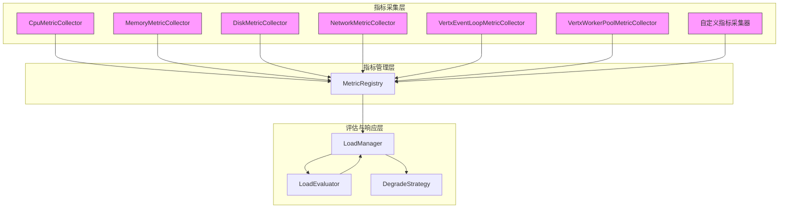

**图示来源**
- [MetricCollector.java](file://core\src\main\java\cn\game\core\performance\metric\MetricCollector.java)
- [MetricRegistry.java](file://core\src\main\java\cn\game\core\performance\metric\MetricRegistry.java)
- [LoadManager.java](file://core\src\main\java\cn\game\core\performance\LoadManager.java)
- [LoadEvaluator.java](file://core\src\main\java\cn\game\core\performance\evaluation\LoadEvaluator.java)
- [DegradeStrategy.java](file://core\src\main\java\cn\game\core\performance\DegradeStrategy.java)

## 详细组件分析

### MetricCollector 接口分析

`MetricCollector` 接口定义了所有指标采集器必须遵循的规范。它通过一系列方法强制实现了统一的指标采集、获取和管理流程。

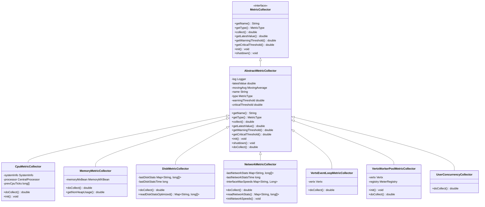

**图示来源**
- [MetricCollector.java](file://core\src\main\java\cn\game\core\performance\metric\MetricCollector.java)
- [AbstractMetricCollector.java](file://core\src\main\java\cn\game\core\performance\metric\AbstractMetricCollector.java)
- [CpuMetricCollector.java](file://core\src\main\java\cn\game\core\performance\metric\system\CpuMetricCollector.java)
- [MemoryMetricCollector.java](file://core\src\main\java\cn\game\core\performance\metric\system\MemoryMetricCollector.java)
- [DiskMetricCollector.java](file://core\src\main\java\cn\game\core\performance\metric\system\DiskMetricCollector.java)
- [NetworkMetricCollector.java](file://core\src\main\java\cn\game\core\performance\metric\system\NetworkMetricCollector.java)
- [VertxEventLoopMetricCollector.java](file://core\src\main\java\cn\game\core\performance\metric\vertx\VertxEventLoopMetricCollector.java)
- [VertxWorkerPoolMetricCollector.java](file://core\src\main\java\cn\game\core\performance\metric\vertx\VertxWorkerPoolMetricCollector.java)
- [UserConcurrencyCollector.java](file://core\src\main\java\cn\game\core\performance\metric\custom\UserConcurrencyCollector.java)

**组件来源**
- [MetricCollector.java](file://core\src\main\java\cn\game\core\performance\metric\MetricCollector.java)
- [AbstractMetricCollector.java](file://core\src\main\java\cn\game\core\performance\metric\AbstractMetricCollector.java)

### MetricRegistry 组件分析

`MetricRegistry` 是一个单例模式的指标注册中心，负责管理所有已注册的指标采集器。它提供了注册、注销、获取和批量操作等核心功能。

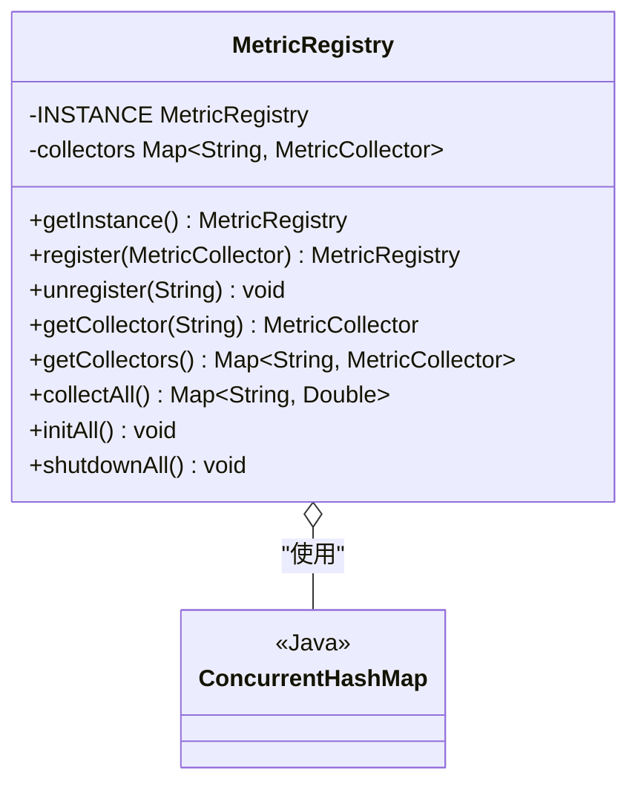

**图示来源**
- [MetricRegistry.java](file://core\src\main\java\cn\game\core\performance\metric\MetricRegistry.java)

**组件来源**
- [MetricRegistry.java](file://core\src\main\java\cn\game\core\performance\metric\MetricRegistry.java)

### 系统指标采集器分析

系统指标采集器（如CpuMetricCollector、MemoryMetricCollector等）负责采集服务器底层的硬件和操作系统资源使用情况。

#### CPU 指标采集器
`CpuMetricCollector` 使用 OSHI 库获取CPU使用率。它通过计算两次采样之间CPU时间片的差异来得到使用率，并使用滑动平均来平滑数据。

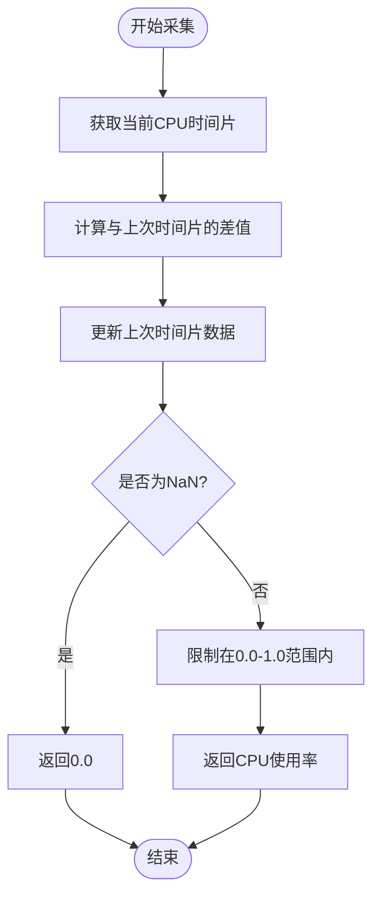

**图示来源**
- [CpuMetricCollector.java](file://core\src\main\java\cn\game\core\performance\metric\system\CpuMetricCollector.java)

#### 内存指标采集器
`MemoryMetricCollector` 利用Java Management Extensions (JMX) 获取JVM堆内存使用情况，计算已使用内存与最大内存的比率。

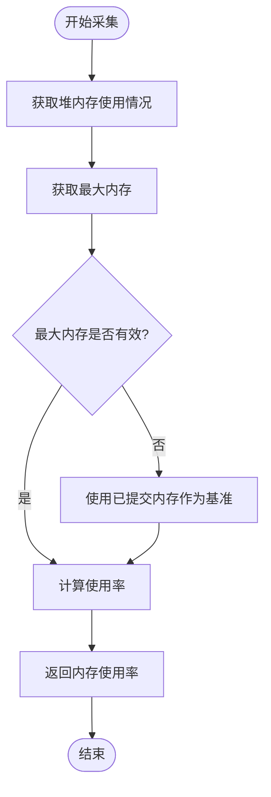

**图示来源**
- [MemoryMetricCollector.java](file://core\src\main\java\cn\game\core\performance\metric\system\MemoryMetricCollector.java)

#### 磁盘指标采集器
`DiskMetricCollector` 通过读取Linux系统文件 `/proc/diskstats` 来获取磁盘I/O统计信息，计算磁盘的使用率。

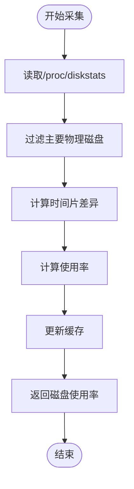

**图示来源**
- [DiskMetricCollector.java](file://core\src\main\java\cn\game\core\performance\metric\system\DiskMetricCollector.java)

#### 网络指标采集器
`NetworkMetricCollector` 通过读取 `/proc/net/dev` 文件获取网络接口的收发字节数，并结合接口速率计算带宽使用率。

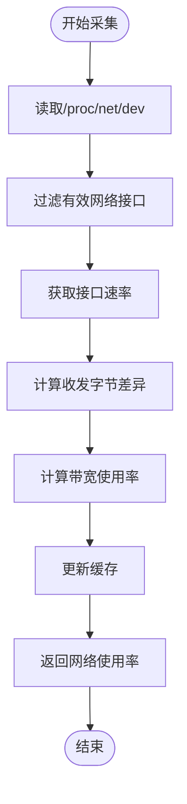

**图示来源**
- [NetworkMetricCollector.java](file://core\src\main\java\cn\game\core\performance\metric\system\NetworkMetricCollector.java)

**组件来源**
- [CpuMetricCollector.java](file://core\src\main\java\cn\game\core\performance\metric\system\CpuMetricCollector.java)
- [MemoryMetricCollector.java](file://core\src\main\java\cn\game\core\performance\metric\system\MemoryMetricCollector.java)
- [DiskMetricCollector.java](file://core\src\main\java\cn\game\core\performance\metric\system\DiskMetricCollector.java)
- [NetworkMetricCollector.java](file://core\src\main\java\cn\game\core\performance\metric\system\NetworkMetricCollector.java)

### Vert.x 指标采集器分析

#### VertxEventLoopMetricCollector
该采集器监控Vert.x事件循环线程的负载情况。它通过访问Netty的`EventLoopGroup`，遍历所有事件循环线程，累计其待处理任务队列的大小。

```mermaid
sequenceDiagram
participant Collector as VertxEventLoopMetricCollector
participant Vertx as Vertx
participant EventLoopGroup as EventLoopGroup
participant EventExecutor as EventExecutor
Collector->>Vertx : 获取Vertx实例
Collector->>Vertx : 转换为VertxInternal
Collector->>EventLoopGroup : 获取事件循环组
loop 遍历每个事件执行器
EventLoopGroup->>EventExecutor : 获取SingleThreadEventExecutor
EventExecutor->>Collector : 获取任务队列大小
Collector->>Collector : 累计待处理任务数
end
Collector->>Collector : 计算归一化值
Collector-->> : 返回事件循环负载
```

**图示来源**
- [VertxEventLoopMetricCollector.java](file://core\src\main\java\cn\game\core\performance\metric\vertx\VertxEventLoopMetricCollector.java)

#### VertxWorkerPoolMetricCollector
该采集器监控Vert.x工作线程池的负载情况。它优先尝试通过Micrometer获取指标，如果失败则直接访问内部API。

```mermaid
sequenceDiagram
participant Collector as VertxWorkerPoolMetricCollector
participant Vertx as Vertx
participant Registry as MeterRegistry
participant WorkerPool as WorkerPool
Collector->>Collector : init()
Collector->>Registry : 尝试获取Micrometer注册表
alt 获取成功
Registry-->>Collector : 保存注册表
else 获取失败
Collector->>Collector : 记录警告日志
end
Collector->>Collector : doCollect()
alt Micrometer注册表可用
Collector->>Registry : 查询工作线程池指标
Registry-->>Collector : 返回待处理任务数
else
Collector->>Vertx : 获取VertxInternal
Collector->>WorkerPool : 获取内部工作池
WorkerPool-->>Collector : 返回待处理任务数
end
Collector->>Collector : 计算归一化值
Collector-->> : 返回工作线程池负载
```

**图示来源**
- [VertxWorkerPoolMetricCollector.java](file://core\src\main\java\cn\game\core\performance\metric\vertx\VertxWorkerPoolMetricCollector.java)

**组件来源**
- [VertxEventLoopMetricCollector.java](file://core\src\main\java\cn\game\core\performance\metric\vertx\VertxEventLoopMetricCollector.java)
- [VertxWorkerPoolMetricCollector.java](file://core\src\main\java\cn\game\core\performance\metric\vertx\VertxWorkerPoolMetricCollector.java)

### 自定义指标开发流程

开发自定义指标需要继承`AbstractMetricCollector`类，并实现`doCollect()`方法。例如，`PlayerConcurrencyCollector`用于监控在线玩家数。

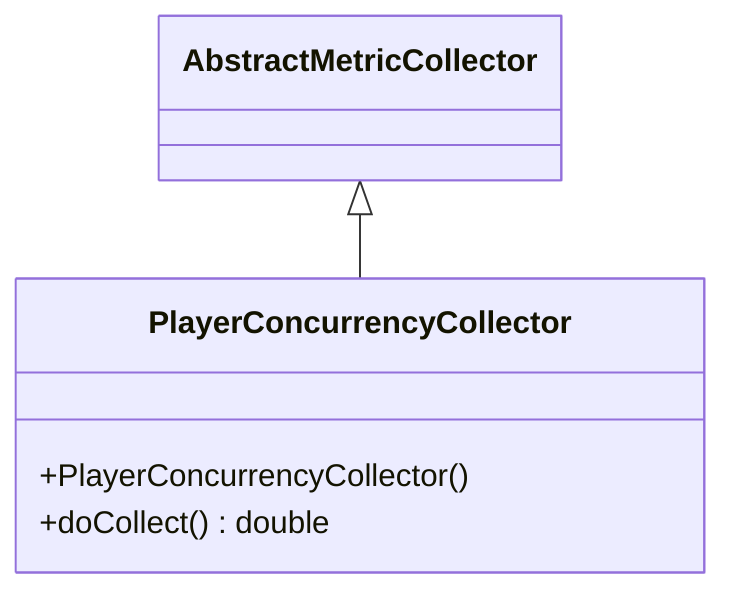

开发步骤如下：
1. 创建新类，继承`AbstractMetricCollector`。
2. 在构造函数中调用父类构造函数，设置指标名称、类型、滑动窗口大小和阈值。
3. 实现`doCollect()`方法，返回0.0到1.0之间的归一化值。
4. 在系统初始化时，将采集器实例注册到`MetricRegistry`。

**组件来源**
- [PlayerConcurrencyCollector.java](file://game\src\main\java\cn\game\games\core\collector\PlayerConcurrencyCollector.java)
- [AbstractMetricCollector.java](file://core\src\main\java\cn\game\core\performance\metric\AbstractMetricCollector.java)

### 指标数据上报与可视化

指标数据通过Micrometer框架上报。`LoadManager`在初始化时会将所有指标注册到Micrometer的`MeterRegistry`中，支持多种后端（如Prometheus、JMX）。

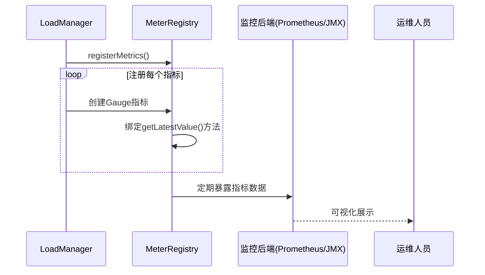

**组件来源**
- [LoadManager.java](file://core\src\main\java\cn\game\core\performance\LoadManager.java)

### 系统降级机制分析

系统降级机制由`LoadManager`、`LoadEvaluator`和`DegradeStrategy`协同实现。当系统负载过高时，会自动触发降级策略以保护核心服务。

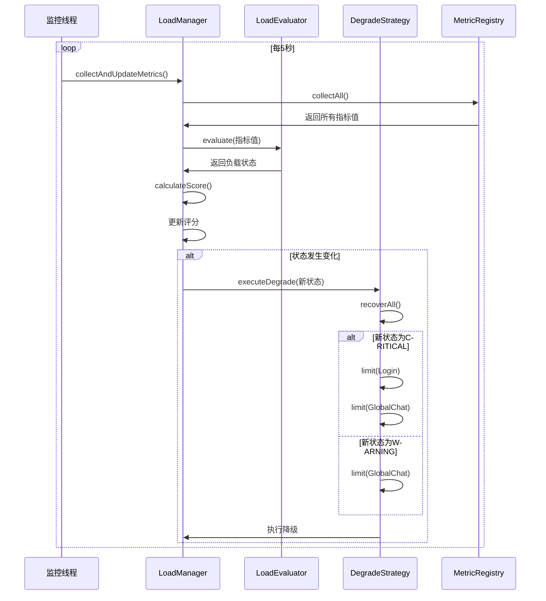

**图示来源**
- [LoadManager.java](file://core\src\main\java\cn\game\core\performance\LoadManager.java)
- [LoadEvaluator.java](file://core\src\main\java\cn\game\core\performance\evaluation\LoadEvaluator.java)
- [DegradeStrategy.java](file://core\src\main\java\cn\game\core\performance\DegradeStrategy.java)

**组件来源**
- [LoadManager.java](file://core\src\main\java\cn\game\core\performance\LoadManager.java)
- [LoadEvaluator.java](file://core\src\main\java\cn\game\core\performance\evaluation\LoadEvaluator.java)
- [DegradeStrategy.java](file://core\src\main\java\cn\game\core\performance\DegradeStrategy.java)
- [LoadLimitTypeEnum.java](file://core\src\main\java\cn\game\core\performance\LoadLimitTypeEnum.java)

## 依赖分析

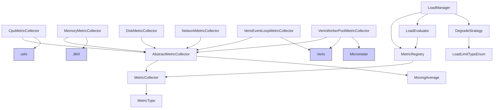

**图示来源**
- [MetricCollector.java](file://core\src\main\java\cn\game\core\performance\metric\MetricCollector.java)
- [MetricType.java](file://core\src\main\java\cn\game\core\performance\metric\MetricType.java)
- [AbstractMetricCollector.java](file://core\src\main\java\cn\game\core\performance\metric\AbstractMetricCollector.java)
- [MovingAverage.java](file://core\src\main\java\cn\game\core\performance\MovingAverage.java)
- [CpuMetricCollector.java](file://core\src\main\java\cn\game\core\performance\metric\system\CpuMetricCollector.java)
- [MemoryMetricCollector.java](file://core\src\main\java\cn\game\core\performance\metric\system\MemoryMetricCollector.java)
- [DiskMetricCollector.java](file://core\src\main\java\cn\game\core\performance\metric\system\DiskMetricCollector.java)
- [NetworkMetricCollector.java](file://core\src\main\java\cn\game\core\performance\metric\system\NetworkMetricCollector.java)
- [VertxEventLoopMetricCollector.java](file://core\src\main\java\cn\game\core\performance\metric\vertx\VertxEventLoopMetricCollector.java)
- [VertxWorkerPoolMetricCollector.java](file://core\src\main\java\cn\game\core\performance\metric\vertx\VertxWorkerPoolMetricCollector.java)
- [MetricRegistry.java](file://core\src\main\java\cn\game\core\performance\metric\MetricRegistry.java)
- [LoadManager.java](file://core\src\main\java\cn\game\core\performance\LoadManager.java)
- [LoadEvaluator.java](file://core\src\main\java\cn\game\core\performance\evaluation\LoadEvaluator.java)
- [DegradeStrategy.java](file://core\src\main\java\cn\game\core\performance\DegradeStrategy.java)
- [LoadLimitTypeEnum.java](file://core\src\main\java\cn\game\core\performance\LoadLimitTypeEnum.java)

**依赖来源**
- [MetricCollector.java](file://core\src\main\java\cn\game\core\performance\metric\MetricCollector.java)
- [AbstractMetricCollector.java](file://core\src\main\java\cn\game\core\performance\metric\AbstractMetricCollector.java)
- [MetricRegistry.java](file://core\src\main\java\cn\game\core\performance\metric\MetricRegistry.java)
- [LoadManager.java](file://core\src\main\java\cn\game\core\performance\LoadManager.java)

## 性能考虑

系统在设计时充分考虑了性能影响。指标采集器运行在独立的低优先级线程中，避免影响业务处理。数据采集采用滑动平均算法，有效平滑了瞬时波动。对于高开销的系统调用（如读取`/proc`文件系统），实现了缓存和采样间隔控制，确保监控系统自身的开销最小化。

## 故障排除指南

- **指标数据不更新**：检查`LoadManager`是否已正确初始化，监控线程是否正常运行。
- **CPU/内存指标异常**：确认`CpuMetricCollector`和`MemoryMetricCollector`已成功注册到`MetricRegistry`。
- **Vert.x指标采集失败**：确保`Vertx`实例已正确传递给`VertxEventLoopMetricCollector`和`VertxWorkerPoolMetricCollector`。
- **降级策略未触发**：检查`LoadEvaluator`的权重配置和阈值设置，确认指标值是否达到触发条件。

**故障排除来源**
- [LoadManager.java](file://core\src\main\java\cn\game\core\performance\LoadManager.java)
- [MetricRegistry.java](file://core\src\main\java\cn\game\core\performance\metric\MetricRegistry.java)
- [DegradeStrategy.java](file://core\src\main\java\cn\game\core\performance\DegradeStrategy.java)

## 结论

本文档详细阐述了性能指标采集系统的架构与实现。该系统通过标准化的接口定义、灵活的采集器实现、高效的注册管理机制以及智能的降级策略，构建了一个完整的系统健康度监控闭环。它不仅能够实时反映系统状态，还能在高负载时自动采取保护措施，极大地提升了系统的稳定性和可靠性。