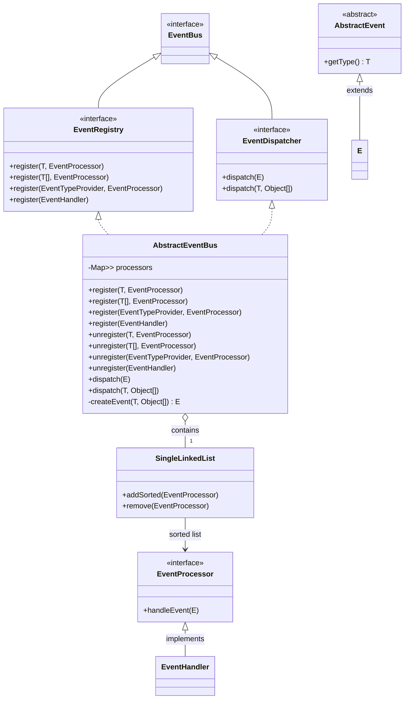
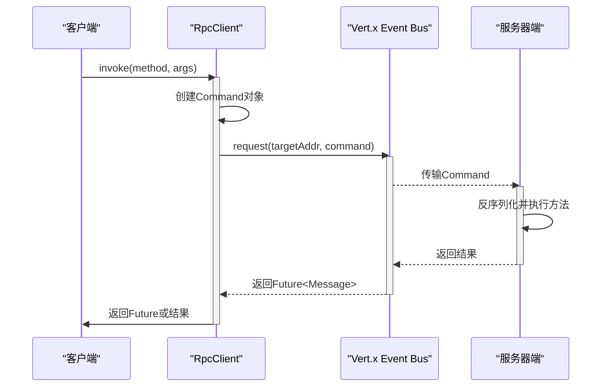

# 核心架构

<cite>
**本文档引用的文件**  
- [TaskExecutorService.java](file://core/src/main/java/cn/game/core/execute/TaskExecutorService.java)
- [TaskExecutionConfig.java](file://core/src/main/java/cn/game/core/execute/TaskExecutionConfig.java)
- [ActorMailbox.java](file://core/src/main/java/cn/game/core/execute/ActorMailbox.java)
- [MailboxManager.java](file://core/src/main/java/cn/game/core/execute/MailboxManager.java)
- [EventBus.java](file://core/src/main/java/cn/game/core/event/EventBus.java)
- [AbstractEventBus.java](file://core/src/main/java/cn/game/core/event/AbstractEventBus.java)
- [RpcClient.java](file://core/src/main/java/cn/game/core/net/rpc/RpcClient.java)
- [VertxRpcClient.java](file://core/src/main/java/cn/game/core/net/rpc/vertx/VertxRpcClient.java)
- [HealthGuard.java](file://core/src/main/java/cn/game/core/health/HealthGuard.java)
- [SelfDestructGuard.java](file://core/src/main/java/cn/game/core/health/SelfDestructGuard.java)
- [MetricCollector.java](file://core/src/main/java/cn/game/core/performance/metric/MetricCollector.java)
- [ServerContext.java](file://core/src/main/java/cn/game/core/base/ServerContext.java)
</cite>

## 目录
1. [异步任务执行框架](#异步任务执行框架)
2. [事件总线（EventBus）](#事件总线eventbus)
3. [远程过程调用（RPC）](#远程过程调用rpc)
4. [健康检查模块（HealthGuard）](#健康检查模块healthguard)
5. [性能监控体系（MetricCollector）](#性能监控体系metriccollector)
6. [架构决策记录（ADR）](#架构决策记录adr)

## 异步任务执行框架

该框架基于Actor模型实现，通过邮箱（Mailbox）机制确保对同一实体（由`entityId`标识）的操作串行化执行，从而避免并发冲突。任务执行服务`TaskExecutorService`是核心组件，它利用Java虚拟线程（Virtual Threads）作为底层执行器，实现了高并发下的轻量级任务处理。

框架的核心设计是“邮箱-处理器”模式。每个实体拥有一个独立的`ActorMailbox`，所有针对该实体的任务（`TaskWrapper`）都被放入其邮箱队列中。`TaskExecutorService`在提交任务时，会尝试获取该实体的邮箱，并将任务入队。如果邮箱当前未被处理（`processing`状态为`false`），则会提交一个`MailboxProcessor`到虚拟线程池中，由该处理器负责从邮箱中取出任务并按序执行。这种设计确保了单个实体的逻辑一致性，同时通过虚拟线程池实现了跨实体的高并发。

线程池配置策略通过`TaskExecutionConfig`类进行管理。该配置类采用构建器（Builder）模式，允许灵活地设置关键参数，如任务队列最大长度（`maxQueueSize`）、任务默认超时时间（`defaultTaskTimeoutMs`）和死锁检测阈值（`deadlockDetectionThresholdMs`）。框架默认使用`OneToOneMailboxManager`，为每个实体ID创建一个独立的邮箱，以保证严格的串行化。此外，框架还提供了`SharedMailboxManager`，允许多个实体共享邮箱，以适应不同的性能和一致性需求。

**本节来源**
- [TaskExecutorService.java](file://core/src/main/java/cn/game/core/execute/TaskExecutorService.java#L31-L488)
- [ActorMailbox.java](file://core/src/main/java/cn/game/core/execute/ActorMailbox.java#L12-L178)
- [MailboxManager.java](file://core/src/main/java/cn/game/core/execute/MailboxManager.java#L9-L56)
- [TaskExecutionConfig.java](file://core/src/main/java/cn/game/core/execute/TaskExecutionConfig.java#L9-L140)

## 事件总线（EventBus）

事件总线（`EventBus`）是实现组件间解耦通信的核心设施，它支持发布-订阅模式和事件广播。`EventBus`接口继承自`EventRegistry`和`EventDispatcher`，分别负责事件处理器的注册与事件的分发。

事件总线的实现基于`AbstractEventBus`抽象类。它内部维护一个`Map`，以事件类型（`T`）为键，以`SingleLinkedList`为值，存储了所有注册到该事件类型的处理器（`EventProcessor`）。`SingleLinkedList`的使用保证了处理器可以按照其定义的优先级（通过`ORDER_COMPARATOR`）进行有序执行。当一个事件被发布时，总线会根据事件类型找到所有注册的处理器，并按顺序调用它们的`handleEvent`方法。

该机制支持多种注册方式，包括注册单个事件类型、批量事件类型、通过`EventTypeProvider`提供事件类型，以及注册实现了`EventHandler`接口的处理器。这种灵活性使得组件可以精确地选择其感兴趣的事件。事件的发布可以通过`dispatch`方法完成，支持直接传递事件对象或通过事件类型和参数动态创建事件。这种设计使得系统中的各个模块可以独立演化，只需约定好事件类型和数据结构，即可实现松耦合的通信。

**图示来源**
- [EventBus.java](file://core/src/main/java/cn/game/core/event/EventBus.java#L12-L13)
- [AbstractEventBus.java](file://core/src/main/java/cn/game/core/event/AbstractEventBus.java#L8-L108)

**本节来源**
- [EventBus.java](file://core/src/main/java/cn/game/core/event/EventBus.java#L12-L13)
- [AbstractEventBus.java](file://core/src/main/java/cn/game/core/event/AbstractEventBus.java#L8-L108)

## 远程过程调用（RPC）

远程过程调用（RPC）机制用于实现跨JVM的通信，其核心是`RpcClient`接口。该接口基于Vert.x的事件总线（Event Bus）实现，提供了同步和异步两种调用模式，支持请求-响应、单向发送和广播等多种消息模式。

在跨JVM通信中，RPC机制通过`Command`对象封装远程调用的元数据，包括目标类名、方法名、参数类型和实际参数。当客户端发起调用时，`RpcClient`会根据返回值类型自动选择处理策略：如果返回值类型是`Future`或`CompletionStage`，则采用异步非阻塞方式，立即返回一个`Future`对象；否则，采用同步阻塞方式，等待远程调用结果。同步调用通过`CompletableFuture.get()`方法实现，会阻塞当前线程直至收到响应或超时。

序列化协议的选择由Vert.x的编解码器（Codec）机制决定。框架通过`VxHolder.universalMessageCodec`指定了一个通用的编解码器，用于在消息传输前将其序列化为字节流，并在接收端反序列化。网络传输优化体现在使用了`DeliveryOptions`来设置超时时间（`sendTimeout`），防止调用方无限期等待。故障转移策略主要依赖于底层的网络拓扑和负载均衡器（如`CallType.LoadBalancer`），但核心框架本身更侧重于快速失败和错误传播。当远程调用发生异常时，异常信息会被封装并返回给调用方，由`ExceptionHelper.rethrowWithPolicy`等工具类进行统一处理。

**图示来源**
- [RpcClient.java](file://core/src/main/java/cn/game/core/net/rpc/RpcClient.java#L26-L215)
- [VertxRpcClient.java](file://core/src/main/java/cn/game/core/net/rpc/vertx/VertxRpcClient.java#L10-L56)

**本节来源**
- [RpcClient.java](file://core/src/main/java/cn/game/core/net/rpc/RpcClient.java#L26-L215)
- [VertxRpcClient.java](file://core/src/main/java/cn/game/core/net/rpc/vertx/VertxRpcClient.java#L10-L56)
- [ServerContext.java](file://core/src/main/java/cn/game/core/base/ServerContext.java#L64-L65)

## 健康检查模块（HealthGuard）

健康检查模块（`HealthGuard`）负责监控系统关键依赖的健康状态，并在检测到严重故障时触发自毁保护，以防止不健康的节点继续提供错误服务。该模块主要监控ZooKeeper和Redis两个核心依赖。

`HealthGuard`通过一个独立的调度线程（`ScheduledExecutorService`）定期执行健康检查（`tick`）。每次检查会分别调用`ZkHealth.probeOnce()`和`RedisHealth.probeOnce()`方法，对ZooKeeper和Redis进行一次探测。如果任一探测失败，则系统进入不健康状态。模块会记录不健康开始的时间，并持续监控。当某个依赖的连续失败次数达到预设阈值（`threshold`）时，`HealthGuard`将调用`System.exit(cfg.exitCode)`，立即终止JVM进程。

`SelfDestructGuard`是`HealthGuard`的封装类，它遵循“保守策略”，即只要ZooKeeper或Redis中任一出现连续失败达到阈值，就判定系统不健康并触发自毁。这种设计确保了系统的强一致性，避免了在分布式协调或数据存储出现故障时产生脑裂或数据不一致。阈值的计算基于`decisionWindow`（决策窗口）和`checkInterval`（检查间隔），确保在指定的时间窗口内能有效判定故障。

**本节来源**
- [HealthGuard.java](file://core/src/main/java/cn/game/core/health/HealthGuard.java#L16-L106)
- [SelfDestructGuard.java](file://core/src/main/java/cn/game/core/health/SelfDestructGuard.java#L19-L35)

## 性能监控体系（MetricCollector）

性能监控体系围绕`MetricCollector`接口构建，提供了一套标准化的指标采集、聚合和上报机制。任何具体的指标收集器都必须实现此接口。

`MetricCollector`接口定义了获取指标名称（`getName`）、类型（`getType`）、收集指标（`collect`）和获取最新值（`getLatestValue`）等核心方法。`collect`方法负责执行实际的采集逻辑，并返回一个0.0到1.0之间的归一化值，便于统一处理和比较。体系内置了警告（`getWarningThreshold`）和严重（`getCriticalThreshold`）阈值，可用于触发告警。收集器通过`init`方法进行初始化，并在关闭时调用`shutdown`方法释放资源。

该体系的设计允许灵活地扩展各种指标，如CPU使用率、内存占用、线程池状态、缓存命中率等。采集到的指标可以被聚合器（Aggregator）收集，并通过配置的上报通道（如日志、监控系统）进行上报，为系统性能分析和容量规划提供数据支持。

**本节来源**
- [MetricCollector.java](file://core/src/main/java/cn/game/core/performance/metric/MetricCollector.java#L6-L53)

## 架构决策记录（ADR）

本节解释了核心架构中的关键设计选择。

1.  **选择虚拟线程而非传统线程池**：`TaskExecutorService`使用`Executors.newThreadPerTaskExecutor(factory)`创建的虚拟线程执行器，而非传统的`ThreadPoolExecutor`。这一决策是为了应对高并发场景下的线程资源瓶颈。虚拟线程由JVM管理，创建和销毁成本极低，能够轻松支持数百万并发任务，极大地提升了系统的吞吐量和响应能力，同时简化了并发编程模型。

2.  **采用邮箱（Mailbox）模式实现Actor模型**：通过`ActorMailbox`和`MailboxManager`，系统实现了轻量级的Actor模型。此设计决策旨在解决高并发下对共享状态的并发访问问题。通过将对同一实体的操作串行化到其专属邮箱中，从根本上避免了锁竞争和数据不一致，同时保持了跨实体的高并发性，是实现高性能、高一致性服务的关键。

3.  **健康检查采用“保守自毁”策略**：`SelfDestructGuard`的设计决策是“任一核心依赖（ZK/Redis）连续失败达阈值即自毁”。这体现了“宁可错杀，不可放过”的高可用性原则。在分布式系统中，失去ZooKeeper或Redis通常意味着服务已不可靠。立即自毁可以防止节点进入“半死不活”状态，从而避免向客户端返回错误数据或导致集群状态混乱，保障了整体系统的数据一致性和可靠性。