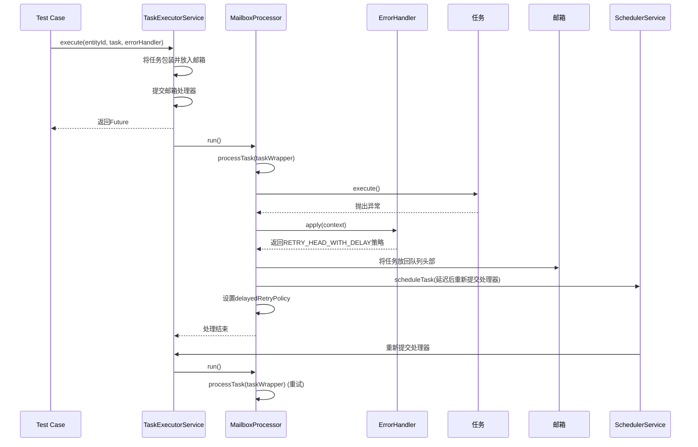
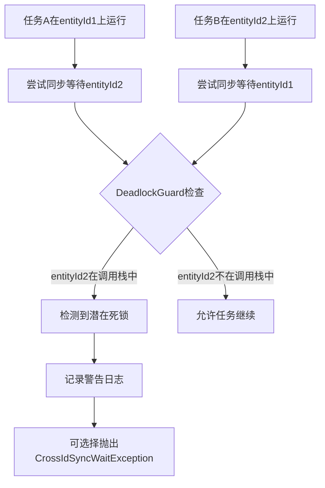

# 单元测试

<cite>
**本文档引用的文件**   
- [TaskExecutorServiceTest.java](file://core/src/test/java/cn/game/core/execute/TaskExecutorServiceTest.java)
- [TaskExecutorService.java](file://core/src/main/java/cn/game/core/execute/TaskExecutorService.java)
- [MailboxProcessor.java](file://core/src/main/java/cn/game/core/execute/MailboxProcessor.java)
- [DeadlockGuard.java](file://core/src/main/java/cn/game/core/execute/DeadlockGuard.java)
- [ErrorPolicy.java](file://core/src/main/java/cn/game/core/execute/error/ErrorPolicy.java)
- [ErrorHandler.java](file://core/src/main/java/cn/game/core/execute/error/ErrorHandler.java)
- [AsyncUtils.java](file://core/src/main/java/cn/game/core/util/AsyncUtils.java)
</cite>

## 目录
1. [引言](#引言)
2. [核心测试实践](#核心测试实践)
3. [异步任务执行器测试详解](#异步任务执行器测试详解)
4. [Mockito框架依赖模拟方法](#mockito框架依赖模拟方法)
5. [并发场景线程安全测试](#并发场景线程安全测试)
6. [测试覆盖率与代码注入验证](#测试覆盖率与代码注入验证)
7. [断言策略与测试数据准备](#断言策略与测试数据准备)
8. [边界条件覆盖原则](#边界条件覆盖原则)
9. [结论](#结论)

## 引言

本单元测试文档旨在深入阐述核心模块的测试实践，重点以`TaskExecutorServiceTest`为例，展示如何对异步任务执行器进行全面测试。文档将详细说明超时处理、异常捕获、重试机制验证等关键测试场景，并解释如何利用测试框架进行依赖模拟。同时，文档将涵盖并发场景下的线程安全问题测试方法，如死锁检测，并提供测试覆盖率目标、代码注入验证的最佳实践，以及断言策略、测试数据准备和边界条件覆盖的指导原则。

**本文档引用的文件**   
- [TaskExecutorServiceTest.java](file://core/src/test/java/cn/game/core/execute/TaskExecutorServiceTest.java)
- [TaskExecutorService.java](file://core/src/main/java/cn/game/core/execute/TaskExecutorService.java)

## 核心测试实践

核心测试实践围绕`TaskExecutorService`这一关键组件展开，该服务负责管理异步任务的执行，确保任务的串行化、超时控制和错误处理。其测试实践主要集中在验证任务执行的正确性、并发安全性以及错误恢复机制。

### 任务串行化与并行化验证

`TaskExecutorService`的核心功能之一是保证相同`entityId`的任务串行执行，而`entityId=0`的任务则可以并行执行。`TaskExecutorServiceTest`中的`testSerialExecution_forSameEntityId`和`testParallelExecution_forEntityIdZero`两个测试用例分别验证了这两种行为。

`testSerialExecution_forSameEntityId`通过提交100个针对同一`entityId`的任务，并记录它们的执行顺序，来验证任务是否严格按照提交顺序执行。测试使用`assertTimeoutPreemptively`来确保所有任务能在合理时间内完成，从而证明串行化逻辑的正确性。

`testParallelExecution_forEntityIdZero`则通过提交多个耗时任务给`entityId=0`，并验证它们是否能在远小于串行执行总耗时的时间内完成，来证明并行执行的有效性。这确保了系统在处理非关键实体任务时的高吞吐量。

### 虚拟线程执行验证

现代Java应用广泛使用虚拟线程（Virtual Threads）来提升并发性能。`TaskExecutorServiceTest`中的`testExecutionOnVirtualThread_whenSubmittedFromPlatformThread`测试用例验证了任务是否确实在虚拟线程中执行。该测试从一个平台线程（Platform Thread）提交任务，然后检查执行任务的线程是否为虚拟线程，并验证其线程名称是否符合预期（以"vt-"开头）。这确保了系统的异步执行模型能够充分利用虚拟线程的优势。

**本文档引用的文件**   
- [TaskExecutorServiceTest.java](file://core/src/test/java/cn/game/core/execute/TaskExecutorServiceTest.java)
- [TaskExecutorService.java](file://core/src/main/java/cn/game/core/execute/TaskExecutorService.java)

## 异步任务执行器测试详解

对`TaskExecutorService`的测试不仅限于基本功能，还深入到超时、异常和重试等复杂场景。

### 超时处理测试

`testTaskTimeout_whenExecutionExceedsLimit`测试用例验证了任务超时机制。测试提交一个执行时间明显超过预设超时时间的任务，然后断言该任务的`Future`会因`TimeoutException`而失败。这确保了长时间运行的任务不会无限期地阻塞资源，系统能够及时响应和处理超时情况。

### 异常捕获与传递测试

`testTaskFailure_propagatesToFuture`测试用例验证了任务内部抛出的异常能否正确地传递到返回的`Future`中。测试提交一个会抛出`RuntimeException`的任务，然后断言`await`该`Future`时会抛出相同类型的异常和消息。这保证了上层调用者能够准确地感知和处理任务执行中的错误。

### 重试机制验证

`testRetry_whenException`是验证重试机制的核心测试。它通过自定义`ErrorHandler`来模拟重试逻辑。测试配置一个错误处理器，当任务抛出非`SQLException`的异常时，会进行延迟重试；而当抛出`SQLException`时，则直接放弃任务。测试通过断言重试次数和总耗时，验证了重试策略（`ErrorPolicy.retryHeadWithDelay`）的正确执行。这确保了系统在面对临时性故障时具备自我恢复能力。

**图例来源**  
- [TaskExecutorService.java](file://core/src/main/java/cn/game/core/execute/TaskExecutorService.java#L213-L270)
- [MailboxProcessor.java](file://core/src/main/java/cn/game/core/execute/MailboxProcessor.java#L106-L175)
- [ErrorPolicy.java](file://core/src/main/java/cn/game/core/execute/error/ErrorPolicy.java#L77-L88)
- [ErrorHandler.java](file://core/src/main/java/cn/game/core/execute/error/ErrorHandler.java#L11-L20)

**本文档引用的文件**   
- [TaskExecutorServiceTest.java](file://core/src/test/java/cn/game/core/execute/TaskExecutorServiceTest.java)
- [TaskExecutorService.java](file://core/src/main/java/cn/game/core/execute/TaskExecutorService.java)
- [MailboxProcessor.java](file://core/src/main/java/cn/game/core/execute/MailboxProcessor.java)
- [ErrorPolicy.java](file://core/src/main/java/cn/game/core/execute/error/ErrorPolicy.java)
- [ErrorHandler.java](file://core/src/main/java/cn/game/core/execute/error/ErrorHandler.java)

## Mockito框架依赖模拟方法

虽然在提供的`TaskExecutorServiceTest`代码中没有直接使用Mockito，但其设计体现了依赖注入和模拟的思想。`TaskExecutorService`依赖于`Vertx`实例、`MailboxManager`和`TaskExecutionConfig`等组件。在单元测试中，可以通过以下方式使用Mockito进行依赖模拟：

1.  **模拟外部服务**：例如，如果`TaskExecutorService`需要调用数据库或远程API，可以使用`Mockito.mock()`创建这些服务的模拟对象，并使用`when(...).thenReturn(...)`或`when(...).thenThrow(...)`来定义它们的行为，从而隔离被测代码与外部系统的依赖。
2.  **验证方法调用**：使用`Mockito.verify()`来验证在特定条件下，某个依赖的方法是否被正确调用，以及调用的次数和参数。
3.  **模拟复杂配置**：对于`TaskExecutionConfig`，可以创建一个模拟对象，并精确地定义`getDefaultTaskTimeoutMs()`等方法的返回值，以测试不同配置下的行为。

尽管当前测试使用了真实的`VxHolder.vertx`，但在更严格的单元测试中，应将`Vertx`也进行模拟，以确保测试的纯粹性和速度。

**本文档引用的文件**   
- [TaskExecutorService.java](file://core/src/main/java/cn/game/core/execute/TaskExecutorService.java)

## 并发场景线程安全测试

并发场景下的线程安全是此类系统测试的重点和难点，特别是死锁问题。

### 死锁检测与预防

`TaskExecutorService`通过`DeadlockGuard`机制来检测潜在的死锁风险。`testDeadlockCheck_whenEntitiesWaitForEachOther`测试用例直接验证了这一机制。该测试启用`DeadlockGuard`，然后模拟两个`entityId`（101和102）的任务互相等待对方的结果。`DeadlockGuard`通过维护一个线程本地的`ID`调用栈，在调用`executeAndAwait`时检查目标`entityId`是否已在当前调用栈中。如果存在，则会记录一个警告日志，并可以配置为抛出`CrossIdSyncWaitException`。

**图例来源**  
- [DeadlockGuard.java](file://core/src/main/java/cn/game/core/execute/DeadlockGuard.java#L76-L96)
- [TaskExecutorService.java](file://core/src/main/java/cn/game/core/execute/TaskExecutorService.java#L331-L335)

此外，`ExecutionMonitor`还通过定期检查邮箱的处理时间来检测潜在的死锁。如果一个邮箱长时间处于处理状态，监控器会记录警告日志，并尝试重置其处理状态，以打破可能的死锁。

**本文档引用的文件**   
- [TaskExecutorServiceTest.java](file://core/src/test/java/cn/game/core/execute/TaskExecutorServiceTest.java)
- [DeadlockGuard.java](file://core/src/main/java/cn/game/core/execute/DeadlockGuard.java)
- [TaskExecutorService.java](file://core/src/main/java/cn/game/core/execute/TaskExecutorService.java)

## 测试覆盖率与代码注入验证

### 测试覆盖率目标

建议的测试覆盖率目标应达到80%以上。这包括：
*   **行覆盖率**：确保代码中的每一行至少被执行一次。
*   **分支覆盖率**：确保`if`、`else`、`switch`等条件分支的每条路径都被测试到。
*   **方法覆盖率**：确保公共API和核心逻辑方法都被调用。

高覆盖率是代码质量的重要指标，能有效减少未被发现的bug。

### 代码注入验证最佳实践

在测试中，应避免直接修改核心代码来注入测试逻辑（如打印日志）。最佳实践是：
1.  **依赖注入**：通过构造函数或setter方法将依赖项（如`MailboxManager`、`ErrorHandler`）注入到被测类中，以便在测试中替换为模拟或桩对象。
2.  **使用回调或监听器**：为关键事件（如任务完成、异常发生）提供回调接口，测试中可以注册监听器来验证这些事件是否发生。
3.  **利用现有的日志框架**：通过配置日志级别和`Appender`，在测试中捕获和验证日志输出，而不是在代码中添加`System.out.println`。

**本文档引用的文件**   
- [TaskExecutorService.java](file://core/src/main/java/cn/game/core/execute/TaskExecutorService.java)

## 断言策略与测试数据准备

### 断言策略

有效的断言是测试成功的关键。应遵循以下策略：
*   **明确性**：每个断言都应有清晰的失败消息，说明预期和实际结果。
*   **原子性**：每个测试用例应尽可能只验证一个行为，避免在一个测试中进行过多断言。
*   **使用合适的断言方法**：如`assertEquals`、`assertTrue`、`assertThrows`等，以提供最精确的验证。
*   **验证异常**：使用`assertThrows`来验证代码在特定条件下是否抛出预期的异常。

### 测试数据准备

高质量的测试数据是可靠测试的基础。
*   **边界值**：测试应覆盖边界条件，如空队列、满队列（`testQueueFullException_whenMailboxIsFull`）、超时时间为0、最大重试次数等。
*   **代表性数据**：准备能代表真实业务场景的数据，如不同类型的`entityId`、不同优先级的任务。
*   **使用`@BeforeEach`和`@AfterEach`**：在`setUp()`和`tearDown()`方法中准备和清理测试环境，确保每个测试用例的独立性和可重复性。

**本文档引用的文件**   
- [TaskExecutorServiceTest.java](file://core/src/test/java/cn/game/core/execute/TaskExecutorServiceTest.java)

## 边界条件覆盖原则

边界条件是bug的高发区，必须重点覆盖。
*   **队列边界**：测试队列为空、队列满（`testQueueFullException_whenMailboxIsFull`）时的行为。
*   **服务状态边界**：测试服务关闭后提交新任务的行为（`testTaskRejection_afterServiceShutdown`）。
*   **数值边界**：测试超时时间为0、负数，重试次数为0、最大值等情况。
*   **特殊ID**：测试`entityId=0`（并行执行）和`entityId`为负数等特殊情况。

**本文档引用的文件**   
- [TaskExecutorServiceTest.java](file://core/src/test/java/cn/game/core/execute/TaskExecutorServiceTest.java)

## 结论

通过对`TaskExecutorService`的全面测试，我们验证了其在任务串行化、并行化、超时控制、异常处理和重试机制方面的正确性。文档详细阐述了如何测试并发场景下的死锁问题，并强调了使用`DeadlockGuard`进行预防的重要性。同时，提供了关于测试覆盖率、依赖模拟、断言策略和边界条件覆盖的最佳实践。遵循这些原则，可以构建出健壮、可靠的异步任务执行系统。