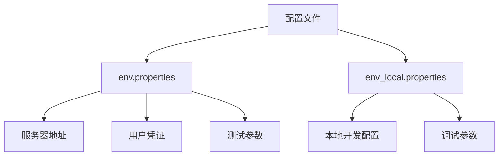
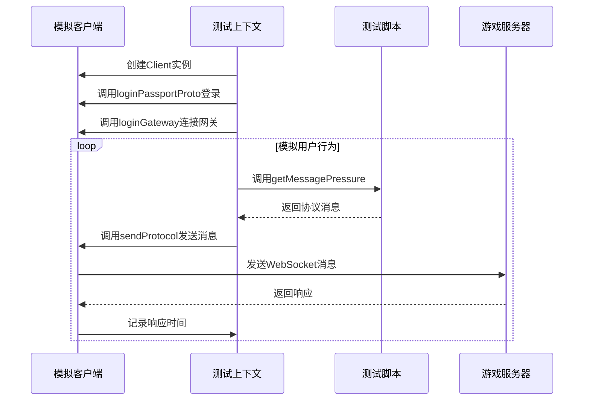
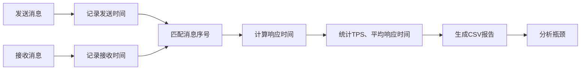

# 性能测试

<cite>
**本文档引用的文件**  
- [Client.java](file://simulationclient/src/main/java/cn/game/simulation/client/Client.java)
- [ServerTestContext.java](file://simulationclient/src/main/java/cn/game/simulation/client/ServerTestContext.java)
- [EnvConfig.java](file://simulationclient/src/main/java/cn/game/simulation/util/EnvConfig.java)
- [MessageStatistics.java](file://simulationclient/src/main/java/cn/game/simulation/util/MessageStatistics.java)
- [env.properties](file://simulationclient/src/main/resources/env.properties)
- [env_local.properties](file://simulationclient/src/main/resources/env_local.properties)
- [messages.csv](file://simulationclient/messages.csv)
- [BattlePVEVPChallengeRequest_13000552Test.java](file://simulationclient/src/main/java/cn/game/simulation/test/gen/BattlePVEVPChallengeRequest_13000552Test.java)
- [PlayerLoginRequest_01000001Test.java](file://simulationclient/src/main/java/cn/game/simulation/test/gen/PlayerLoginRequest_01000001Test.java)
- [statistics](file://simulationclient/statistics)
</cite>

## 目录
1. [引言](#引言)
2. [测试工具配置](#测试工具配置)
3. [并发用户与测试持续时间配置](#并发用户与测试持续时间配置)
4. [请求频率与发送间隔控制](#请求频率与发送间隔控制)
5. [测试脚本编写](#测试脚本编写)
6. [性能数据收集与分析](#性能数据收集与分析)
7. [负载、压力与稳定性测试](#负载压力与稳定性测试)
8. [性能指标监控与优化](#性能指标监控与优化)
9. [测试环境与生产环境对比](#测试环境与生产环境对比)
10. [结论](#结论)

## 引言

本性能测试文档旨在详细介绍simulationclient压力测试工具的使用方法。该工具用于模拟大量真实用户行为，对游戏服务器进行负载测试、压力测试和稳定性测试。文档将详细说明如何配置并发用户数、测试持续时间和请求频率，如何基于Client.java编写测试脚本以模拟登录、活动参与和战斗操作等用户行为，以及如何分析statistics目录下的CSV性能数据以识别系统瓶颈。同时，文档将提供性能指标（如TPS、响应时间、错误率）的监控和优化建议，并说明如何进行测试环境与生产环境的性能基准对比。

## 测试工具配置

simulationclient压力测试工具的核心配置文件位于`simulationclient/src/main/resources/`目录下，主要包括`env.properties`和`env_local.properties`。这些配置文件定义了测试运行所需的各种参数。

主要配置项包括：
- `login.server.url`：登录服务器的URL地址。
- `game.server.ip` 和 `game.server.port`：游戏网关服务器的IP地址和端口。
- `game.server.id`：目标游戏服务器的ID。
- `user.name` 和 `user.pwd`：用于登录的用户名和密码。
- `logbackFile`：日志配置文件路径。
- `argsFile`：Spring应用上下文配置文件路径。



**图源**  
- [env.properties](file://simulationclient/src/main/resources/env.properties)
- [env_local.properties](file://simulationclient/src/main/resources/env_local.properties)

## 并发用户与测试持续时间配置

并发用户数和测试持续时间是性能测试的核心参数，它们在`env.properties`文件中通过以下属性进行配置：

- `botIdStart`：起始机器人ID，用于生成唯一的客户端标识。
- `botCount`：本次测试的机器人（并发用户）总数。
- `botRunTimeMax`：单个机器人最大运行时间，单位为分钟。

在`ServerTestContext`类中，这些配置被读取并用于控制测试流程。`botCount`决定了将创建多少个`Client`实例来模拟并发用户。测试的主循环会持续运行，直到达到`botRunTimeMax`指定的时间上限。

```java
// ServerTestContext.java 中的测试运行逻辑
while (run) {
    if (botRunTimeMax > 0 && System.currentTimeMillis() - startTime > botRunTimeMax * 60 * 1000) {
        run = false; // 达到运行时间上限，停止测试
    }
    // ... 其他逻辑
}
```

**本节来源**  
- [ServerTestContext.java](file://simulationclient/src/main/java/cn/game/simulation/client/ServerTestContext.java#L382-L387)
- [env.properties](file://simulationclient/src/main/resources/env.properties#L58-L72)

## 请求频率与发送间隔控制

请求频率和发送间隔通过多个配置项进行精细控制，以模拟真实用户的行为模式。

- `sendInterval`：全局消息发送的最短间隔，单位为毫秒。这是所有客户端发送消息的全局节流阀。
- `botSendInterval`：单个机器人发送消息的最短间隔，单位为毫秒。这限制了单个客户端的请求频率。
- `loginInterval`：机器人登录的间隔时间，单位为毫秒。用于控制登录请求的速率。
- `loginConcurrency`：并发登录的线程数，用于控制登录阶段的并发度。

在`ServerTestContext`的主循环中，`sendInterval`通过检查`lastSendTime`来实现：

```java
// ServerTestContext.java 中的发送节流逻辑
if (System.currentTimeMillis() - lastSendTime < sendInterval) {
    Thread.sleep(1);
    continue;
}
```

同时，登录过程使用`Semaphore`信号量和`ThreadPoolExecutor`线程池来精确控制并发登录的速率和数量。

**本节来源**  
- [ServerTestContext.java](file://simulationclient/src/main/java/cn/game/simulation/client/ServerTestContext.java#L394-L398)
- [env.properties](file://simulationclient/src/main/resources/env.properties#L62-L67)

## 测试脚本编写

测试脚本的核心是`Client.java`类，它代表一个模拟的客户端。通过继承`ServerTest`基类并实现`getMessagePressure`方法，可以编写针对特定游戏功能的测试脚本。

### 基于Client.java的脚本编写

`Client.java`类封装了与服务器通信的所有逻辑，包括：
- 通过`loginPassportProto`方法进行账号登录。
- 通过`loginGateway`方法连接到游戏网关。
- 通过`sendProtocol`方法发送协议消息。
- 维护客户端状态，如`accountId`、`roleId`、`sign`等。

编写测试脚本时，需要创建一个继承自`ServerTest`的类，并重写`getMessagePressure`方法来生成特定的协议消息。

### 模拟真实用户行为

以下示例展示了如何编写脚本来模拟登录、活动参与和战斗操作。

#### 登录操作
```java
// PlayerLoginRequest_01000001Test.java
public class PlayerLoginRequest_01000001Test extends ServerTest {
    @Override
    public Message getMessagePressure(Client client) {
        cn.game.protocol.protobuf.PlayerMsg.PlayerLoginRequest_01000001.Builder builder = 
            cn.game.protocol.protobuf.PlayerMsg.PlayerLoginRequest_01000001.newBuilder();
        builder.setSessionId(client.getPassportSessionId());
        builder.setVerstion(client.getVersion());
        // ... 设置其他字段
        return builder.build();
    }
}
```

#### 战斗操作
```java
// BattlePVEVPChallengeRequest_13000552Test.java
public class BattlePVEVPChallengeRequest_13000552Test extends ServerTest{
    @Override
    public Message getMessagePressure(Client client) {
        cn.game.protocol.protobuf.BattleMsg.BattlePVEVPChallengeRequest_13000552.Builder builder = 
            cn.game.protocol.protobuf.BattleMsg.BattlePVEVPChallengeRequest_13000552.newBuilder();
        builder.setType(1); // 设置挑战类型
        return builder.build(); 
    }
}
```

测试脚本通过`messages.csv`文件中的`msgGroup`字段进行分组管理，`ServerTestContext`会根据配置随机选择消息组中的消息进行发送，从而模拟多样化的用户行为。



**图源**  
- [Client.java](file://simulationclient/src/main/java/cn/game/simulation/client/Client.java)
- [ServerTestContext.java](file://simulationclient/src/main/java/cn/game/simulation/client/ServerTestContext.java)
- [PlayerLoginRequest_01000001Test.java](file://simulationclient/src/main/java/cn/game/simulation/test/gen/PlayerLoginRequest_01000001Test.java)
- [BattlePVEVPChallengeRequest_13000552Test.java](file://simulationclient/src/main/java/cn/game/simulation/test/gen/BattlePVEVPChallengeRequest_13000552Test.java)

**本节来源**  
- [Client.java](file://simulationclient/src/main/java/cn/game/simulation/client/Client.java)
- [ServerTestContext.java](file://simulationclient/src/main/java/cn/game/simulation/client/ServerTestContext.java)
- [PlayerLoginRequest_01000001Test.java](file://simulationclient/src/main/java/cn/game/simulation/test/gen/PlayerLoginRequest_01000001Test.java)
- [BattlePVEVPChallengeRequest_13000552Test.java](file://simulationclient/src/main/java/cn/game/simulation/test/gen/BattlePVEVPChallengeRequest_13000552Test.java)

## 性能数据收集与分析

simulationclient工具通过`MessageStatistics`类和`GlobalMessageStatistics`类来收集和分析性能数据。

### 数据收集机制

`Client.java`类中的`sendMessages`和`recvMessages`两个`ConcurrentHashMap`用于记录每条发送和接收消息的时间戳。`MessageStatistics`类会遍历这两个映射，匹配发送和接收的消息（通过消息序号），并计算响应时间。

```java
// MessageStatistics.java 中的统计逻辑
for (Map.Entry<Integer, Pair<String, Long>> sendEntry : sendMessages.entrySet()) {
    int msgId = sendEntry.getKey();
    long sendTime = sendEntry.getValue().getRight();
    Pair<String, Long> recvEntry = recvMessages.get(msgId);
    if (recvEntry != null) {
        long recvTime = recvEntry.getRight();
        long responseTime = recvTime - sendTime;
        // 收集响应时间
    }
}
```

### CSV性能数据分析

测试结束后，性能数据会被保存到`statistics`目录下的CSV文件中，文件名格式为`{botIdStart}_{HH-mm}.csv`。这些CSV文件包含了每个消息的请求计数、响应计数、响应率、最小/最大/平均响应时间以及P50、P75、P90等百分位数。

分析这些数据可以帮助识别系统瓶颈：
- **高响应时间**：表明特定接口或服务器处理能力不足。
- **低响应率**：表明服务器可能丢失了请求或无法及时处理。
- **错误率上升**：结合日志分析，可以定位具体的错误原因。



**图源**  
- [MessageStatistics.java](file://simulationclient/src/main/java/cn/game/simulation/util/MessageStatistics.java)
- [statistics](file://simulationclient/statistics)

**本节来源**  
- [MessageStatistics.java](file://simulationclient/src/main/java/cn/game/simulation/util/MessageStatistics.java#L34-L79)
- [statistics](file://simulationclient/statistics)

## 负载、压力与稳定性测试

simulationclient工具支持多种类型的性能测试。

### 负载测试

负载测试旨在确定系统在预期负载下的性能表现。通过配置`botCount`为预期的并发用户数，并运行测试，可以观察系统的TPS、响应时间和资源使用情况。

### 压力测试

压力测试旨在确定系统的极限。通过逐步增加`botCount`，直到系统出现性能急剧下降或错误率显著上升，可以找到系统的最大承载能力。

### 稳定性测试

稳定性测试（或耐久性测试）旨在验证系统在长时间运行下的稳定性。通过设置较长的`botRunTimeMax`（例如数小时或数天），可以检测内存泄漏、资源耗尽等问题。

`ServerTestContext`中的优雅关闭机制确保了测试结束后所有客户端都能正确登出，这对于稳定性测试的准确性至关重要。

**本节来源**  
- [ServerTestContext.java](file://simulationclient/src/main/java/cn/game/simulation/client/ServerTestContext.java#L175-L203)

## 性能指标监控与优化

### 关键性能指标

- **TPS (Transactions Per Second)**：每秒处理的事务数，衡量系统吞吐量。
- **响应时间**：从发送请求到收到响应的时间，包括P50、P90、P99等百分位数，衡量系统延迟。
- **错误率**：失败请求占总请求的比例，衡量系统稳定性。

### 监控与优化建议

- **监控**：在测试过程中，实时监控服务器的CPU、内存、网络I/O和数据库性能。
- **优化**：
  - 如果TPS瓶颈在数据库，考虑优化SQL查询、增加索引或进行数据库读写分离。
  - 如果响应时间过长，分析慢查询日志或使用性能分析工具定位热点代码。
  - 如果错误率高，检查服务器日志，排查连接池耗尽、超时等问题。

## 测试环境与生产环境对比

为了确保测试结果的有效性，应尽可能使测试环境与生产环境保持一致。

- **硬件配置**：测试环境的服务器CPU、内存、网络带宽应与生产环境相同或成比例。
- **数据量**：测试数据库的数据量应尽量接近生产环境，以模拟真实的查询性能。
- **网络拓扑**：测试环境的网络延迟和带宽应尽量模拟生产环境。

通过在测试环境和生产环境（或预发布环境）上运行相同的性能测试脚本，可以对比TPS、响应时间和错误率等指标，评估系统性能的变化和优化效果。

## 结论

simulationclient是一个功能强大的压力测试工具，能够有效模拟真实用户行为，对游戏服务器进行全面的性能评估。通过合理配置`env.properties`文件中的参数，可以精确控制并发用户数、测试持续时间和请求频率。基于`Client.java`编写的测试脚本能够灵活地模拟登录、活动和战斗等多种用户行为。通过分析`statistics`目录下的CSV性能数据，可以准确识别系统瓶颈，并为性能优化提供数据支持。遵循本文档的指导，可以有效地进行负载测试、压力测试和稳定性测试，确保游戏服务器在高并发场景下的稳定性和高性能。