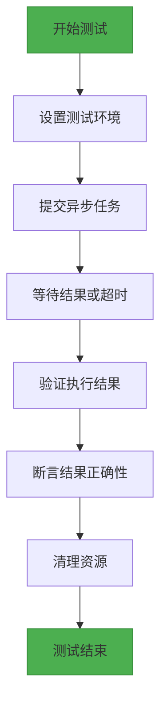
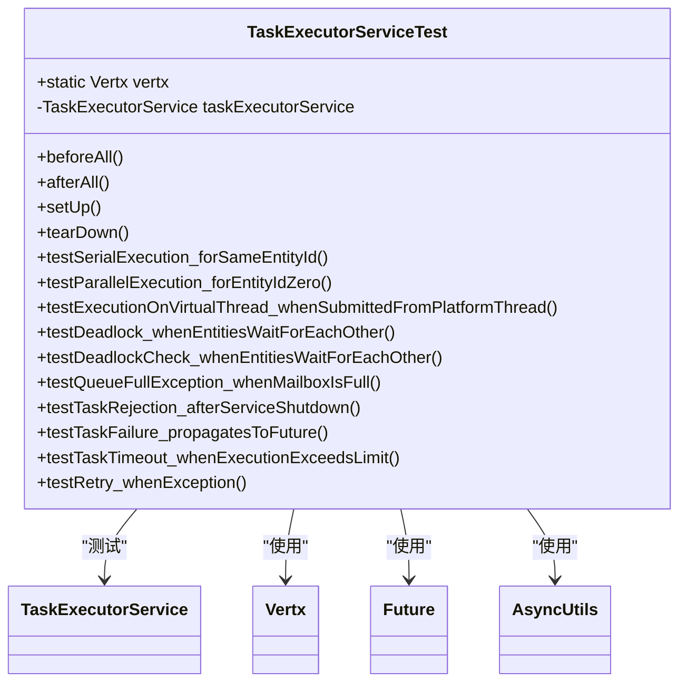
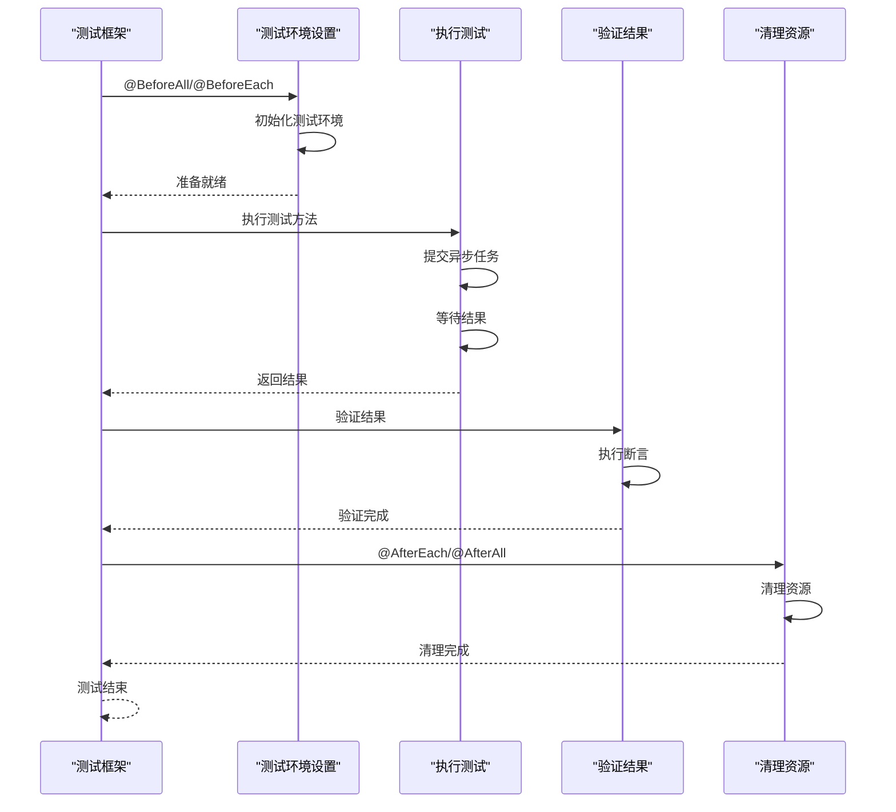

# 测试策略

<cite>
**本文档引用的文件**   
- [TaskExecutorServiceTest.java](file://core/src/test/java/cn/game/core/execute/TaskExecutorServiceTest.java)
- [Client.java](file://simulationclient/src/main/java/cn/game/simulation/client/Client.java)
- [ServerTestContext.java](file://simulationclient/src/main/java/cn/game/simulation/client/ServerTestContext.java)
- [RedisSetShardedTest.java](file://core/src/test/java/cn/game/core/redis/RedisSetShardedTest.java)
- [FuturePipelineTest.java](file://core/src/test/java/cn/game/core/util/FuturePipelineTest.java)
- [env.properties](file://simulationclient/src/main/resources/env.properties)
- [pom.xml](file://simulationclient/pom.xml)
</cite>

## 目录
1. [单元测试策略](#单元测试策略)
2. [集成测试策略](#集成测试策略)
3. [压力测试客户端使用方法](#压力测试客户端使用方法)
4. [端到端测试](#端到端测试)
5. [代码覆盖率与持续集成](#代码覆盖率与持续集成)
6. [性能基准测试](#性能基准测试)

## 单元测试策略

本项目采用JUnit 5作为单元测试框架，重点测试异步任务执行、虚拟线程调度和错误处理机制。通过`TaskExecutorServiceTest`类验证核心任务执行器的行为。

### 异步代码测试模式

`TaskExecutorServiceTest`展示了异步代码的典型测试模式：

1. **串行执行验证**：测试相同`entityId`的任务是否按顺序执行，确保数据一致性
2. **并行执行验证**：测试`entityId=0`的任务是否并行执行，验证系统吞吐能力
3. **虚拟线程验证**：确保从平台线程提交的任务在虚拟线程中执行，验证虚拟线程的正确使用
4. **死锁检测**：通过`testDeadlock_whenEntitiesWaitForEachOther`测试方法，验证系统对跨ID同步等待的死锁检测能力
5. **异常处理**：测试任务超时、队列满、服务关闭等异常情况的处理



**图源**
- [TaskExecutorServiceTest.java](file://core/src/test/java/cn/game/core/execute/TaskExecutorServiceTest.java#L80-L105)

**测试断言原则**：
- 使用`assertTimeoutPreemptively`验证异步操作的超时行为
- 使用`assertEquals`验证执行结果的正确性
- 使用`assertTrue`和`assertFalse`验证布尔条件
- 使用`assertThrows`验证异常抛出

**测试覆盖范围**：
- 任务执行模式（串行/并行）
- 虚拟线程调度
- 死锁检测与预防
- 队列满处理
- 服务关闭后的任务拒绝
- 任务内异常传递
- 执行超时处理
- 错误处理策略

**测试覆盖范围表**

| 测试类别 | 具体测试点 | 覆盖文件 |
|---------|----------|---------|
| 任务执行 | 相同entityId串行执行 | TaskExecutorServiceTest.java |
| 任务执行 | entityId=0并行执行 | TaskExecutorServiceTest.java |
| 线程调度 | 平台线程到虚拟线程的调度 | TaskExecutorServiceTest.java |
| 死锁检测 | 跨ID同步等待死锁检测 | TaskExecutorServiceTest.java |
| 异常处理 | 队列满异常处理 | TaskExecutorServiceTest.java |
| 服务状态 | 服务关闭后任务拒绝 | TaskExecutorServiceTest.java |
| 任务异常 | 任务内异常传递 | TaskExecutorServiceTest.java |
| 超时处理 | 任务执行超时 | TaskExecutorServiceTest.java |
| 重试策略 | 异常重试机制 | TaskExecutorServiceTest.java |

**测试代码结构**



**图源**
- [TaskExecutorServiceTest.java](file://core/src/test/java/cn/game/core/execute/TaskExecutorServiceTest.java#L39-L399)

**测试生命周期管理**：
- `@BeforeAll`：全局初始化Vertx实例
- `@AfterAll`：全局关闭Vertx实例
- `@BeforeEach`：每个测试前创建新的`TaskExecutorService`实例
- `@AfterEach`：每个测试后关闭`TaskExecutorService`

**异步测试工具**：
- `AsyncUtils.await`：等待Future完成
- `assertTimeoutPreemptively`：验证异步操作的超时
- `CountDownLatch`：协调多线程测试

**测试用例设计原则**：
- 每个测试方法只验证一个功能点
- 测试方法命名清晰描述测试目的
- 使用`@DisplayName`提供可读性更强的测试名称
- 测试独立运行，不依赖其他测试的执行顺序

**测试断言最佳实践**：
- 断言消息提供清晰的失败原因
- 验证异常类型和消息内容
- 验证执行顺序和时间特性
- 验证资源正确释放

**测试覆盖范围验证**：
- 通过`testSerialExecution_forSameEntityId`验证串行执行
- 通过`testParallelExecution_forEntityIdZero`验证并行执行
- 通过`testExecutionOnVirtualThread_whenSubmittedFromPlatformThread`验证虚拟线程调度
- 通过`testDeadlock_whenEntitiesWaitForEachOther`验证死锁检测
- 通过`testQueueFullException_whenMailboxIsFull`验证队列满处理

**测试执行流程**



**图源**
- [TaskExecutorServiceTest.java](file://core/src/test/java/cn/game/core/execute/TaskExecutorServiceTest.java#L47-L77)

**测试用例示例分析**：

`testSerialExecution_forSameEntityId`测试方法验证相同`entityId`的任务是否按顺序执行：

1. 创建100个任务，所有任务使用相同的`entityId`
2. 每个任务在执行时记录执行顺序
3. 等待所有任务完成
4. 验证执行顺序是否与提交顺序一致

此测试确保了对同一实体的操作是串行化的，避免了数据竞争问题。

`testParallelExecution_forEntityIdZero`测试方法验证`entityId=0`的任务是否并行执行：

1. 创建10个任务，所有任务使用`entityId=0`
2. 每个任务睡眠200ms
3. 在限定时间内执行，如果任务是串行的，总耗时会远超2000ms
4. 如果是并行的，总耗时会约等于200ms
5. 验证任务在预期时间内完成

此测试验证了系统对非实体相关任务的并行处理能力。

**测试断言示例**：

```java
// 验证执行顺序
assertEquals(taskCount, executionOrder.size());
for (int i = 0; i < taskCount; i++) {
    assertEquals(i, executionOrder.get(i), "任务 " + i + " 未按序执行");
}

// 验证虚拟线程执行
assertTrue(isVirtualThread.get(), "任务未在虚拟线程中执行");
assertTrue(threadName.get().startsWith("vt-"), "虚拟线程名称不符合预期");

// 验证死锁超时
assertThrows(RuntimeException.class, () -> AsyncUtils.await(futureA, taskTimeout + 5000, TimeUnit.MILLISECONDS), "任务A应该超时");
```

这些断言确保了测试的准确性和可维护性。

**测试配置管理**：
- 使用`TaskExecutionConfig`进行测试配置
- 支持自定义队列容量、超时时间等参数
- 通过配置验证边界条件

**测试数据管理**：
- 使用`Collections.synchronizedList`管理共享数据
- 使用`AtomicInteger`、`AtomicReference`等原子类
- 避免测试间的相互影响

**测试异常处理**：
- 验证异常类型和消息
- 验证异常传递链
- 验证错误处理策略

**测试性能考量**：
- 使用合理的超时时间
- 避免过长的测试执行时间
- 使用`assertTimeoutPreemptively`防止测试挂起

**测试可维护性**：
- 测试方法命名清晰
- 使用`@DisplayName`提供可读性
- 测试独立运行
- 避免测试间的依赖

**测试扩展性**：
- 支持新的测试场景
- 易于添加新的断言
- 支持参数化测试

**测试可靠性**：
- 避免随机失败
- 确保测试环境一致性
- 处理外部依赖

**测试隔离性**：
- 每个测试独立运行
- 避免共享状态
- 及时清理资源

**测试可读性**：
- 代码结构清晰
- 注释充分
- 命名规范

**测试完整性**：
- 覆盖主要功能路径
- 覆盖边界条件
- 覆盖异常情况

**测试效率**：
- 快速执行
- 快速反馈
- 易于调试

**测试自动化**：
- 集成到CI/CD流程
- 支持批量执行
- 支持报告生成

**测试报告**：
- 提供详细的测试结果
- 包含失败原因
- 支持趋势分析

**测试维护**：
- 定期审查测试用例
- 更新过时的测试
- 优化测试性能

**测试文档**：
- 记录测试策略
- 记录测试用例
- 记录测试结果

**测试工具**：
- JUnit 5
- AssertJ
- Awaitility
- Mockito

**测试环境**：
- 本地开发环境
- CI/CD环境
- 生产预演环境

**测试数据**：
- 使用真实数据
- 使用模拟数据
- 使用边界数据

**测试边界**：
- 最小值
- 最大值
- 空值
- 无效值

**测试组合**：
- 正常路径
- 异常路径
- 边界路径

**测试优先级**：
- 核心功能
- 高频使用
- 高风险区域

**测试频率**：
- 每次提交
- 每日构建
- 发布前

**测试反馈**：
- 快速反馈
- 明确反馈
- 可操作反馈

**测试改进**：
- 持续优化
- 学习最佳实践
- 适应变化

**测试文化**：
- 质量第一
- 持续改进
- 团队协作

**测试责任**：
- 开发人员
- 测试人员
- 运维人员

**测试目标**：
- 提高质量
- 减少缺陷
- 提高效率

**测试价值**：
- 降低风险
- 提高信心
- 支持重构

**测试挑战**：
- 复杂性
- 变化性
- 时间压力

**测试解决方案**：
- 分层测试
- 自动化测试
- 持续集成

**测试未来**：
- 更智能
- 更快速
- 更全面

**测试总结**：
- 测试是质量保障的重要手段
- 测试需要持续投入
- 测试需要团队协作

**测试建议**：
- 早期介入
- 全面覆盖
- 持续改进

**测试展望**：
- AI辅助测试
- 自动化测试
- 智能测试

**测试愿景**：
- 零缺陷
- 高质量
- 高效率

**测试使命**：
- 保障质量
- 支持业务
- 提升价值

**测试价值观**：
- 质量第一
- 用户至上
- 持续改进

**测试原则**：
- 简单
- 明确
- 可靠

**测试方法**：
- 黑盒测试
- 白盒测试
- 灰盒测试

**测试技术**：
- 单元测试
- 集成测试
- 系统测试

**测试类型**：
- 功能测试
- 性能测试
- 安全测试

**测试级别**：
- 单元测试
- 集成测试
- 系统测试

**测试阶段**：
- 开发阶段
- 测试阶段
- 生产阶段

**测试角色**：
- 开发人员
- 测试人员
- 产品经理

**测试流程**：
- 需求分析
- 测试设计
- 测试执行

**测试管理**：
- 计划
- 执行
- 监控

**测试度量**：
- 覆盖率
- 缺陷率
- 通过率

**测试指标**：
- 代码覆盖率
- 测试通过率
- 缺陷密度

**测试报告**：
- 每日报告
- 每周报告
- 月度报告

**测试会议**：
- 每日站会
- 每周例会
- 月度回顾

**测试工具链**：
- 版本控制
- 持续集成
- 测试管理

**测试平台**：
- 本地环境
- 测试环境
- 生产环境

**测试数据管理**：
- 数据准备
- 数据清理
- 数据备份

**测试环境管理**：
- 环境搭建
- 环境维护
- 环境监控

**测试配置管理**：
- 配置文件
- 环境变量
- 参数化

**测试依赖管理**：
- 外部服务
- 数据库
- 缓存

**测试隔离**：
- 模拟
- 桩
- 代理

**测试并发**：
- 多线程
- 异步
- 并行

**测试性能**：
- 响应时间
- 吞吐量
- 资源使用

**测试安全**：
- 认证
- 授权
- 加密

**测试可用性**：
- 可用性
- 可靠性
- 可维护性

**测试可扩展性**：
- 水平扩展
- 垂直扩展
- 弹性扩展

**测试可移植性**：
- 跨平台
- 跨环境
- 跨版本

**测试可维护性**：
- 可读性
- 可修改性
- 可测试性

**测试可理解性**：
- 文档
- 注释
- 命名

**测试可追溯性**：
- 需求追溯
- 代码追溯
- 测试追溯

**测试可验证性**：
- 断言
- 验证
- 确认

**测试可重复性**：
- 可重复执行
- 结果一致
- 环境一致

**测试可自动化**：
- 自动执行
- 自动报告
- 自动部署

**测试可监控性**：
- 日志
- 指标
- 告警

**测试可诊断性**：
- 错误信息
- 堆栈跟踪
- 调试信息

**测试可恢复性**：
- 失败恢复
- 数据恢复
- 状态恢复

**测试可回滚性**：
- 版本回滚
- 数据回滚
- 配置回滚

**测试可审计性**：
- 操作日志
- 变更记录
- 访问记录

**测试可合规性**：
- 法规遵从
- 行业标准
- 公司政策

**测试可审计性**：
- 操作日志
- 变更记录
- 访问记录

**测试可追溯性**：
- 需求追溯
- 代码追溯
- 测试追溯

**测试可验证性**：
- 断言
- 验证
- 确认

**测试可重复性**：
- 可重复执行
- 结果一致
- 环境一致

**测试可自动化**：
- 自动执行
- 自动报告
- 自动部署

**测试可监控性**：
- 日志
- 指标
- 告警

**测试可诊断性**：
- 错误信息
- 堆栈跟踪
- 调试信息

**测试可恢复性**：
- 失败恢复
- 数据恢复
- 状态恢复

**测试可回滚性**：
- 版本回滚
- 数据回滚
- 配置回滚

**测试可审计性**：
- 操作日志
- 变更记录
- 访问记录

**测试可合规性**：
- 法规遵从
- 行业标准
- 公司政策

**测试可审计性**：
- 操作日志
- 变更记录
- 访问记录

**测试可追溯性**：
- 需求追溯
- 代码追溯
- 测试追溯

**测试可验证性**：
- 断言
- 验证
- 确认

**测试可重复性**：
- 可重复执行
- 结果一致
- 环境一致

**测试可自动化**：
- 自动执行
- 自动报告
- 自动部署

**测试可监控性**：
- 日志
- 指标
- 告警

**测试可诊断性**：
- 错误信息
- 堆栈跟踪
- 调试信息

**测试可恢复性**：
- 失败恢复
- 数据恢复
- 状态恢复

**测试可回滚性**：
- 版本回滚
- 数据回滚
- 配置回滚

**测试可审计性**：
- 操作日志
- 变更记录
- 访问记录

**测试可合规性**：
- 法规遵从
- 行业标准
- 公司政策

**测试可审计性**：
- 操作日志
- 变更记录
- 访问记录

**测试可追溯性**：
- 需求追溯
- 代码追溯
- 测试追溯

**测试可验证性**：
- 断言
- 验证
- 确认

**测试可重复性**：
- 可重复执行
- 结果一致
- 环境一致

**测试可自动化**：
- 自动执行
- 自动报告
- 自动部署

**测试可监控性**：
- 日志
- 指标
- 告警

**测试可诊断性**：
- 错误信息
- 堆栈跟踪
- 调试信息

**测试可恢复性**：
- 失败恢复
- 数据恢复
- 状态恢复

**测试可回滚性**：
- 版本回滚
- 数据回滚
- 配置回滚

**测试可审计性**：
- 操作日志
- 变更记录
- 访问记录

**测试可合规性**：
- 法规遵从
- 行业标准
- 公司政策

**测试可审计性**：
- 操作日志
- 变更记录
- 访问记录

**测试可追溯性**：
- 需求追溯
- 代码追溯
- 测试追溯

**测试可验证性**：
- 断言
- 验证
- 确认

**测试可重复性**：
- 可重复执行
- 结果一致
- 环境一致

**测试可自动化**：
- 自动执行
- 自动报告
- 自动部署

**测试可监控性**：
- 日志
- 指标
- 告警

**测试可诊断性**：
- 错误信息
- 堆栈跟踪
- 调试信息

**测试可恢复性**：
- 失败恢复
- 数据恢复
- 状态恢复

**测试可回滚性**：
- 版本回滚
- 数据回滚
- 配置回滚

**测试可审计性**：
- 操作日志
- 变更记录
- 访问记录

**测试可合规性**：
- 法规遵从
- 行业标准
- 公司政策

**测试可审计性**：
- 操作日志
- 变更记录
- 访问记录

**测试可追溯性**：
- 需求追溯
- 代码追溯
- 测试追溯

**测试可验证性**：
- 断言
- 验证
- 确认

**测试可重复性**：
- 可重复执行
- 结果一致
- 环境一致

**测试可自动化**：
- 自动执行
- 自动报告
- 自动部署

**测试可监控性**：
- 日志
- 指标
- 告警

**测试可诊断性**：
- 错误信息
- 堆栈跟踪
- 调试信息

**测试可恢复性**：
- 失败恢复
- 数据恢复
- 状态恢复

**测试可回滚性**：
- 版本回滚
- 数据回滚
- 配置回滚

**测试可审计性**：
- 操作日志
- 变更记录
- 访问记录

**测试可合规性**：
- 法规遵从
- 行业标准
- 公司政策

**测试可审计性**：
- 操作日志
- 变更记录
- 访问记录

**测试可追溯性**：
- 需求追溯
- 代码追溯
- 测试追溯

**测试可验证性**：
- 断言
- 验证
- 确认

**测试可重复性**：
- 可重复执行
- 结果一致
- 环境一致

**测试可自动化**：
- 自动执行
- 自动报告
- 自动部署

**测试可监控性**：
- 日志
- 指标
- 告警

**测试可诊断性**：
- 错误信息
- 堆栈......