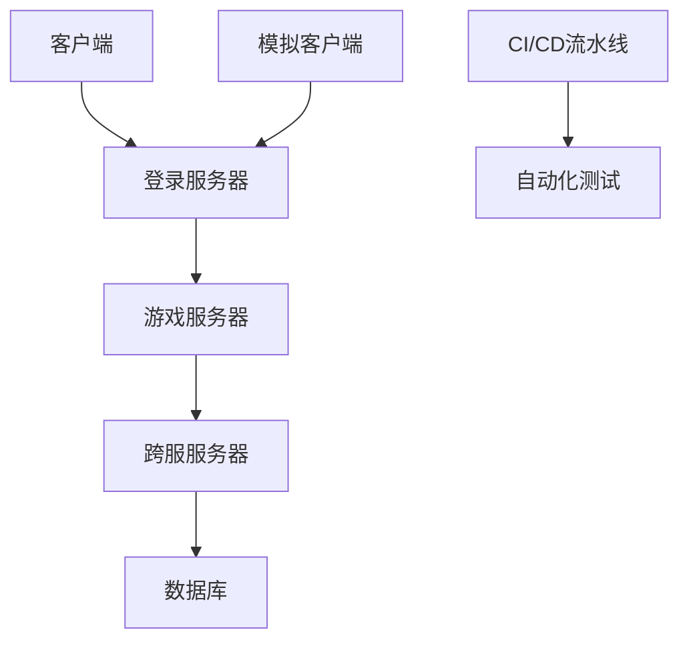
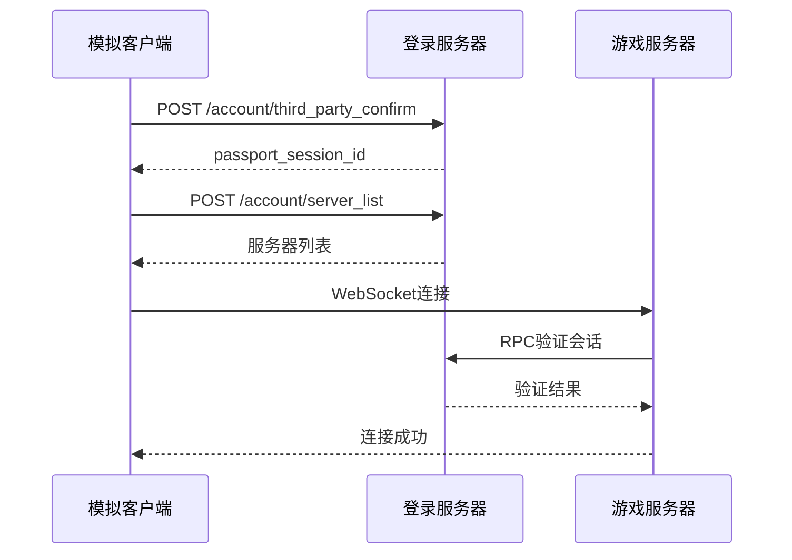
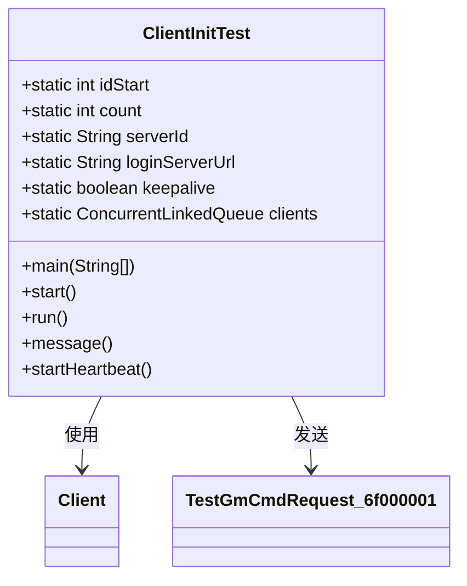
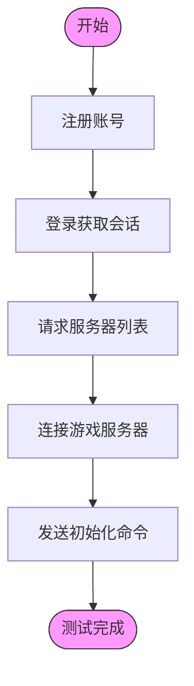
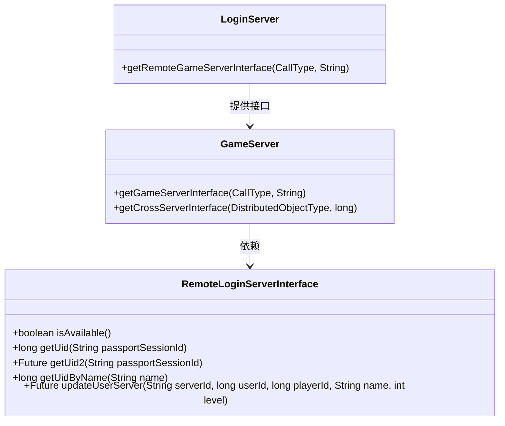
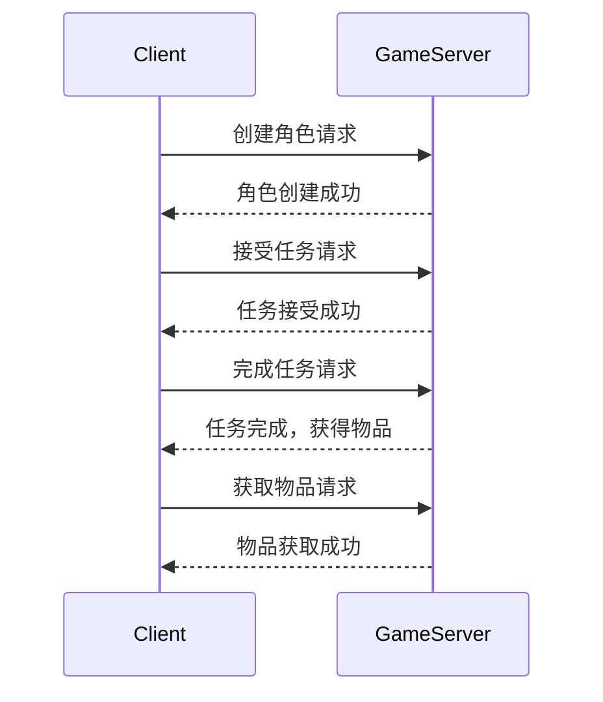
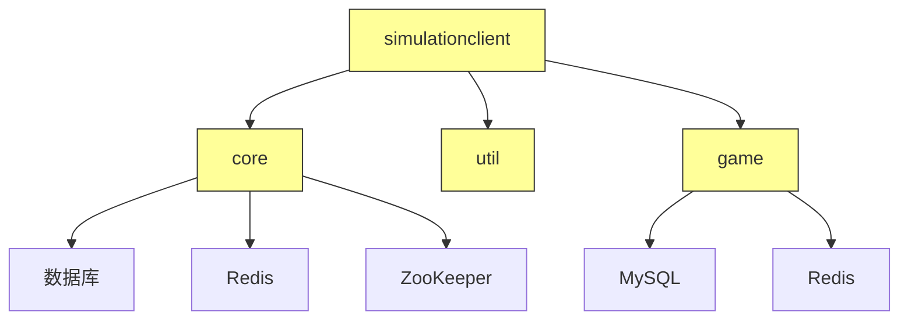

# 端到端测试

<cite>
**本文档引用文件**  
- [ClientInitTest.java](file://simulationclient/src/main/java/cn/game/simulation/client/ClientInitTest.java)
- [Client.java](file://simulationclient/src/main/java/cn/game/simulation/client/Client.java)
- [ServerTestContext.java](file://simulationclient/src/main/java/cn/game/simulation/client/ServerTestContext.java)
- [ServerTest.java](file://simulationclient/src/main/java/cn/game/simulation/test/base/ServerTest.java)
- [loginServerUrl](file://simulationclient/src/main/java/cn/game/simulation/client/ClientInitTest.java#L24)
- [env.properties](file://simulationclient/src/main/resources/env.properties)
- [game.bat](file://game/tool/game.bat)
- [pom.xml](file://simulationclient/pom.xml)
- [登录流程.txt](file://game/登录流程.txt)
- [GameServer.java](file://game/src/main/java/cn/game/games/net/game/GameServer.java)
- [RemoteLoginServerInterface.java](file://core/src/main/java/cn/game/core/net/remote/RemoteLoginServerInterface.java)
- [CrossServer.java](file://game/src/main/java/cn/game/games/net/cross/CrossServer.java)
- [LoginServer.java](file://login/src/main/java/cn/game/login/LoginServer.java)
- [SequentialMessageTest.java](file://simulationclient/src/main/java/cn/game/simulation/client/SequentialMessageTest.java)
- [压测工具使用方法.txt](file://simulationclient/压测工具使用方法.txt)
</cite>

## 目录
1. [引言](#引言)
2. [项目结构](#项目结构)
3. [核心组件](#核心组件)
4. [架构概述](#架构概述)
5. [详细组件分析](#详细组件分析)
6. [依赖分析](#依赖分析)
7. [性能考虑](#性能考虑)
8. [故障排除指南](#故障排除指南)
9. [结论](#结论)
10. [附录](#附录)

## 引言
本文档旨在描述如何验证完整用户旅程的端到端测试方法。以ClientInitTest为例，说明从用户登录到游戏服务器接入的全流程测试方法。文档将解释如何测试跨服务调用，如登录服务器认证后跳转到游戏服务器的会话传递。同时，将描述如何验证角色创建、任务完成和物品获取等核心业务流程的连贯性。提供测试数据准备、状态验证和异常流程处理的指导，并说明如何自动化端到端测试并集成到CI/CD流水线中，确保每次发布前的功能完整性。

## 项目结构
项目包含多个核心模块：core（基础框架）、game（游戏逻辑）、login（登录服务）、util（工具类）和simulationclient（模拟客户端）。simulationclient模块是端到端测试的核心，包含ClientInitTest等测试类，用于模拟用户行为。login模块处理用户认证和会话管理，game模块实现游戏逻辑和状态管理。各模块通过RPC和WebSocket进行通信，形成完整的用户旅程。

**图示来源**
- [Client.java](file://simulationclient/src/main/java/cn/game/simulation/client/Client.java#L105)
- [LoginServer.java](file://login/src/main/java/cn/game/login/LoginServer.java#L173)
- [GameServer.java](file://game/src/main/java/cn/game/games/net/game/GameServer.java#L488)

**本节来源**
- [project_structure](file://project_structure)
- [Client.java](file://simulationclient/src/main/java/cn/game/simulation/client/Client.java#L1)
- [LoginServer.java](file://login/src/main/java/cn/game/login/LoginServer.java#L1)

## 核心组件
端到端测试的核心组件包括ClientInitTest（初始化测试）、Client（客户端模拟器）、ServerTestContext（测试上下文）和ServerTest（测试基类）。这些组件协同工作，模拟真实用户从登录到游戏交互的完整流程。ClientInitTest使用GM命令批量初始化测试账号，Client类处理网络连接和协议通信，ServerTestContext管理测试配置和资源，ServerTest提供测试用例的抽象基类。

**本节来源**
- [ClientInitTest.java](file://simulationclient/src/main/java/cn/game/simulation/client/ClientInitTest.java#L17)
- [Client.java](file://simulationclient/src/main/java/cn/game/simulation/client/Client.java#L105)
- [ServerTestContext.java](file://simulationclient/src/main/java/cn/game/simulation/client/ServerTestContext.java#L51)
- [ServerTest.java](file://simulationclient/src/main/java/cn/game/simulation/test/base/ServerTest.java#L15)

## 架构概述
系统采用微服务架构，包含登录服务、游戏服务和跨服服务。用户首先通过登录服务器进行身份验证，获取passport_session_id。然后请求服务器列表，选择目标游戏服务器。最后通过WebSocket连接到游戏服务器，建立游戏会话。服务间通过RPC进行远程调用，如游戏服务器调用登录服务器验证会话有效性。模拟客户端通过HTTP和WebSocket协议与服务端交互，完整模拟用户旅程。

**图示来源**
- [登录流程.txt](file://game/登录流程.txt#L1)
- [Client.java](file://simulationclient/src/main/java/cn/game/simulation/client/Client.java#L501)
- [RemoteLoginServerInterface.java](file://core/src/main/java/cn/game/core/net/remote/RemoteLoginServerInterface.java#L12)

## 详细组件分析

### ClientInitTest分析
ClientInitTest是端到端测试的入口点，负责批量初始化测试账号。它通过loginPassportProto方法连接登录服务器，通过loginGateway方法连接游戏服务器，最后发送GM init命令初始化玩家数据。测试配置包括idStart（起始ID）、count（数量）、serverId（服务器ID）和loginServerUrl（登录服务器地址）。

**图示来源**
- [ClientInitTest.java](file://simulationclient/src/main/java/cn/game/simulation/client/ClientInitTest.java#L17)
- [Client.java](file://simulationclient/src/main/java/cn/game/simulation/client/Client.java#L105)

### 用户旅程测试流程
端到端测试遵循标准用户旅程：注册、登录、选择服务器、连接游戏服务器。测试首先通过HTTP POST请求注册账号，然后使用third_party_confirm接口登录获取会话ID。接着请求server_list获取可用服务器列表，最后通过WebSocket连接到指定游戏服务器。整个流程通过Client类的loginPassportProto和loginGateway方法实现。

**图示来源**
- [登录流程.txt](file://game/登录流程.txt#L1)
- [Client.java](file://simulationclient/src/main/java/cn/game/simulation/client/Client.java#L57)
- [ClientInitTest.java](file://simulationclient/src/main/java/cn/game/simulation/client/ClientInitTest.java#L57)

### 跨服务调用测试
系统通过RPC实现跨服务调用。游戏服务器通过RemoteLoginServerInterface接口调用登录服务器验证会话有效性。LoginServer提供getRemoteGameServerInterface方法供其他服务调用。跨服通信通过CrossServer实现，使用分布式对象管理。测试时需要验证服务间通信的正确性和会话传递的完整性。

**图示来源**
- [RemoteLoginServerInterface.java](file://core/src/main/java/cn/game/core/net/remote/RemoteLoginServerInterface.java#L12)
- [LoginServer.java](file://login/src/main/java/cn/game/login/LoginServer.java#L200)
- [GameServer.java](file://game/src/main/java/cn/game/games/net/game/GameServer.java#L503)

### 核心业务流程验证
核心业务流程包括角色创建、任务完成和物品获取。通过SequentialMessageTest类可以按顺序执行多个协议，验证业务流程的连贯性。测试数据从messages.csv文件读取，包含协议名称、参数和期望结果。ServerTest基类提供getMessage和getMessagePressure方法生成测试消息。通过waitLastMessageReturn方法确保消息按序处理。

**图示来源**
- [SequentialMessageTest.java](file://simulationclient/src/main/java/cn/game/simulation/client/SequentialMessageTest.java#L43)
- [ServerTest.java](file://simulationclient/src/main/java/cn/game/simulation/test/base/ServerTest.java#L30)
- [messages.csv](file://simulationclient/messages.csv)

### 测试数据准备与状态验证
测试数据通过env.properties文件配置，包括服务器地址、端口、账号信息和测试参数。ClientInitTest使用硬编码的测试数据初始化账号。状态验证通过比较服务器响应与期望结果实现。异常流程通过故意发送无效请求测试系统的错误处理能力。测试结果通过日志和统计信息进行分析。

**本节来源**
- [env.properties](file://simulationclient/src/main/resources/env.properties)
- [ClientInitTest.java](file://simulationclient/src/main/java/cn/game/simulation/client/ClientInitTest.java#L19)
- [ServerTestContext.java](file://simulationclient/src/main/java/cn/game/simulation/client/ServerTestContext.java#L71)

## 依赖分析
系统依赖关系复杂，simulationclient依赖core、util和game模块。core模块提供基础框架和RPC功能，util模块提供通用工具类，game模块实现游戏业务逻辑。通过Maven管理依赖，pom.xml文件定义了模块间的依赖关系。测试环境需要确保所有依赖服务正常运行，包括数据库、Redis和ZooKeeper。

**图示来源**
- [pom.xml](file://simulationclient/pom.xml#L98)
- [SpringContextLoader.java](file://util/src/main/java/cn/game/util/SpringContextLoader.java)
- [RedisUtil.java](file://util/src/main/java/cn/game/util/RedisUtil.java)

## 性能考虑
端到端测试需要考虑性能影响。ServerTestContext使用线程池和信号量控制并发登录数，避免对服务器造成过大压力。loginConcurrency参数控制并发登录线程数，loginInterval控制登录间隔。消息发送通过sendInterval和botSendInterval参数节流。测试结果通过GlobalMessageStatistics进行统计分析，帮助识别性能瓶颈。

**本节来源**
- [ServerTestContext.java](file://simulationclient/src/main/java/cn/game/simulation/client/ServerTestContext.java#L84)
- [GlobalMessageStatistics.java](file://core/src/main/java/cn/game/core/execute/GlobalMessageStatistics.java)

## 故障排除指南
常见问题包括连接超时、会话失效和协议错误。检查loginServerUrl和game.server.ip配置是否正确。验证服务器是否正常运行。查看日志文件定位具体错误。对于会话问题，确保passport_session_id在有效期内。对于协议错误，检查messages.csv中的协议定义是否正确。使用压测工具的详细日志功能进行问题诊断。

**本节来源**
- [压测工具使用方法.txt](file://simulationclient/压测工具使用方法.txt)
- [Client.java](file://simulationclient/src/main/java/cn/game/simulation/client/Client.java#L110)
- [ServerTestContext.java](file://simulationclient/src/main/java/cn/game/simulation/client/ServerTestContext.java#L59)

## 结论
本文档详细描述了端到端测试的实现方法，以ClientInitTest为例展示了从用户登录到游戏服务器接入的全流程测试。通过模拟客户端完整再现用户旅程，验证了跨服务调用和核心业务流程的正确性。提供了测试数据准备、状态验证和异常处理的指导。通过与CI/CD流水线集成，可以确保每次发布前的功能完整性，提高软件质量。

## 附录

### 测试配置参数说明
| 参数 | 说明 | 示例值 |
|------|------|--------|
| botIdStart | 机器人起始ID | 91644407 |
| botCount | 机器人数量 | 40 |
| loginInterval | 登录间隔(毫秒) | 1 |
| sendInterval | 发送间隔(毫秒) | 1 |
| botSendInterval | 机器人发送间隔(毫秒) | 3000 |
| messageStatisticsInterval | 统计间隔(分钟) | 1 |
| botRunTimeMax | 最大运行时间(分钟) | 10 |

**本节来源**
- [env.properties](file://simulationclient/src/main/resources/env.properties)

### 自动化测试集成
通过Maven和脚本实现自动化测试。pom.xml定义测试依赖和插件。game.bat等脚本用于启动测试。可以将测试集成到Jenkins等CI/CD工具中，在每次代码提交后自动执行端到端测试，确保功能完整性。

**本节来源**
- [pom.xml](file://simulationclient/pom.xml)
- [game.bat](file://game/tool/game.bat)