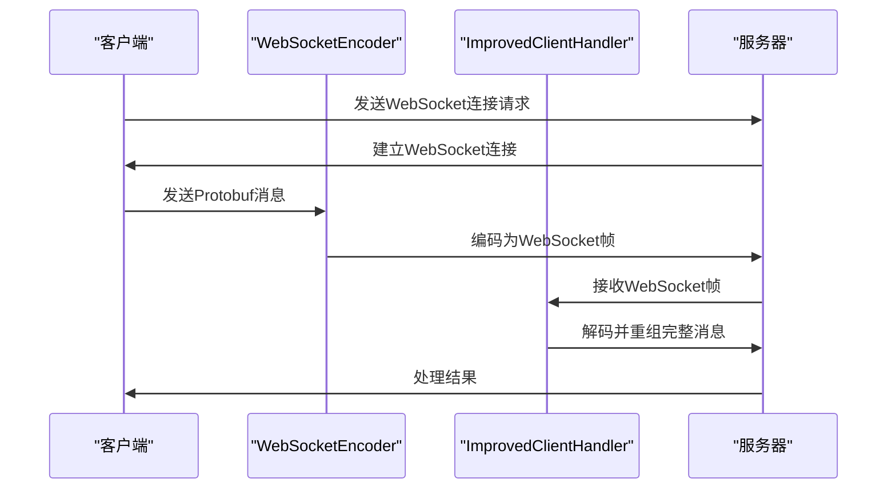
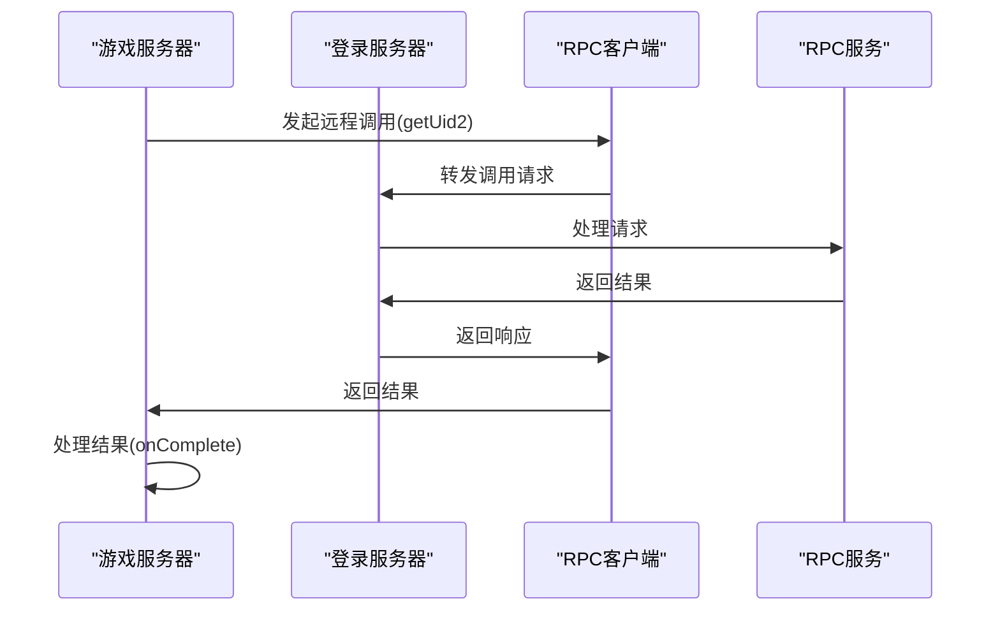

# 集成测试

<cite>
**本文档引用的文件**   
- [RedisShardedMapTest.java](file://core/src/test/java/cn/game/core/redis/RedisShardedMapTest.java)
- [RedisShardedMap.java](file://core/src/main/java/cn/game/core/redis/RedisShardedMap.java)
- [NettyTest.java](file://game/src/test/java/netty/NettyTest.java)
- [WebSocketEncoder.java](file://game/src/main/java/cn/game/games/core/netty/WebSocketEncoder.java)
- [ImprovedClientHandler.java](file://simulationclient/src/main/java/cn/game/simulation/socket/ImprovedClientHandler.java)
- [VirtualServerRegistry.java](file://core/src/main/java/cn/game/core/base/VirtualServerRegistry.java)
- [ActiveServerListManager.java](file://core/src/main/java/cn/game/core/base/ActiveServerListManager.java)
- [ZkCacheRegistry.java](file://core/src/main/java/cn/game/core/zookeeper/ZkCacheRegistry.java)
- [ZkHelper.java](file://util/src/main/java/cn/game/util/ZkHelper.java)
</cite>

## 目录
1. [引言](#引言)
2. [分布式缓存功能测试](#分布式缓存功能测试)
3. [网络通信层测试](#网络通信层测试)
4. [跨模块调用测试](#跨模块调用测试)
5. [外部依赖模拟与环境切换](#外部依赖模拟与环境切换)
6. [事务管理与异常恢复测试](#事务管理与异常恢复测试)
7. [结论](#结论)

## 引言
本文档详细说明了服务器项目中组件间交互的集成测试方法。重点介绍了如何验证分布式缓存、网络通信层以及跨模块调用的功能正确性。文档涵盖了使用RedisShardedMapTest验证分布式缓存功能，通过NettyTest验证网络通信层，以及测试游戏服务器与登录服务器之间的RPC通信。同时提供了外部依赖（Redis、Zookeeper）的模拟方案和真实环境测试的切换方法，并包含了事务管理、数据持久化和异常恢复的测试用例设计。

## 分布式缓存功能测试

### 分片策略验证
`RedisShardedMapTest`类通过`testResharding()`方法验证了分片策略的正确性。测试流程包括：
1. 准备测试数据并写入当前分片配置
2. 执行重分片操作，将分片数量从4个增加到8个
3. 验证数据完整性，确保迁移前后数据内容和大小一致
4. 检查分片统计信息，确认新的分片数量正确

分片策略基于键的哈希值进行分配，确保数据均匀分布在各个分片中。`RedisShardedMap`类的`getShardKey()`方法负责计算键所属的分片。

### 数据一致性检查
数据一致性通过多个测试方法进行验证：
- `testBasicOperations()`：验证基本的put、get、remove操作的原子性和一致性
- `testBatchOperations()`：验证批量操作（putAll、getAll、deleteAll）的数据一致性
- `testConcurrentOperations()`：验证多线程并发操作下的数据一致性
- `testAtomicOperations()`：验证原子操作（putIfAbsent、replace）的一致性

测试用例通过断言（assert）验证操作结果，确保在各种操作下数据的一致性。

**Section sources**
- [RedisShardedMapTest.java](file://core/src/test/java/cn/game/core/redis/RedisShardedMapTest.java#L174-L220)
- [RedisShardedMap.java](file://core/src/main/java/cn/game/core/redis/RedisShardedMap.java#L239-L318)

## 网络通信层测试

### WebSocket连接测试
网络通信层的WebSocket连接测试主要通过`NettyTest`类实现。测试内容包括：
1. 建立WebSocket连接
2. 验证连接状态
3. 测试连接的稳定性和可靠性
4. 验证连接关闭和重连机制

### 消息编解码测试
消息编解码测试通过`WebSocketEncoder`和`ImprovedClientHandler`类实现：
- `WebSocketEncoder`负责将Protobuf协议消息编码为WebSocket帧
- `ImprovedClientHandler`负责解码WebSocket帧并重组完整的消息

**Diagram sources **
- [WebSocketEncoder.java](file://game/src/main/java/cn/game/games/core/netty/WebSocketEncoder.java#L13-L29)
- [ImprovedClientHandler.java](file://simulationclient/src/main/java/cn/game/simulation/socket/ImprovedClientHandler.java#L16-L95)

### 协议处理测试
协议处理测试验证了消息头的正确性：
1. 消息头包含长度、序列号、消息ID和错误码
2. 客户端和服务器使用相同的协议格式
3. 消息分片和重组的正确性

测试用例验证了消息长度计算、序列号递增、消息ID匹配等关键协议要素。

**Section sources**
- [NettyTest.java](file://game/src/test/java/netty/NettyTest.java)
- [WebSocketEncoder.java](file://game/src/main/java/cn/game/games/core/netty/WebSocketEncoder.java)
- [ImprovedClientHandler.java](file://simulationclient/src/main/java/cn/game/simulation/socket/ImprovedClientHandler.java)

## 跨模块调用测试

### RPC通信验证
跨模块调用的RPC通信测试主要验证游戏服务器与登录服务器之间的通信：
1. 使用`RemoteLoginServerInterface`进行远程调用
2. 验证点对点通信的正确性
3. 测试异步调用的完成处理

**Diagram sources **
- [GGameVertxTest.java](file://game/src/test/java/GGameVertxTest.java#L105-L117)

### 服务发现与注册测试
服务发现与注册通过Zookeeper实现，相关测试包括：
- `VirtualServerRegistry`：虚拟服务器注册表
- `ActiveServerListManager`：活跃服务器列表管理
- `ZkCacheRegistry`：Zookeeper缓存注册表

测试验证了服务器的注册、发现和状态同步功能。

**Section sources**
- [VirtualServerRegistry.java](file://core/src/main/java/cn/game/core/base/VirtualServerRegistry.java#L106-L150)
- [ActiveServerListManager.java](file://core/src/main/java/cn/game/core/base/ActiveServerListManager.java#L71-L120)
- [ZkCacheRegistry.java](file://core/src/main/java/cn/game/core/zookeeper/ZkCacheRegistry.java)
- [ZkHelper.java](file://util/src/main/java/cn/game/util/ZkHelper.java#L32-L79)

## 外部依赖模拟与环境切换

### Redis模拟方案
Redis依赖的模拟方案包括：
1. 使用Testcontainers创建Redis集群容器
2. 在测试环境中启动独立的Redis实例
3. 使用内存数据库作为替代方案

`ShardedRedisMapContainerTest`类展示了如何使用Testcontainers创建Redis集群进行测试。

### Zookeeper模拟方案
Zookeeper依赖的模拟方案包括：
1. 使用CuratorFramework的测试模式
2. 在测试环境中启动独立的Zookeeper实例
3. 使用内存Zookeeper作为替代方案

### 真实环境测试切换
真实环境测试的切换方法：
1. 通过配置文件切换Redis和Zookeeper的连接地址
2. 使用不同的配置文件区分测试环境和生产环境
3. 在测试代码中动态设置连接参数

**Section sources**
- [ShardedRedisMapContainerTest.java](file://core/src/test/java/cn/game/core/redis/ShardedRedisMapContainerTest.java)
- [ZkHelper.java](file://util/src/main/java/cn/game/util/ZkHelper.java#L58-L67)

## 事务管理与异常恢复测试

### 事务管理测试
事务管理测试验证了数据操作的原子性和一致性：
1. 测试批量操作的事务性
2. 验证异常情况下的回滚机制
3. 测试并发操作的隔离性

### 数据持久化测试
数据持久化测试包括：
1. 验证数据正确写入Redis
2. 测试数据过期和清除机制
3. 验证数据迁移的完整性

### 异常恢复测试
异常恢复测试验证了系统在异常情况下的恢复能力：
1. 测试网络中断后的重连机制
2. 验证服务器崩溃后的数据恢复
3. 测试异常情况下的错误处理和日志记录

**Section sources**
- [TaskExecutorServiceTest.java](file://core/src/test/java/cn/game/core/execute/TaskExecutorServiceTest.java#L390-L398)
- [MailboxProcessor.java](file://core/src/main/java/cn/game/core/execute/MailboxProcessor.java#L43-L108)
- [DeadlockGuard.java](file://core/src/main/java/cn/game/core/execute/DeadlockGuard.java#L88-L107)

## 结论
本文档详细介绍了服务器项目中组件间交互的集成测试方法。通过全面的测试用例，验证了分布式缓存、网络通信层、跨模块调用等功能的正确性。同时提供了外部依赖的模拟方案和真实环境测试的切换方法，确保了测试的灵活性和可靠性。事务管理、数据持久化和异常恢复的测试用例设计，进一步保证了系统的稳定性和数据的一致性。