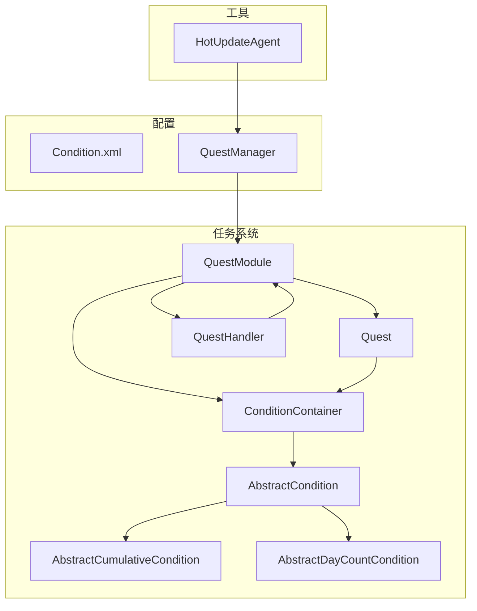
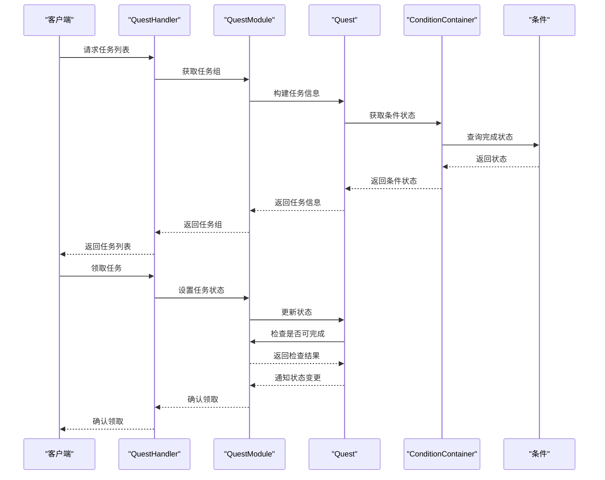
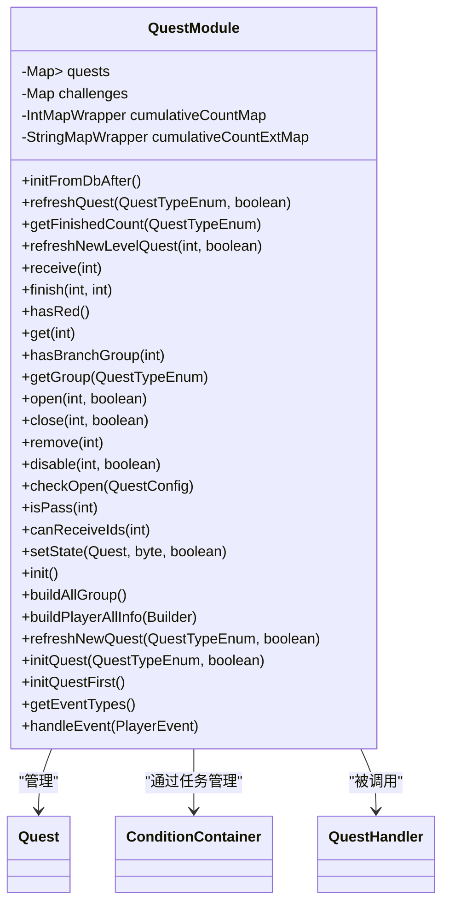
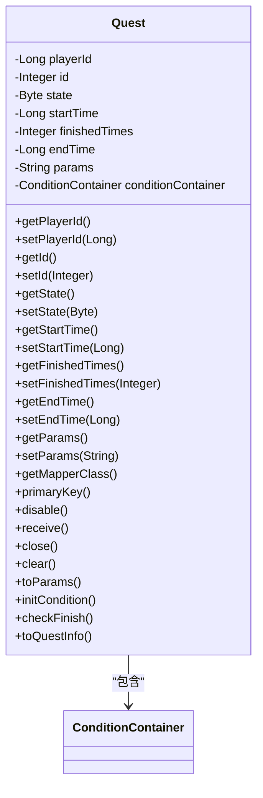
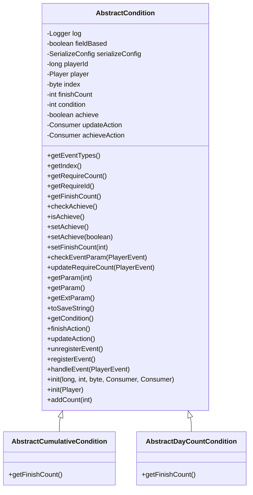
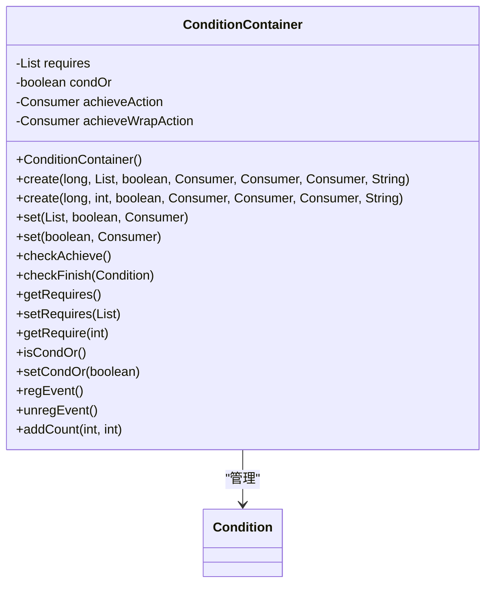
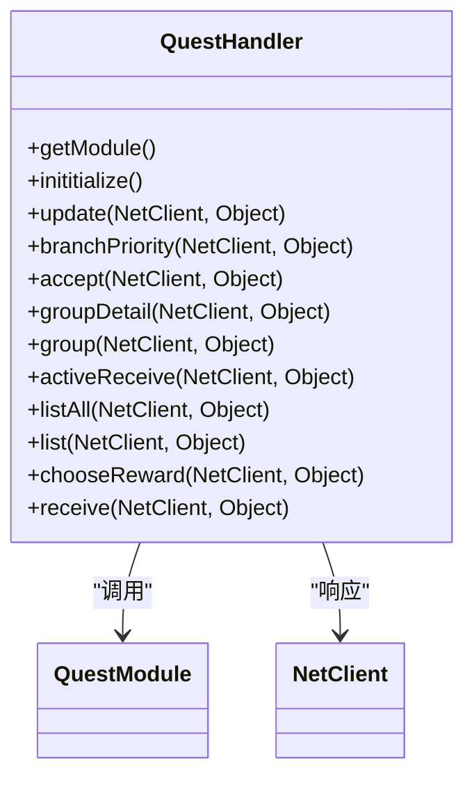

# 任务系统

<cite>
**本文档引用文件**   
- [QuestModule.java](file://game/src/main/java/cn/game/games/net/game/module/quest/QuestModule.java)
- [Quest.java](file://game/src/main/java/cn/game/games/net/game/module/quest/Quest.java)
- [Condition.xml](file://game/src/main/resources/xml/Condition.xml)
- [AbstractCumulativeCondition.java](file://game/src/main/java/cn/game/games/net/game/module/quest/AbstractCumulativeCondition.java)
- [AbstractDayCountCondition.java](file://game/src/main/java/cn/game/games/net/game/module/quest/AbstractDayCountCondition.java)
- [QuestHandler.java](file://game/src/main/java/cn/game/games/net/game/module/quest/QuestHandler.java)
- [ConditionContainer.java](file://game/src/main/java/cn/game/games/net/game/module/quest/ConditionContainer.java)
- [QuestManager.java](file://protocol/src/main/java/cn/game/protocol/generated/manager/QuestManager.java)
- [HotUpdateAgent.java](file://util/src/main/java/cn/game/util/HotUpdateAgent.java)
</cite>

## 目录
1. [简介](#简介)
2. [项目结构](#项目结构)
3. [核心组件](#核心组件)
4. [架构概述](#架构概述)
5. [详细组件分析](#详细组件分析)
6. [依赖分析](#依赖分析)
7. [性能考虑](#性能考虑)
8. [故障排除指南](#故障排除指南)
9. [结论](#结论)

## 简介
本文档全面记录任务系统的领域模型与运行机制。以QuestModule为主线，说明任务的加载、刷新和状态同步策略。深入解析Condition体系的条件类型（ConditionType）、累积条件（AbstractCumulativeCondition）和每日计数条件（AbstractDayCountCondition）的判定逻辑。描述任务进度更新的事件驱动机制、条件容器（ConditionContainer）的动态管理方式。说明QuestHandler如何处理客户端请求、任务领取与完成校验。提供任务配置热更新方案、大规模任务并发检查的性能优化技巧及调试工具的使用方法。

## 项目结构
任务系统主要位于`game/src/main/java/cn/game/games/net/game/module/quest`目录下，包含核心模块、任务实体、条件体系和处理器。配置文件位于`game/src/main/resources/xml`目录下。相关管理器位于`protocol/src/main/java/cn/game/protocol/generated/manager`目录下。热更新工具位于`util/src/main/java/cn/game/util`目录下。



**图表来源**
- [QuestModule.java](file://game/src/main/java/cn/game/games/net/game/module/quest/QuestModule.java)
- [Quest.java](file://game/src/main/java/cn/game/games/net/game/module/quest/Quest.java)
- [ConditionContainer.java](file://game/src/main/java/cn/game/games/net/game/module/quest/ConditionContainer.java)
- [QuestHandler.java](file://game/src/main/java/cn/game/games/net/game/module/quest/QuestHandler.java)
- [AbstractCumulativeCondition.java](file://game/src/main/java/cn/game/games/net/game/module/quest/AbstractCumulativeCondition.java)
- [AbstractDayCountCondition.java](file://game/src/main/java/cn/game/games/net/game/module/quest/AbstractDayCountCondition.java)
- [Condition.xml](file://game/src/main/resources/xml/Condition.xml)
- [QuestManager.java](file://protocol/src/main/java/cn/game/protocol/generated/manager/QuestManager.java)
- [HotUpdateAgent.java](file://util/src/main/java/cn/game/util/HotUpdateAgent.java)

**章节来源**
- [QuestModule.java](file://game/src/main/java/cn/game/games/net/game/module/quest/QuestModule.java)
- [Quest.java](file://game/src/main/java/cn/game/games/net/game/module/quest/Quest.java)
- [Condition.xml](file://game/src/main/resources/xml/Condition.xml)
- [QuestManager.java](file://protocol/src/main/java/cn/game/protocol/generated/manager/QuestManager.java)
- [HotUpdateAgent.java](file://util/src/main/java/cn/game/util/HotUpdateAgent.java)

## 核心组件
任务系统的核心组件包括QuestModule、Quest、ConditionContainer、QuestHandler和各种条件类。QuestModule负责管理所有任务的生命周期，包括加载、刷新和状态同步。Quest代表单个任务实例，包含任务状态、进度和条件。ConditionContainer管理任务的完成条件，支持AND和OR逻辑。QuestHandler处理客户端请求，如任务领取、完成和状态查询。条件体系通过继承AbstractCondition实现各种具体的条件类型。

**章节来源**
- [QuestModule.java](file://game/src/main/java/cn/game/games/net/game/module/quest/QuestModule.java)
- [Quest.java](file://game/src/main/java/cn/game/games/net/game/module/quest/Quest.java)
- [ConditionContainer.java](file://game/src/main/java/cn/game/games/net/game/module/quest/ConditionContainer.java)
- [QuestHandler.java](file://game/src/main/java/cn/game/games/net/game/module/quest/QuestHandler.java)
- [AbstractCumulativeCondition.java](file://game/src/main/java/cn/game/games/net/game/module/quest/AbstractCumulativeCondition.java)
- [AbstractDayCountCondition.java](file://game/src/main/java/cn/game/games/net/game/module/quest/AbstractDayCountCondition.java)

## 架构概述
任务系统采用模块化设计，核心为QuestModule，负责协调任务的整个生命周期。系统通过事件驱动机制响应玩家行为和时间变化，动态更新任务状态。条件体系采用策略模式，不同类型的条件通过继承AbstractCondition实现特定的判定逻辑。任务进度更新通过ConditionContainer集中管理，支持复杂的条件组合。客户端请求由QuestHandler处理，通过协议与前端交互。



**图表来源**
- [QuestHandler.java](file://game/src/main/java/cn/game/games/net/game/module/quest/QuestHandler.java)
- [QuestModule.java](file://game/src/main/java/cn/game/games/net/game/module/quest/QuestModule.java)
- [Quest.java](file://game/src/main/java/cn/game/games/net/game/module/quest/Quest.java)
- [ConditionContainer.java](file://game/src/main/java/cn/game/games/net/game/module/quest/ConditionContainer.java)

## 详细组件分析

### QuestModule分析
QuestModule是任务系统的核心管理器，负责任务的加载、刷新和状态同步。它维护一个二维映射`quests`，按任务类型和ID存储所有激活的任务。模块在初始化时创建各任务类型的容器，并在数据库加载后初始化任务条件。通过`refreshQuest`方法根据任务类型刷新任务列表，支持每日、每周等周期性任务的自动刷新。



**图表来源**
- [QuestModule.java](file://game/src/main/java/cn/game/games/net/game/module/quest/QuestModule.java)

**章节来源**
- [QuestModule.java](file://game/src/main/java/cn/game/games/net/game/module/quest/QuestModule.java)

### Quest分析
Quest类代表单个任务实例，包含任务的基本信息和状态。它通过`conditionContainer`管理任务的完成条件，支持动态更新进度。任务状态包括初始、可接取、已接取、可领取和已领取等。`checkFinish`方法用于检查任务是否完成，`receive`方法处理任务奖励领取。



**图表来源**
- [Quest.java](file://game/src/main/java/cn/game/games/net/game/module/quest/Quest.java)

**章节来源**
- [Quest.java](file://game/src/main/java/cn/game/games/net/game/module/quest/Quest.java)

### 条件体系分析
条件体系以AbstractCondition为基类，定义了条件的基本行为和接口。AbstractCumulativeCondition和AbstractDayCountCondition分别处理累计计数和每日计数的条件，它们重写了`getFinishCount`方法，从统一的计数器中获取当前完成数量。条件通过事件驱动机制响应游戏事件，动态更新完成进度。



**图表来源**
- [AbstractCondition.java](file://game/src/main/java/cn/game/games/net/game/module/quest/AbstractCondition.java)
- [AbstractCumulativeCondition.java](file://game/src/main/java/cn/game/games/net/game/module/quest/AbstractCumulativeCondition.java)
- [AbstractDayCountCondition.java](file://game/src/main/java/cn/game/games/net/game/module/quest/AbstractDayCountCondition.java)

**章节来源**
- [AbstractCondition.java](file://game/src/main/java/cn/game/games/net/game/module/quest/AbstractCondition.java)
- [AbstractCumulativeCondition.java](file://game/src/main/java/cn/game/games/net/game/module/quest/AbstractCumulativeCondition.java)
- [AbstractDayCountCondition.java](file://game/src/main/java/cn/game/games/net/game/module/quest/AbstractDayCountCondition.java)

### ConditionContainer分析
ConditionContainer是条件的容器，管理一组条件的完成状态。它支持AND和OR逻辑组合，通过`achieveWrapAction`在任一条件达成时触发全条件检查。容器负责注册和注销条件的事件监听，确保条件能及时响应游戏事件。`addCount`方法允许客户端直接更新条件进度。



**图表来源**
- [ConditionContainer.java](file://game/src/main/java/cn/game/games/net/game/module/quest/ConditionContainer.java)

**章节来源**
- [ConditionContainer.java](file://game/src/main/java/cn/game/games/net/game/module/quest/ConditionContainer.java)

### QuestHandler分析
QuestHandler处理客户端与任务系统之间的协议交互。它接收各种任务相关请求，如获取任务列表、领取任务、提交进度等，并调用QuestModule进行实际处理。处理器通过`putInvoker`注册各个协议的处理方法，实现请求的分发。



**图表来源**
- [QuestHandler.java](file://game/src/main/java/cn/game/games/net/game/module/quest/QuestHandler.java)

**章节来源**
- [QuestHandler.java](file://game/src/main/java/cn/game/games/net/game/module/quest/QuestHandler.java)

## 依赖分析
任务系统依赖于QuestManager获取任务配置，依赖于PlayerHelper进行玩家数据操作，依赖于ConditionManager获取条件配置。系统通过事件总线与游戏其他模块交互，响应玩家等级提升、每日刷新等事件。持久化通过QuestMapper和ConditionCountMapper实现。

```mermaid
graph TD
QuestModule --> QuestManager : "获取配置"
QuestModule --> PlayerHelper : "玩家数据"
QuestModule --> ConditionManager : "获取条件配置"
QuestModule --> QuestMapper : "持久化"
QuestModule --> ConditionCountMapper : "持久化"
QuestHandler --> QuestModule : "调用"
Quest --> ConditionContainer : "包含"
ConditionContainer --> AbstractCondition : "管理"
AbstractCumulativeCondition --> PlayerHelper : "获取计数"
AbstractDayCountCondition --> PlayerHelper : "获取计数"
```

**图表来源**
- [QuestModule.java](file://game/src/main/java/cn/game/games/net/game/module/quest/QuestModule.java)
- [QuestHandler.java](file://game/src/main/java/cn/game/games/net/game/module/quest/QuestHandler.java)
- [Quest.java](file://game/src/main/java/cn/game/games/net/game/module/quest/Quest.java)
- [ConditionContainer.java](file://game/src/main/java/cn/game/games/net/game/module/quest/ConditionContainer.java)
- [AbstractCumulativeCondition.java](file://game/src/main/java/cn/game/games/net/game/module/quest/AbstractCumulativeCondition.java)
- [AbstractDayCountCondition.java](file://game/src/main/java/cn/game/games/net/game/module/quest/AbstractDayCountCondition.java)

**章节来源**
- [QuestModule.java](file://game/src/main/java/cn/game/games/net/game/module/quest/QuestModule.java)
- [QuestHandler.java](file://game/src/main/java/cn/game/games/net/game/module/quest/QuestHandler.java)
- [Quest.java](file://game/src/main/java/cn/game/games/net/game/module/quest/Quest.java)
- [ConditionContainer.java](file://game/src/main/java/cn/game/games/net/game/module/quest/ConditionContainer.java)
- [AbstractCumulativeCondition.java](file://game/src/main/java/cn/game/games/net/game/module/quest/AbstractCumulativeCondition.java)
- [AbstractDayCountCondition.java](file://game/src/main/java/cn/game/games/net/game/module/quest/AbstractDayCountCondition.java)

## 性能考虑
任务系统通过以下方式优化性能：使用内存缓存避免频繁数据库访问，采用事件驱动机制减少轮询开销，对条件检查进行惰性评估。对于大规模任务并发检查，建议使用批量处理和异步执行。系统支持配置热更新，避免重启服务器。

**章节来源**
- [QuestModule.java](file://game/src/main/java/cn/game/games/net/game/module/quest/QuestModule.java)
- [Quest.java](file://game/src/main/java/cn/game/games/net/game/module/quest/Quest.java)
- [ConditionContainer.java](file://game/src/main/java/cn/game/games/net/game/module/quest/ConditionContainer.java)

## 故障排除指南
常见问题包括任务无法领取、进度不更新、奖励未发放等。调试时应检查任务配置、条件设置和事件触发。使用日志分析工具查看任务相关日志。热更新工具可用于动态修复问题。

**章节来源**
- [QuestModule.java](file://game/src/main/java/cn/game/games/net/game/module/quest/QuestModule.java)
- [QuestHandler.java](file://game/src/main/java/cn/game/games/net/game/module/quest/QuestHandler.java)
- [HotUpdateAgent.java](file://util/src/main/java/cn/game/util/HotUpdateAgent.java)

## 结论
任务系统设计合理，功能完整，支持复杂的任务逻辑和动态更新。通过模块化设计和事件驱动机制，系统具有良好的扩展性和性能。建议进一步优化大规模并发场景下的性能表现，并完善监控和调试工具。