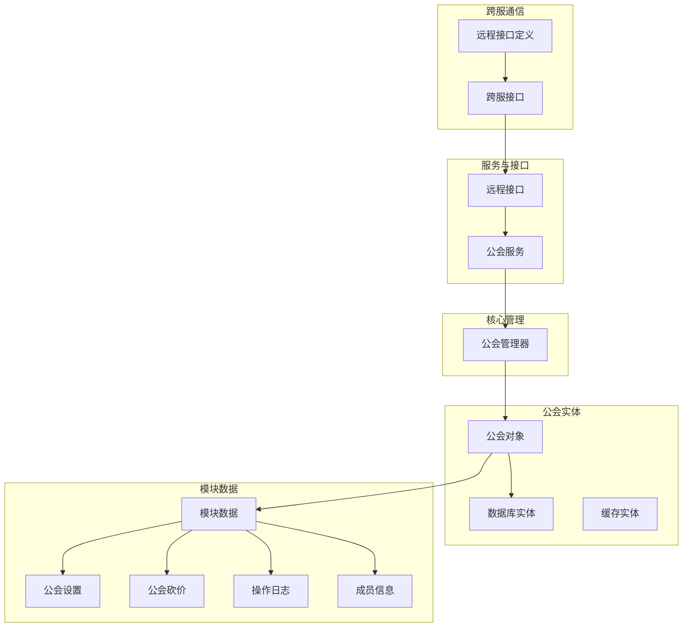
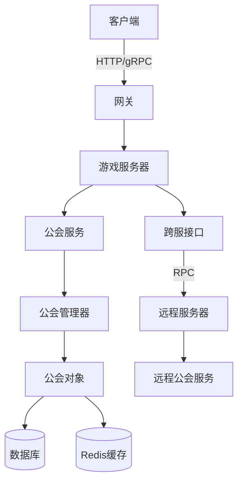
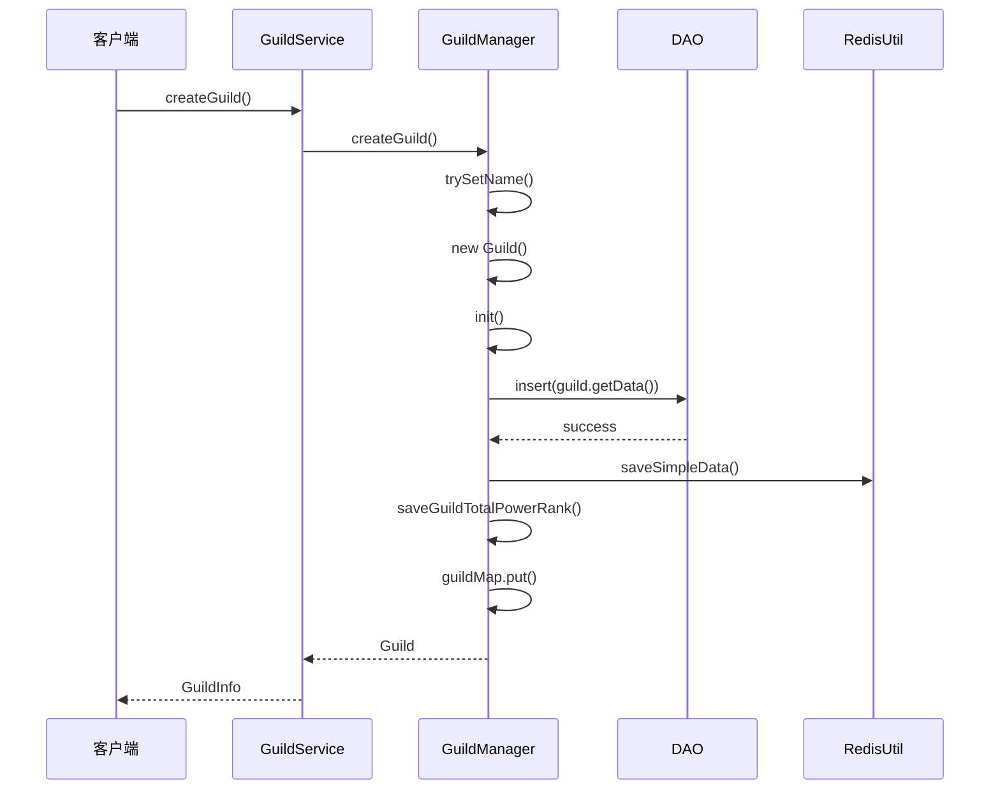
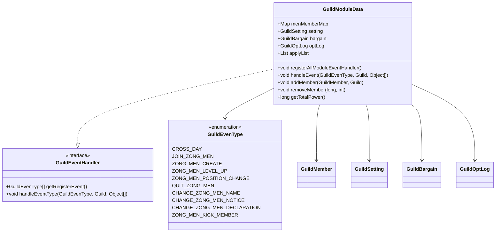
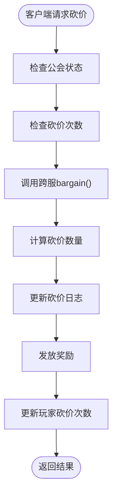
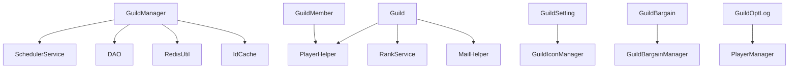

# 公会系统

<cite>
**本文档引用文件**  
- [GuildManager.java](file://game\src\main\java\cn\game\games\net\cross\guild\GuildManager.java)
- [GuildModuleData.java](file://game\src\main\java\cn\game\games\net\cross\guild\GuildModuleData.java)
- [GuildData.java](file://game\src\main\java\cn\game\games\cache\entity\GuildData.java)
- [Guild.java](file://game\src\main\java\cn\game\games\net\cross\guild\Guild.java)
- [GuildService.java](file://game\src\main\java\cn\game\games\net\cross\guild\service\GuildService.java)
- [GuildServiceInterface.java](file://game\src\main\java\cn\game\games\net\cross\guild\service\GuildServiceInterface.java)
- [GuildBargain.java](file://game\src\main\java\cn\game\games\net\cross\guild\GuildBargain.java)
- [GuildSetting.java](file://game\src\main\java\cn\game\games\net\cross\guild\GuildSetting.java)
- [GuildMember.java](file://game\src\main\java\cn\game\games\net\cross\guild\GuildMember.java)
- [GuildOptLog.java](file://game\src\main\java\cn\game\games\net\cross\guild\GuildOptLog.java)
- [GuildConstants.java](file://game\src\main\java\cn\game\games\net\cross\guild\GuildConstants.java)
- [CrossServerInterface.java](file://game\src\main\java\cn\game\games\net\cross\remote\CrossServerInterface.java)
- [RemoteCrossServerInterface.java](file://core\src\main\java\cn\game\core\net\remote\RemoteCrossServerInterface.java)
- [GuildDataMapper.xml](file://game\src\main\resources\mapping\GuildDataMapper.xml)
</cite>

## 目录
1. [引言](#引言)
2. [项目结构](#项目结构)
3. [核心组件](#核心组件)
4. [架构概述](#架构概述)
5. [详细组件分析](#详细组件分析)
6. [依赖分析](#依赖分析)
7. [性能考虑](#性能考虑)
8. [故障排除指南](#故障排除指南)
9. [结论](#结论)

## 引言
公会系统是游戏核心社交功能之一，支持跨服公会管理、成员权限控制、公会商店、公会战等复杂功能。本系统采用分布式架构，通过Redis缓存、数据库持久化、事件驱动机制和跨服通信实现高可用性和一致性保障。系统以`GuildManager`为核心管理器，协调`Guild`、`GuildModuleData`、`GuildData`等实体，实现公会的创建、升级、成员管理、日志记录等功能。同时，通过`CrossServerInterface`实现跨服交互，确保多服务器环境下公会数据的一致性。

## 项目结构
公会系统主要位于`game/src/main/java/cn/game/games/net/cross/guild`目录下，包含核心管理类、数据实体、服务接口和跨服交互组件。系统采用分层设计，将数据存储、业务逻辑、网络通信分离，便于维护和扩展。

**图源**  
- [GuildManager.java](file://game\src\main\java\cn\game\games\net\cross\guild\GuildManager.java)
- [Guild.java](file://game\src\main\java\cn\game\games\net\cross\guild\Guild.java)
- [GuildModuleData.java](file://game\src\main\java\cn\game\games\net\cross\guild\GuildModuleData.java)
- [GuildService.java](file://game\src\main\java\cn\game\games\net\cross\guild\service\GuildService.java)
- [CrossServerInterface.java](file://game\src\main\java\cn\game\games\net\cross\remote\CrossServerInterface.java)

## 核心组件

公会系统的核心组件包括`GuildManager`（公会管理器）、`Guild`（公会对象）、`GuildModuleData`（模块数据）和`GuildData`（数据库实体）。`GuildManager`负责全局公会的生命周期管理，包括创建、加载和定时保存。`Guild`封装了公会的所有状态和行为，是系统运行时的核心实体。`GuildModuleData`聚合了公会的各种功能模块，如设置、砍价、日志等。`GuildData`是与数据库表`t_guild`映射的持久化实体，通过MyBatis进行数据存取。

**组件源**  
- [GuildManager.java](file://game\src\main\java\cn\game\games\net\cross\guild\GuildManager.java)
- [Guild.java](file://game\src\main\java\cn\game\games\net\cross\guild\Guild.java)
- [GuildModuleData.java](file://game\src\main\java\cn\game\games\net\cross\guild\GuildModuleData.java)
- [GuildData.java](file://game\src\main\java\cn\game\games\cache\entity\GuildData.java)

## 架构概述

公会系统采用分布式微服务架构，通过事件驱动和异步处理实现高性能和高可用性。系统核心是`GuildManager`，它在服务器启动时初始化，负责加载所有公会数据到内存，并启动定时任务定期将数据持久化到数据库。公会数据在内存中以`Guild`对象形式存在，包含`GuildData`（数据库数据）和`GuildModuleData`（模块数据）两部分。`GuildModuleData`通过JSON序列化存储在数据库的`modules`字段中，实现了灵活的模块扩展。

跨服交互通过`CrossServerInterface`实现，该接口继承自`RemoteCrossServerInterface`，定义了公会相关的远程调用方法。当需要跨服操作时，客户端通过`GameServer`获取目标服务器的代理接口，进行RPC调用。系统使用Redis作为缓存层，存储`SimpleGuild`（公会简介）和`playerId-guildId`映射，加速公会信息查询。

**图源**  
- [GuildManager.java](file://game\src\main\java\cn\game\games\net\cross\guild\GuildManager.java)
- [GuildService.java](file://game\src\main\java\cn\game\games\net\cross\guild\service\GuildService.java)
- [CrossServerInterface.java](file://game\src\main\java\cn\game\games\net\cross\remote\CrossServerInterface.java)
- [GuildDataMapper.xml](file://game\src\main\resources\mapping\GuildDataMapper.xml)

## 详细组件分析

### GuildManager 分析
`GuildManager`是公会系统的全局单例管理器，负责所有公会的生命周期管理。它在`init()`方法中启动两个定时任务：一个每30秒调用`saveAllGuildData()`，将内存中修改过的公会数据批量保存到数据库；另一个每秒检查是否跨天，触发`CROSS_DAY`事件。

公会数据加载通过`loadGuildList()`方法完成，该方法从数据库批量加载`GuildData`列表，为每个数据创建`Guild`对象并放入`guildMap`缓存。`createGuild()`方法处理公会创建逻辑，包括名称唯一性检查、ID生成、对象初始化和数据库插入。`saveAllGuildData()`方法采用异步并行处理，对每个需要保存的公会，同时执行数据库更新、排行榜更新和Redis缓存更新，最后通过`Future.join()`等待所有操作完成，确保数据一致性。

**图源**  
- [GuildManager.java](file://game\src\main\java\cn\game\games\net\cross\guild\GuildManager.java)
- [GuildService.java](file://game\src\main\java\cn\game\games\net\cross\guild\service\GuildService.java)

### GuildModuleData 分析
`GuildModuleData`是公会功能模块的聚合类，实现了`GuildEventHandler`接口，采用事件驱动架构。它包含`menMemberMap`（成员列表）、`setting`（设置）、`bargain`（砍价）、`optLog`（日志）等模块。`registerAllModuleEventHandler()`方法将所有模块的事件处理器注册到`eventTypeHandleMaps`中，形成事件分发机制。

当`Guild`对象收到事件（如`CROSS_DAY`）时，会调用`module.handleEvent()`，该方法遍历对应事件类型的所有处理器并执行。例如，`CROSS_DAY`事件会重置成员的每日贡献度和公会活跃度。`addMember()`和`removeMember()`方法负责成员的增删，并触发相应的事件。`getTotalPower()`方法计算公会总战力，用于排行榜更新。

**图源**  
- [GuildModuleData.java](file://game\src\main\java\cn\game\games\net\cross\guild\GuildModuleData.java)
- [GuildConstants.java](file://game\src\main\java\cn\game\games\net\cross\guild\GuildConstants.java)
- [GuildMember.java](file://game\src\main\java\cn\game\games\net\cross\guild\GuildMember.java)

### GuildData 分析
`GuildData`是与数据库表`t_guild`直接映射的JPA实体类，实现了`DbEntity`接口。它包含公会的基本信息，如`id`、`name`、`lv`、`icon`、`notice`、`notification`、`exp`、`serverId`和`modules`。其中`modules`字段是关键，它以JSON字符串形式存储`GuildModuleData`的序列化数据，实现了模块数据的灵活扩展而无需修改数据库表结构。

`GuildDataMapper`是MyBatis的Mapper接口，定义了对`t_guild`表的CRUD操作，包括`insert`、`updateByPrimaryKey`、`selectByPrimaryKey`等。系统通过`DAO`工具类调用这些Mapper方法，实现数据持久化。`updateColumnsByPrimaryKey`方法支持动态更新指定字段，提高了数据库操作的灵活性。

**组件源**  
- [GuildData.java](file://game\src\main\java\cn\game\games\cache\entity\GuildData.java)
- [GuildDataMapper.java](file://game\src\main\java\cn\game\games\net\data\mapper\GuildDataMapper.java)
- [GuildDataMapper.xml](file://game\src\main\resources\mapping\GuildDataMapper.xml)

### 公会跨服交互分析
公会跨服交互通过`CrossServerInterface`实现，该接口继承自`RemoteCrossServerInterface`，定义了公会相关的远程调用方法。`GameServer`类提供了`getCrossServerInterface()`方法，根据目标服务器ID和对象类型获取远程代理。系统使用`RpcFactory`和`ServerHelper`创建RPC代理，实现跨服通信。

消息传递采用Protobuf序列化，确保高效和兼容性。异常处理通过`Future`的`onFailure`回调实现，当RPC调用失败时，系统会记录错误日志并返回适当的错误码给客户端。`getAllCrossServerInterface()`方法可用于广播消息到所有服务器。

**组件源**  
- [CrossServerInterface.java](file://game\src\main\java\cn\game\games\net\cross\remote\CrossServerInterface.java)
- [RemoteCrossServerInterface.java](file://core\src\main\java\cn\game\core\net\remote\RemoteCrossServerInterface.java)
- [GameServer.java](file://game\src\main\java\cn\game\games\net\game\GameServer.java)

### 公会战与商店功能分析
公会战和公会商店功能集成在`GuildBargain`模块中。`GuildBargain`实现了`GuildEventHandler`，在`CROSS_DAY`事件时刷新砍价物品。`performBargain()`方法执行砍价逻辑，根据配置的砍价区间和随机算法计算砍价数量，并记录到`bargainLogMap`中。

`GuildServiceInterface`定义了`bargain()`和`getBargainPrice()`远程方法，供客户端调用。`GuildHandler`在收到客户端请求后，通过`ServerHelper.getGuildProxy()`获取跨服代理，调用远程服务。性能瓶颈主要在于高并发下的Redis竞争和数据库写入，系统通过批量保存和异步处理缓解压力。高可用性通过Redis集群和数据库主从复制保障。

**图源**  
- [GuildBargain.java](file://game\src\main\java\cn\game\games\net\cross\guild\GuildBargain.java)
- [GuildServiceInterface.java](file://game\src\main\java\cn\game\games\net\cross\guild\service\GuildServiceInterface.java)
- [GuildHandler.java](file://game\src\main\java\cn\game\games\net\game\module\guild\GuildHandler.java)

## 依赖分析

公会系统依赖于核心框架的`SchedulerService`（定时任务）、`DAO`（数据访问）、`RedisUtil`（Redis操作）和`IdCache`（分布式ID管理）。业务上依赖`PlayerHelper`获取玩家信息，`RankService`维护排行榜，`MailHelper`发送邮件。配置管理依赖`GuildBasicManager`、`GuildPermissionsManager`等配置加载器。

**图源**  
- [GuildManager.java](file://game\src\main\java\cn\game\games\net\cross\guild\GuildManager.java)
- [Guild.java](file://game\src\main\java\cn\game\games\net\cross\guild\Guild.java)
- [GuildSetting.java](file://game\src\main\java\cn\game\games\net\cross\guild\GuildSetting.java)
- [GuildBargain.java](file://game\src\main\java\cn\game\games\net\cross\guild\GuildBargain.java)

## 性能考虑
公会系统的性能关键点在于数据一致性与高并发处理。系统通过以下措施保障性能：
1. **批量持久化**：`saveAllGuildData()`每30秒批量保存所有修改过的公会，减少数据库I/O。
2. **异步操作**：数据库更新、Redis操作均采用异步非阻塞方式，避免阻塞主线程。
3. **缓存优化**：使用`SimpleGuild`缓存公会简介，减少数据库查询。
4. **事件驱动**：采用事件机制解耦业务逻辑，提高代码可维护性。
5. **连接池**：数据库和Redis使用连接池，复用连接资源。

潜在瓶颈包括跨服通信延迟和高并发下的锁竞争。建议监控`saveAllGuildData()`的执行时间和`Future.join()`的等待时间，优化数据库索引和Redis分片策略。

## 故障排除指南
常见问题及解决方案：
- **公会创建失败**：检查名称是否重复（`trySetName`返回false），或数据库插入异常。
- **成员无法加入**：检查公会是否已满（`isFull()`），或申请列表已满（`isApplyFull()`）。
- **数据不一致**：检查`saveAllGuildData()`是否正常执行，或Redis与数据库数据是否同步。
- **跨服调用失败**：检查目标服务器是否在线，RPC配置是否正确。
- **性能下降**：监控定时任务执行时间，检查数据库慢查询日志。

日志关键点：`GuildManager`的`saveAllGuildData()`日志、`DAO`的SQL执行日志、`RedisUtil`的异常日志。

**组件源**  
- [GuildManager.java](file://game\src\main\java\cn\game\games\net\cross\guild\GuildManager.java)
- [Guild.java](file://game\src\main\java\cn\game\games\net\cross\guild\Guild.java)
- [DAO.java](file://game\src\main\java\cn\game\games\util\DAO.java)

## 结论
公会系统通过`GuildManager`统一管理，采用内存+数据库+Redis的三级存储架构，实现了高性能和高可用性。事件驱动的设计使功能模块高度解耦，易于扩展。跨服通信通过标准化的`CrossServerInterface`实现，确保了分布式环境下的一致性。系统在公会创建、成员管理、权限控制、日志记录等方面功能完备，公会战和商店功能集成良好。未来可优化方向包括引入更精细的缓存策略、优化跨服通信协议和增强监控告警能力。