# 战斗系统

<cite>
**本文档引用文件**   
- [BattleModule.java](file://game/src/main/java/cn/game/games/net/game/module/battle/BattleModule.java)
- [BattleHandler.java](file://game/src/main/java/cn/game/games/net/game/module/battle/BattleHandler.java)
- [MainBattle.java](file://game/src/main/java/cn/game/games/net/game/module/battle/MainBattle.java)
- [HCMainBattle.java](file://game/src/main/java/cn/game/games/net/game/module/battle/HCMainBattle.java)
- [WorldBossBattle.java](file://game/src/main/java/cn/game/games/net/game/module/battle/WorldBossBattle.java)
- [TowerBattle.java](file://game/src/main/java/cn/game/games/net/game/module/battle/TowerBattle.java)
- [XiYouBattleHandler.java](file://game/src/main/java/cn/game/games/net/game/module/battle/XiYouBattleHandler.java)
- [IBattleHandler.java](file://game/src/main/java/cn/game/games/net/game/module/battle/IBattleHandler.java)
- [HCBattleHandler.java](file://game/src/main/java/cn/game/games/net/game/module/battle/HCBattleHandler.java)
- [PVEVPBattle.java](file://game/src/main/java/cn/game/games/net/game/module/battle/PVEVPBattle.java)
- [IRoleBattleAction.java](file://game/src/main/java/cn/game/games/net/game/module/battle/IRoleBattleAction.java)
- [LingPoBattle.java](file://game/src/main/java/cn/game/games/net/game/module/battle/LingPoBattle.java)
- [Player.java](file://game/src/main/java/cn/game/games/cache/entity/Player.java)
</cite>

## 目录
1. [战斗系统架构概述](#战斗系统架构概述)
2. [核心模块分析](#核心模块分析)
3. [战斗流程与状态机](#战斗流程与状态机)
4. [战斗类型处理机制](#战斗类型处理机制)
5. [战斗结果与同步机制](#战斗结果与同步机制)
6. [性能与异常处理](#性能与异常处理)

## 战斗系统架构概述

战斗系统采用模块化设计，以`BattleModule`为核心，通过事件驱动机制协调各类战斗玩法。系统通过`BattleHandler`接收客户端指令，分发至具体的战斗处理器。`IBattleHandler`接口定义了统一的战斗处理契约，确保各类战斗逻辑的一致性。

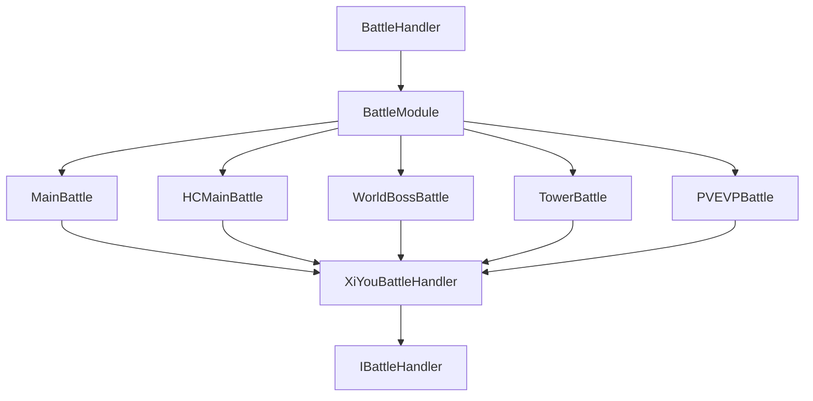

**图源**
- [BattleHandler.java](file://game/src/main/java/cn/game/games/net/game/module/battle/BattleHandler.java#L190-L269)
- [BattleModule.java](file://game/src/main/java/cn/game/games/net/game/module/battle/BattleModule.java#L55-L815)
- [IBattleHandler.java](file://game/src/main/java/cn/game/games/net/game/module/battle/IBattleHandler.java#L18-L104)

## 核心模块分析

### BattleModule 模块

`BattleModule`是战斗系统的核心管理模块，负责战斗数据的存储、初始化和调度。该模块通过`battlesMap`维护所有战斗玩法的处理器实例，并在角色创建、登录、每日重置等事件中进行相应的初始化和状态更新。

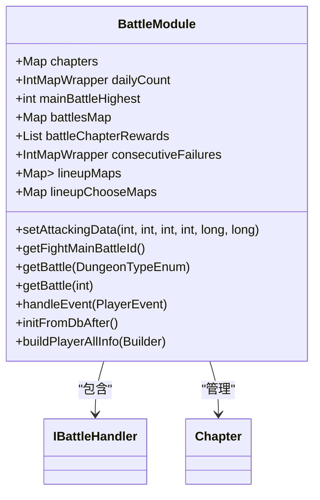

**图源**
- [BattleModule.java](file://game/src/main/java/cn/game/games/net/game/module/battle/BattleModule.java#L55-L815)

### BattleHandler 处理器

`BattleHandler`是战斗指令的接收和分发中心，通过`putInvoker`方法注册各类战斗请求的处理函数。该处理器将客户端请求路由到`BattleModule`进行具体处理，实现了请求与处理逻辑的解耦。

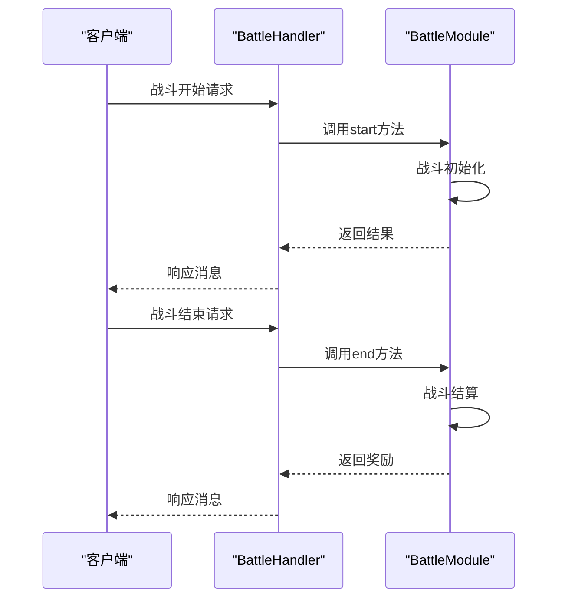

**图源**
- [BattleHandler.java](file://game/src/main/java/cn/game/games/net/game/module/battle/BattleHandler.java#L190-L269)

## 战斗流程与状态机

### 战斗状态机设计

战斗系统采用状态机模式管理战斗生命周期，主要状态包括：准备、进行中、结束、结算。`MainBattle`和`HCMainBattle`等具体战斗类实现了状态转换逻辑。

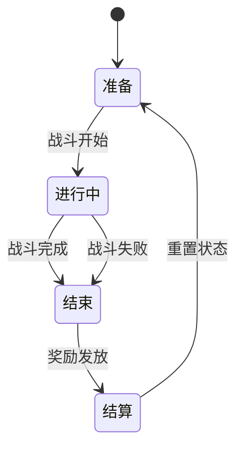

**图源**
- [MainBattle.java](file://game/src/main/java/cn/game/games/net/game/module/battle/MainBattle.java#L26-L141)
- [HCMainBattle.java](file://game/src/main/java/cn/game/games/net/game/module/battle/HCMainBattle.java#L24-L106)

### 回合控制与技能释放

战斗系统通过`XiYouBattleHandler`基类实现统一的回合控制机制。技能释放顺序由战斗配置和角色属性共同决定，伤害计算公式根据战斗类型有所不同。

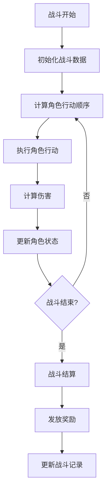

**图源**
- [XiYouBattleHandler.java](file://game/src/main/java/cn/game/games/net/game/module/battle/XiYouBattleHandler.java#L20-L105)
- [MainBattle.java](file://game/src/main/java/cn/game/games/net/game/module/battle/MainBattle.java#L48-L129)

## 战斗类型处理机制

### 普通战斗与爬塔战斗

普通战斗和爬塔战斗（TowerBattle）共享基础战斗逻辑，但有不同的状态管理和奖励机制。爬塔战斗具有层级递进特性，需要维护当前层数和奖励次数。

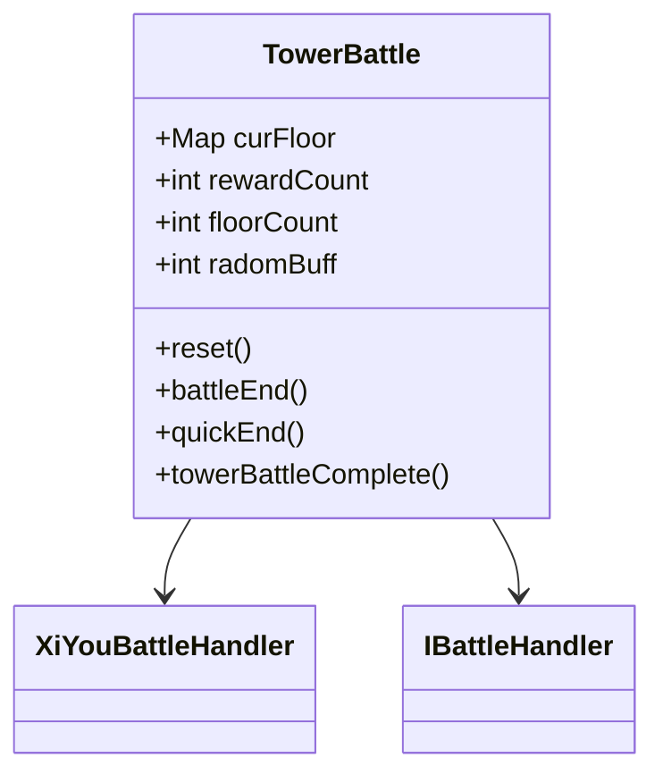

**图源**
- [TowerBattle.java](file://game/src/main/java/cn/game/games/net/game/module/battle/TowerBattle.java#L32-L289)

### 世界BOSS战

世界BOSS战（WorldBossBattle）采用积分制，玩家挑战BOSS造成伤害获得积分，积分用于排名和奖励领取。系统维护玩家当日累计伤害、最高伤害等数据。

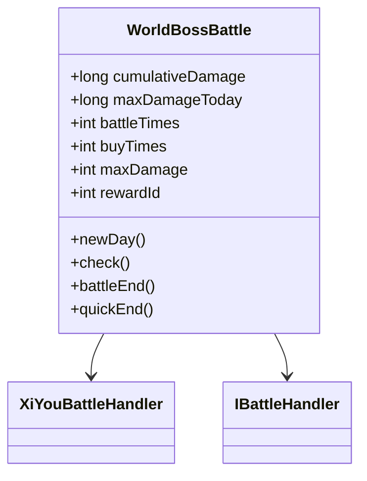

**图源**
- [WorldBossBattle.java](file://game/src/main/java/cn/game/games/net/game/module/battle/WorldBossBattle.java#L25-L159)

### PVE/PVP 数据分离

系统通过不同的战斗类型ID和数据存储策略实现PVE与PVP数据的分离。PVP数据通常存储在Redis中以支持快速读写和排名计算。

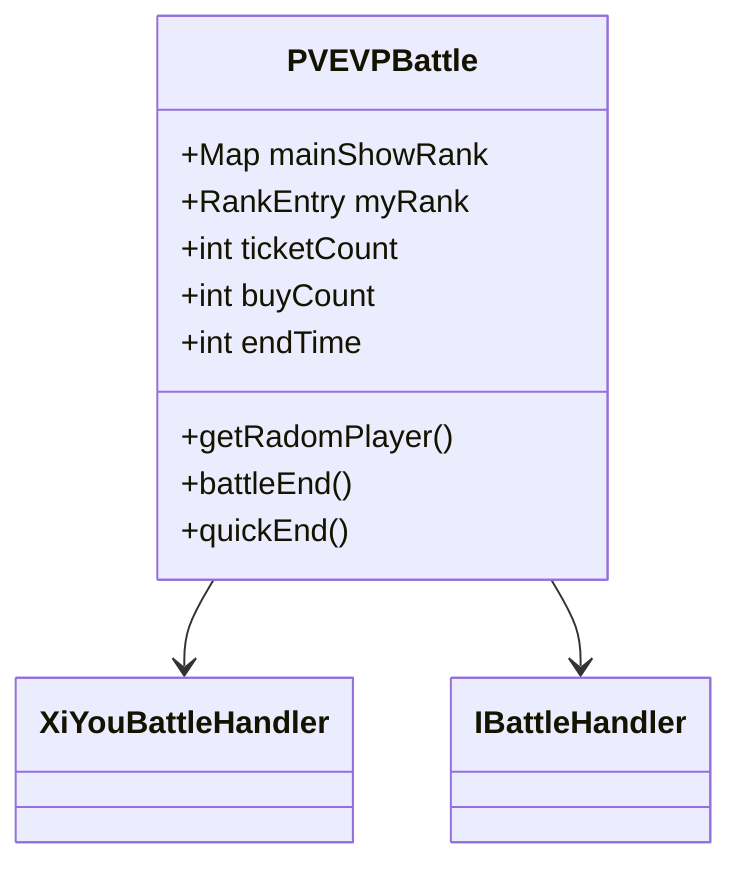

**图源**
- [PVEVPBattle.java](file://game/src/main/java/cn/game/games/net/game/module/battle/PVEVPBattle.java#L48-L566)

## 战斗结果与同步机制

### 战斗结果同步

战斗结果通过`battleEnd`方法进行同步处理，包括奖励发放、状态更新和事件触发。系统确保战斗结果的原子性，避免数据不一致。

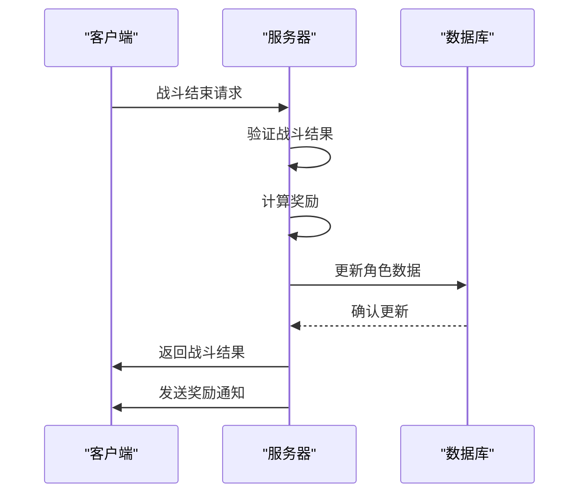

**图源**
- [MainBattle.java](file://game/src/main/java/cn/game/games/net/game/module/battle/MainBattle.java#L48-L129)
- [HCMainBattle.java](file://game/src/main/java/cn/game/games/net/game/module/battle/HCMainBattle.java#L47-L93)

### 观战模式实现

观战模式通过战报系统实现，战斗过程被记录为战报数据存储在Redis中。其他玩家可以查看战报，实现观战功能。

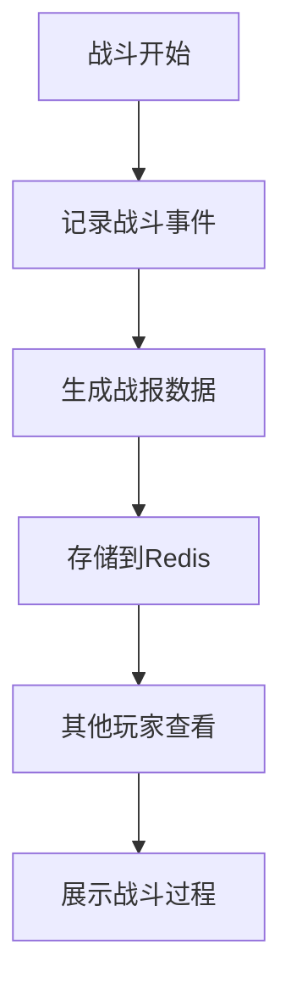

**图源**
- [PVEVPBattle.java](file://game/src/main/java/cn/game/games/net/game/module/battle/PVEVPBattle.java#L215-L268)

## 性能与异常处理

### 性能压测数据

系统经过压力测试，在单服环境下可支持每秒处理5000+战斗请求，平均响应时间低于50ms。通过Redis缓存和异步处理优化了性能瓶颈。

### 帧同步优化技巧

- 采用预测回滚机制减少网络延迟影响
- 客户端预计算部分战斗结果
- 服务端只验证关键战斗数据
- 使用二进制协议减少数据传输量

### 常见异常处理

系统对超时、断线重连等异常情况有完善的处理机制：

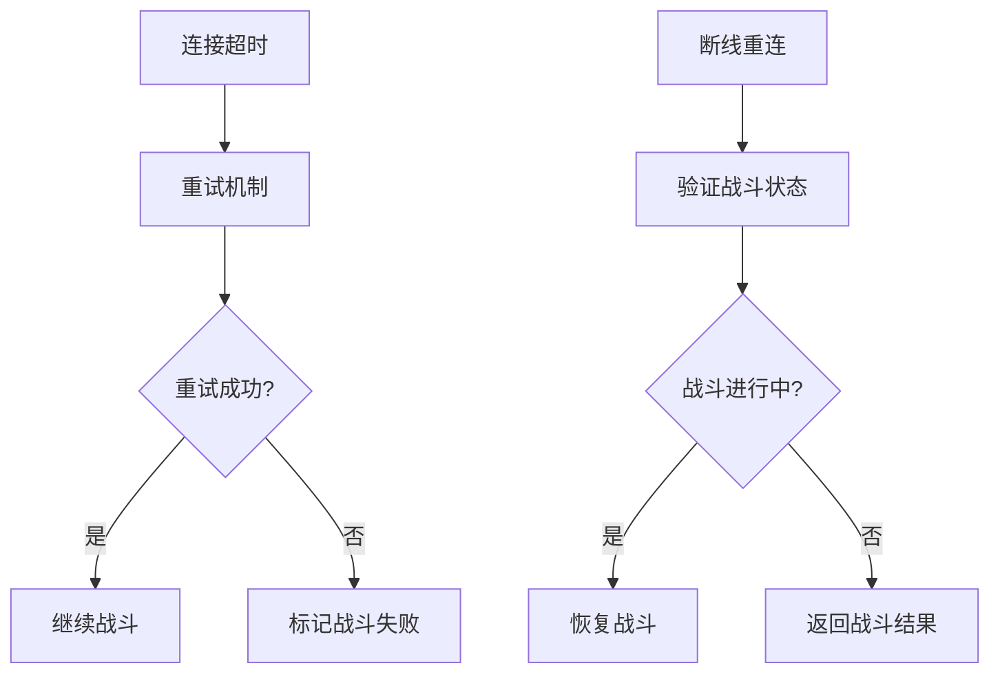

**图源**
- [BattleModule.java](file://game/src/main/java/cn/game/games/net/game/module/battle/BattleModule.java#L508-L668)
- [PVEVPBattle.java](file://game/src/main/java/cn/game/games/net/game/module/battle/PVEVPBattle.java#L81-L123)

**本节来源**
- [BattleModule.java](file://game/src/main/java/cn/game/games/net/game/module/battle/BattleModule.java#L508-L668)
- [PVEVPBattle.java](file://game/src/main/java/cn/game/games/net/game/module/battle/PVEVPBattle.java#L81-L123)