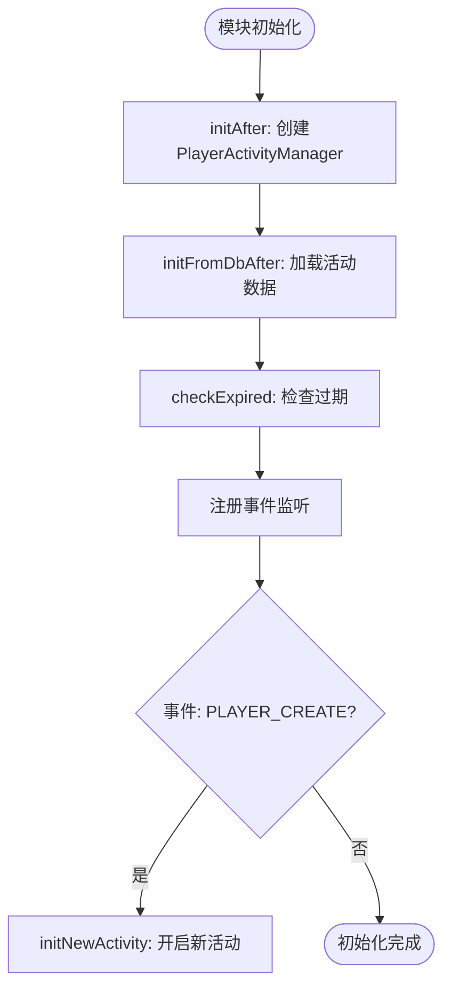
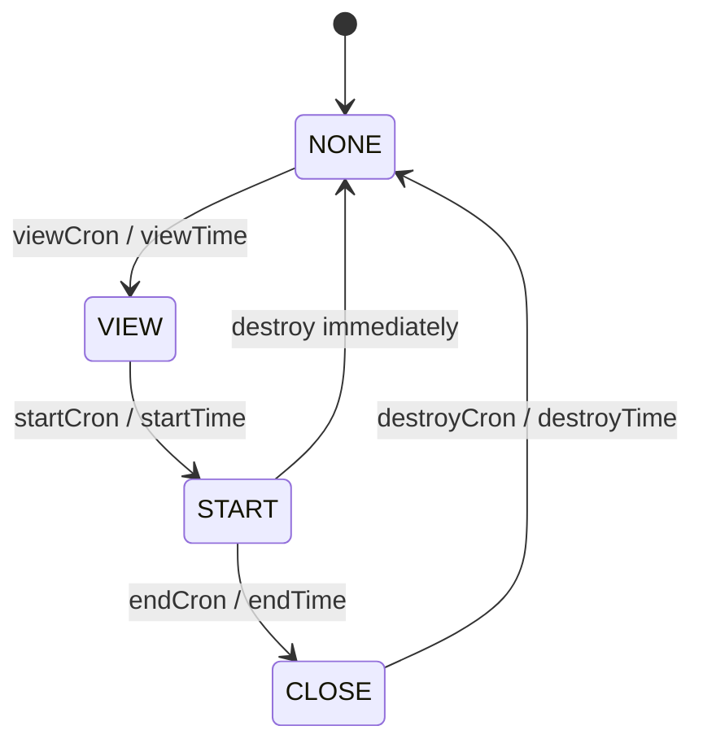
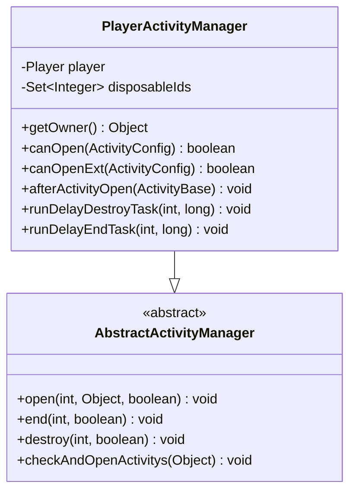
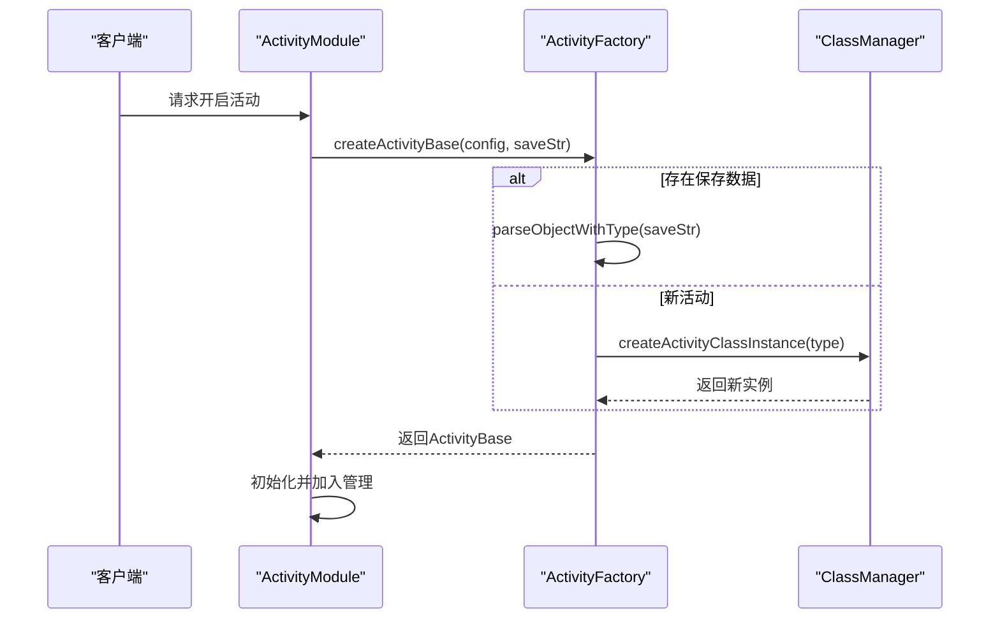

# 活动系统

<cite>
**本文档引用的文件**  
- [ActivityModule.java](file://game\src\main\java\cn\game\games\net\game\module\activity\ActivityModule.java)
- [PlayerActivityManager.java](file://game\src\main\java\cn\game\games\net\game\module\activity\PlayerActivityManager.java)
- [ActivityFactory.java](file://game\src\main\java\cn\game\games\net\game\module\activity\ActivityFactory.java)
- [ActivityStateManager.java](file://game\src\main\java\cn\game\games\net\game\manager\ActivityStateManager.java)
- [Activity.xml](file://game\src\main\resources\xml\Activity.xml)
- [ActivityType.java](file://game\src\main\java\cn\game\games\net\game\module\activity\ActivityType.java)
- [ClassManager.java](file://game\src\main\java\cn\game\games\core\clazz\ClassManager.java)
- [AbstractActivityManager.java](file://game\src\main\java\cn\game\games\net\common\module\activity\AbstractActivityManager.java)
- [GameActivityService.java](file://game\src\main\java\cn\game\games\net\common\module\activity\GameActivityService.java)
</cite>

## 目录
1. [简介](#简介)
2. [核心组件](#核心组件)
3. [活动模块初始化流程](#活动模块初始化流程)
4. [活动状态机与定时任务调度](#活动状态机与定时任务调度)
5. [玩家活动进度管理](#玩家活动进度管理)
6. [活动配置解析机制](#活动配置解析机制)
7. [活动工厂与扩展机制](#活动工厂与扩展机制)
8. [热更新与版本兼容性](#热更新与版本兼容性)
9. [调试工具与测试方案](#调试工具与测试方案)
10. [高峰期流量削峰策略](#高峰期流量削峰策略)

## 简介
本系统为游戏服务端的活动管理系统，负责动态配置与运行时管理各类运营活动。系统以 `ActivityModule` 为核心，结合 `PlayerActivityManager` 实现玩家个人活动状态的管理，通过 `ActivityStateManager` 统一控制全局活动的生命周期。活动类型由 `ActivityType` 注解定义，并通过 `ActivityFactory` 工厂模式实现灵活扩展。配置文件 `Activity.xml` 定义了所有活动的触发条件、时间规则和奖励机制，支持基于 Cron 表达式和相对时间的复杂调度逻辑。

## 核心组件

活动系统由多个核心类协同工作，形成完整的活动管理闭环。`ActivityModule` 作为玩家模块的入口，封装了活动的开启、关闭、重置等操作；`PlayerActivityManager` 负责管理单个玩家的活动数据和状态；`ActivityFactory` 根据配置动态创建具体活动实例；`ActivityStateManager` 统一维护服务器级活动的状态流转；`ActivityType` 注解用于标记具体活动类的类型，实现类型绑定。

**本节引用文件**  
- [ActivityModule.java](file://game\src\main\java\cn\game\games\net\game\module\activity\ActivityModule.java#L23-L227)
- [PlayerActivityManager.java](file://game\src\main\java\cn\game\games\net\game\module\activity\PlayerActivityManager.java#L12-L102)
- [ActivityFactory.java](file://game\src\main\java\cn\game\games\net\game\module\activity\ActivityFactory.java#L10-L28)
- [ActivityType.java](file://game\src\main\java\cn\game\games\net\game\module\activity\ActivityType.java#L1-L14)

## 活动模块初始化流程

`ActivityModule` 在玩家登录后完成初始化。其 `initAfter` 方法中创建 `PlayerActivityManager` 实例并绑定玩家对象。`initFromDbAfter` 方法从数据库加载已存在的活动数据，并调用 `checkExpired` 检查过期状态。当玩家创建角色时，系统会触发 `PLAYER_CREATE` 事件，`ActivityModule` 监听到该事件后调用 `initNewActivity` 方法，根据配置自动开启 `OPENTYPE_PLAYER_CREATE` 类型的活动。

**图示来源**  
- [ActivityModule.java](file://game\src\main\java\cn\game\games\net\game\module\activity\ActivityModule.java#L44-L92)

**本节引用文件**  
- [ActivityModule.java](file://game\src\main\java\cn\game\games\net\game\module\activity\ActivityModule.java#L44-L92)

## 活动状态机与定时任务调度

活动状态由 `ActivityStateManager` 统一管理，支持四种状态：`NONE`（无）、`VIEW`（可见）、`START`（开启）、`CLOSE`（关闭）。系统在启动时遍历所有活动配置，根据 `viewCron`、`startCron`、`endCron`、`destroyCron` 等字段注册定时任务。对于非 Cron 配置，则使用 `SchedulerService` 按固定延迟或周期调度 `StartTask`、`EndTask`、`DestroyTask`。

当活动状态变更时，`ActivityStateManager` 会通过 `ServerEventBus` 发布 `ActivityOpenTime`、`ActivityShutDownTime`、`ActivityDestoryTime` 等事件，通知 `GameActivityService` 进行全局处理。

**图示来源**  
- [ActivityStateManager.java](file://game\src\main\java\cn\game\games\net\game\manager\ActivityStateManager.java#L54-L522)

**本节引用文件**  
- [ActivityStateManager.java](file://game\src\main\java\cn\game\games\net\game\manager\ActivityStateManager.java#L54-L522)
- [GameActivityService.java](file://game\src\main\java\cn\game\games\net\common\module\activity\GameActivityService.java#L98-L112)

## 玩家活动进度管理

`PlayerActivityManager` 继承自 `AbstractActivityManager`，负责管理玩家个人的活动进度。它通过 `disposableIds` 集合记录已开启过的一次性活动，防止重复开启。`canOpen` 方法根据活动配置的 `resetType` 和玩家状态判断是否可开启。`canOpenExt` 方法实现了基于玩家等级、VIP等级、创建天数等条件的开启逻辑。

活动奖励领取状态通过具体活动实现类（如 `FundPassSignActivity`）中的字段（如 `finish`、`reward`）维护。红点提示更新通过 `syncActivityInfo` 方法推送 `ActivityStatePush_11100006` 协议至客户端。

**图示来源**  
- [PlayerActivityManager.java](file://game\src\main\java\cn\game\games\net\game\module\activity\PlayerActivityManager.java#L12-L102)

**本节引用文件**  
- [PlayerActivityManager.java](file://game\src\main\java\cn\game\games\net\game\module\activity\PlayerActivityManager.java#L12-L102)
- [AbstractActivityManager.java](file://game\src\main\java\cn\game\games\net\common\module\activity\AbstractActivityManager.java#L315-L368)

## 活动配置解析机制

`Activity.xml` 文件定义了所有活动的静态配置。每个 `<Activity>` 节点包含 `ID`、`type`、`openType`、`resetType`、`startTime`、`endTime` 等属性。系统启动时由 `ActivityManager` 加载并解析该文件，生成 `ActivityConfig` 对象存入内存。

`openType` 决定活动开启条件，如 `PLAYER_CREATE`（角色创建）、`PLAYER_LEVEL`（达到指定等级）。`resetType` 控制重置逻辑，0 表示一次性，1 表示每日重置，2 表示每周重置，3 表示每月重置，4 表示周期性活动。时间字段支持 `Cron` 表达式和具体时间点两种格式，系统优先使用 `Cron` 进行调度。

**本节引用文件**  
- [Activity.xml](file://game\src\main\resources\xml\Activity.xml#L1-L160)

## 活动工厂与扩展机制

`ActivityFactory` 是活动实例的创建中心。`createActivityBase(ActivityConfig, String)` 方法根据配置和保存的 JSON 字符串创建活动实例。若 `saveString` 非空，则通过 `JsonUtil.parseObjectWithType` 反序列化恢复状态；否则调用 `createActivityBase(int)` 通过反射创建新实例。

`createActivityBase(int)` 方法委托给 `ClassManager.getInstance().createActivityClassInstance(type)`，后者通过注解扫描机制查找并实例化标记了 `@ActivityType` 的具体活动类。

**图示来源**  
- [ActivityFactory.java](file://game\src\main\java\cn\game\games\net\game\module\activity\ActivityFactory.java#L12-L25)
- [ClassManager.java](file://game\src\main\java\cn\game\games\core\clazz\ClassManager.java#L130-L143)

**本节引用文件**  
- [ActivityFactory.java](file://game\src\main\java\cn\game\games\net\game\module\activity\ActivityFactory.java#L12-L25)
- [ClassManager.java](file://game\src\main\java\cn\game\games\core\clazz\ClassManager.java#L130-L143)

## 热更新与版本兼容性

系统通过 `JsonUtil.parseObjectWithType` 支持活动数据的序列化与反序列化，允许在不重启服务的情况下更新活动逻辑。老版本数据兼容通过 `ActivityModule` 的 `initAfter` 方法实现，该方法会将旧的 `activities` 和 `disposableIds` 迁移到新的 `PlayerActivityManager` 中。

`ActivityStateManager` 在计算活动周期 `getPeriodPass` 时，会基于当前时间和活动开始时间动态计算偏移量，确保跨版本更新后时间逻辑正确。

**本节引用文件**  
- [ActivityModule.java](file://game\src\main\java\cn\game\games\net\game\module\activity\ActivityModule.java#L53-L58)
- [ActivityStateManager.java](file://game\src\main\java\cn\game\games\net\game\manager\ActivityStateManager.java#L298-L320)

## 调试工具与测试方案

系统提供了 `testGetOpenIds` 等测试方法用于验证活动状态逻辑。`SchedulerService` 提供了灵活的任务调度接口，便于在测试环境中模拟时间推进。通过 `ActivityStateManager` 的 `getShowState` 方法可以获取当前所有可见活动的状态，用于前端调试。

**本节引用文件**  
- [ActivityStateManager.java](file://game\src\main\java\cn\game\games\net\game\manager\ActivityStateManager.java#L605-L618)

## 高峰期流量削峰策略

活动开启时，系统通过 `ServerContext.getInstance().getProcessor().process` 将玩家操作放入异步处理器队列，避免瞬时大量请求导致服务器阻塞。对于跨服活动，使用 `VxHolder.sendRemoteServer` 进行异步消息推送，解耦服务间调用。

定时任务的调度使用 `SchedulerService` 的 `scheduleAtFixedRate` 和 `scheduleTask`，支持固定延迟执行，有效分散请求压力。`ActivityStateManager` 使用 `ConcurrentHashMap` 存储状态，保证高并发下的读写安全。

**本节引用文件**  
- [ActivityStateManager.java](file://game\src\main\java\cn\game\games\net\game\manager\ActivityStateManager.java#L447-L452)
- [PlayerActivityBase.java](file://game\src\main\java\cn\game\games\net\game\module\activity\PlayerActivityBase.java#L55-L58)