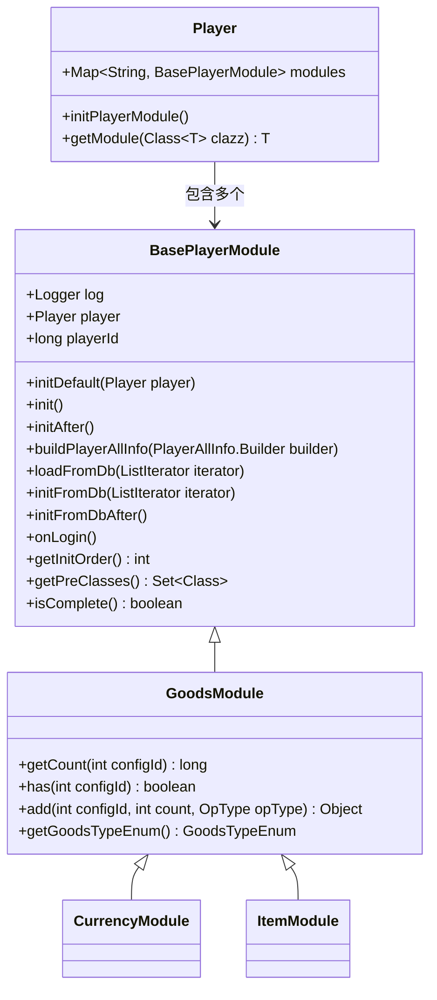
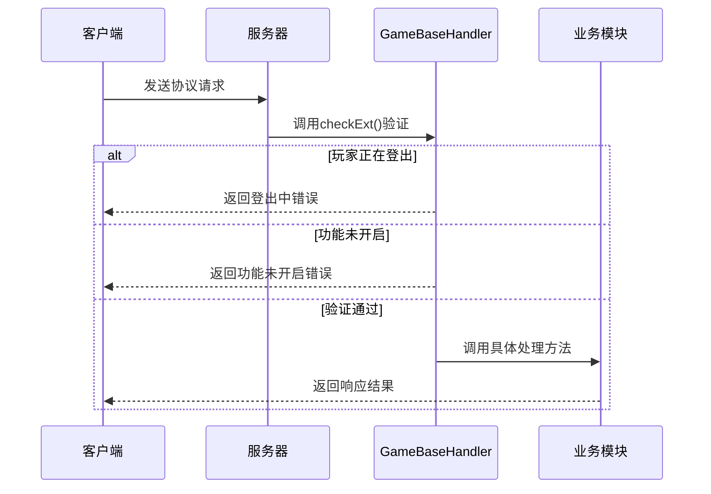
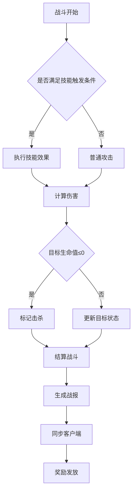
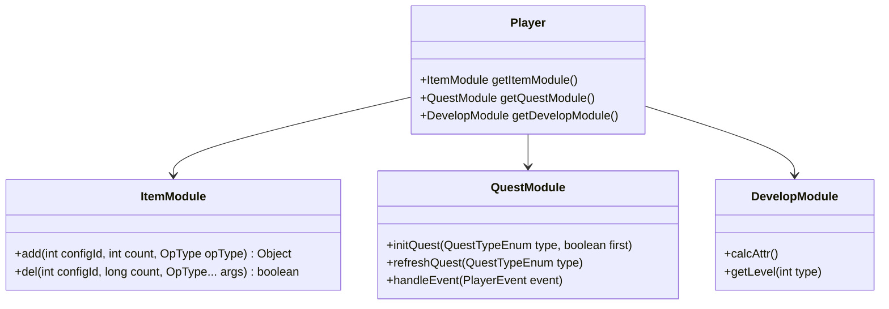
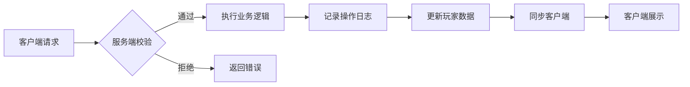

# 游戏逻辑

<cite>
**本文档引用的文件**  
- [BasePlayerModule.java](file://game/src/main/java/cn/game/games/core/BasePlayerModule.java)
- [GameBaseHandler.java](file://game/src/main/java/cn/game/games/net/game/handler/GameBaseHandler.java)
- [BattleModule.java](file://game/src/main/java/cn/game/games/net/game/module/battle/BattleModule.java)
- [Player.java](file://game/src/main/java/cn/game/games/cache/entity/Player.java)
- [PlayerManager.java](file://game/src/main/java/cn/game/games/net/game/manager/PlayerManager.java)
- [CurrencyModule.java](file://game/src/main/java/cn/game/games/net/game/module/currency/CurrencyModule.java)
- [GoodsModule.java](file://game/src/main/java/cn/game/games/core/GoodsModule.java)
- [ItemModule.java](file://game/src/main/java/cn/game/games/net/game/module/item/ItemModule.java)
- [QuestModule.java](file://game/src/main/java/cn/game/games/net/game/module/quest/QuestModule.java)
- [HeroSkill.xml](file://game/src/main/resources/xml/HeroSkill.xml)
</cite>

## 目录
1. [玩家模块初始化与状态管理](#玩家模块初始化与状态管理)
2. [客户端指令路由与业务逻辑分发](#客户端指令路由与业务逻辑分发)
3. [战斗系统实现细节](#战斗系统实现细节)
4. [核心玩法模块交互机制](#核心玩法模块交互机制)
5. [游戏内经济系统与防作弊设计](#游戏内经济系统与防作弊设计)
6. [关键算法与性能优化](#关键算法与性能优化)

## 玩家模块初始化与状态管理

游戏中的玩家模块以 `BasePlayerModule` 为基类，所有功能模块均继承该类并实现其抽象方法。`BasePlayerModule` 提供了统一的初始化流程、状态管理机制和数据库交互接口。

玩家对象 `Player` 在创建时会通过反射扫描所有 `BasePlayerModule` 的子类，并根据 `isComplete()` 方法判断模块是否完成开发，仅初始化已完成的模块。每个模块通过 `initDefault(Player player)` 方法进行初始化，该方法确保模块仅被初始化一次。

模块初始化顺序由 `getInitOrder()` 控制，数值越小优先级越高。同时支持通过 `getPreClasses()` 指定前置依赖模块，确保模块间初始化顺序正确。模块可通过 `getInitOrder()` 和 `getPreClasses()` 实现复杂的依赖关系管理。

玩家数据从数据库加载时，通过 `loadFromDb(ListIterator<?> iterator)` 统一加载，各模块通过 `initFromDb()` 和 `initFromDbAfter()` 分阶段完成数据初始化。其中 `initFromDb()` 负责从数据库加载原始数据，而 `initFromDbAfter()` 用于处理数据间的关联关系和状态校验。



**模块来源**
- [BasePlayerModule.java](file://game/src/main/java/cn/game/games/core/BasePlayerModule.java#L1-L217)
- [Player.java](file://game/src/main/java/cn/game/games/cache/entity/Player.java#L103-L401)

## 客户端指令路由与业务逻辑分发

游戏服务器通过 `GameBaseHandler` 实现客户端指令的统一处理和业务逻辑分发。所有业务处理器均继承 `GameBaseHandler`，并重写 `getInitialUI()` 方法标识其对应的功能模块。

`GameBaseHandler` 的 `checkExt()` 方法在每次收到客户端请求时执行，用于验证玩家状态和功能开启情况。该方法首先检查玩家是否正在登出，若正在登出则拒绝后续请求；然后通过 `player.isFuncOpen(getInitialUI())` 判断当前功能是否已对玩家开放，若未开放则返回“功能未开启”错误。

指令路由通过 `putInvoker()` 方法注册，将协议号与处理方法绑定。服务器接收到客户端请求后，根据协议号查找对应的处理方法并执行。这种设计实现了高内聚低耦合的模块化架构，每个功能模块独立处理自身业务逻辑，无需关心网络层细节。



**模块来源**
- [GameBaseHandler.java](file://game/src/main/java/cn/game/games/net/game/handler/GameBaseHandler.java#L1-L45)
- [ServerHandler.java](file://game/src/main/java/cn/game/games/net/game/handler/ServerHandler.java#L106-L123)

## 战斗系统实现细节

战斗系统以 `BattleModule` 为核心，管理所有战斗相关数据和逻辑。该模块实现了战斗状态机、伤害计算、技能释放和结果同步等核心功能。

### 战斗状态机

`BattleModule` 通过 `attackingType`、`attackingId`、`attackingSubId` 等字段维护当前战斗状态。战斗开始时设置攻击类型和目标，战斗结束后清零状态。系统通过 `isBattleStarted()` 方法判断当前是否有正在进行的战斗。

战斗事件通过事件系统驱动，`handleEvent()` 方法监听 `BattleStart` 和 `BattleEnd` 事件，在战斗开始时重置单次战斗限制（如复活次数），在战斗结束时更新连续失败次数统计。

### 伤害计算公式

伤害计算由 `Hurt` 类实现，支持三种伤害类型：绝对值、上限百分比和当前百分比。实际伤害值根据战斗配置和角色属性动态计算，公式如下：

```
最终伤害 = (基础伤害 + 攻击力 * 伤害系数) * (1 + 暴击伤害加成) - 防御力 * 防御减免系数
```

属性加成通过 `AttrEffectConfigManager` 配置，不同属性对战斗力的贡献度可配置化管理。

### 技能释放逻辑

技能数据存储在 `HeroSkill.xml` 配置文件中，包含技能ID、触发时机、效果组、条件参数等信息。技能释放时根据 `TriggerTiming` 字段判断触发时机，通过 `EccectGroup` 关联具体效果实现。

角色战斗行为由 `IRoleBattleAction` 接口定义，包括累计伤害、击杀统计、攻击次数等指标，用于战斗评价和成就系统。

### 结果同步机制

战斗结果通过协议推送至客户端，包含战斗结果、获得奖励、属性变化等信息。奖励发放通过 `RewardHelper` 统一处理，确保事务一致性。



**模块来源**
- [BattleModule.java](file://game/src/main/java/cn/game/games/net/game/module/battle/BattleModule.java#L1-L800)
- [Hurt.java](file://game/src/main/java/cn/game/games/net/game/module/battle/Hurt.java#L1-L58)
- [HeroSkill.xml](file://game/src/main/resources/xml/HeroSkill.xml#L2849-L3133)

## 核心玩法模块交互机制

游戏内各核心玩法模块通过事件系统实现松耦合交互。`PlayerEvent` 事件驱动各模块响应游戏状态变化。

### 物品系统

`ItemModule` 继承 `GoodsModule`，管理玩家所有可叠加物品。物品增减通过 `add()` 和 `del()` 方法操作，支持操作类型标记（`OpType`）。物品数据独立存储于数据库 `ItemMapper` 表中。

### 角色养成

角色养成由多个模块协同完成：
- `DevelopModule`：管理角色进阶、突破等成长系统
- `HeroModule`：管理英雄角色及其属性
- `CurrencyModule`：管理经验、等级等资源

属性计算通过 `PlayerAttrCalc` 抽象类实现，不同养成系统提供具体计算逻辑，最终由属性管理器统一汇总。

### 任务系统

`QuestModule` 管理所有任务逻辑，监听 `NewDay`、`NewWeek` 等时间事件自动刷新日常和周常任务。任务完成条件通过注解 `@ConditionType` 标识，如 `ReceiveStamina` 条件监听 `ReceiveStamina` 事件。

任务与奖励系统深度集成，任务完成时通过 `RewardHelper` 发放奖励，并触发 `QuestComplete` 事件通知其他模块。



**模块来源**
- [ItemModule.java](file://game/src/main/java/cn/game/games/net/game/module/item/ItemModule.java#L1-L40)
- [QuestModule.java](file://game/src/main/java/cn/game/games/net/game/module/quest/QuestModule.java#L763-L808)
- [DevelopModule.java](file://game/src/main/java/cn/game/games/net/game/module/develop/attr/PotentialAttrCalc.java#L1-L48)

## 游戏内经济系统与防作弊设计

### 货币流通规则

经济系统以 `CurrencyModule` 为核心，管理所有货币资源。系统采用 `MapWrapper` 存储货币数据，key为货币ID，value为持有数量。

货币类型在 `Asset` 枚举中定义，包含金币、钻石、体力等。货币增减需通过 `add()` 和 `del()` 方法操作，支持操作类型记录，便于后续审计。

每日货币重置通过监听 `NewDay` 事件实现，如每日积分和活跃度点数在每日零点清零。

### 防作弊设计

系统通过多层次设计防止作弊行为：
1. **服务端权威计算**：所有核心逻辑在服务端执行，客户端仅负责展示
2. **操作审计日志**：关键操作记录 `OpType`，便于追踪异常行为
3. **状态一致性校验**：战斗前校验角色状态，防止非法数据修改
4. **频率限制**：对敏感操作添加频率限制，防止脚本刷资源
5. **外部反作弊集成**：通过 `SteamAPI` 集成第三方反作弊系统，上报可疑行为

经济系统特别强化了货币操作的安全性，所有货币变更必须通过 `CurrencyModule` 统一接口，禁止直接修改内存数据。



**模块来源**
- [CurrencyModule.java](file://game/src/main/java/cn/game/games/net/game/module/currency/CurrencyModule.java#L1-L228)
- [SteamAPI.java](file://core/src/main/java/cn/game/core/net/steam/SteamAPI.java#L6797-L6956)

## 关键算法与性能优化

### 关键算法伪代码

**伤害计算算法：**
```
function calculateDamage(attacker, defender, skill):
    baseDamage = skill.baseDamage + attacker.attack * skill.damageCoefficient
    critRate = attacker.critRate - defender.critResist
    if random() < critRate:
        damage = baseDamage * (1 + attacker.critDamage)
    else:
        damage = baseDamage
    finalDamage = max(damage - defender.defense * 0.5, baseDamage * 0.1)
    return finalDamage
```

**战斗结果同步算法：**
```
function syncBattleResult(player, result):
    rewards = calculateRewards(result)
    transaction = beginTransaction()
    try:
        for reward in rewards:
            player.addItem(reward)
        player.updateBattleStats(result)
        transaction.commit()
        pushResultToClient(player, result, rewards)
    catch Exception:
        transaction.rollback()
        logError("战斗结算失败", player, result)
```

### 性能优化技巧

1. **对象池技术**：频繁创建的对象（如战斗事件）使用对象池复用
2. **批量操作**：数据库操作尽量批量执行，减少IO次数
3. **缓存机制**：玩家数据常驻内存，减少数据库查询
4. **异步处理**：非关键逻辑（如日志记录）异步执行
5. **懒加载**：非必要模块延迟初始化，降低启动负载
6. **集合优化**：使用 `IntMapWrapper` 等专用集合减少内存占用和GC压力

**模块来源**
- [BattleHelper.java](file://game/src/main/java/cn/game/games/net/game/helper/BattleHelper.java#L336-L367)
- [PlayerHelper.java](file://game/src/main/java/cn/game/games/net/game/helper/PlayerHelper.java#L1373-L1404)