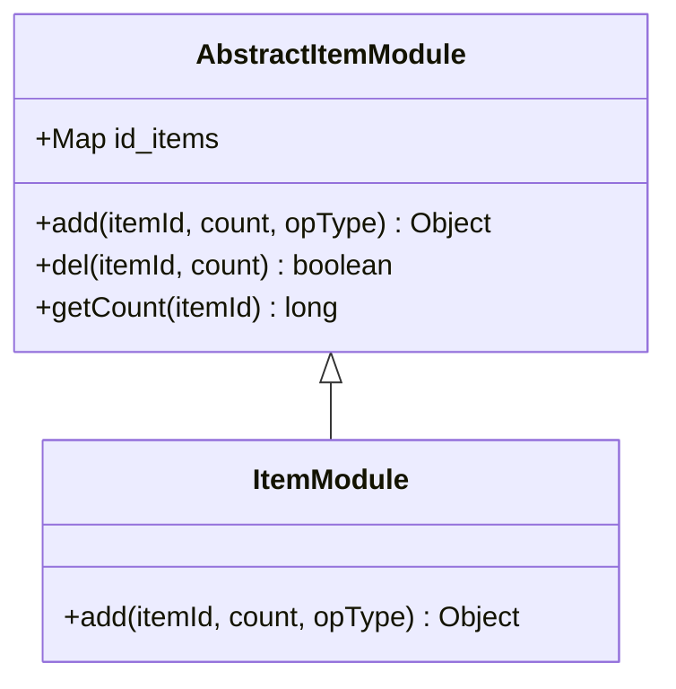
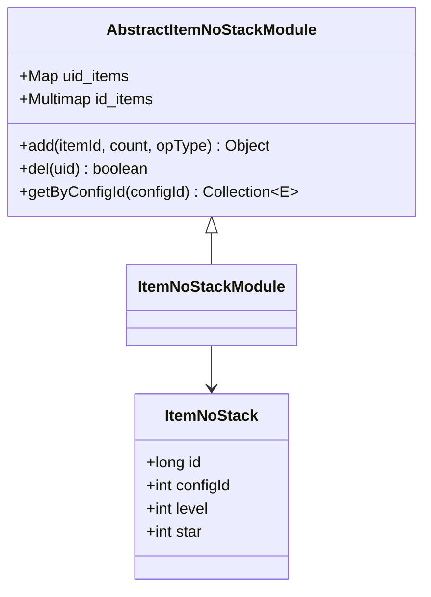
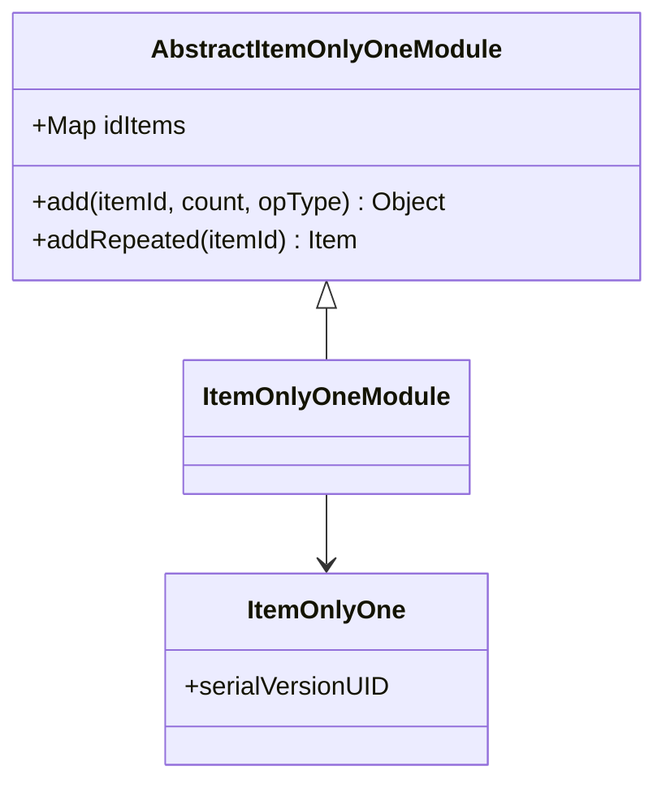
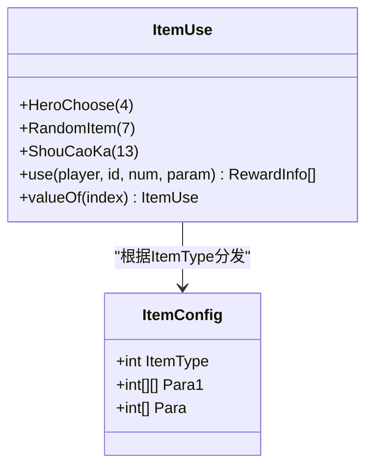
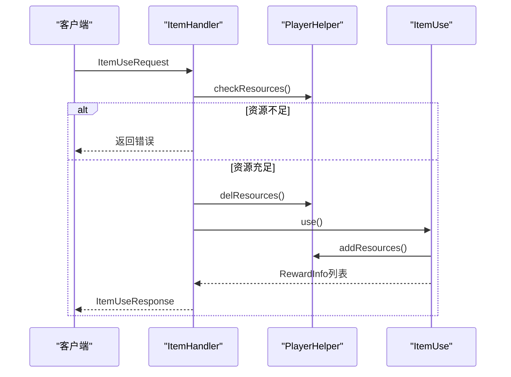
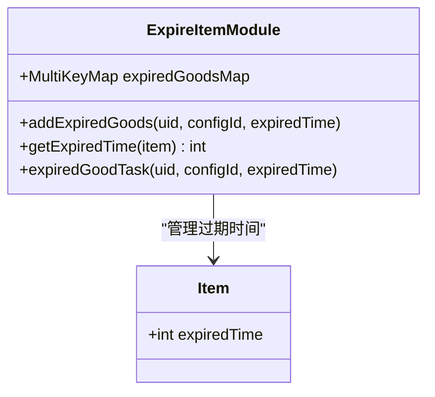
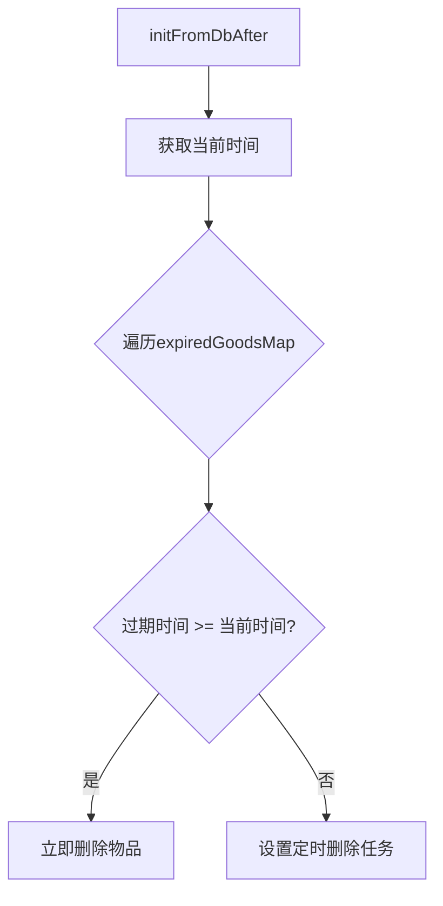
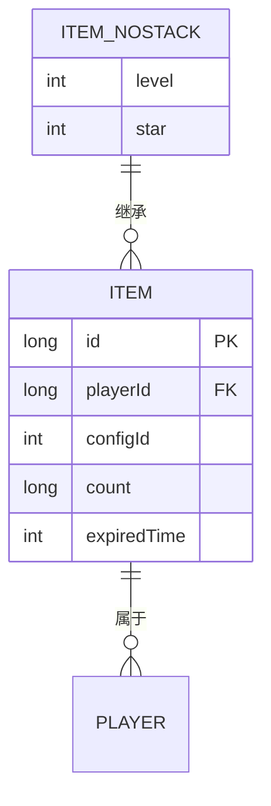
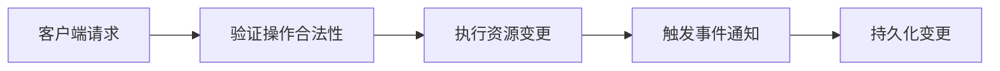

# 物品系统

<cite>
**本文档引用文件**  
- [ItemModule.java](file://game\src\main\java\cn\game\games\net\game\module\item\ItemModule.java)
- [ItemUse.java](file://game\src\main\java\cn\game\games\net\game\module\item\ItemUse.java)
- [ExpireItemModule.java](file://game\src\main\java\cn\game\games\net\game\module\item\ExpireItemModule.java)
- [Item.java](file://game\src\main\java\cn\game\games\cache\entity\Item.java)
- [ItemNoStack.java](file://game\src\main\java\cn\game\games\cache\entity\ItemNoStack.java)
- [ItemOnlyOne.java](file://game\src\main\java\cn\game\games\cache\entity\ItemOnlyOne.java)
- [AbstractItemModule.java](file://game\src\main\java\cn\game\games\net\game\module\item\AbstractItemModule.java)
- [AbstractItemNoStackModule.java](file://game\src\main\java\cn\game\games\net\game\module\item\AbstractItemNoStackModule.java)
- [AbstractItemOnlyOneModule.java](file://game\src\main\java\cn\game\games\net\game\module\item\AbstractItemOnlyOneModule.java)
- [ItemHandler.java](file://game\src\main\java\cn\game\games\net\game\module\item\ItemHandler.java)
- [AbstractItemIdModule.java](file://game\src\main\java\cn\game\games\net\game\module\item\AbstractItemIdModule.java)
</cite>

## 目录
1. [系统概述](#系统概述)
2. [物品分类与库存管理](#物品分类与库存管理)
3. [物品使用逻辑处理](#物品使用逻辑处理)
4. [物品ID生成与绑定机制](#物品id生成与绑定机制)
5. [物品过期机制](#物品过期机制)
6. [数据缓存与批量操作](#数据缓存与批量操作)
7. [高并发锁竞争规避](#高并发锁竞争规避)

## 系统概述
本系统围绕物品管理核心模块（ItemModule）构建，实现了对不同类型物品的分类管理、库存控制、使用逻辑、过期处理及交易限制等完整功能。系统采用分层架构设计，通过抽象基类实现通用逻辑，具体模块继承并扩展功能。

## 物品分类与库存管理

### 堆叠物品管理
堆叠物品（Stackable Items）由`AbstractItemModule`基类实现，使用`Map<Integer, E>`结构以配置ID为键存储物品实例。同一配置ID的物品共享一个实例，数量通过`count`字段管理。



**图示来源**  
- [AbstractItemModule.java](file://game\src\main\java\cn\game\games\net\game\module\item\AbstractItemModule.java#L22-L150)
- [ItemModule.java](file://game\src\main\java\cn\game\games\net\game\module\item\ItemModule.java#L26-L135)

### 非堆叠物品管理
非堆叠物品（Non-Stackable Items）由`AbstractItemNoStackModule`管理，使用双层映射结构：`uid_items`（Long → E）用于唯一标识，`id_items`（Multimap<Integer, E>）用于按配置ID查询。



**图示来源**  
- [AbstractItemNoStackModule.java](file://game\src\main\java\cn\game\games\net\game\module\item\AbstractItemNoStackModule.java#L28-L167)
- [ItemNoStack.java](file://game\src\main\java\cn\game\games\cache\entity\ItemNoStack.java#L3-L63)

### 唯一物品管理
唯一物品（Unique Items）由`AbstractItemOnlyOneModule`处理，确保每个配置ID最多存在一个实例。重复获取时触发`addRepeated`方法进行特殊处理（如转换资源或延长时效）。



**图示来源**  
- [AbstractItemOnlyOneModule.java](file://game\src\main\java\cn\game\games\net\game\module\item\AbstractItemOnlyOneModule.java#L23-L110)
- [ItemOnlyOne.java](file://game\src\main\java\cn\game\games\cache\entity\ItemOnlyOne.java#L3-L7)

## 物品使用逻辑处理

### 使用类型枚举
`ItemUse`枚举定义了不同物品类型的使用行为，通过`ItemType`配置项关联具体逻辑。



**图示来源**  
- [ItemUse.java](file://game\src\main\java\cn\game\games\net\game\module\item\ItemUse.java#L17-L67)
- [ItemConfig.java](file://game\src\main\java\cn\game\protocol\generated\config\ItemConfig.java)

### 使用请求处理流程
客户端请求通过`ItemHandler`处理，验证资源充足性后调用对应`ItemUse`逻辑。



**图示来源**  
- [ItemHandler.java](file://game\src\main\java\cn\game\games\net\game\module\item\ItemHandler.java#L46-L85)
- [PlayerHelper.java](file://game\src\main\java\cn\game\games\net\game\helper\PlayerHelper.java)

## 物品ID生成与绑定机制

### 唯一ID管理
`AbstractItemIdModule`通过玩家模块的ID管理系统确保物品ID不重复，重复获取时触发`addRepeated`逻辑。

```mermaid
flowchart TD
A[调用add(itemId, 1)] --> B{hasId(itemId)?}
B --> |是| C[执行addRepeated(itemId)]
B --> |否| D[创建新物品实例]
D --> E[调用playerModule.addId()]
E --> F[返回新物品]
```

**图示来源**  
- [AbstractItemIdModule.java](file://game\src\main\java\cn\game\games\net\game\module\item\AbstractItemIdModule.java#L26-L41)
- [PlayerModule.java](file://game\src\main\java\cn\game\games\net\game\module\player\PlayerModule.java)

### 交易限制规则
系统通过`OpType`枚举区分不同操作类型（如`ItemSell`、`ItemOpen`），并在`PlayerHelper`中实现资源增减的审计与限制。

## 物品过期机制

### 过期时间管理
`ExpireItemModule`使用`MultiKeyMap`存储物品过期时间，并在初始化时设置定时任务。



**图示来源**  
- [ExpireItemModule.java](file://game\src\main\java\cn\game\games\net\game\module\item\ExpireItemModule.java#L18-L80)
- [Item.java](file://game\src\main\java\cn\game\games\cache\entity\Item.java#L23-L27)

### 批量扫描优化
在`initFromDbAfter`阶段批量处理过期物品，避免逐个创建定时任务的性能开销。



**图示来源**  
- [ExpireItemModule.java](file://game\src\main\java\cn\game\games\net\game\module\item\ExpireItemModule.java#L60-L72)

## 数据缓存与批量操作

### 缓存结构设计
系统采用内存缓存+数据库持久化的双层结构，通过`DbEntity`接口实现数据同步。



**图示来源**  
- [Item.java](file://game\src\main\java\cn\game\games\cache\entity\Item.java)
- [ItemNoStack.java](file://game\src\main\java\cn\game\games\cache\entity\ItemNoStack.java)

### 批量操作API
`AbstractItemNoStackModule`提供`delBatch`方法支持批量删除，通过DAO批量操作优化性能。

```java
// 示例：批量删除非堆叠物品
List<Long> uidList = Arrays.asList(1001L, 1002L, 1003L);
itemNoStackModule.delBatch(uidList, OpType.ItemSell);
```

**代码来源**  
- [AbstractItemNoStackModule.java](file://game\src\main\java\cn\game\games\net\game\module\item\AbstractItemNoStackModule.java#L105-L123)

## 高并发锁竞争规避

### 无锁设计原则
系统通过以下方式规避锁竞争：
1. 每个玩家拥有独立的物品模块实例
2. 使用线程安全的集合类（如ConcurrentHashMap）
3. 将状态变更封装为不可变操作

### 并发操作保障
通过`OpType`区分操作上下文，在`PlayerHelper`中实现原子性资源变更。



**图示来源**  
- [PlayerHelper.java](file://game\src\main\java\cn\game\games\net\game\helper\PlayerHelper.java)
- [GoodsModule.java](file://game\src\main\java\cn\game\games\core\GoodsModule.java)