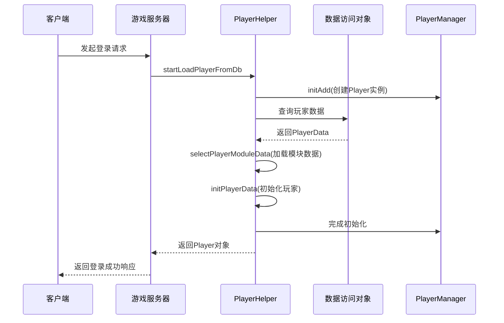
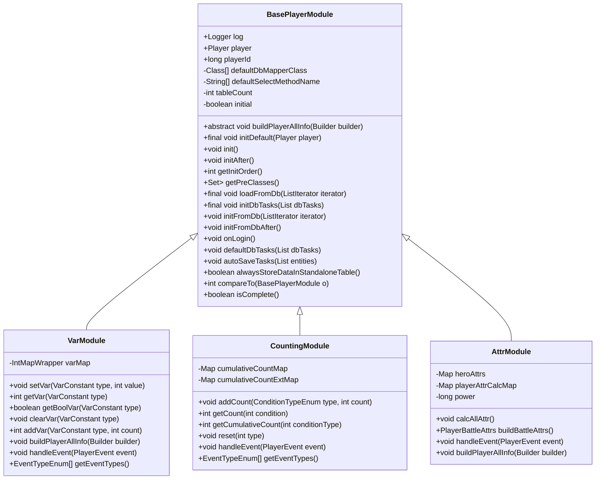
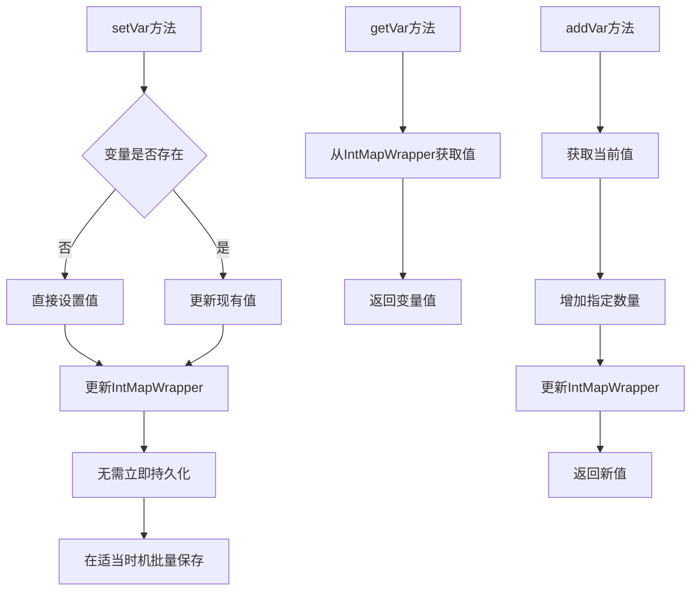
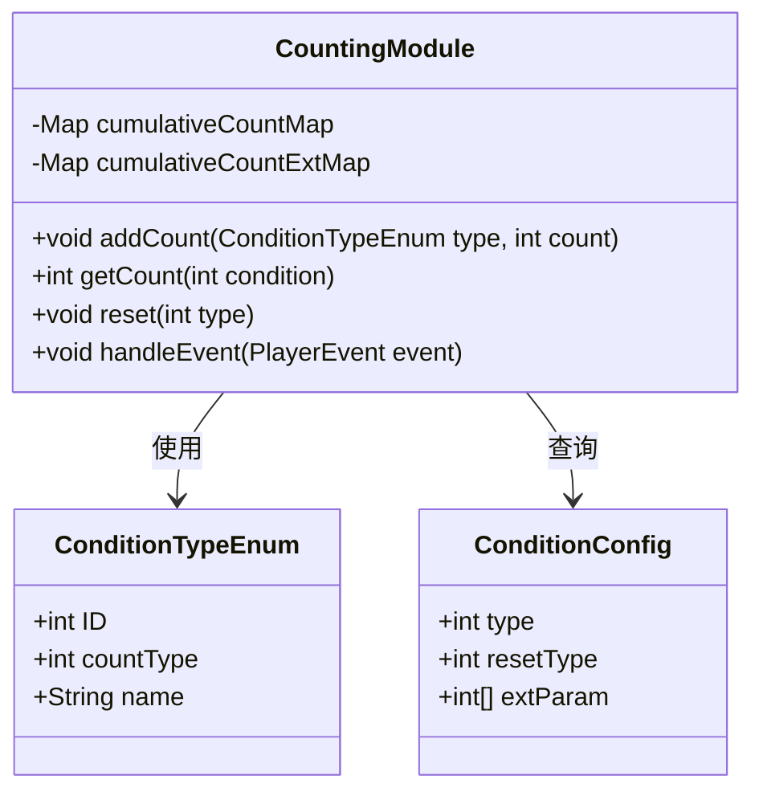
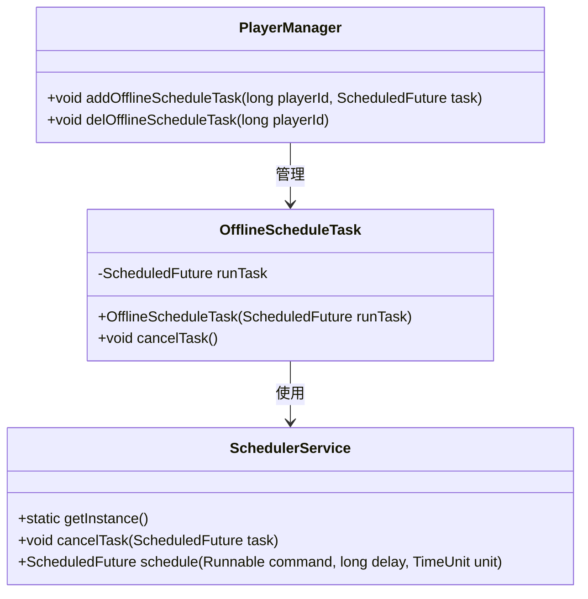
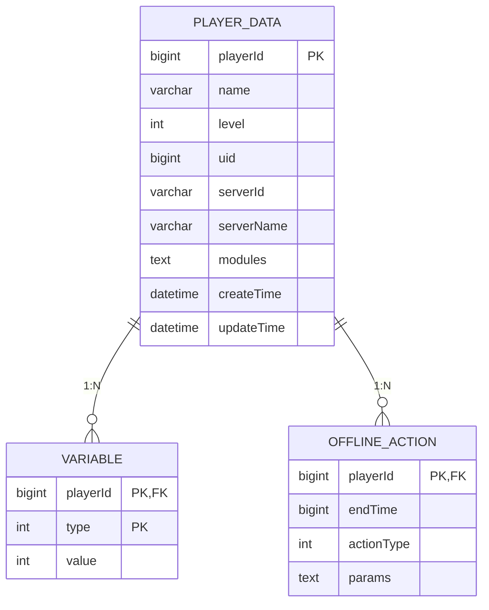
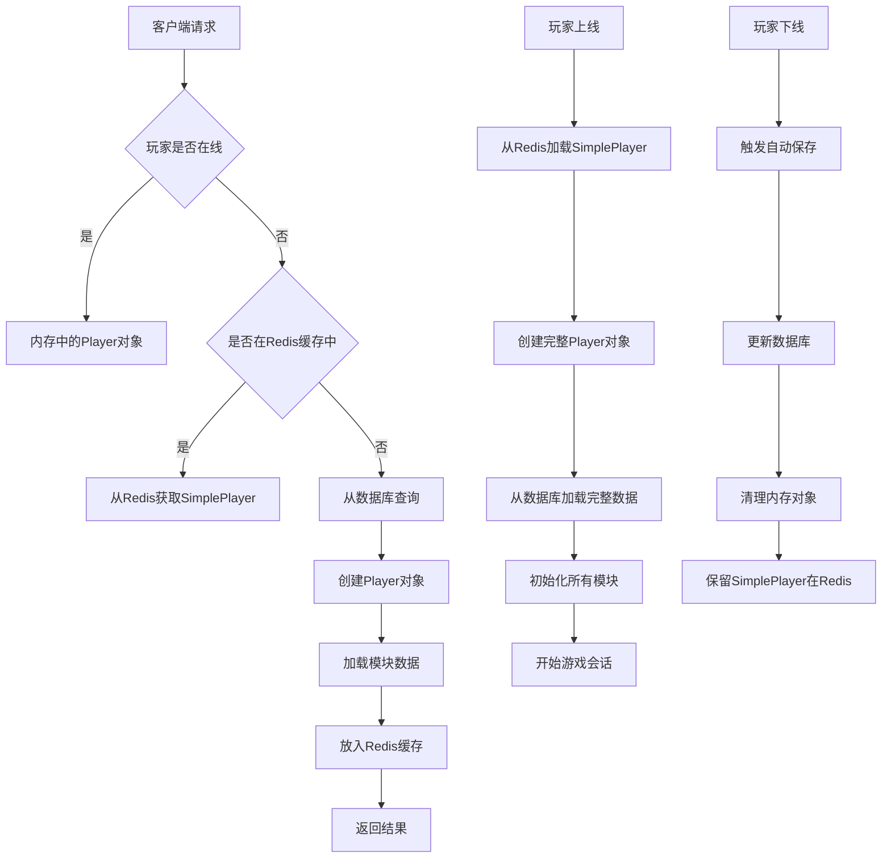
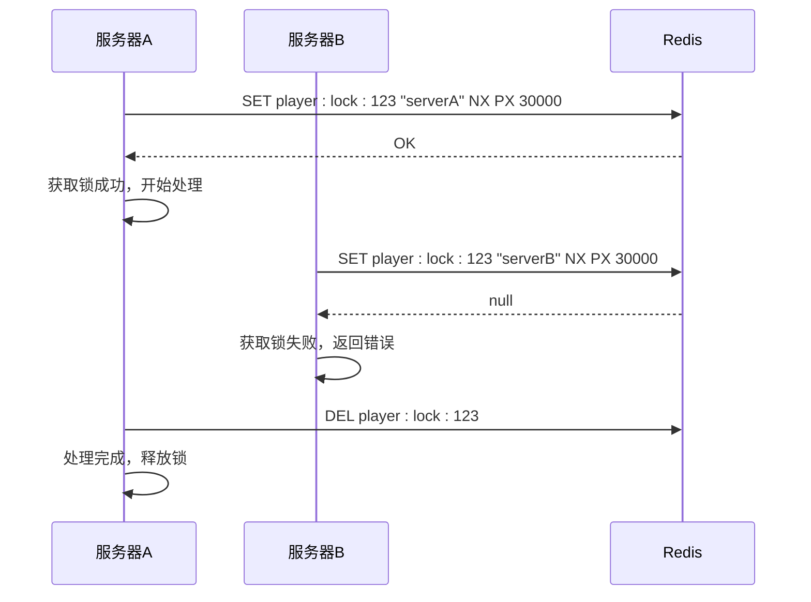

# 玩家系统

<cite>
**本文档引用的文件**  
- [BasePlayer.java](file://game/src/main/java/cn/game/games/core/BasePlayer.java)
- [BasePlayerModule.java](file://game/src/main/java/cn/game/games/core/BasePlayerModule.java)
- [PlayerHelper.java](file://game/src/main/java/cn/game/games/net/game/helper/PlayerHelper.java)
- [VarModule.java](file://game/src/main/java/cn/game/games/net/game/module/player/VarModule.java)
- [CountingModule.java](file://game/src/main/java/cn/game/games/net/game/module/player/CountingModule.java)
- [OfflineScheduleTask.java](file://game/src/main/java/cn/game/games/net/game/module/player/OfflineScheduleTask.java)
- [PlayerManager.java](file://game/src/main/java/cn/game/games/net/game/manager/PlayerManager.java)
- [Player.java](file://game/src/main/java/cn/game/games/cache/entity/Player.java)
- [Variable.java](file://game/src/main/java/cn/game/games/cache/entity/Variable.java)
- [PlayerDataMapper.xml](file://game/src/main/resources/mapping/PlayerDataMapper.xml)
- [GameServer.java](file://game/src/main/java/cn/game/games/net/game/GameServer.java)
</cite>

## 目录
1. [引言](#引言)
2. [玩家数据加载与初始化](#玩家数据加载与初始化)
3. [PlayerModule状态管理](#playermodule状态管理)
4. [玩家变量与计数器系统](#玩家变量与计数器系统)
5. [离线任务系统](#离线任务系统)
6. [数据持久化机制](#数据持久化机制)
7. [缓存策略与性能优化](#缓存策略与性能优化)
8. [并发控制与常见问题](#并发控制与常见问题)
9. [API使用示例](#api使用示例)
10. [结论](#结论)

## 引言
玩家系统是游戏服务端的核心模块，负责管理所有玩家的生命周期、状态数据和业务逻辑。本系统基于模块化设计，通过BasePlayer作为玩家数据的容器，各个功能模块（如VarModule、CountingModule等）继承BasePlayerModule来实现特定功能。系统采用事件驱动架构，通过PlayerEventBus处理玩家生命周期事件，确保各模块间的松耦合和高内聚。

## 玩家数据加载与初始化

玩家数据的加载与初始化是玩家系统的核心流程，确保玩家在登录时能够正确恢复其游戏状态。该流程主要通过PlayerHelper工具类协调完成。



**图示来源**  
- [PlayerHelper.java](file://game/src/main/java/cn/game/games/net/game/helper/PlayerHelper.java#L1380-L1444)
- [PlayerManager.java](file://game/src/main/java/cn/game/games/net/game/manager/PlayerManager.java#L122-L158)

玩家加载流程分为以下几个关键步骤：
1. **创建Player实例**：通过`createPlayer`方法创建Player对象，并将其注册到PlayerManager中。
2. **分布式锁获取**：通过`getPlayerDistributedLock`确保同一玩家在同一时间只能由一个服务器实例处理。
3. **数据查询**：使用DAO执行数据库查询，获取玩家基础数据（PlayerData）和各模块的独立数据。
4. **模块初始化**：调用各PlayerModule的`initFromDb`和`initFromDbAfter`方法完成模块数据的初始化。
5. **事件触发**：触发PLAYER_CREATE等生命周期事件，完成玩家的最终初始化。

**本节来源**  
- [PlayerHelper.java](file://game/src/main/java/cn/game/games/net/game/helper/PlayerHelper.java#L1380-L1593)
- [BasePlayerModule.java](file://game/src/main/java/cn/game/games/core/BasePlayerModule.java#L91-L131)

## PlayerModule状态管理

PlayerModule是玩家系统的核心抽象，所有玩家相关的功能模块都继承自BasePlayerModule类。该设计实现了功能的模块化和可扩展性。



**图示来源**  
- [BasePlayerModule.java](file://game/src/main/java/cn/game/games/core/BasePlayerModule.java)
- [VarModule.java](file://game/src/main/java/cn/game/games/net/game/module/player/VarModule.java)
- [CountingModule.java](file://game/src/main/java/cn/game/games/net/game/module/player/CountingModule.java)
- [AttrModule.java](file://game/src/main/java/cn/game/games/net/game/module/develop/AttrModule.java)

PlayerModule的状态管理主要体现在以下几个方面：
1. **初始化顺序控制**：通过`getInitOrder`和`getPreClasses`方法控制模块的初始化顺序，确保依赖关系正确的模块优先初始化。
2. **事件驱动**：通过实现`PlayerEventHandler`接口，订阅特定的`EventTypeEnum`事件，在事件发生时执行相应的业务逻辑。
3. **数据构建**：在`buildPlayerAllInfo`方法中构建玩家的完整信息，供客户端使用。
4. **生命周期管理**：通过`init`、`initAfter`、`onLogin`等方法管理模块的生命周期。

**本节来源**  
- [BasePlayerModule.java](file://game/src/main/java/cn/game/games/core/BasePlayerModule.java)
- [VarModule.java](file://game/src/main/java/cn/game/games/net/game/module/player/VarModule.java)
- [CountingModule.java](file://game/src/main/java/cn/game/games/net/game/module/player/CountingModule.java)

## 玩家变量与计数器系统

玩家系统提供了两种主要的数据存储机制：VarModule用于存储零散的int和boolean类型变量，CountingModule用于管理具有独立生命周期的计数变量。

### VarModule设计与实现

VarModule使用IntMapWrapper作为底层存储，将VarConstant枚举的值作为键来存储玩家的各类变量。



**图示来源**  
- [VarModule.java](file://game/src/main/java/cn/game/games/net/game/module/player/VarModule.java#L22-L76)

VarModule的关键特性包括：
- **高效存储**：使用IntMapWrapper实现紧凑的整数映射存储。
- **类型安全**：通过VarConstant枚举确保变量类型的统一管理。
- **延迟持久化**：变量变更不会立即写入数据库，而是在适当的时机批量保存，提高性能。
- **事件响应**：在PLAYER_CREATE事件中初始化默认变量值。

### CountingModule设计与实现

CountingModule用于管理具有独立重置周期的计数变量，如每日登录次数、累计充值金额等。



**图示来源**  
- [CountingModule.java](file://game/src/main/java/cn/game/games/net/game/module/player/CountingModule.java)
- [ConditionTypeEnum.java](file://game/src/main/java/cn/game/protocol/generated/enume/ConditionTypeEnum.java)
- [ConditionConfig.java](file://game/src/main/java/cn/game/protocol/generated/config/ConditionConfig.java)

CountingModule的核心机制包括：
1. **多级计数**：支持按天(1)、周(2)、月(3)等不同周期进行计数管理。
2. **事件驱动更新**：通过订阅各种事件（如Charge、BattleEnd等）自动更新计数。
3. **条件配置**：与ConditionConfig表配合使用，实现灵活的计数规则配置。
4. **高优先级处理**：通过`processOrder`返回高优先级值，确保计数更新在其他依赖逻辑之前完成。

**本节来源**  
- [VarModule.java](file://game/src/main/java/cn/game/games/net/game/module/player/VarModule.java)
- [CountingModule.java](file://game/src/main/java/cn/game/games/net/game/module/player/CountingModule.java)
- [Variable.java](file://game/src/main/java/cn/game/games/cache/entity/Variable.java)

## 离线任务系统

离线任务系统允许玩家在离线期间执行定时任务，如资源自动产出、任务进度推进等。该系统通过OfflineScheduleTask类实现。



**图示来源**  
- [OfflineScheduleTask.java](file://game/src/main/java/cn/game/games/net/game/module/player/OfflineScheduleTask.java)
- [SchedulerService.java](file://core/src/main/java/cn/game/core/task/SchedulerService.java)
- [PlayerManager.java](file://game/src/main/java/cn/game/games/net/game/manager/PlayerManager.java)

离线任务系统的工作流程如下：
1. **任务创建**：当玩家离线时，相关模块创建定时任务并封装为OfflineScheduleTask。
2. **任务管理**：PlayerManager负责管理玩家的离线任务，确保任务与玩家生命周期一致。
3. **任务执行**：SchedulerService在指定时间执行任务，完成资源发放、进度更新等操作。
4. **任务取消**：当玩家上线或服务器关闭时，通过`cancelTask`方法取消所有离线任务。

奖励发放流程通常包括：
- 验证奖励条件是否满足
- 计算应发放的奖励数量
- 调用`PlayerHelper.addResources`方法添加资源
- 记录发放日志

**本节来源**  
- [OfflineScheduleTask.java](file://game/src/main/java/cn/game/games/net/game/module/player/OfflineScheduleTask.java)
- [PlayerManager.java](file://game/src/main/java/cn/game/games/net/game/manager/PlayerManager.java)

## 数据持久化机制

玩家系统的数据持久化采用混合策略，结合数据库存储和Redis缓存，确保数据的一致性和高性能。

### 数据库持久化

玩家核心数据存储在t_player_data表中，通过MyBatis Mapper进行访问。



**图示来源**  
- [PlayerDataMapper.xml](file://game/src/main/resources/mapping/PlayerDataMapper.xml)
- [VariableMapper.xml](file://game/src/main/resources/mapping/VariableMapper.xml)
- [OfflineActionMapper.xml](file://game/src/main/resources/mapping/OfflineActionMapper.xml)

持久化流程包括：
1. **数据保存**：通过DAO.execute方法执行MyBatis映射的SQL语句。
2. **批量操作**：支持批量保存和查询，提高数据库操作效率。
3. **事务管理**：确保相关数据的一致性更新。

### 自动保存机制

BasePlayerModule提供了`autoSaveTasks`方法，允许模块注册需要自动保存的数据实体。

```java
@Override
public void autoSaveTasks(List<DbEntity> entities) {
    entities.add(this.player.getData());
    // 添加其他需要保存的实体
}
```

系统会在适当的时机（如玩家下线、定时保存等）调用所有模块的`autoSaveTasks`方法，收集需要保存的数据并批量执行。

**本节来源**  
- [BasePlayerModule.java](file://game/src/main/java/cn/game/games/core/BasePlayerModule.java#L175-L177)
- [PlayerHelper.java](file://game/src/main/java/cn/game/games/net/game/helper/PlayerHelper.java#L1504-L1511)
- [update.sql](file://game/src/main/resources/sql/update.sql)

## 缓存策略与性能优化

玩家系统采用多层次缓存策略，结合Redis和本地缓存，显著提升系统性能。

### 缓存架构



**图示来源**  
- [PlayerHelper.java](file://game/src/main/java/cn/game/games/net/game/helper/PlayerHelper.java#L1473-L1486)
- [GameServer.java](file://game/src/main/java/cn/game/games/net/game/GameServer.java#L238-L260)
- [PlayerManager.java](file://game/src/main/java/cn/game/games/net/game/manager/PlayerManager.java#L129-L135)

### 性能优化方案

1. **分层缓存**：
   - 第一层：内存中的完整Player对象（玩家在线时）
   - 第二层：Redis中的SimplePlayer对象（玩家离线时）
   - 第三层：数据库持久化存储

2. **批量操作**：
   - 支持批量获取SimplePlayer：`batchGetSimplePlayerListFromRedisAsync`
   - 支持批量数据库操作：通过DbTask列表实现

3. **异步处理**：
   - 数据库操作采用Future模式异步执行
   - Redis操作支持异步API

4. **连接池优化**：
   - 使用Redisson作为Redis客户端，支持连接池和高可用
   - 数据库连接通过MyBatis管理

**本节来源**  
- [PlayerHelper.java](file://game/src/main/java/cn/game/games/net/game/helper/PlayerHelper.java#L1473-L1486)
- [GameServer.java](file://game/src/main/java/cn/game/games/net/game/GameServer.java#L238-L270)
- [PlayerManager.java](file://game/src/main/java/cn/game/games/net/game/manager/PlayerManager.java#L129-L158)

## 并发控制与常见问题

玩家系统通过多种机制确保在高并发环境下的数据一致性和系统稳定性。

### 分布式锁机制

系统使用Redis实现分布式锁，防止同一玩家被多个服务器实例同时处理。



**图示来源**  
- [PlayerHelper.java](file://game/src/main/java/cn/game/games/net/game/helper/PlayerHelper.java#L1521-L1532)
- [IdCache.java](file://game/src/main/java/cn/game/games/net/game/cache/IdCache.java)

### 常见并发问题及解决方案

1. **问题：玩家重复登录**
   - **现象**：同一玩家账号在不同设备同时登录
   - **解决方案**：使用分布式锁确保同一时间只有一个登录会话被处理

2. **问题：数据竞争**
   - **现象**：多个请求同时修改同一玩家数据导致数据不一致
   - **解决方案**：所有玩家数据操作通过PlayerManager串行化处理

3. **问题：缓存穿透**
   - **现象**：大量请求查询不存在的玩家ID
   - **解决方案**：对不存在的玩家ID进行短时间缓存

4. **问题：缓存雪崩**
   - **现象**：大量缓存同时过期导致数据库压力激增
   - **解决方案**：采用随机过期时间策略

5. **问题：内存泄漏**
   - **现象**：玩家下线后内存对象未及时清理
   - **解决方案**：确保在`clearPlayer`方法中彻底清理所有相关对象

**本节来源**  
- [PlayerHelper.java](file://game/src/main/java/cn/game/games/net/game/helper/PlayerHelper.java#L1788-L1794)
- [PlayerManager.java](file://game/src/main/java/cn/game/games/net/game/manager/PlayerManager.java)

## API使用示例

以下是一些常见的玩家系统API使用示例。

### 玩家信息查询

```java
// 异步获取玩家信息
Future<Player> playerFuture = PlayerHelper.loadPlayerFromDb(playerId);
playerFuture.onSuccess(player -> {
    // 处理玩家数据
    int level = player.getLevel();
    String name = player.getData().getName();
    int renameCount = player.getVarModule().getVar(VarConstant.RANAME_COUNT);
});

// 批量获取简单玩家信息
List<Long> playerIds = Arrays.asList(1L, 2L, 3L);
Future<List<SimplePlayer>> simplePlayersFuture = 
    PlayerManager.getInstance().batchGetSimplePlayerListFromRedisAsync(playerIds);
```

### 属性更新

```java
// 更新玩家变量
player.getVarModule().setVar(VarConstant.WECHAT_NOTIFY_ENERGY, true);
player.getVarModule().addVar(VarConstant.LOGIN_DAYS, 1);

// 更新计数器
player.getCountingModule().addCount(ConditionTypeEnum.CumulativeLogins, 1);
```

### 事件监听

```java
// 在模块中监听事件
@Override
public EventTypeEnum[] getEventTypes() {
    return new EventTypeEnum[] { EventTypeEnum.Charge, EventTypeEnum.BattleEnd };
}

@Override
public void handleEvent(PlayerEvent event) {
    switch (event.getType()) {
        case Charge:
            int amount = event.getIntParameter(0);
            // 处理充值事件
            break;
        case BattleEnd:
            boolean isWin = event.getBoolParameter(0);
            // 处理战斗结束事件
            break;
    }
}
```

**本节来源**  
- [PlayerHelper.java](file://game/src/main/java/cn/game/games/net/game/helper/PlayerHelper.java)
- [VarModule.java](file://game/src/main/java/cn/game/games/net/game/module/player/VarModule.java)
- [CountingModule.java](file://game/src/main/java/cn/game/games/net/game/module/player/CountingModule.java)

## 结论

玩家系统通过精心设计的架构实现了高性能、高可用和易扩展的目标。系统采用模块化设计，将不同功能分离到独立的PlayerModule中，通过事件驱动机制实现模块间的通信。数据持久化采用数据库与Redis缓存相结合的策略，既保证了数据的持久性，又提供了高性能的访问能力。并发控制通过分布式锁和串行化处理确保了数据一致性。整体设计充分考虑了游戏服务器的特殊需求，为游戏的稳定运行提供了坚实的基础。