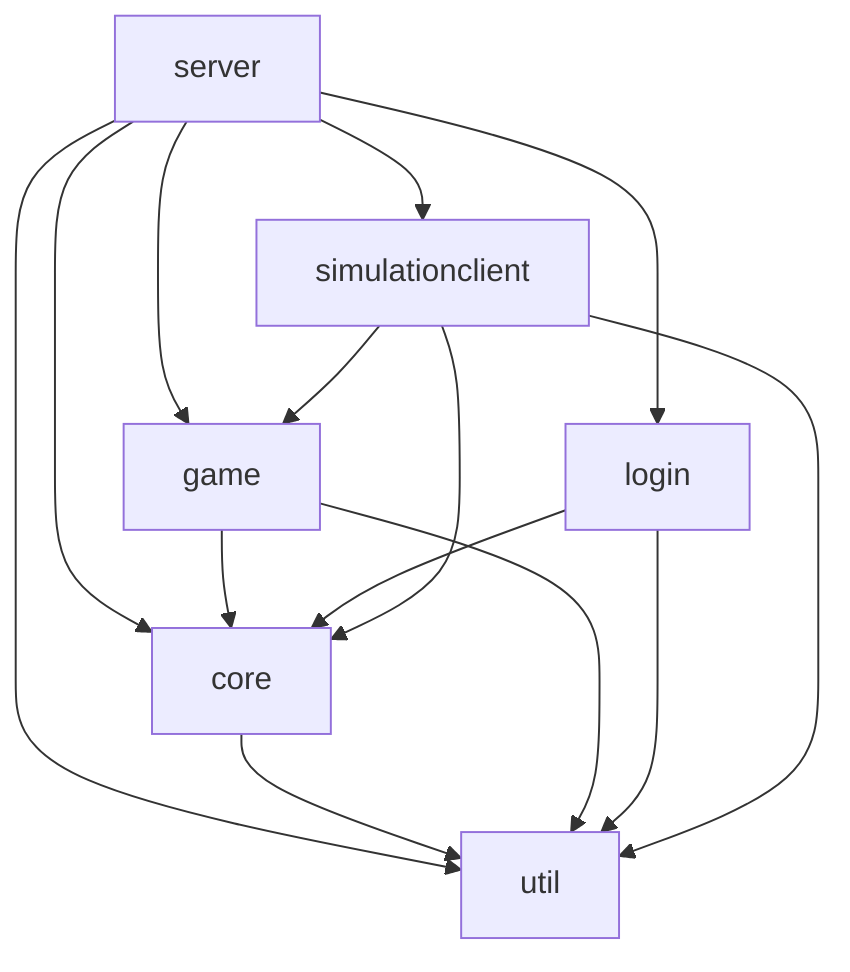
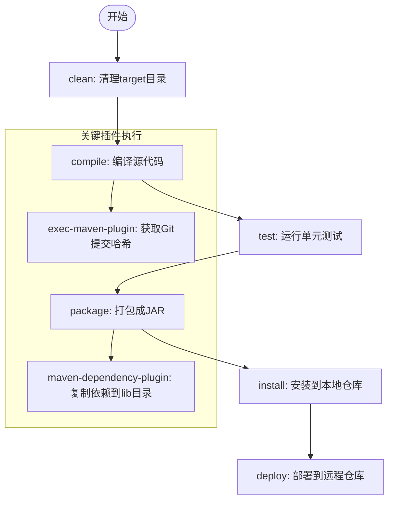
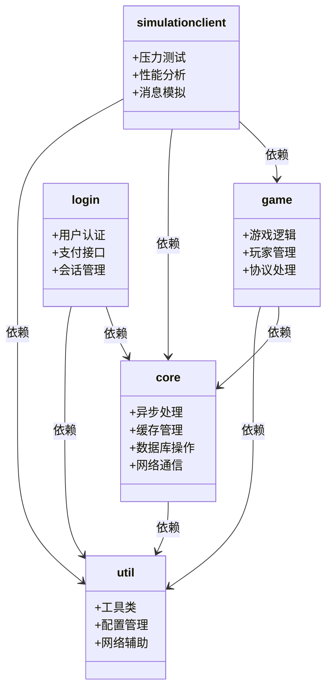
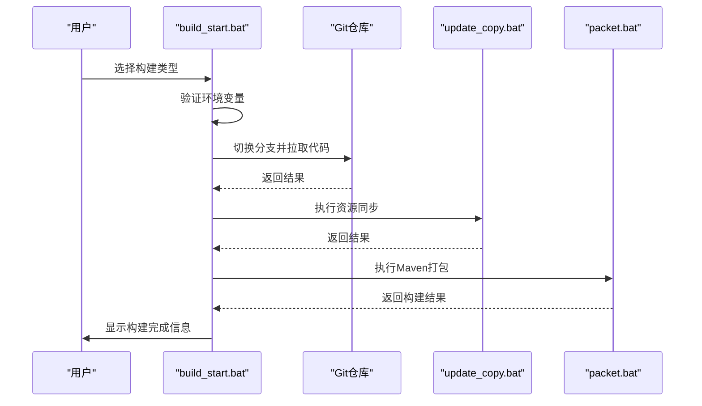
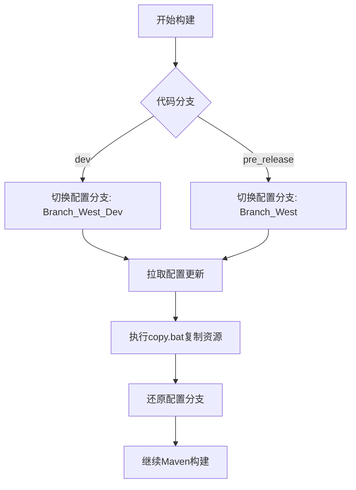

# 构建流程

<cite>
**本文档引用的文件**  
- [pom.xml](file://pom.xml)
- [core/pom.xml](file://core/pom.xml)
- [game/pom.xml](file://game/pom.xml)
- [login/pom.xml](file://login/pom.xml)
- [util/pom.xml](file://util/pom.xml)
- [simulationclient/pom.xml](file://simulationclient/pom.xml)
- [game/tool/packet.bat](file://game/tool/packet.bat)
- [game/tool/build_start.bat](file://game/tool/build_start.bat)
- [game/tool/update_copy.bat](file://game/tool/update_copy.bat)
- [game/package.xml](file://game/package.xml)
- [game/package_full.xml](file://game/package_full.xml)
- [core/src/main/resources/META-INF/app.properties](file://core/src/main/resources/META-INF/app.properties)
- [game/src/main/resources/META-INF/app.properties](file://game/src/main/resources/META-INF/app.properties)
- [game/src/main/resources/config/quartz_gameServer.properties](file://game/src/main/resources/config/quartz_gameServer.properties)
</cite>

## 目录
1. [项目结构与模块依赖](#项目结构与模块依赖)
2. [Maven构建生命周期](#maven构建生命周期)
3. [模块依赖关系与构建顺序](#模块依赖关系与构建顺序)
4. [game模块构建脚本详解](#game模块构建脚本详解)
5. [资源文件处理与配置注入](#资源文件处理与配置注入)
6. [常见构建问题排查](#常见构建问题排查)
7. [CI/CD集成与自动化构建最佳实践](#cicd集成与自动化构建最佳实践)

## 项目结构与模块依赖

本项目是一个基于Maven的多模块Java项目，包含多个子模块，通过父POM统一管理依赖和构建配置。项目采用分层架构设计，各模块职责清晰，通过Maven的依赖管理机制实现模块间的解耦。

**图示来源**  
- [pom.xml](file://pom.xml#L10-L16)
- [core/pom.xml](file://core/pom.xml#L17-L27)
- [game/pom.xml](file://game/pom.xml#L21-L35)
- [login/pom.xml](file://login/pom.xml#L78-L91)
- [simulationclient/pom.xml](file://simulationclient/pom.xml#L99-L113)

**本节来源**  
- [pom.xml](file://pom.xml#L1-L800)
- [project_structure](file://project_structure)

## Maven构建生命周期

Maven构建过程遵循标准的生命周期阶段，包括clean、compile、test、package、install和deploy。本项目通过配置maven-compiler-plugin指定JDK 21版本进行编译，确保代码兼容性。

构建过程中，exec-maven-plugin在initialize阶段执行git命令获取当前提交哈希值，并将其写入version.txt文件，便于版本追踪。maven-dependency-plugin在package阶段将所有运行时依赖复制到lib目录下，为后续打包做准备。

**图示来源**  
- [pom.xml](file://pom.xml#L31-L68)
- [pom.xml](file://pom.xml#L111-L131)

**本节来源**  
- [pom.xml](file://pom.xml#L29-L133)

## 模块依赖关系与构建顺序

项目包含六个主要模块：util、core、game、login、protocol和simulationclient。父POM通过dependencyManagement统一管理所有内部模块和第三方依赖的版本，确保版本一致性。

各模块的依赖关系如下：
- **util模块**：基础工具模块，无内部依赖，仅包含外部工具库
- **core模块**：核心功能模块，依赖util和protocol模块
- **game模块**：游戏服务器模块，依赖util、core和protocol模块
- **login模块**：登录服务器模块，依赖util、core、protocol和第三方支付SDK
- **simulationclient模块**：压测客户端模块，依赖util、core、game和JMeter库

构建顺序必须遵循依赖关系：首先构建无依赖的util和protocol模块，然后构建依赖它们的core模块，最后构建game、login和simulationclient模块。

**图示来源**  
- [pom.xml](file://pom.xml#L140-L164)
- [core/pom.xml](file://core/pom.xml#L17-L27)
- [game/pom.xml](file://game/pom.xml#L21-L35)
- [login/pom.xml](file://login/pom.xml#L78-L91)
- [simulationclient/pom.xml](file://simulationclient/pom.xml#L99-L113)

**本节来源**  
- [pom.xml](file://pom.xml#L137-L238)
- [core/pom.xml](file://core/pom.xml)
- [game/pom.xml](file://game/pom.xml)
- [login/pom.xml](file://login/pom.xml)
- [simulationclient/pom.xml](file://simulationclient/pom.xml)

## game模块构建脚本详解

game模块提供了两个核心构建脚本：build_start.bat和packet.bat，实现了从代码拉取到打包的完整自动化流程。

### build_start.bat 脚本功能

该脚本是构建流程的入口，提供交互式菜单选择构建环境（开发版或正式版），并自动执行完整的构建流程：

1. **环境检查**：验证workspace和metafolder环境变量是否设置，确保路径存在
2. **菜单选择**：用户选择构建类型（开发环境或正式发布）
3. **Git处理**：根据选择切换到对应的代码分支（dev或pre_release）并拉取最新代码
4. **资源同步**：执行update_copy.bat脚本同步配置资源
5. **Maven打包**：执行packet.bat脚本进行Maven构建

**图示来源**  
- [game/tool/build_start.bat](file://game/tool/build_start.bat#L1-L146)

**本节来源**  
- [game/tool/build_start.bat](file://game/tool/build_start.bat#L1-L146)

### packet.bat 脚本功能

该脚本负责执行Maven构建命令，是构建流程的核心执行单元：

1. **环境设置**：切换到workspace目录，设置Maven和Java编码选项
2. **Maven构建**：执行`mvn clean install`命令，使用指定的assembly descriptor进行打包
3. **错误处理**：检查构建结果，失败时输出错误信息并退出

脚本通过环境变量game.assembly.descriptor和game.server控制打包行为，实现不同环境的差异化构建。

**本节来源**  
- [game/tool/packet.bat](file://game/tool/packet.bat#L1-L37)

## 资源文件处理与配置注入

项目通过Maven Assembly Plugin实现资源文件的定制化打包，package.xml和package_full.xml定义了不同的打包策略。

### Assembly Descriptor 配置

**package.xml**：定义了标准打包配置，包含：
- 仅打包runtime范围的依赖到lib目录
- 包含编译后的classes文件
- 排除log4j2.xml等日志配置文件，避免覆盖环境特定配置
- 明确指定包含的内部模块依赖（util、protocol、core）

**package_full.xml**：定义了全量打包配置，与标准包的主要区别在于包含所有依赖，适用于完整部署场景。

### 配置文件注入机制

项目采用多环境配置管理策略：
- **app.properties**：定义应用ID和Apollo配置中心地址，开发和生产环境使用不同配置
- **quartz配置**：通过FileSystemJobInitializationPlugin从文件系统加载定时任务配置，支持动态更新
- **资源同步**：update_copy.bat脚本根据代码分支自动切换配置分支，确保代码与配置版本一致

**图示来源**  
- [game/tool/update_copy.bat](file://game/tool/update_copy.bat#L1-L99)

**本节来源**  
- [game/package.xml](file://game/package.xml#L1-L81)
- [game/package_full.xml](file://game/package_full.xml#L1-L65)
- [game/tool/update_copy.bat](file://game/tool/update_copy.bat#L1-L99)
- [core/src/main/resources/META-INF/app.properties](file://core/src/main/resources/META-INF/app.properties)
- [game/src/main/resources/META-INF/app.properties](file://game/src/main/resources/META-INF/app.properties)
- [game/src/main/resources/config/quartz_gameServer.properties](file://game/src/main/resources/config/quartz_gameServer.properties)

## 常见构建问题排查

### 依赖冲突
当出现依赖冲突时，使用`mvn dependency:tree`命令分析依赖树，识别冲突的依赖项。通过在pom.xml中添加exclusions排除不需要的传递依赖，或在dependencyManagement中统一指定版本。

### 编译失败
编译失败常见原因包括：
- JDK版本不匹配：确保使用JDK 21进行编译
- 编码问题：设置MAVEN_OPTS=-Dfile.encoding=UTF-8确保正确处理中文字符
- 缺少环境变量：确保workspace和metafolder环境变量已正确设置

### 打包异常
打包异常可能由以下原因引起：
- Assembly descriptor路径错误：检查game.assembly.descriptor变量值
- 权限问题：确保对workspace和metafolder目录有读写权限
- 网络问题：Git拉取或Maven下载依赖时可能出现超时

### 脚本执行问题
- **中文乱码**：脚本开头使用chcp 65001设置UTF-8编码
- **路径问题**：使用cd /D确保正确切换磁盘驱动器
- **错误处理**：每个关键步骤后检查errorlevel，及时发现并处理错误

**本节来源**  
- [game/tool/build_start.bat](file://game/tool/build_start.bat#L14-L50)
- [game/tool/packet.bat](file://game/tool/packet.bat#L8-L11)
- [pom.xml](file://pom.xml#L19-L23)
- [game/tool/update_copy.bat](file://game/tool/update_copy.bat#L57-L58)

## CI/CD集成与自动化构建最佳实践

### CI/CD集成建议
1. **环境变量管理**：在CI/CD系统中预定义workspace和metafolder等环境变量
2. **分支策略**：建立与开发、测试、生产环境对应的构建流水线
3. **制品管理**：将构建产物上传到制品仓库，实现版本化管理
4. **构建缓存**：缓存Maven本地仓库和Git仓库，提高构建速度

### 自动化构建最佳实践
1. **标准化构建脚本**：保持build_start.bat等脚本的跨环境一致性
2. **构建幂等性**：确保重复执行构建脚本产生相同结果
3. **构建日志**：详细记录构建过程，便于问题追踪
4. **构建验证**：在构建完成后执行基本的健康检查
5. **安全实践**：避免在脚本中硬编码敏感信息，使用环境变量或密钥管理服务

通过遵循这些最佳实践，可以建立稳定、可靠的自动化构建流程，支持快速迭代和持续交付。

**本节来源**  
- [game/tool/build_start.bat](file://game/tool/build_start.bat)
- [game/tool/packet.bat](file://game/tool/packet.bat)
- [pom.xml](file://pom.xml)
- [game/package.xml](file://game/package.xml)