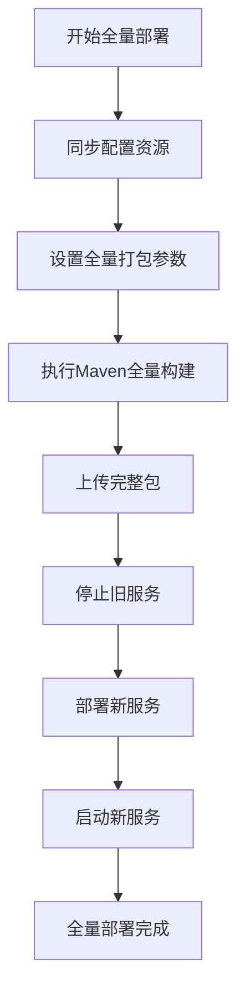
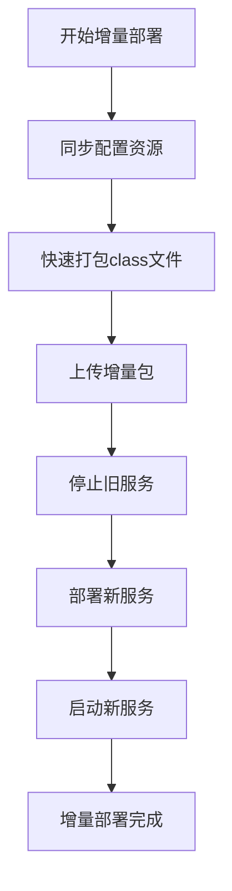
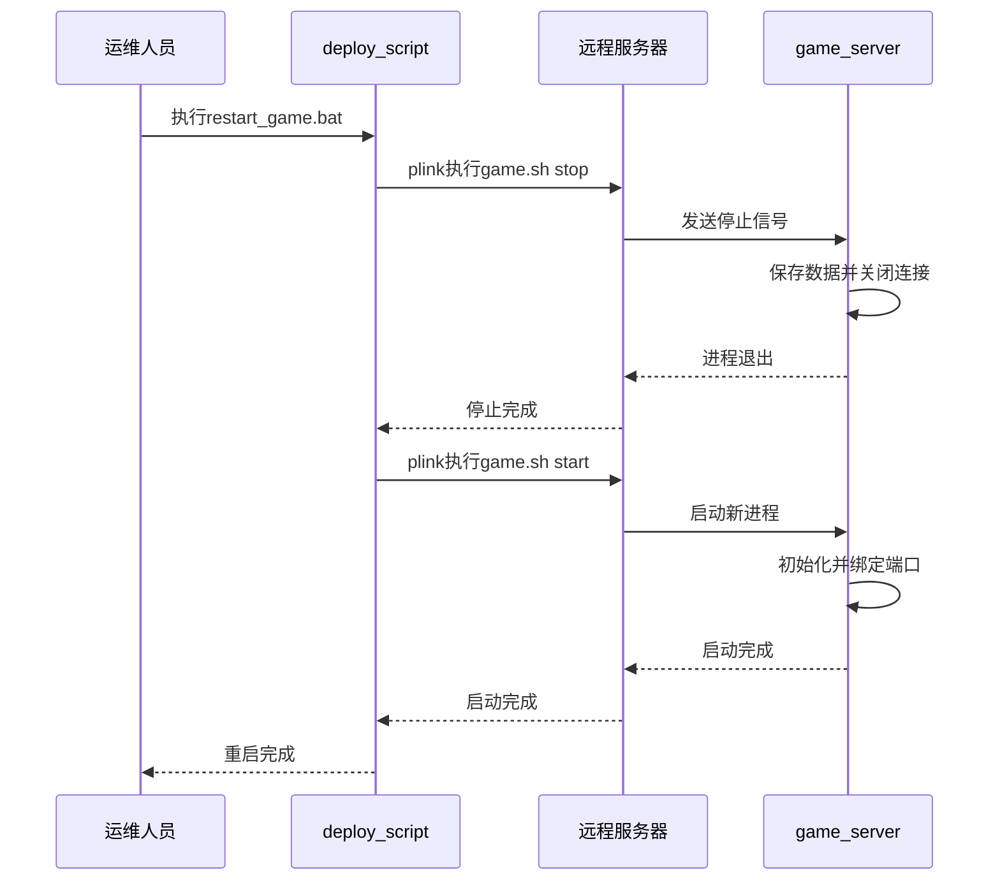
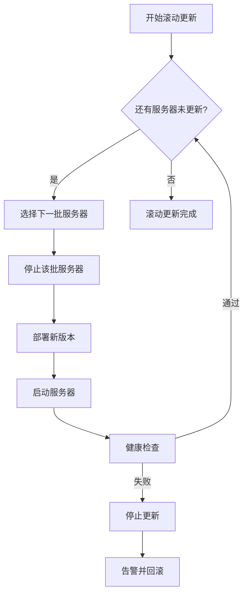

# 部署策略

<cite>
**本文档引用的文件**  
- [deploy_game.bat](file://game/tool/deploy_game.bat)
- [upload.bat](file://game/tool/upload.bat)
- [restart_game.bat](file://game/tool/restart_game.bat)
- [全量部署game.bat](file://game/tool/全量部署game.bat)
- [快速部署game.bat](file://game/tool/快速部署game.bat)
- [update_copy.bat](file://game/tool/update_copy.bat)
- [packet.bat](file://game/tool/packet.bat)
- [packet_all.bat](file://game/tool/packet_all.bat)
- [packet_game_7z.bat](file://game/tool/packet_game_7z.bat)
- [copy.bat](file://game/tool/copy.bat)
- [init_env.bat](file://game/tool/init_env.bat)
- [env.txt](file://game/tool/env.txt)
- [game.zip_exclude.txt](file://game/tool/game.zip_exclude.txt)
- [exclude.txt](file://game/tool/exclude.txt)
- [game.sh](file://game/game.sh)
</cite>

## 目录
1. [简介](#简介)
2. [部署脚本详解](#部署脚本详解)
3. [全量部署与增量部署](#全量部署与增量部署)
4. [服务器启停流程](#服务器启停流程)
5. [服务健康检查与故障恢复](#服务健康检查与故障恢复)
6. [高级部署模式](#高级部署模式)
7. [监控与日志跟踪](#监控与日志跟踪)

## 简介
本文档详细描述了游戏服务器的部署策略，涵盖从基础脚本使用到高级部署模式的完整方案。文档分析了`deploy_game.bat`、`upload.bat`、`restart_game.bat`等核心部署脚本的功能与执行流程，解释了全量部署与增量部署的区别及适用场景。同时，文档还介绍了服务器启停机制、健康检查、故障恢复策略，以及蓝绿部署、滚动更新等高级部署模式的实施步骤。

## 部署脚本详解

### deploy_game.bat 脚本分析
`deploy_game.bat` 是标准部署流程的主控脚本，按顺序调用其他脚本完成部署任务。其执行流程如下：
1. 设置控制台字符集为UTF-8
2. 执行资源同步与配置更新
3. 打包游戏服务器
4. 上传并部署新版本

该脚本通过调用`update_copy.bat`、`packet.bat`和`upload.bat`实现完整的部署流水线。

**Section sources**
- [deploy_game.bat](file://game/tool/deploy_game.bat#L1-L12)

### upload.bat 脚本分析
`upload.bat` 负责将打包好的游戏服务器上传到目标服务器并完成部署。其主要功能包括：
1. 使用pscp将`game.zip`上传到远程服务器
2. 通过plink远程执行停止游戏服务器命令
3. 执行安装脚本`install_game.sh`进行部署
4. 重新启动游戏服务器

脚本使用plink和pscp工具实现SSH连接和文件传输，确保部署过程的自动化。

**Section sources**
- [upload.bat](file://game/tool/upload.bat#L1-L18)

### restart_game.bat 脚本分析
`restart_game.bat` 用于重启游戏服务器，执行简单的停止和启动操作。其流程为：
1. 远程执行`game.sh stop`命令停止服务器
2. 等待5秒确保服务完全停止
3. 远程执行`game.sh start`命令启动服务器

该脚本适用于配置更新或简单维护后的重启操作。

**Section sources**
- [restart_game.bat](file://game/tool/restart_game.bat#L1-L10)

### update_copy.bat 脚本分析
`update_copy.bat` 负责同步代码和配置资源，是部署前的重要准备步骤。其主要功能包括：
1. 检测当前代码分支和配置分支
2. 根据分支规则自动切换配置分支
3. 从远程仓库拉取最新配置
4. 执行`copy.bat`复制必要文件

脚本实现了代码分支与配置分支的智能匹配，确保部署环境的一致性。

**Section sources**
- [update_copy.bat](file://game/tool/update_copy.bat#L1-L99)

### packet.bat 脚本分析
`packet.bat` 使用Maven执行游戏服务器的构建和打包。其流程包括：
1. 设置Java编码和时区参数
2. 执行`mvn clean install`命令
3. 根据`game.assembly.descriptor`参数选择打包配置

该脚本是构建过程的核心，负责生成可部署的`game.zip`文件。

**Section sources**
- [packet.bat](file://game/tool/packet.bat#L1-L37)

## 全量部署与增量部署

### 全量部署
全量部署通过`全量部署game.bat`脚本执行，其特点是：
- 使用`package_full.xml`作为打包描述文件
- 设置`lib.clear=1`清除旧的库文件
- 包含所有依赖和资源的完整打包

全量部署适用于：
- 新服务器初始化
- 重大版本更新
- 依赖库变更
- 首次部署或环境重建

**Diagram sources**
- [全量部署game.bat](file://game/tool/全量部署game.bat#L1-L9)
- [packet_all.bat](file://game/tool/packet_all.bat#L1-L18)

### 增量部署
增量部署通过`快速部署game.bat`脚本执行，其特点是：
- 只复制`classes`目录下的编译文件
- 使用7-Zip快速打包
- 不重新编译整个项目

增量部署适用于：
- 热修复紧急bug
- 小范围代码修改
- 开发环境快速迭代
- 避免长时间构建等待

**Diagram sources**
- [快速部署game.bat](file://game/tool/快速部署game.bat#L1-L11)
- [packet_game_7z.bat](file://game/tool/packet_game_7z.bat#L1-L10)

## 服务器启停流程

### 启动流程
游戏服务器的启动流程由`game.sh`脚本控制，主要步骤包括：
1. 检查Java环境
2. 设置JVM参数和系统属性
3. 启动Spring容器
4. 初始化核心组件
5. 绑定网络端口
6. 注册到服务发现

### 停止流程
服务器停止流程包括：
1. 接收停止信号
2. 关闭网络连接
3. 保存玩家数据
4. 释放资源
5. 安全退出JVM

**Diagram sources**
- [restart_game.bat](file://game/tool/restart_game.bat#L1-L10)
- [game.sh](file://game/game.sh)

## 服务健康检查与故障恢复

### 健康检查机制
系统通过以下方式实现服务健康检查：
1. **心跳检测**：服务器定期向监控系统发送心跳
2. **端口检测**：检查游戏服务端口是否可连接
3. **API检测**：调用健康检查接口`/health`验证服务状态
4. **资源监控**：监控CPU、内存、磁盘使用率

### 故障恢复策略
当检测到服务故障时，系统执行以下恢复流程：
1. 自动尝试重启服务（最多3次）
2. 若重启失败，发送告警通知运维人员
3. 切换到备用服务器（如果配置了高可用）
4. 从最近备份恢复数据

## 高级部署模式

### 蓝绿部署
蓝绿部署实施步骤：
1. 准备绿环境（当前生产环境为蓝）
2. 在绿环境部署新版本
3. 进行全面测试验证
4. 通过负载均衡器切换流量到绿环境
5. 监控新版本运行状态
6. 若有问题，立即切回蓝环境
7. 若运行正常，保留绿环境作为新的生产环境

### 滚动更新
滚动更新实施步骤：
1. 将服务器集群分为多个批次
2. 逐批停止服务并部署新版本
3. 每批更新后进行健康检查
4. 只有当前批次健康才继续更新下一批
5. 所有批次更新完成后完成部署

**Diagram sources**
- [upload.bat](file://game/tool/upload.bat#L1-L18)

## 监控与日志跟踪

### 监控指标采集
部署过程中需要监控的关键指标包括：
- **部署时间**：从开始到完成的总耗时
- **资源使用率**：CPU、内存、磁盘I/O
- **错误率**：部署过程中出现的错误数量
- **服务可用性**：部署后服务的响应时间和成功率

### 日志跟踪方法
日志跟踪策略：
1. **集中式日志**：所有服务器日志收集到中央日志系统
2. **结构化日志**：使用统一格式记录部署日志
3. **关键节点标记**：在部署关键步骤添加日志标记
4. **错误追踪**：记录错误堆栈和上下文信息
5. **审计日志**：记录谁在何时执行了何种部署操作

部署脚本通过`echo`命令输出关键步骤日志，便于追踪部署进度和排查问题。