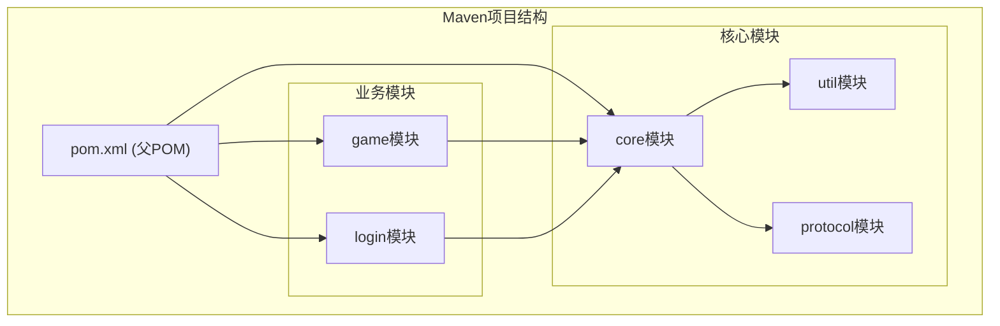
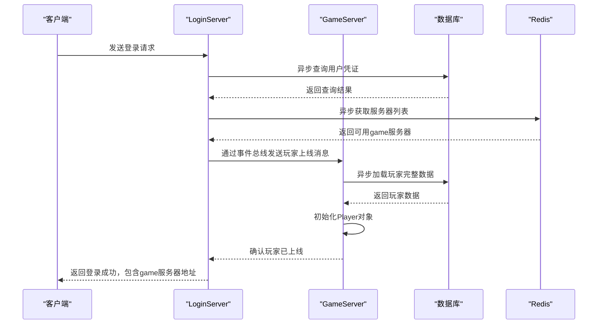
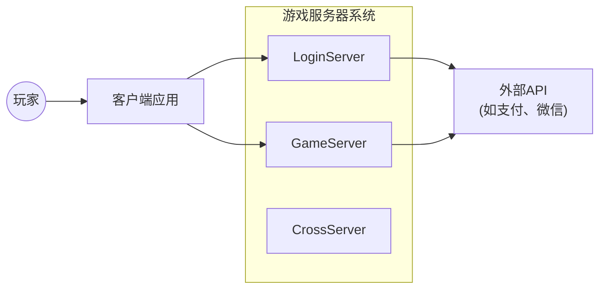
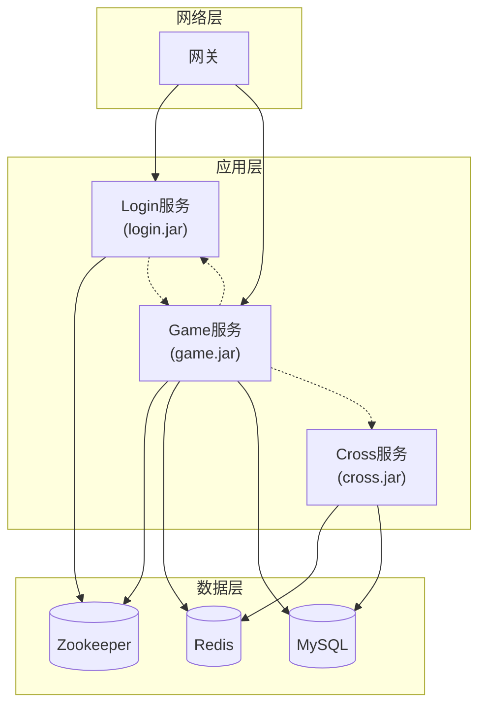

# 项目概述

<cite>
**本文档引用的文件**   
- [pom.xml](file://pom.xml)
- [core\pom.xml](file://core\pom.xml)
- [game\pom.xml](file://game\pom.xml)
- [login\pom.xml](file://login\pom.xml)
- [util\pom.xml](file://util\pom.xml)
- [core\src\main\java\cn\game\core\net\vertx\VxHolder.java](file://core\src\main\java\cn\game\core\net\vertx\VxHolder.java)
- [core\src\main\java\cn\game\core\net\rpc\vertx\VertxRpcClient.java](file://core\src\main\java\cn\game\core\net\rpc\vertx\VertxRpcClient.java)
- [core\src\main\java\cn\game\core\net\message\MessageHandlerService.java](file://core\src\main\java\cn\game\core\net\message\MessageHandlerService.java)
- [core\src\main\java\cn\game\core\net\message\AbstractMessageHandlerService.java](file://core\src\main\java\cn\game\core\net\message\AbstractMessageHandlerService.java)
- [core\src\main\java\cn\game\core\net\vertx\ServerClient.java](file://core\src\main\java\cn\game\core\net\vertx\ServerClient.java)
- [core\src\main\java\cn\game\core\zookeeper\ZkBackedCacheFactory.java](file://core\src\main\java\cn\game\core\zookeeper\ZkBackedCacheFactory.java)
- [core\src\main\java\cn\game\core\zookeeper\ZkCacheRegistry.java](file://core\src\main\java\cn\game\core\zookeeper\ZkCacheRegistry.java)
- [core\src\main\java\cn\game\core\zookeeper\ZkBackedCache.java](file://core\src\main\java\cn\game\core\zookeeper\ZkBackedCache.java)
- [core\src\main\java\cn\game\core\zookeeper\ZkCacheType.java](file://core\src\main\java\cn\game\core\zookeeper\ZkCacheType.java)
- [core\src\main\java\cn\game\core\zookeeper\CacheChangeListener.java](file://core\src\main\java\cn\game\core\zookeeper\CacheChangeListener.java)
- [core\src\main\java\cn\game\core\cache\RedisLocalCache.java](file://core\src\main\java\cn\game\core\cache\RedisLocalCache.java)
- [core\src\main\java\cn\game\core\cache\SimpleCacheManager.java](file://core\src\main\java\cn\game\core\cache\SimpleCacheManager.java)
- [game\src\main\java\cn\game\games\net\game\handler\ServerHandler.java](file://game\src\main\java\cn\game\games\net\game\handler\ServerHandler.java)
- [login\src\main\java\cn\game\login\LoginServer.java](file://login\src\main\java\cn\game\login\LoginServer.java)
- [util\src\main\java\cn\game\util\ZkHelper.java](file://util\src\main\java\cn\game\util\ZkHelper.java)
</cite>

## 目录
1. [系统架构设计](#系统架构设计)
2. [核心组件与职责划分](#核心组件与职责划分)
3. [事件驱动与异步处理模型](#事件驱动与异步处理模型)
4. [关键流程实现](#关键流程实现)
5. [技术选型权衡](#技术选型权衡)
6. [系统上下文与容器图](#系统上下文与容器图)

## 系统架构设计

该分布式游戏服务器系统采用微服务架构，将核心功能拆分为独立的`core`、`game`、`login`等模块，通过Vert.x异步框架和事件总线（Event Bus）实现高效通信。系统基于Maven进行多模块管理，`pom.xml`文件定义了`util`、`protocol`、`core`、`game`、`login`等子模块，形成清晰的依赖层级。`core`模块作为基础，为`game`和`login`等业务模块提供通用能力，如网络通信、缓存、Zookeeper服务发现等。这种架构设计实现了高内聚、低耦合，便于独立开发、部署和扩展。

**Diagram sources**
- [pom.xml](file://pom.xml)
- [core\pom.xml](file://core\pom.xml)
- [game\pom.xml](file://game\pom.xml)
- [login\pom.xml](file://login\pom.xml)

## 核心组件与职责划分

系统的核心组件围绕微服务架构展开，各模块职责明确，协作紧密。

### core模块
`core`模块是整个系统的技术基石，提供了一系列通用的、与业务无关的基础设施。其核心职责包括：
*   **网络通信**: 基于Vert.x框架，封装了`VxHolder`类，统一管理Vert.x实例和事件总线，提供`requestRemoteServer`、`sendRemoteServer`、`broadcastRemoteServer`等方法，简化了跨服务的RPC调用和消息广播。
*   **服务发现与集群**: 通过`ZkHelper`和`ZookeeperClusterManager`，利用Zookeeper实现服务注册与发现，确保`game`和`login`等服务实例能够动态感知彼此的存在，形成集群。
*   **分布式缓存**: 提供了基于Redis的`RedisLocalCache`和基于Zookeeper的`ZkBackedCache`。`ZkBackedCache`通过`ZkCacheRegistry`进行统一管理，用于存储服务器列表、虚拟分服列表等需要强一致性的元数据。

### game模块
`game`模块是游戏逻辑的核心，负责处理玩家的游戏行为、状态管理和数据持久化。其主要职责包括：
*   **玩家会话管理**: 通过`GameClientManager`和`PlayerManager`管理在线玩家的连接和状态。`GameClientManager`维护`sessionId`、`playerId`和`connectionId`的映射，`PlayerManager`则负责`Player`对象的生命周期。
*   **跨服通信**: 通过`ServerHandler`处理来自其他`game`服务器或`login`服务器的消息，实现跨服广播、玩家数据推送等功能。
*   **数据持久化**: 通过`DAO`工具类与数据库交互，执行数据的增删改查操作。

### login模块
`login`模块负责用户的身份验证和登录流程。其主要职责包括：
*   **用户认证**: 处理用户的登录请求，验证凭证。
*   **会话分发**: 在用户认证成功后，决定将用户分配到哪个`game`服务器实例。
*   **全局状态管理**: 维护全局的服务器列表和活跃服务器列表，为登录分发提供依据。

**Section sources**
- [core\src\main\java\cn\game\core\net\vertx\VxHolder.java](file://core\src\main\java\cn\game\core\net\vertx\VxHolder.java)
- [core\src\main\java\cn\game\core\zookeeper\ZkHelper.java](file://core\src\main\java\cn\game\core\zookeeper\ZkHelper.java)
- [core\src\main\java\cn\game\core\zookeeper\ZkBackedCache.java](file://core\src\main\java\cn\game\core\zookeeper\ZkBackedCache.java)
- [core\src\main\java\cn\game\core\zookeeper\ZkCacheRegistry.java](file://core\src\main\java\cn\game\core\zookeeper\ZkCacheRegistry.java)
- [game\src\main\java\cn\game\games\net\game\manager\GameClientManager.java](file://game\src\main\java\cn\game\games\net\game\manager\GameClientManager.java)
- [game\src\main\java\cn\game\games\net\game\manager\PlayerManager.java](file://game\src\main\java\cn\game\games\net\game\manager\PlayerManager.java)
- [game\src\main\java\cn\game\games\net\game\handler\ServerHandler.java](file://game\src\main\java\cn\game\games\net\game\handler\ServerHandler.java)
- [login\src\main\java\cn\game\login\LoginServer.java](file://login\src\main\java\cn\game\login\LoginServer.java)

## 事件驱动与异步处理模型

系统深度集成了Vert.x异步非阻塞编程模型，这是支撑高并发实时交互的关键。

### Vert.x事件总线 (Event Bus)
`VxHolder`类是系统与Vert.x交互的中心。它初始化一个集群化的Vert.x实例，并注册了多种自定义的消息编解码器（如`ProtobufMessageCodec`、`UniversalMessageCodec`），使得Protobuf消息和自定义协议对象可以直接在事件总线上进行传输。服务间的通信（如`game`服务器向`login`服务器请求信息）本质上是通过事件总线发送和接收消息来完成的，实现了松耦合。

### 异步编程实践
系统大量使用`Future`和`Promise`来处理异步操作。例如，在`PlayerHelper`中，`loadPlayerFromDb`方法返回一个`Future<Player>`，表示从数据库加载玩家数据的异步过程。业务逻辑可以使用`compose`方法将多个异步操作串联起来，避免了传统的回调地狱，代码更加清晰。`VxHolder`还提供了`runWithLock`等工具方法，确保在获取分布式锁后，后续的异步业务逻辑能在正确的Vert.x上下文（Context）中执行，保证了线程安全。

**Diagram sources**
- [core\src\main\java\cn\game\core\net\vertx\VxHolder.java](file://core\src\main\java\cn\game\core\net\vertx\VxHolder.java)
- [login\src\main\java\cn\game\login\LoginServer.java](file://login\src\main\java\cn\game\login\LoginServer.java)
- [game\src\main\java\cn\game\games\net\game\handler\ServerHandler.java](file://game\src\main\java\cn\game\games\net\game\handler\ServerHandler.java)

## 关键流程实现

### 玩家会话管理
玩家会话管理是游戏服务器的核心。当玩家登录时，`login`服务会通过`VxHolder.broadcastRemoteServer(ServerType.Game, ...)`广播一条`GamePlayerOnlinePush`消息，通知所有`game`服务器该玩家已上线。`game`服务器的`ServerHandler`接收到此消息后，会调用`PlayerManager.getInstance().online(playerId, serverId)`更新本地状态。当玩家下线时，`GameClientManager`会调用`logout`方法，清理连接并广播下线消息。

### 跨服通信
跨服通信主要通过`ServerHandler`中的`broadcast`、`broadcastPlayers`和`forward`等方法实现。例如，`broadcast`方法可以将一条消息广播给所有`game`服务器或指定的服务器列表。`forward`方法则用于将消息转发给特定服务器上的特定玩家，这在实现跨服聊天、组队等功能时非常关键。

### 数据持久化
数据持久化通过`DAO`工具类实现。`DAO`封装了对MyBatis的调用，提供了`execute`、`insert`、`update`等异步方法。`DbEntity`接口定义了所有数据库实体的通用操作，如`insert()`、`update()`等，这些方法返回`Future`对象，与系统的异步模型无缝集成。对于批量操作，系统提供了`execMutiTasks`方法，可以高效地执行多个数据库任务。

**Section sources**
- [game\src\main\java\cn\game\games\net\game\handler\ServerHandler.java](file://game\src\main\java\cn\game\games\net\game\handler\ServerHandler.java)
- [game\src\main\java\cn\game\games\net\game\manager\PlayerManager.java](file://game\src\main\java\cn\game\games\net\game\manager\PlayerManager.java)
- [game\src\main\java\cn\game\games\net\game\manager\GameClientManager.java](file://game\src\main\java\cn\game\games\net\game\manager\GameClientManager.java)
- [game\src\main\java\cn\game\games\cache\base\DbEntity.java](file://game\src\main\java\cn\game\games\cache\base\DbEntity.java)
- [game\src\main\java\cn\game\games\util\DAO.java](file://game\src\main\java\cn\game\games\util\DAO.java)

## 技术选型权衡

### 为何选择Zookeeper进行服务发现
Zookeeper被选为服务发现组件，主要因为它提供了**强一致性**（CP系统）和**高可用性**。在游戏中，服务器列表、虚拟分服列表等元数据的准确性至关重要。`ZkBackedCache`的设计正是为了利用Zookeeper的ZNode特性，确保所有服务实例对这些关键信息的视图是一致的。虽然Zookeeper的写性能相对较低，但服务发现的场景下写操作较少，其强一致性的优势远大于性能上的微小损失。

### 为何选择Redis作为分布式缓存
Redis被选为分布式缓存，主要因为它提供了**极高的读写性能**和**丰富的数据结构**。系统使用Redis存储玩家的热点数据（如角色信息、背包等），通过`RedisLocalCache`实现了本地缓存+Redis的二级缓存架构，极大地降低了数据库的压力。Redis的`pub/sub`机制也方便了缓存失效通知。虽然Redis是AP系统，但在缓存场景下，短暂的数据不一致是可以接受的，其性能优势是首选。

**Section sources**
- [core\src\main\java\cn\game\core\zookeeper\ZkBackedCache.java](file://core\src\main\java\cn\game\core\zookeeper\ZkBackedCache.java)
- [core\src\main\java\cn\game\core\zookeeper\ZkHelper.java](file://core\src\main\java\cn\game\core\zookeeper\ZkHelper.java)
- [core\src\main\java\cn\game\core\cache\RedisLocalCache.java](file://core\src\main\java\cn\game\core\cache\RedisLocalCache.java)

## 系统上下文与容器图

### 系统上下文图
该图展示了系统与外部用户及其他系统之间的交互。

**Diagram sources**
- [login\src\main\java\cn\game\login\LoginServer.java](file://login\src\main\java\cn\game\login\LoginServer.java)
- [game\src\main\java\cn\game\games\net\game\handler\ServerHandler.java](file://game\src\main\java\cn\game\games\net\game\handler\ServerHandler.java)

### 容器图
该图展示了系统内部各个容器（服务）的部署和交互方式。

**Diagram sources**
- [pom.xml](file://pom.xml)
- [core\src\main\java\cn\game\core\net\vertx\VxHolder.java](file://core\src\main\java\cn\game\core\net\vertx\VxHolder.java)
- [core\src\main\java\cn\game\core\zookeeper\ZkHelper.java](file://core\src\main\java\cn\game\core\zookeeper\ZkHelper.java)
- [core\src\main\java\cn\game\core\cache\RedisLocalCache.java](file://core\src\main\java\cn\game\core\cache\RedisLocalCache.java)